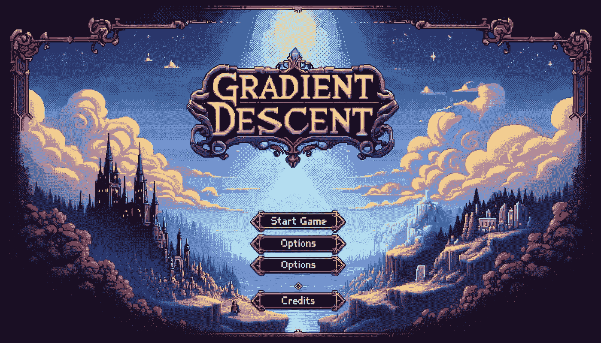

# 学习机器学习的勇气：梯度下降与流行优化器的详细探索

> 原文：[`towardsdatascience.com/courage-to-learn-ml-a-detailed-exploration-of-gradient-descent-and-popular-optimizers-022ecf97be7d?source=collection_archive---------4-----------------------#2024-01-09`](https://towardsdatascience.com/courage-to-learn-ml-a-detailed-exploration-of-gradient-descent-and-popular-optimizers-022ecf97be7d?source=collection_archive---------4-----------------------#2024-01-09)

## 你真的掌握了梯度下降吗？将这篇文章作为你的终极检查点

 [Amy Ma](https://amyma101.medium.com/?source=post_page---byline--022ecf97be7d--------------------------------)

·发表于[数据科学探索](https://towardsdatascience.com/?source=post_page---byline--022ecf97be7d--------------------------------) ·阅读时间 22 分钟·2024 年 1 月 9 日

--

我们今天将使用 RPG 游戏作为类比。由 ChatGPT 创建

欢迎回到《[学习机器学习的勇气](https://towardsdatascience.com/tagged/courage-to-learn-ml)》的新章节。对于那些新加入这一系列文章的读者，本系列旨在使这些复杂的主题变得易于理解并富有趣味，就像导师与学习者之间的轻松对话，灵感来源于《[被讨厌的勇气](https://www.goodreads.com/book/show/43306206-the-courage-to-be-disliked)》的写作风格，专注于机器学习。

在之前的讨论中，我们的导师和学习者讨论了一些常见的损失函数以及设计损失函数的三个基本原则。今天，他们将探讨另一个关键概念：梯度下降。

一如既往，以下是我们今天将要探索的主题列表：

+   梯度究竟是什么？为什么这种技术被称为“梯度下降”？

+   为什么普通的梯度下降在深度神经网络（DNNs）中表现不佳？有什么改进措施？

+   回顾各种优化器及其关系（牛顿法、Adagrad、Momentum、RMSprop 和 Adam）

+   基于我个人经验，关于选择合适优化器的实用见解
