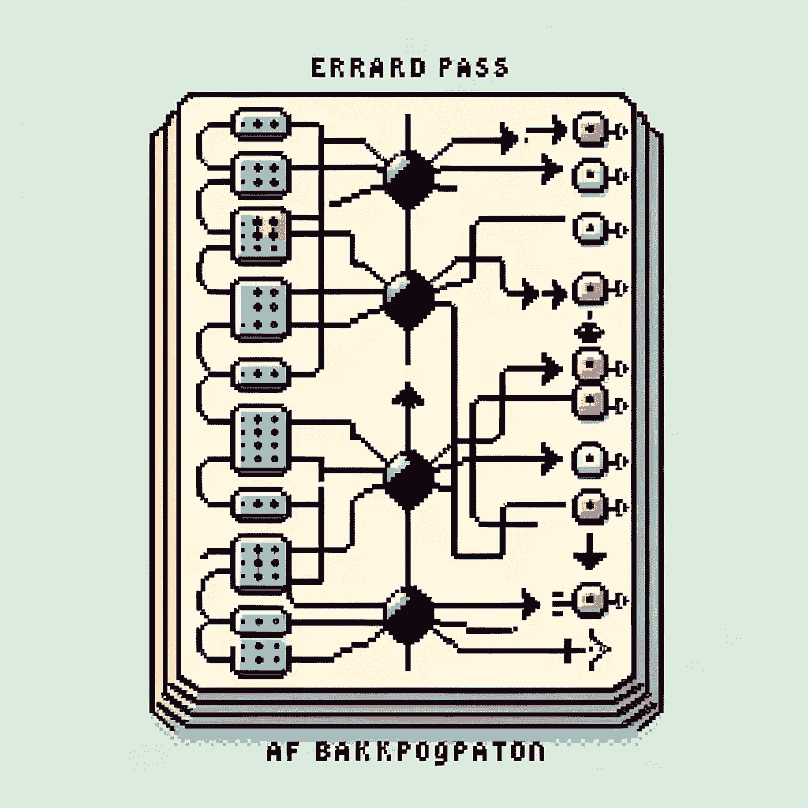

# 勇敢学习机器学习：从数学理论到编码实践，全面解释反向传播

> 原文：[`towardsdatascience.com/courage-to-learn-ml-explain-backpropagation-from-mathematical-theory-to-coding-practice-21e670415378?source=collection_archive---------8-----------------------#2024-01-17`](https://towardsdatascience.com/courage-to-learn-ml-explain-backpropagation-from-mathematical-theory-to-coding-practice-21e670415378?source=collection_archive---------8-----------------------#2024-01-17)

## 将反向传播的复杂数学转化为易于理解和学习的简明内容

 [Amy Ma](https://amyma101.medium.com/?source=post_page---byline--21e670415378--------------------------------)

·发表于[Towards Data Science](https://towardsdatascience.com/?source=post_page---byline--21e670415378--------------------------------) ·阅读时间 19 分钟·2024 年 1 月 17 日

--

由作者使用 ChatGPT 创建的图像。

欢迎回到《[勇敢学习机器学习](https://towardsdatascience.com/tagged/courage-to-learn-ml)》的最新章节。在这一系列中，我旨在通过问答形式，揭开复杂机器学习主题的神秘面纱，并使其变得引人入胜。

这次，我们的学习者正在探讨反向传播，并选择通过编码的方式进行。 他发现了一个关于反向传播的 Python 教程，来自[Machine Learning Mastery](https://machinelearningmastery.com/implement-backpropagation-algorithm-scratch-python/)，该教程从零开始使用基本的 Python 代码讲解反向传播，没有使用任何深度学习框架。发现代码有些令人困惑后，他拜访了导师并寻求指导，以更好地理解代码及反向传播的概念。

一如既往，以下是我们今天将要探讨的主题列表：

+   理解反向传播及其与梯度下降的关系

+   探讨深度神经网络（DNN）中偏好深度而非宽度的现象，以及浅层宽网络的稀有性。

+   什么是链式法则？

+   将反向传播计算分解为 3 个组成部分，并深入探讨每个部分。为什么它被称为**反**向传播？

+   通过简单明了的方式理解反向传播……
