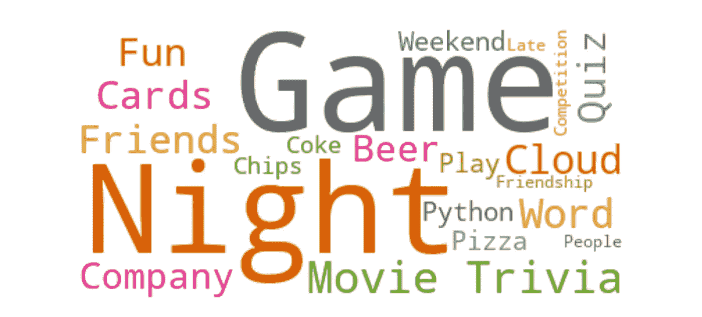
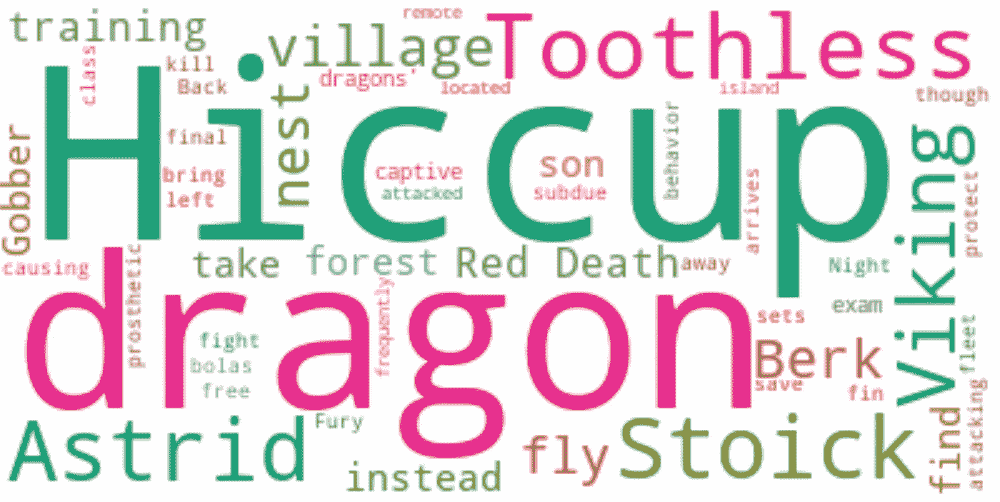
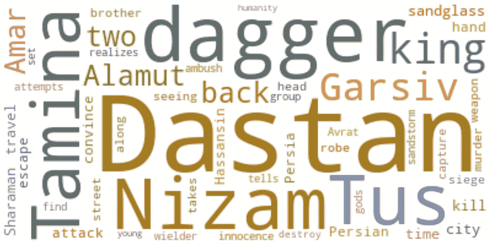
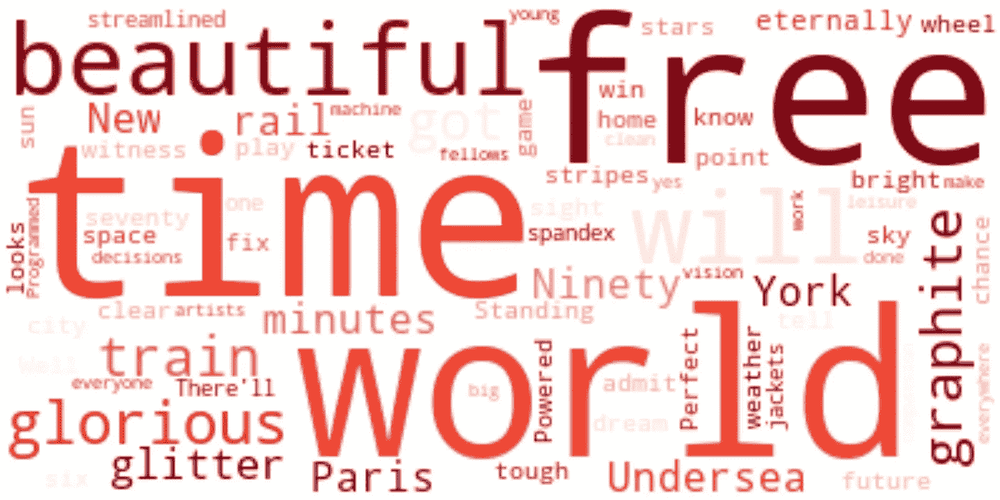

# 用 Python 制作自定义词云猜谜游戏

> 原文：[`towardsdatascience.com/craft-a-customized-word-cloud-trivia-game-with-python-cff7df28501d?source=collection_archive---------6-----------------------#2024-03-10`](https://towardsdatascience.com/craft-a-customized-word-cloud-trivia-game-with-python-cff7df28501d?source=collection_archive---------6-----------------------#2024-03-10)

## 快速成功数据科学

## 根据你的兴趣定制游戏之夜！

 [Lee Vaughan](https://medium.com/@lee_vaughan?source=post_page---byline--cff7df28501d--------------------------------)

·发表于 [Towards Data Science](https://towardsdatascience.com/?source=post_page---byline--cff7df28501d--------------------------------) ·阅读时间 6 分钟·2024 年 3 月 10 日

--

游戏之夜词云（作者提供）

游戏之夜总是玩那些老掉牙的桌游吗？如果你懂一点 Python，你可以轻松制作一个自定义的词云猜谜游戏。

*词云* 是一种文本数据的可视化表示，用于显示关键词元数据，这些数据通常被称为*标签*，并出现在网站上。在词云中，字体大小或颜色显示每个标签或词语的重要性。

这里有三个示例词云测验，你能猜出其中的两部电影和一首歌吗？（答案在文章最后）

一部电影的词云（作者提供）

另一个电影词云（作者提供）

一首流行歌曲的词云（作者提供）

你可以使用这个技巧为电影、音乐、小说、历史事件等生成定制的测验。它们也可以应用于更严肃的场景，比如培训…
