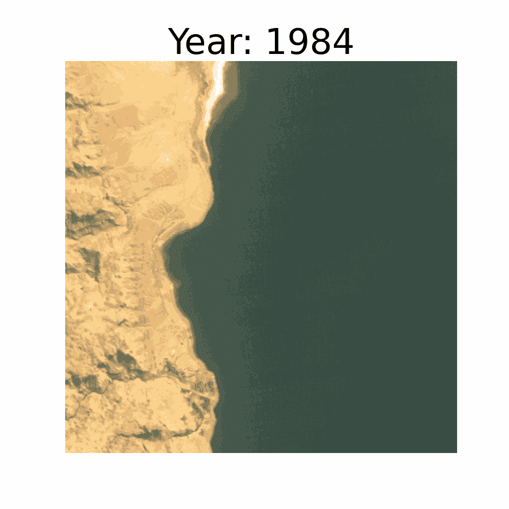

# 使用 Python 制作卫星图像时间序列 GIF

> 原文：[`towardsdatascience.com/crafting-time-series-gifs-of-satellite-images-with-python-ea5873203f66?source=collection_archive---------2-----------------------#2024-05-12`](https://towardsdatascience.com/crafting-time-series-gifs-of-satellite-images-with-python-ea5873203f66?source=collection_archive---------2-----------------------#2024-05-12)

## 见证我们的世界在 40 年的 Landsat 数据和最少手动操作下的演变

 [Conor O'Sullivan](https://conorosullyds.medium.com/?source=post_page---byline--ea5873203f66--------------------------------)

·发表于[Towards Data Science](https://towardsdatascience.com/?source=post_page---byline--ea5873203f66--------------------------------) ·12 分钟阅读·2024 年 5 月 12 日

--

（来源：chatGPT）

时间是一位非凡的讲述者。它在我们的星球上编织着变化的故事。看似无生命的物体，如河流、森林和海岸线，在足够的时间面前都能发生变化。即使是我们每天似乎没有变化的城市，也能在几十年间发生翻天覆地的变化。通过使用 40 年的 Landsat 数据，我们将看到如何观察这些变化。

[Landsat](https://landsat.gsfc.nasa.gov/satellites/timeline/)是一个开源的卫星图像数据集。我们将利用它制作像下面这样的 GIF，展示[死海如何逐渐缩小](https://www.smithsonianmag.com/science-nature/the-dying-of-the-dead-sea-70079351/#:~:text=The%20Dead%20Sea%20is%20shrinking,earth%20above%20collapses%20without%20warning.)，时间跨度为 1984 年至 2024 年。我们可以创建类似的可视化图像，展示地球表面各地的年度、季节性或每日变化。你可以在文章的结尾找到更多此类示例。

死海的干涸（来源：作者）

目标是使用 Python 和最少的手动工作来创建这样的时间序列 GIF。我们将看到如何*编程*处理以下内容：

+   搜索并下载最合适的场景

+   Landsat 数据质量、季节变化……
