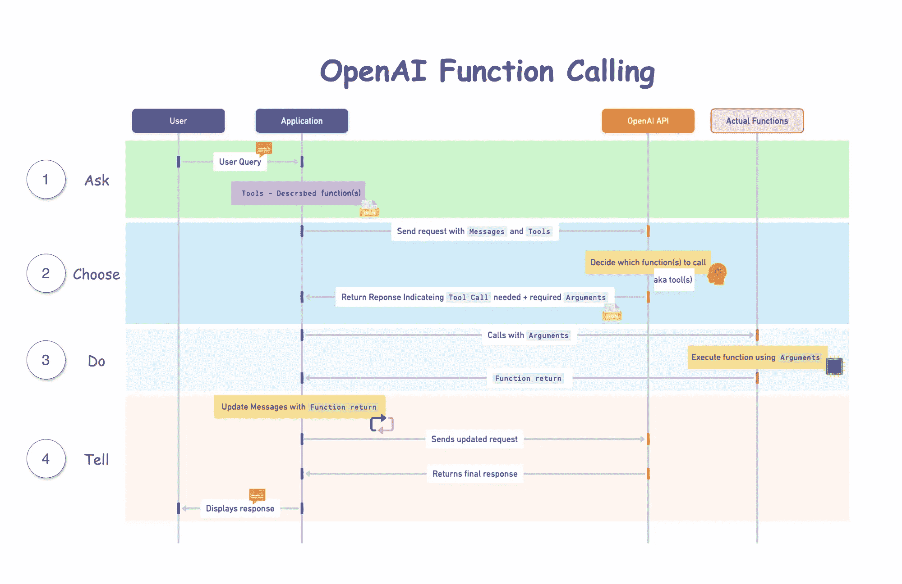
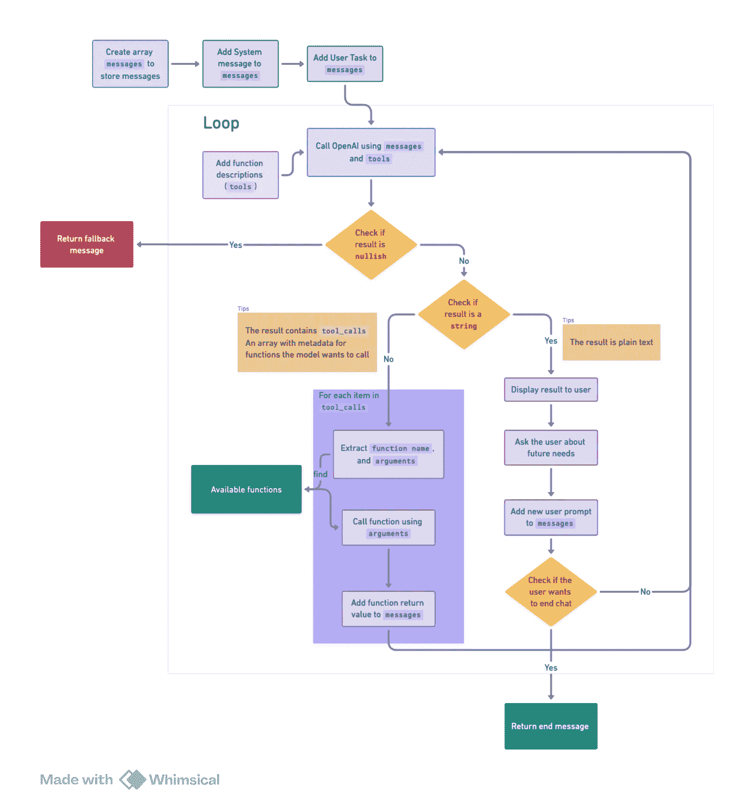
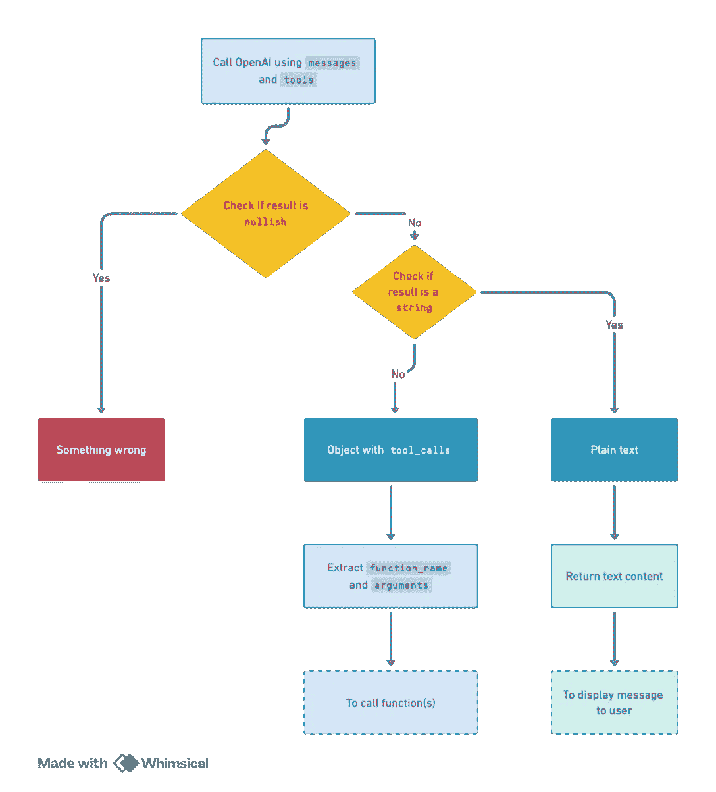

# 创建一个具有 OpenAI 函数调用功能的代理

> 原文：[`towardsdatascience.com/create-an-agent-with-openai-function-calling-capabilities-ad52122c3d12?source=collection_archive---------3-----------------------#2024-03-31`](https://towardsdatascience.com/create-an-agent-with-openai-function-calling-capabilities-ad52122c3d12?source=collection_archive---------3-----------------------#2024-03-31)

## 2024 年的 OpenAI 函数调用

[](https://medium.com/@bianbianzhu123?source=post_page---byline--ad52122c3d12--------------------------------)[](https://towardsdatascience.com/?source=post_page---byline--ad52122c3d12--------------------------------) [Tianyi Li](https://medium.com/@bianbianzhu123?source=post_page---byline--ad52122c3d12--------------------------------)

· 发布于 [Towards Data Science](https://towardsdatascience.com/?source=post_page---byline--ad52122c3d12--------------------------------) · 阅读时间 15 分钟 · 2024 年 3 月 31 日

--


由 [DALL·E 3](https://openai.com/dall-e-3) 生成的图像

**作者**： [Tianyi Li](https://medium.com/u/4092d7367010?source=post_page---user_mention--ad52122c3d12--------------------------------), [Selina Li](https://medium.com/u/7b9ea39b0d79?source=post_page---user_mention--ad52122c3d12--------------------------------)

· 介绍

· 人工智能能做什么

· 当前挑战

· 它是如何工作的

∘ 四个可能让人困惑的关键概念：

· 逐步构建代理指南

∘ 商业案例：开发一个农场旅行助手代理

∘ 应用架构

∘ 前提条件：

∘ 步骤 1：准备调用模型

∘ 步骤 2：定义工具

∘ 步骤 3：使用消息和工具调用模型

∘ 步骤 4：处理模型响应

∘ 步骤 5：执行函数并再次调用模型

∘ 步骤 6：将结果总结反馈给用户

· 结论

· 喜欢这个故事吗？

随着我们进入 2024 年，开发 AI 驱动应用程序的热潮显而易见，因为它们具有明显的优势。

传统上，创建一个应用程序涉及为每个功能编写独立的函数或服务，例如用户登录或票务预订。这个过程通常需要用户填写表格，勾选框并输入数据，这些数据随后必须通过各种验证检查，以确保数据可用。尤其是在涉及多个步骤时，这种方法显著削弱了用户体验。

假设你计划为复活节安排一次为期一天的农场之旅。你尚未确定日期，但有一些特定的要求：农场必须在两小时车程内，提供某些活动，天气要阴天（因为你的孩子对阳光过敏），并且在做决定之前需要和伴侣商量。传统的方法将涉及多次浏览不同的页面、步骤和表单——这反映了日常决策的复杂性。这种复杂性是一个关键原因，尽管现在有许多预订网站，很多人仍然更倾向于通过旅行代理人来规划旅行。

# AI 能做什么

AI 通过以下方式带来了显著的改进：

1.  提供对话式体验，使互动更加自然、用户友好。

1.  将应用程序功能整合到一个单一的入口点。与传统应用程序不同，传统应用需要不同的页面和表单来执行不同的功能，而 AI 可以解释用户输入，顺利选择并执行所需功能，甚至可以一步步处理复杂的请求。

然而，一个主要挑战依然存在：处理 AI 模型返回的非结构化文本数据。

传统上，从模型输出中提取结构化数据（如 JSON）需要复杂的提示工程或正则表达式（RegEx），由于 AI 模型的不可预测性和用户输入的多样性，这种方法容易出错且不一致。

为了解决这个问题，OpenAI 推出了两项创新功能：`Json 模式`和`函数调用`。本文将深入探讨函数调用功能，说明它如何简化从模型输出中提取结构化数据的过程，并附有 TypeScript 代码示例。

在这个[Github 代码库](https://github.com/bianbianzhu/openai-function-calling)中发现所有代码示例，如果您觉得有用，可以考虑给它点个星。

# 当前的挑战

+   结构化数据处理：以前，开发人员依赖正则表达式或复杂的提示工程来解析文本数据，这个过程充满了复杂性和错误。函数调用通过允许模型处理用户定义的函数，简化了这一过程，使模型能够生成如 JSON 等结构化输出，而不需要繁琐的技术手段。

+   一致性和可预测性：函数调用通过允许定义自定义函数来精确提取信息，从而确保 AI 模型输出的一致性和可预测性。这保证了在各种输入下生成结构化且可靠的输出，对于需要可靠数据提取的应用至关重要，例如文本摘要、文档分析以及与外部 API 或数据库的集成。

# 它是如何工作的

根据[OpenAI 的文档](https://platform.openai.com/docs/guides/function-calling)，函数调用的基本步骤如下：

1.  使用用户查询和在 functions（工具）参数中定义的一组函数来调用模型。

1.  模型可以选择调用一个或多个函数；如果选择调用，内容将是一个符合您自定义架构的字符串化 JSON 对象（注意：模型可能会产生虚假的参数）。

1.  在代码中将字符串解析为 JSON，并在提供的参数存在时调用相应的函数。

1.  通过将函数响应作为新消息附加来再次调用模型，让模型将结果总结并反馈给用户。



OpenAI 函数调用工作原理的序列图

## 四个可能一开始会让人困惑的关键概念：

1.  **工具**：术语`Functions`已被弃用，并由`Tools`替代。目前，`Tools`专门支持本质上是函数类型的功能。实质上，这一变化仅体现在名称和语法上。

1.  **工具描述**：当我们说将“工具”传递给模型时，可以理解为提供了模型可以执行的操作列表或菜单，而不是实际的函数。这就像是告诉模型：“这是你可以选择执行的操作”，而不直接给它实现这些操作的手段。

1.  **函数调用返回**：当模型建议调用一个函数时，本质上是在说：“我认为我们应该使用这个工具，这就是我们所需的”，通过命名该函数并指定任何必要的信息（`arguments`）。然而，这时它只是一个建议；实际操作是在您的应用程序中执行的。

1.  **使用响应来指导下一步**：一旦在应用程序中实际执行了一个函数并获得结果，您将这些结果作为新提示的一部分反馈给模型。这有助于模型理解发生了什么，并引导它做出下一步的操作或回应。

# 构建代理的分步指南

## 商业案例：农场旅行助手代理的开发

我们的目标是开发一个农场旅行助手代理，旨在提升用户在规划农场参访时的体验。这个数字助手将通过以下方式提供全面支持：

+   根据用户的位置识别最适合的农场目的地。

+   提供每个农场可用活动的详细信息。

+   促进所选活动的预订。

+   提供一个简便的投诉流程（如有需要）。

## 应用架构：

这个流程图展示了应用程序的架构：



代理的流程图

## 前提条件：

**OpenAI API 密钥**：您可以从 OpenAI 平台获得此密钥。

## 第一步：准备调用模型：

要开始对话，请从系统消息和用户任务提示开始：

+   创建一个`messages`数组，用于跟踪对话历史。

+   在`messages`数组中包含一个系统消息，以建立助手的角色和上下文。

+   用问候消息迎接用户，并提示他们指定任务。

+   将用户的提示添加到`messages`数组中。

```py
const messages: ChatCompletionMessageParam[] = [];

console.log(StaticPrompts.welcome);

messages.push(SystemPrompts.context);

const userPrompt = await createUserMessage();
messages.push(userPrompt);
```

作为个人偏好，所有提示都存储在对象中，以便于访问和修改。请参考以下代码片段，了解应用程序中使用的所有提示。请根据需要采用或修改此方法。

+   **StaticPrompts**：在整个对话中使用的静态消息。

```py
export const StaticPrompts = {
  welcome:
    "Welcome to the farm assistant! What can I help you with today? You can ask me what I can do.",
  fallback: "I'm sorry, I don't understand.",
  end: "I hope I was able to help you. Goodbye!",
} as const;
```

+   **UserPrompts**：根据用户输入生成的用户消息。

```py
import OpenAI from "openai";
type ChatCompletionUserMessageParam = OpenAI.ChatCompletionUserMessageParam;

type UserPromptKey = "task";
type UserPromptValue = (userInput?: string) => ChatCompletionUserMessageParam;

export const UserPrompts: Record<UserPromptKey, UserPromptValue> = {
  task: (userInput) => ({
    role: "user",
    content: userInput || "What can you do?",
  }),
};
```

+   **SystemPrompts**：根据系统上下文生成的系统消息。

```py
import OpenAI from "openai";
type ChatCompletionSystemMessageParam = OpenAI.ChatCompletionSystemMessageParam;

type SystemPromptKey = "context";

export const SystemPrompts: Record<
  SystemPromptKey,
  ChatCompletionSystemMessageParam
> = {
  context: {
    role: "system",
    content:
      "You are an farm visit assistant. You are upbeat and friendly. You introduce yourself when first saying `Howdy!`. If you decide to call a function, you should retrieve the required fields for the function from the user. Your answer should be as precise as possible. If you have not yet retrieve the required fields of the function completely, you do not answer the question and inform the user you do not have enough information.",
  },
};
```

+   **FunctionPrompts**：基本上是函数的返回值的功能消息。

```py
import OpenAI from "openai";
type ChatCompletionToolMessageParam = OpenAI.ChatCompletionToolMessageParam;

type FunctionPromptKey = "function_response";

type FunctionPromptValue = (
  args: Omit<ChatCompletionToolMessageParam, "role">
) => ChatCompletionToolMessageParam;

export const FunctionPrompts: Record<FunctionPromptKey, FunctionPromptValue> = {
  function_response: (options) => ({
    role: "tool",
    ...options,
  }),
};
```

## 第 2 步：定义工具

如前所述，`tools`本质上是模型可以调用的函数描述。在这种情况下，我们定义了四个工具来满足农场旅行助手代理的需求：

1.  `get_farms`：根据用户的位置检索农场目的地列表。

1.  `get_activities_per_farm`：提供特定农场的活动详细信息。

1.  `book_activity`：方便用户预定选择的活动。

1.  `file_complaint`：提供一个简单的投诉流程。

以下代码片段演示了这些工具如何被定义：

```py
import OpenAI from "openai";
import {
  ConvertTypeNameStringLiteralToType,
  JsonAcceptable,
} from "../utils/type-utils.js";

type ChatCompletionTool = OpenAI.ChatCompletionTool;
type FunctionDefinition = OpenAI.FunctionDefinition;

// An enum to define the names of the functions. This will be shared between the function descriptions and the actual functions
export enum DescribedFunctionName {
  FileComplaint = "file_complaint",
  getFarms = "get_farms",
  getActivitiesPerFarm = "get_activities_per_farm",
  bookActivity = "book_activity",
}
// This is a utility type to narrow down the `parameters` type in the `FunctionDefinition`.
// It pairs with the keyword `satisfies` to ensure that the properties of parameters are correctly defined.
// This is a workaround as the default type of `parameters` in `FunctionDefinition` is `type FunctionParameters = Record<string, unknown>` which is overly broad.
type FunctionParametersNarrowed<
  T extends Record<string, PropBase<JsonAcceptable>>
> = {
  type: JsonAcceptable; // basically all the types that JSON can accept
  properties: T;
  required: (keyof T)[];
};
// This is a base type for each property of the parameters
type PropBase<T extends JsonAcceptable = "string"> = {
  type: T;
  description: string;
};
// This utility type transforms parameter property string literals into usable types for function parameters.
// Example: { email: { type: "string" } } -> { email: string }
export type ConvertedFunctionParamProps<
  Props extends Record<string, PropBase<JsonAcceptable>>
> = {
  [K in keyof Props]: ConvertTypeNameStringLiteralToType<Props[K]["type"]>;
};
// Define the parameters for each function
export type FileComplaintProps = {
  name: PropBase;
  email: PropBase;
  text: PropBase;
};
export type GetFarmsProps = {
  location: PropBase;
};
export type GetActivitiesPerFarmProps = {
  farm_name: PropBase;
};
export type BookActivityProps = {
  farm_name: PropBase;
  activity_name: PropBase;
  datetime: PropBase;
  name: PropBase;
  email: PropBase;
  number_of_people: PropBase<"number">;
};

// Define the function descriptions
const FunctionDescriptions: Record<
  DescribedFunctionName,
  FunctionDefinition
> = {
  [DescribedFunctionName.FileComplaint]: {
    name: DescribedFunctionName.FileComplaint,
    description: "File a complaint as a customer",
    parameters: {
      type: "object",
      properties: {
        name: {
          type: "string",
          description: "The name of the user, e.g. John Doe",
        },
        email: {
          type: "string",
          description: "The email address of the user, e.g. john@doe.com",
        },
        text: {
          type: "string",
          description: "Description of issue",
        },
      },
      required: ["name", "email", "text"],
    } satisfies FunctionParametersNarrowed<FileComplaintProps>,
  },
  [DescribedFunctionName.getFarms]: {
    name: DescribedFunctionName.getFarms,
    description: "Get the information of farms based on the location",
    parameters: {
      type: "object",
      properties: {
        location: {
          type: "string",
          description: "The location of the farm, e.g. Melbourne VIC",
        },
      },
      required: ["location"],
    } satisfies FunctionParametersNarrowed<GetFarmsProps>,
  },
  [DescribedFunctionName.getActivitiesPerFarm]: {
    name: DescribedFunctionName.getActivitiesPerFarm,
    description: "Get the activities available on a farm",
    parameters: {
      type: "object",
      properties: {
        farm_name: {
          type: "string",
          description: "The name of the farm, e.g. Collingwood Children's Farm",
        },
      },
      required: ["farm_name"],
    } satisfies FunctionParametersNarrowed<GetActivitiesPerFarmProps>,
  },
  [DescribedFunctionName.bookActivity]: {
    name: DescribedFunctionName.bookActivity,
    description: "Book an activity on a farm",
    parameters: {
      type: "object",
      properties: {
        farm_name: {
          type: "string",
          description: "The name of the farm, e.g. Collingwood Children's Farm",
        },
        activity_name: {
          type: "string",
          description: "The name of the activity, e.g. Goat Feeding",
        },
        datetime: {
          type: "string",
          description: "The date and time of the activity",
        },
        name: {
          type: "string",
          description: "The name of the user",
        },
        email: {
          type: "string",
          description: "The email address of the user",
        },
        number_of_people: {
          type: "number",
          description: "The number of people attending the activity",
        },
      },
      required: [
        "farm_name",
        "activity_name",
        "datetime",
        "name",
        "email",
        "number_of_people",
      ],
    } satisfies FunctionParametersNarrowed<BookActivityProps>,
  },
};
// Format the function descriptions into tools and export them
export const tools = Object.values(
  FunctionDescriptions
).map<ChatCompletionTool>((description) => ({
  type: "function",
  function: description,
}));
```

> **理解功能描述**

功能描述需要以下键：

+   `name`：标识函数。

+   `description`：提供函数功能的总结。

+   `parameters`：定义函数的参数，包括它们的`type`、`description`以及是否为`required`。

+   `type`：指定参数类型，通常是对象。

+   `properties`：详细描述每个参数，包括其类型和描述。

+   `required`：列出函数操作所需的必选参数。

> **添加新功能**

引入新功能，请按以下步骤进行：

1.  扩展 DescribedFunctionName，添加一个新枚举，例如`DoNewThings`。

1.  为参数定义一个 Props 类型，例如`DoNewThingsProps`。

1.  在*FunctionDescriptions*对象中插入一个新条目。

1.  在函数目录中实现新功能，并根据枚举值命名它。

## 第 3 步：使用消息和工具调用模型

设置好消息和工具后，我们就可以使用它们来调用模型。

需要注意的是，直到 2024 年 3 月，只有`gpt-3.5-turbo-0125`和`gpt-4-turbo-preview`模型支持函数调用。

代码实现：

```py
export const startChat = async (messages: ChatCompletionMessageParam[]) => {
  const response = await openai.chat.completions.create({
    model: "gpt-3.5-turbo",
    top_p: 0.95,
    temperature: 0.5,
    max_tokens: 1024,

    messages, // The messages array we created earlier
    tools, // The function descriptions we defined earlier
    tool_choice: "auto", // The model will decide whether to call a function and which function to call
  });
  const { message } = response.choices[0] ?? {};
  if (!message) {
    throw new Error("Error: No response from the API.");
  }
  messages.push(message);
  return processMessage(message);
};
```

> `**tool_choice**` **选项**

`tool_choice`选项控制模型的函数调用方式：

+   `Specific Function`：要指定特定功能，请将`tool_choice`设置为一个对象，包含`type: "function"`，并包括函数的名称和详细信息。例如，`tool_choice: { type: "function", function: { name: "get_farms"}}` 告诉模型无论上下文如何都调用`get_farms`函数。即使是一个简单的用户提示，如"Hi."，也会触发此函数调用。

+   `无功能`: 若希望模型生成没有任何函数调用的回应，可以使用 `tool_choice: "none"`。这个选项让模型仅依赖输入消息来生成回应。

+   `自动选择`: 默认设置 `tool_choice: "auto"` 让模型根据对话上下文自动决定是否调用某个函数以及调用哪个函数。这种灵活性有助于在函数调用的决策过程中做出动态选择。

## 步骤 4：处理模型回应

模型的回应大致可分为两类，同时可能存在错误，需要回退消息：



1.  **函数调用请求**: 模型表明希望调用一个或多个函数。这是函数调用的真正潜力。模型会根据上下文和用户查询智能选择需要执行的函数。例如，如果用户请求农场推荐，模型可能会建议调用 `get_farms` 函数。

但模型不仅止步于此，它还会分析用户输入，判断其中是否包含进行函数调用所需的必要信息（`arguments`）。如果缺少必要信息，模型会提示用户提供缺失的细节。

一旦收集了所有必需的信息（`arguments`），模型会返回一个 JSON 对象，详细说明函数名称和参数。这种结构化的回应可以轻松地转化为我们应用程序中的 JavaScript 对象，从而无缝地调用指定的函数，确保流畅的用户体验。

此外，模型还可以选择调用多个函数，这些函数可以是同时执行或顺序执行的，每个函数都可能需要特定的细节。在应用程序中管理这一过程对于顺利操作至关重要。

**模型回应示例:**

```py
{
  "role": "assistant",
  "content": null,
  "tool_calls": [
    {
      "id": "call_JWoPQYmdxNXdNu1wQ1iDqz2z",
      "type": "function",
      "function": {
        "name": "get_farms", // The function name to be called
        "arguments": "{\"location\":\"Melbourne\"}" // The arguments required for the function
      }
    }
    ... // multiple function calls can be present
  ]
}
```

**2\. 纯文本回应**: 模型提供直接的文本回应。这是我们从 AI 模型中最常见的标准输出，能够为用户查询提供直接的回答。仅返回文本内容即可满足这些回应要求。

**模型回应示例:**

```py
{
  "role": "assistant",
  "content": {
    "text": "I can help you with that. What is your location?"
  }
}
```

关键的区别在于是否存在 `tool_calls` 键用于表示函数调用。如果 `tool_calls` 存在，说明模型正在请求执行某个函数；否则，模型返回的是一个简单的文本回应。

要处理这些回应，可以根据回应类型采取以下方法：

```py
type ChatCompletionMessageWithToolCalls = RequiredAll<
  Omit<ChatCompletionMessage, "function_call">
>;

// If the message contains tool_calls, it extracts the function arguments. Otherwise, it returns the content of the message.
export function processMessage(message: ChatCompletionMessage) {
  if (isMessageHasToolCalls(message)) {
    return extractFunctionArguments(message);
  } else {
    return message.content;
  }
}
// Check if the message has `tool calls`
function isMessageHasToolCalls(
  message: ChatCompletionMessage
): message is ChatCompletionMessageWithToolCalls {
  return isDefined(message.tool_calls) && message.tool_calls.length !== 0;
}
// Extract function name and arguments from the message
function extractFunctionArguments(message: ChatCompletionMessageWithToolCalls) {
  return message.tool_calls.map((toolCall) => {
    if (!isDefined(toolCall.function)) {
      throw new Error("No function found in the tool call");
    }
    try {
      return {
        tool_call_id: toolCall.id,
        function_name: toolCall.function.name,
        arguments: JSON.parse(toolCall.function.arguments),
      };
    } catch (error) {
      throw new Error("Invalid JSON in function arguments");
    }
  });
}
```

从函数调用中提取的 `arguments` 被用来在应用程序中执行实际的函数，而文本内容则帮助继续对话。

以下是一个**if-else 语句块**，展示了该过程的展开：

```py
const result = await startChat(messages);

if (!result) {
  // Fallback message if response is empty (e.g., network error)
  console.log(StaticPrompts.fallback);
} else if (isNonEmptyString(result)) {
  // If the response is a string, log it and prompt the user for the next message
  console.log(`Assistant: ${result}`);
  const userPrompt = await createUserMessage();
  messages.push(userPrompt);
} else {
  // If the response contains function calls, execute the functions and call the model again with the updated messages
  for (const item of result) {
    const { tool_call_id, function_name, arguments: function_arguments } = item;
    // Execute the function and get the function return
    const functionReturn = await AvailableFunctions
      function_name as keyof typeof AvailableFunctions
    ;
    // Add the function output back to the messages with a role of "tool", the id of the tool call, and the function return as the content
    messages.push(
      FunctionPrompts.function_response({
        tool_call_id,
        content: functionReturn,
      })
    );
  }
}
```

## 步骤 5：执行函数并再次调用模型

当模型请求函数调用时，我们会在应用程序中执行该函数，并随后使用新的消息更新模型。这使得模型能够了解函数的结果，从而给出与用户需求相关的答复。

保持函数执行顺序的正确性至关重要，特别是当模型选择按顺序执行多个函数以完成任务时。使用`for`循环而不是`Promise.all`可以保持执行顺序，这对成功的工作流至关重要。然而，如果函数是独立的并且可以并行执行，可以考虑自定义优化以提升性能。

这是执行该函数的方式：

```py
for (const item of result) {
  const { tool_call_id, function_name, arguments: function_arguments } = item;

  console.log(
    `Calling function "${function_name}" with ${JSON.stringify(
      function_arguments
    )}`
  );
  // Available functions are stored in an object for easy access
  const functionReturn = await AvailableFunctions
    function_name as keyof typeof AvailableFunctions
  ;
}
```

这是如何通过函数响应来更新消息数组的方式：

```py
for (const item of result) {
  const { tool_call_id, function_name, arguments: function_arguments } = item;

  console.log(
    `Calling function "${function_name}" with ${JSON.stringify(
      function_arguments
    )}`
  );
  const functionReturn = await AvailableFunctions
    function_name as keyof typeof AvailableFunctions
  ;
  // Add the function output back to the messages with a role of "tool", the id of the tool call, and the function return as the content
  messages.push(
    FunctionPrompts.function_response({
      tool_call_id,
      content: functionReturn,
    })
  );
}
```

可调用的函数示例：

```py
// Mocking getting farms based on location from a database
export async function get_farms(
  args: ConvertedFunctionParamProps<GetFarmsProps>
): Promise<string> {
  const { location } = args;
  return JSON.stringify({
    location,
    farms: [
      {
        name: "Farm 1",
        location: "Location 1",
        rating: 4.5,
        products: ["product 1", "product 2"],
        activities: ["activity 1", "activity 2"],
      },
      ...
    ],
  });
}
```

`tool` 消息与函数响应示例：

```py
{
  "role": "tool",
  "tool_call_id": "call_JWoPQYmdxNXdNu1wQ1iDqz2z",
  "content": {
    // Function return value
    "location": "Melbourne",
    "farms": [
      {
        "name": "Farm 1",
        "location": "Location 1",
        "rating": 4.5,
        "products": [
          "product 1",
          "product 2"
        ],
        "activities": [
          "activity 1",
          "activity 2"
        ]
      },
      ...
    ]
  }
}
```

## 第 6 步：总结结果并反馈给用户

在运行函数并更新消息数组后，我们通过重新调用这些更新的消息来重新激活模型，以向用户简要介绍结果。这涉及通过循环反复调用***startChat***函数。

为了避免无休止的循环，至关重要的是要监控用户输入，识别出表示对话结束的信号，如“再见”或“结束”，确保循环能够适当终止。

代码实现：

```py
const CHAT_END_SIGNALS = [
  "end",
  "goodbye",
  ...
];

export function isChatEnding(
  message: ChatCompletionMessageParam | undefined | null
) {
  // If the message is not defined, log a fallback message
  if (!isDefined(message)) {
    throw new Error("Cannot find the message!");
  }
  // Check if the message is from the user
  if (!isUserMessage(message)) {
    return false;
  }
  const { content } = message;
  return CHAT_END_SIGNALS.some((signal) => {
    if (typeof content === "string") {
      return includeSignal(content, signal);
    } else {
      // content has a typeof ChatCompletionContentPart, which can be either ChatCompletionContentPartText or ChatCompletionContentPartImage
      // If user attaches an image to the current message first, we assume they are not ending the chat
      const contentPart = content.at(0);
      if (contentPart?.type !== "text") {
        return false;
      } else {
        return includeSignal(contentPart.text, signal);
      }
    }
  });
}
function isUserMessage(
  message: ChatCompletionMessageParam
): message is ChatCompletionUserMessageParam {
  return message.role === "user";
}
function includeSignal(content: string, signal: string) {
  return content.toLowerCase().includes(signal);
}
```

# 结论

OpenAI 的函数调用代表了人工智能的一大进步，允许模型根据用户查询执行自定义函数。此功能简化了从输出中获取结构化数据的过程，改善了用户交互，并支持更复杂的交流。

# 喜欢这个故事吗？

**Selina Li**（[Selina Li](https://medium.com/u/7b9ea39b0d79)，[LinkedIn](https://www.linkedin.com/in/selina-zhuohang-li-3b7355120/)）是位于澳大利亚墨尔本的[Officeworks](https://www.officeworks.com.au/)的首席数据工程师。Selina 对人工智能/机器学习、数据工程和投资充满热情。

**Jason Li**（[Tianyi Li](https://medium.com/u/4092d7367010)，[LinkedIn](https://www.linkedin.com/in/tianyi-li-jason/)）是位于澳大利亚墨尔本的[Mindset Health](https://www.mindsethealth.com/)的全栈开发工程师。Jason 对人工智能、前端开发和与太空相关的技术充满热情。

Selina 和 Jason 希望探索能够帮助人们实现目标的技术。

*除非另有说明，所有图片均由作者提供。*
