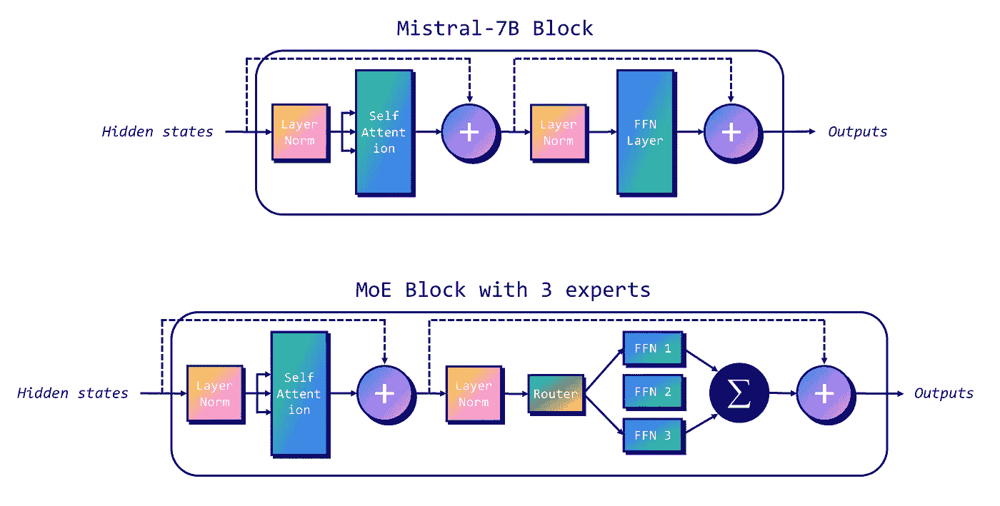
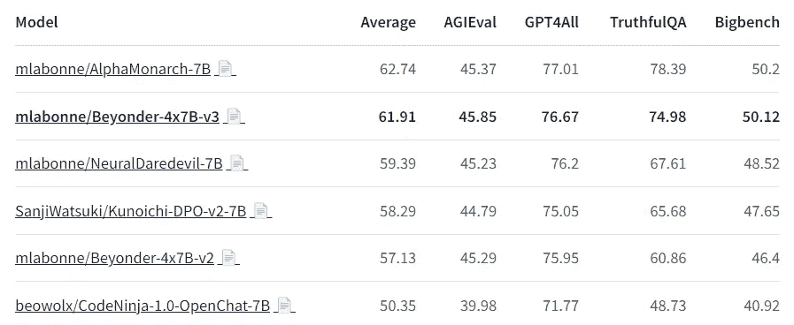
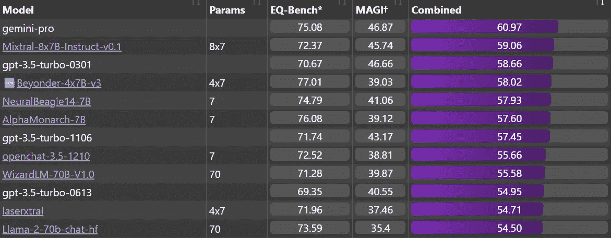
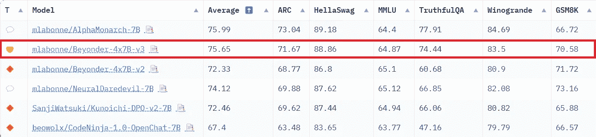

# 使用 MergeKit 创建专家混合

> 原文：[`towardsdatascience.com/create-mixtures-of-experts-with-mergekit-11b318c99562?source=collection_archive---------2-----------------------#2024-03-27`](https://towardsdatascience.com/create-mixtures-of-experts-with-mergekit-11b318c99562?source=collection_archive---------2-----------------------#2024-03-27)

## *将多个模型组合成一个 MoE*

[](https://medium.com/@mlabonne?source=post_page---byline--11b318c99562--------------------------------)[](https://towardsdatascience.com/?source=post_page---byline--11b318c99562--------------------------------) [Maxime Labonne](https://medium.com/@mlabonne?source=post_page---byline--11b318c99562--------------------------------)

·发表于[Towards Data Science](https://towardsdatascience.com/?source=post_page---byline--11b318c99562--------------------------------) ·9 分钟阅读·2024 年 3 月 27 日

--


图片由作者提供

得益于 Mixtral 的发布，**专家混合**（MoE）架构在最近几个月变得非常流行。这种架构提供了一种有趣的权衡：以增加 VRAM 使用量为代价，获得更高的性能。虽然 Mixtral 和其他 MoE 架构是从头开始预训练的，但最近出现了一种创建 MoE 的另一种方法。借助 Arcee 的[MergeKit](https://github.com/arcee-ai/mergekit)库，我们现在可以通过集成多个预训练模型来创建 MoE。这些通常被称为**frankenMoE**或**MoErge**，以区别于预训练的 MoE。

在本文中，我们将详细介绍 MoE 架构的工作原理以及如何创建 frankenMoE。最后，我们将使用 MergeKit 创建我们自己的[frankenMoE](https://huggingface.co/mlabonne/Beyonder-4x7B-v3)并在多个基准上评估它。代码可以通过 Google Colab 中的一个封装程序[LazyMergeKit](https://colab.research.google.com/drive/1obulZ1ROXHjYLn6PPZJwRR6GzgQogxxb#scrollTo=d5mYzDo1q96y)获取。

特别感谢[Charles Goddard](https://github.com/cg123)，MergeKit 的创建者，感谢他对本文的校对。

# 🔀 MoE 简介

专家混合（MoE）是一种旨在提高效率和性能的架构。它使用多个专门的子网络，称为“**专家**”。与密集型模型不同，后者会激活整个网络，MoE 只会根据输入激活相关的专家。这使得训练速度更快，推理更加高效。

MoE 模型的核心有两个组成部分：

1.  **稀疏 MoE 层**: 这些层替代了变换器架构中的密集前馈网络层。每个 MoE 层包含多个专家，而每次输入仅会激活其中的一部分专家。

1.  **门控网络或路由器**: 该组件决定哪些标记由哪些专家处理，确保输入的每个部分都由最合适的专家处理。

在以下示例中，我们展示了如何将一个 Mistral-7B 模块转化为带有稀疏 MoE 层（前馈网络 1、2、3）和路由器的 MoE 模块。这个示例代表了一个拥有三个专家的 MoE，其中两个专家正在参与（FFN 1 和 FFN 3）。



图片由作者提供

MoE 模型也有自己的一套挑战，特别是在微调和内存需求方面。由于模型的复杂性，微调过程可能会变得困难，需要在训练过程中**平衡专家的使用**，以便正确训练门控权重，从而选择最相关的专家。在内存方面，尽管在推理过程中仅使用了总参数的一部分，但整个模型，包括所有专家，都需要**加载到内存中**，这需要高显存容量。

更具体地说，MoE 有两个关键参数：

+   **专家数量** (`num_local_experts`): 该参数决定架构中专家的总数（例如，Mixtral 为 8）。专家数量越多，显存使用越高。

+   **每个标记的专家数量** (`num_experts_per_tok`): 该参数决定每个标记和每个层激活的专家数量（例如，Mixtral 为 2）。在准确性和训练、推理速度之间存在权衡：更多专家可以提高准确性（但回报递减），而较少的专家则有助于快速训练和推理。

历史上，MoE（专家混合模型）表现不如密集模型。然而，2023 年 12 月发布的[Mixtral-8x7B](https://arxiv.org/abs/2401.04088)震动了这一领域，并展示了其在规模上的惊人表现。此外，GPT-4 也被传闻为一种 MoE 模型，这也有其道理，因为与密集模型相比，这种模型在 OpenAI 运行和训练时会更便宜。除了这些近期表现出色的 MoE 模型外，我们现在还可以通过 MergeKit 创建一种新的 MoE 方式：frankenMoE，也被称为 MoErges。

# 🧟‍♂️ 真正的 MoE 与 frankenMoE

真正的 MoE 与 frankenMoE 之间的主要区别在于它们的训练方式。在真正的 MoE 中，专家和路由器是共同训练的。而在 frankenMoE 中，我们重新利用现有模型，并在之后初始化路由器。

换句话说，我们从基础模型中复制层归一化和自注意力层的权重，然后复制每个专家中找到的 FFN 层的权重。这意味着除了 FFN 之外，所有其他参数都是共享的。这也解释了为什么带有八个专家的 Mixtral-8x7B 没有 8*7 = 56B 的参数，而是大约 45B。这也是为什么每个 token 使用两个专家时，推理速度（FLOPs）相当于一个 12B 的密集模型，而不是 14B 的原因。

FrankenMoE 的核心是选择最相关的专家并正确初始化它们。MergeKit 目前实现了三种初始化路由器的方法：

1.  [**随机**](https://github.com/arcee-ai/mergekit/blob/9c691527f7192b5a2fc388555bfd3105e0898480/mergekit/scripts/mixtral_moe.py#L139-L142)：随机权重。在使用时要小心，因为每次可能选择相同的专家（这需要进一步的微调或`num_local_experts = num_experts_per_tok`，这意味着你不需要任何路由）。

1.  [**廉价嵌入**](https://github.com/arcee-ai/mergekit/blob/9c691527f7192b5a2fc388555bfd3105e0898480/mergekit/scripts/mixtral_moe.py#L91C1-L109C37)：直接使用输入 token 的原始嵌入，并对所有层应用相同的变换。该方法计算开销小，适合在较弱的硬件上执行。

1.  [**隐藏**](https://github.com/arcee-ai/mergekit/blob/9c691527f7192b5a2fc388555bfd3105e0898480/mergekit/scripts/mixtral_moe.py#L70-L88)：通过从 LLM 的最后一层提取一组正向和负向提示，创建它们的隐藏表示。这些表示会被平均并归一化以初始化门控。更多信息请参考[Charles Goddard 的博客](https://goddard.blog/posts/clown-moe/)。

如你所猜测，“隐藏”初始化是最有效的，它能够正确地将 token 路由到最相关的专家。在接下来的部分中，我们将使用这一技术创建自己的 frankenMoE。

# 💻 创建一个 frankenMoE

要创建我们的 frankenMoE，我们需要选择`n`个专家。在这种情况下，我们将依靠 Mistral-7B，因为它非常流行且相对较小。然而，像 Mixtral 中的八个专家实际上有点多，因为我们需要将它们全部装入内存。为了提高效率，本例中我将只使用四个专家，其中每个 token 和每层使用两个专家。这样，我们最终会得到一个具有 24.2B 参数的模型，而不是 4*7 = 28B 的参数。

在这里，我们的目标是创建一个全能模型，可以完成几乎所有任务：写故事、解释文章、编写 Python 代码等。我们可以将这个需求分解成四个任务，并为每个任务选择最佳的专家。以下是我如何进行分解的：

+   **聊天模型**：一种用于大多数交互的通用模型。我使用了[mlabonne/AlphaMonarch-7B](https://huggingface.co/mlabonne/AlphaMonarch-7B)，它完美满足了需求。

+   **代码模型**：一个能够生成良好代码的模型。我没有太多关于基于 Mistral-7B 的代码模型的经验，但相比其他模型，我发现[beowolx/CodeNinja-1.0-OpenChat-7B](https://huggingface.co/beowolx/CodeNinja-1.0-OpenChat-7B)特别出色。

+   **数学模型**：数学对于大语言模型（LLMs）来说很棘手，这也是为什么我们需要一个专门处理数学的模型。由于其高 MMLU 和 GMS8K 分数，我选择了[mlabonne/NeuralDaredevil-7B](https://huggingface.co/mlabonne/NeuralDaredevil-7B)作为这个目的的模型。

+   **角色扮演模型**：这个模型的目标是编写高质量的故事和对话。我选择了[SanjiWatsuki/Kunoichi-DPO-v2–7B](https://huggingface.co/SanjiWatsuki/Kunoichi-DPO-v2-7B)，因为它有良好的声誉和高 MT-Bench 分数（8.51 vs. Mixtral 的 8.30）。

现在我们已经确定了要使用的专家，我们可以创建 MergeKit 将用来创建 frankenMoE 的 YAML 配置文件。这使用了 MergeKit 的 mixtral 分支。你可以在[这个页面](https://github.com/arcee-ai/mergekit/blob/mixtral/docs/moe.md)上找到有关如何编写配置的更多信息。以下是我们的版本：

```py
base_model: mlabonne/AlphaMonarch-7B
experts:
  - source_model: mlabonne/AlphaMonarch-7B
    positive_prompts:
    - "chat"
    - "assistant"
    - "tell me"
    - "explain"
    - "I want"
  - source_model: beowolx/CodeNinja-1.0-OpenChat-7B
    positive_prompts:
    - "code"
    - "python"
    - "javascript"
    - "programming"
    - "algorithm"
  - source_model: SanjiWatsuki/Kunoichi-DPO-v2-7B
    positive_prompts:
    - "storywriting"
    - "write"
    - "scene"
    - "story"
    - "character"
  - source_model: mlabonne/NeuralDaredevil-7B
    positive_prompts:
    - "reason"
    - "math"
    - "mathematics"
    - "solve"
    - "count"
```

对于每个专家，我提供了五个基本的正向提示。如果你愿意，也可以写完整的句子。最好的策略是使用能够触发特定专家的真实提示。你也可以添加负向提示以达到相反效果。

一旦准备好，你可以将配置保存为`config.yaml`。在同一个文件夹中，我们将下载并安装[mergekit](https://github.com/arcee-ai/mergekit)库（mixtral 分支）。

```py
git clone -b mixtral https://github.com/arcee-ai/mergekit.git
cd mergekit && pip install -e .
pip install -U transformers
```

如果你的计算机有足够的 RAM（大约 24–32 GB 的 RAM），你可以运行以下命令：

```py
mergekit-moe config.yaml merge --copy-tokenizer
```

如果你没有足够的 RAM，你可以尝试将模型分片，方法如下（这会花费更长时间）：

```py
mergekit-moe config.yaml merge --copy-tokenizer --allow-crimes --out-shard-size 1B --lazy-unpickle
```

这个命令会自动下载专家模型，并在`merge`目录中创建 frankenMoE。对于`hidden`门模式，你还可以使用`--load-in-4bit`和`--load-in-8bit`选项，以更低的精度计算隐藏状态。

另外，你可以将你的配置复制到[LazyMergekit](https://colab.research.google.com/drive/1obulZ1ROXHjYLn6PPZJwRR6GzgQogxxb#scrollTo=d5mYzDo1q96y)中，这是我为简化模型合并而制作的一个包装工具。在这个 Colab 笔记本中，你可以输入模型名称，选择`mixtral`分支，指定你的 Hugging Face 用户名/令牌，并运行相应的单元格。在创建完 frankenMoE 后，它还会将模型上传到 Hugging Face Hub，并附带一个格式化良好的模型卡。

我将我的模型命名为[Beyonder-4x7B-v3](https://huggingface.co/mlabonne/Beyonder-4x7B-v3)，并使用[AutoGGUF](https://colab.research.google.com/drive/1P646NEg33BZy4BfLDNpTz0V0lwIU3CHu#scrollTo=fD24jJxq7t3k)创建了[GGUF 版本](https://huggingface.co/mlabonne/Beyonder-4x7B-v3-GGUF)。如果你无法在本地机器上运行 GGUF 版本，你也可以使用这个[Colab 笔记本](https://colab.research.google.com/drive/1SIfwhpLttmoZxT604LGVXDOI9UKZ_1Aq?usp=sharing)进行推理。

为了全面了解其能力，该模型已经在三个不同的基准测试上进行了评估：Nous 的基准套件、EQ-Bench 和 Open LLM 排行榜。这个模型并不是为了在传统基准测试中表现突出而设计的，因为代码和角色扮演模型通常不适用于这些上下文。尽管如此，凭借强大的通用专家，它的表现依然非常出色。

**Nous**：Beyonder-4x7B-v3 是 Nous 基准套件中最好的模型之一（评估使用[LLM AutoEval](https://github.com/mlabonne/llm-autoeval)进行），并且明显超越了 v2 版本。查看完整的排行榜[这里](https://huggingface.co/spaces/mlabonne/Yet_Another_LLM_Leaderboard)。



**EQ-Bench**：它还是[EQ-Bench 排行榜](https://eqbench.com/)上表现最好的 4x7B 模型，超越了旧版本的 ChatGPT 和 Llama-2–70b-chat。Beyonder 与 Mixtral-8x7B-Instruct-v0.1 和 Gemini Pro 非常接近，后者（据说）是更大的模型。



**Open LLM 排行榜**：最后，它在 Open LLM 排行榜上也是一个强有力的表现者，明显超越了 v2 模型。



除了这些定量评估，我建议使用[LM Studio](https://lmstudio.ai/)上的 GGUF 版本，以更定性的方式检查模型的输出。测试这些模型的常见方法是收集一组私人问题并检查其输出。通过这种策略，我发现 Beyonder-4x7B-v3 相比其他模型，包括 AlphaMonarch-7B，对于用户和系统提示的变化表现得相当稳健。这非常棒，因为它提升了模型的一般实用性。

FrankenMoE 是一个有前景但仍处于实验阶段的方法。它的权衡，如更高的显存需求和更慢的推理速度，可能会使得它在与像 SLERP 或 DARE TIES 这样的简单融合技术相比时难以显现优势。尤其是当你仅使用两个专家时，它们的表现可能不如直接将这两个模型融合。然而，frankenMoEs 在保持知识方面表现出色，这可以使得模型更强大，正如 Beyonder-4x7B-v3 所展示的那样。只要有合适的硬件，这些缺点可以有效地缓解。

# 结论

在这篇文章中，我们介绍了专家混合架构（Mixture of Experts）。与从零开始训练的传统 MoE 不同，MergeKit 通过集合专家来促进 MoE 的创建，提供了一种创新的方法来提升模型的性能和效率。我们详细讲解了使用 MergeKit 创建 frankenMoE 的过程，强调了选择和组合不同专家以生成高质量 MoE 的实际步骤。

感谢阅读本文。我鼓励你尝试使用[LazyMergeKit](https://colab.research.google.com/drive/1obulZ1ROXHjYLn6PPZJwRR6GzgQogxxb#scrollTo=d5mYzDo1q96y)：选择几个模型，创建基于 Beyonder 的配置，并运行笔记本来创建你自己的模型！如果你喜欢这篇文章，请在[Hugging Face](https://huggingface.co/mlabonne)上关注我，并在 X/Twitter 上关注[@maximelabonne](https://twitter.com/maximelabonne)。

# 参考文献

+   [Mixtral 专家混合模型](https://arxiv.org/abs/2401.04088) 由 Jiang 等人（2023 年）撰写

+   [小丑的专家混合模型](https://goddard.blog/posts/clown-moe/) 由 Charles Goddard（2023 年）撰写

+   [专家混合模型解析](https://huggingface.co/blog/moe) 由 Sanseviero 等人（2023 年）撰写

+   [局部专家的自适应混合模型](https://www.cs.toronto.edu/~hinton/absps/jjnh91.pdf) 由 Jacobs 等人（1991 年）撰写

+   [稀疏上采样：从密集检查点训练专家混合模型](https://arxiv.org/abs/2212.05055) 由 Komatsuzaki 等人（2022 年）撰写

*点击此处了解更多关于机器学习的内容并支持我的工作——成为 Medium 会员：*

[](https://medium.com/@mlabonne/membership?source=post_page-----11b318c99562--------------------------------) [## 使用我的推荐链接加入 Medium — Maxime Labonne

### 作为 Medium 会员，你的部分会员费用将用于支持你阅读的作者，并且你将可以完全访问每一篇故事…

medium.com](https://medium.com/@mlabonne/membership?source=post_page-----11b318c99562--------------------------------)
