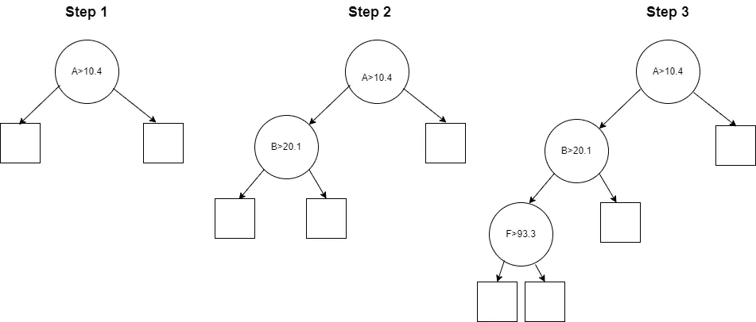
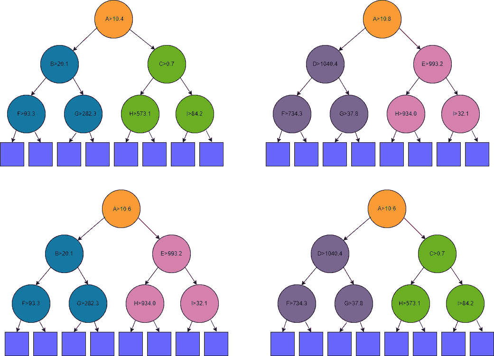
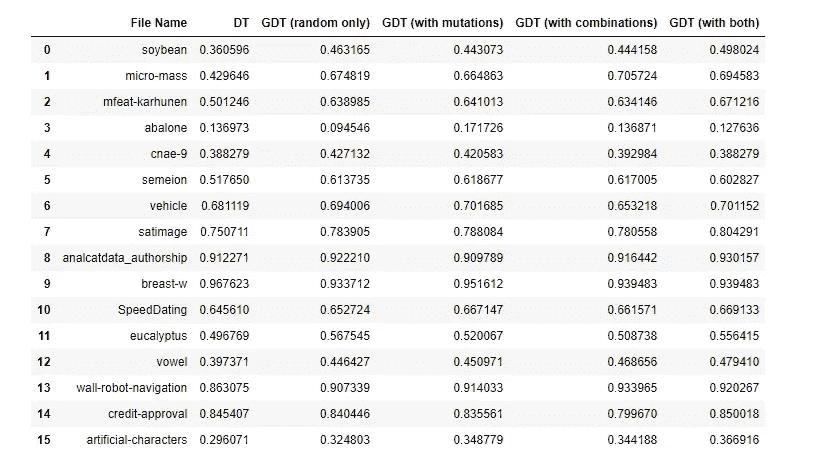

# 使用自助法和遗传算法创建更强的决策树

> 原文：[`towardsdatascience.com/create-stronger-decision-trees-with-bootstrapping-and-genetic-algorithms-1ae633a993c9?source=collection_archive---------1-----------------------#2024-08-09`](https://towardsdatascience.com/create-stronger-decision-trees-with-bootstrapping-and-genetic-algorithms-1ae633a993c9?source=collection_archive---------1-----------------------#2024-08-09)

## 一种更好地让决策树作为可解释模型使用的技术

[](https://medium.com/@wkennedy934?source=post_page---byline--1ae633a993c9--------------------------------)[](https://towardsdatascience.com/?source=post_page---byline--1ae633a993c9--------------------------------) [W Brett Kennedy](https://medium.com/@wkennedy934?source=post_page---byline--1ae633a993c9--------------------------------)

·发表于[Towards Data Science](https://towardsdatascience.com/?source=post_page---byline--1ae633a993c9--------------------------------) ·24 分钟阅读·2024 年 8 月 9 日

--

尽管决策树作为可解释模型通常是有效的（它们相当易于理解），但它们依赖于贪心的构造方法，这可能导致生成次优的树。在本文中，我们展示了如何生成与标准算法生成的相同大小的分类决策树，但这些树可能具有显著更好的性能。

本文是关于可解释人工智能的一系列文章的延续，其他文章还讨论了 ikNN、[加法决策树](https://medium.com/towards-data-science/additive-decision-trees-85f2feda2223)和 PRISM 规则。

# 动机

在机器学习中，使用可解释模型解决预测问题通常是很有用的。与黑箱模型相比，可解释模型至少有两个主要优势。首先，通过可解释模型，我们理解为什么会做出特定的预测。其次，我们可以判断该模型是否适用于未来（未见过的）数据。可解释模型通常比黑箱模型更受青睐，例如在高风险或高度监管的环境中，使用黑箱模型风险过大。

决策树，至少在限制为合理大小的情况下，是非常易于理解的，并且在足够准确时是出色的可解释模型。然而，并非总是能够达到足够的准确性，决策树通常可能表现较弱，尤其是与像 CatBoost、XGBoost 和 LGBM 这样的表格数据更强大的模型相比（这些模型本身是决策树的集成方法）。

同样地，在决策树足够准确的情况下，这种准确性通常是通过允许树的规模变大来实现的，从而消除了可解释性。例如，若一个决策树的深度为 6，它将拥有 2⁶（64）个叶节点，因此实际上是 64 条规则（尽管这些规则是重叠的，因此理解这些规则的认知负担可能不会像理解 64 条完全不同的规则那样大），每条规则有 6 个条件（其中许多条件通常是无关的或具有误导性的）。因此，这样大小的树可能无法被认为是可解释的——尽管根据观众的不同，可能有边界的可解释性。当然，任何更大的树都不可能被任何观众理解。

然而，任何合理小的树，如深度为 3 或 4 的树，对于大多数用途来说，都是可以管理的。事实上，浅层决策树可能与任何其他模型一样具有可解释性。

鉴于决策树作为可解释模型的有效性（即使在实践中高准确性和可解释性并不总是能实现），以及可解释机器学习的其他选项较少，研究可解释机器学习的很多内容（包括本文）自然地与如何使决策树成为更有效的可解释模型有关。这归结为如何使决策树在较小的规模上变得更准确。

# 作为代理模型的可解释模型

除了创建可解释模型，通常在机器学习中也很有用的是使用可解释模型作为一种叫做*代理模型*的东西。

例如，我们可以为某些预测问题创建一个表现良好的模型，可能是一个 CatBoost 模型或神经网络模型。但该模型将是（如果是 CatBoost、神经网络或其他现代模型类型）不可理解的：我们无法理解其预测。也就是说，测试该模型时，我们可以判断它是否足够准确，但无法判断它为何做出当前的预测。

鉴于此，将模型投入生产可能是可行的，也可能不可行。不过我们可以做的是创建一个工具，尽力估计（并以清晰的方式解释）模型为何做出当前的预测。一种方法是创建所谓的*代理模型*。

我们可以创建一个更简单、可解释的模型，如决策树、规则列表、GAM 或 ikNN，来预测黑箱模型的行为。也就是说，代理模型预测黑箱模型将做出的预测。决策树在这方面非常有用。

如果代理模型能够足够准确（它能够很好地估计黑盒模型的预测结果）且具有可解释性，它将提供一些关于黑盒模型行为的见解，尽管这种解释只是近似的：它可以帮助解释为什么黑盒模型会做出这些预测，尽管可能并不完全准确，且可能无法预测黑盒模型在未来不同寻常的数据上的行为。然而，在只需要近似解释的情况下，代理模型对于理解黑盒模型非常有用。

本文剩余部分假设我们正在创建一个可解释的模型，作为实际模型使用，尽管创建一个代理模型来近似另一个模型也会以相同方式工作，这也是创建更精确的小型决策树的重要应用。

# 标准决策树使用的贪心算法

通常，在构建决策树时，我们从根节点开始，识别最佳的初始划分，创建两个子节点，然后再将这两个子节点各自划分为两个，依此类推，直到满足某个停止条件为止。

决策树中的每个节点，在训练过程中，表示训练数据的某个部分。根节点覆盖整个训练集。它将有两个子节点，每个子节点代表训练数据的某个子集（这两个子集不重叠，且覆盖其父节点的全部训练数据）。

每个内部节点覆盖的行集根据与某个特征相关的条件被分为两部分（通常大小不相同）。在下图中，根节点基于特征 A > 10.4 进行划分，因此左节点将表示训练数据中特征 A < 10.4 的所有行，右节点将表示训练数据中特征 A ≥ 10.4 的所有行。

为了找到每个内部节点的划分条件，这一过程选择一个特征和一个划分点，最大化所谓的*信息增益*，即与目标值的一致性。这就是说：假设我们处理的是一个分类问题，我们从根节点开始使用完整数据集。目标列将包含每个目标类别的某些比例。我们尝试将数据集划分为两个子集，使得这两个子集在目标类别上尽可能一致。



例如，在完整的数据集中，我们可能有 1000 行，其中 300 行是 A 类，300 行是 B 类，400 行是 C 类。我们可以将这些数据划分为两个子集，使得两个子集的情况如下：

+   左子集：160 A 类，130 B 类，210 C 类

+   右子集：140 A 类，170 B 类，190 C 类

这里，三个类别的比例在两个子节点中几乎与完整数据集中的比例相同，因此几乎没有（或没有）信息增益。这将是一个不理想的划分选择。

另一方面，如果我们将数据划分为如下形式：

+   左子集：300 类 A，5 类 B，3 类 C

+   右子集：0 类 A，295 类 B，397 类 C

在这种情况下，两个子节点的目标一致性远高于整个数据集。左子节点几乎只有类 A，而右子节点只有类 B 和类 C。因此，这是一个非常好的划分，具有较高的信息增益。

最好的划分将被选择，例如这里的第二个示例，或者如果可能的话，选择一个能带来更高信息增益的划分（即两个子节点中的目标类别具有更高的一致性）。

然后，这一过程会在每个子节点中重复。在上图中，我们看到左子节点首先根据特征 B > 20.1 进行分割，然后它的左子节点根据特征 F > 93.3 进行分割。

这通常是构建树的合理方法，但并不能保证找到可能的最佳树。每个决策都是孤立做出的，仅考虑该节点覆盖的数据，而不是整体树的情况。

此外，对于标准的决策树，每个节点上特征和阈值的选择是一次性的决策（即，它是一个贪婪算法）：一旦选择了分割点，决策树就被限制在这些选择上。虽然树可以（在较低层次）弥补树上层次较高的建模选择不佳的情况，但这通常会导致额外的节点，或导致较难理解的分割，从而降低可解释性，且可能无法完全缓解上层选择的分割点所带来的影响。

尽管决策树使用的贪婪方法通常是相当次优的，但它确实允许树结构的快速构建。历史上，由于计算机系统的处理能力较低，这一点更为重要（评估每个节点每个特征的所有可能分割点实际上是相当繁重的工作，即使在现代硬件上速度非常快）。而在现代环境下，贪婪算法带来的速度也非常有用，因为它允许在基于大规模决策树集成的模型中快速构建许多树。

然而，为了创建一个既准确又可解释（且相对较小）的单一决策树，使用贪婪算法是非常有限的。通常可以构建一个大小有限的决策树，既能实现较好的准确性，又能达到比贪婪方法更高的准确性水平。

# 遗传算法

在专门讨论决策树之前，我们将快速回顾一下遗传算法。遗传算法在计算机科学中广泛应用，且通常在开发问题解决方案时非常有效。它们通过生成许多潜在的解决方案并通过试错法找到最佳方案，尽管这一过程是有指导和高效的，模拟了现实世界中的遗传过程。

遗传算法通常从一组候选问题解决方案开始（通常是随机创建的），然后进行多次迭代，每轮选择最强的候选方案，去除其他方案，并基于当前最好的（到目前为止的）现有解决方案创建一组新的候选解决方案。这可以通过变异（随机修改）现有的解决方案，或通过将两个或更多解决方案组合成一个新解决方案来完成，模拟现实世界进化过程中的繁殖现象。

这样，随着时间的推移，逐渐会出现一组越来越强的候选方案。并非每个新生成的解决方案都比之前生成的解决方案强，但在每个步骤中，某些方案很可能会更强，即使只是稍微更强。

在这个过程中，也有可能定期生成完全新的随机解决方案。尽管这些解决方案并没有经历变异或强解决方案的组合（这些强解决方案也最初是随机创建的），它们可能由于偶然的原因，与一些经过进化的解决方案一样强。尽管这种情况的可能性随着遗传过程产生的候选方案（并且被选为到目前为止最好的解决方案）越来越进化和适应问题而逐渐减小，但偶尔也会发生。

在决策树构建中应用遗传算法时，生成一组候选决策树，选择其中最好的，进行变异和组合（有些新树可能同时进行这两项操作：从多个现有树中衍生出新后代，并同时对这些后代进行变异）。这些步骤可以重复进行多次。

每当从一个或多个现有决策树生成新的决策树时，新的决策树将与之前的树非常相似，但会有所不同。通常，大部分内部节点将保持相同，但会修改一个（或少数几个）内部节点：改变特征和阈值，或仅修改阈值。修改也可能包括添加、删除或重新排列现有的内部节点。每当内部节点被修改时，叶节点中的预测也必须重新计算。

这个过程可能比较缓慢，需要多次迭代才能看到准确度的显著提升，但在本文讨论的情况下（创建可解释的决策树），我们可以假设所有决策树都相对较小（出于可解释性的需要），最大深度大约为 2 到 5 层。这使得进展比尝试进化大型决策树时要快得多。

# 创建更强决策树的其他方法

随着时间的推移，已经提出了许多关于决策树的遗传算法的方案。本文介绍的解决方案具有提供 GitHub 上的 Python 代码的优势，但这并不是第一个，许多其他解决方案可能对你的项目更有效。GitHub 上还有几个项目也致力于将遗传算法应用于构建决策树，可能值得进一步调查。但是，本文展示的解决方案直观且有效，在可解释的机器学习领域中值得关注。

除了遗传算法，还有一些研究致力于提高决策树的准确性和可解释性（在约束大小下的准确性），包括 [最优稀疏决策树](https://arxiv.org/abs/1904.12847)、斜向决策树、忽视型决策树和 [AdditiveDecisionTrees](https://github.com/Brett-Kennedy/AdditiveDecisionTree)。我在另一篇 Medium 文章中讨论了最后一种方法，并希望在随后的文章中涉及其他方法。

此外，还有一些与创建可解释规则相关的工作，包括 [imodels](https://github.com/csinva/imodels) 和 [PRISM-Rules](https://github.com/Brett-Kennedy/PRISM-Rules)。虽然规则与决策树并不完全等价，但它们通常可以以类似的方式使用，并提供类似的准确性和可解释性水平。而且，树结构总是可以轻松地转化为规则。

一些工具，如 [autofeat](https://github.com/cod3licious/autofeat)、[ArithmeticFeatures](https://github.com/Brett-Kennedy/ArithmeticFeatures)、[FormulaFeatures](https://github.com/Brett-Kennedy/FormulaFeatures) 和 [RotationFeatures](https://github.com/Brett-Kennedy/RotationFeatures)，也可以与标准或遗传决策树结合，创建出更加精确的模型。它们通过创建更强大的特征来减少树中所需的节点数，以达到更高的准确性：虽然特征变得更加复杂，从而导致解释性有所下降，但树的规模通常会显著缩小，从而在整体上提高（有时是非常大的提高）了可解释性。

# 实现细节

决策树对用于训练的数据非常敏感。决策树以其不稳定性而著称，即使训练数据发生细微变化，内部表示也可能会不同。这虽然可能不会显著影响它们的准确性，但却可能让人怀疑它们是否能很好地捕捉特征与目标之间的真实关系。

高方差（基于训练数据的小变化导致的可变性）通常也会导致过拟合。但在遗传决策树中，我们正是利用这一点来生成随机候选模型。

在内部，GeneticDecisionTree 会生成一组 scikit-learn 决策树，然后将其转换为 GeneticDecisionTrees 内部使用的另一种数据结构（这使得随后的变异和组合操作变得更简单）。为了创建这些 scikit-learn 决策树，我们简单地使用原始训练数据的不同自助法样本进行拟合（同时变化使用的随机种子）。

我们还会变化样本的大小，从而进一步增加多样性。样本大小基于对数分布，因此我们实际上是在为样本大小选择一个随机的数量级。考虑到这一点，较小的样本更为常见，但偶尔也会使用较大的样本。这一范围限制为最小 128 行，最大为训练集大小的两倍。例如，如果数据集有 100,000 行，则允许样本大小在 128 到 200,000 之间，均匀地从 log(128)到 log(200,000)之间随机抽取一个值，然后取这个随机值的指数作为样本大小。

算法从创建一小组通过这种方式生成的决策树开始。然后，它会进行指定次数的迭代（默认五次）。每次迭代：

+   它会随机变异迄今为止创建的表现最佳的树（这些树最适合训练数据）。在第一次迭代时，这会使用所有在迭代前创建的树。从每棵表现最好的树开始，生成大量的变异。

+   它会将到目前为止创建的表现最好的树配对并进行组合。这是通过对所有能够组合的表现最佳树的配对进行穷举方式来完成的（详细信息见下）。

+   它会使用 scikit-learn 和随机自助法样本生成额外的随机树（随着迭代的进行，生成的这些树越来越少，因为它们与经历过变异和/或组合的模型竞争变得更困难）。

+   它会选择表现最好的树，然后循环回到下一次迭代。其他的则被丢弃。

每次迭代时，都会生成大量新的树。每棵树都会在训练数据上进行评估，以确定其中最强的一棵，这样下一次迭代就仅以少量表现良好的树开始，每次迭代通常会在上一轮的基础上有所改进。

最终，在执行完指定次数的迭代后，选出表现最好的单棵树，并用于预测。

如前所述，标准决策树是以纯粹贪婪的方式构建的，只考虑每个内部节点的每种可能分裂的**信息增益**。而遗传决策树则不同，构建每棵新树的过程可能部分或完全是随机的（由 scikit-learn 构建的过程大部分是非随机的，但它基于随机样本；突变是纯随机的；组合是纯确定性的）。但是，在拟合过程中做出的重要决策（选择目前为止生成的最佳模型）与整个树对可用训练数据的拟合相关。这通常会生成一个比贪婪方法允许的更适合训练数据的最终结果。

尽管遗传过程具有实用性，但一个有趣的发现是：即使每次迭代不执行突变或组合（每次迭代仅生成随机决策树），遗传决策树往往比标准的相同（小）尺寸的决策树更准确。

突变和组合操作是可配置的，可以设置为`False`以允许更快的执行时间——在这种情况下，我们只是生成一组随机决策树，并选择最适合训练数据的那一棵。

这正是我们预期的结果：通过尝试决策树内部节点的多种可能选择集，某些模型的表现将优于以正常贪婪方式构建的单棵树。

然而，这确实是一个非常有趣的发现，也非常实际。这意味着：即使没有遗传过程，仅仅通过尝试许多潜在的小决策树来拟合训练集，我们几乎总是能够找到一棵比以贪婪方式生长的相同大小的小决策树更适合数据的树。通常要好得多。事实上，这可能是构建近似最优决策树的更实际的方法，至少对于适用于可解释模型的小尺寸树来说，优于特意寻求创建最优树。

然而，在启用突变和组合的情况下，通常在一两次迭代后，得分最高的候选决策树（最适合训练数据的树）将基于突变和/或组合其他强模型。也就是说，启用突变和组合确实有助于生成更强的模型。

假设我们创建一个有限大小的决策树，模型的强度是有限的——实际上，虽然可能不会实际发现，但确实存在一棵树，它最好地匹配训练数据。例如，在有七个内部节点（一个根节点，两个子节点，四个孙节点）的情况下，拟合树时只需做出七个决策：在这七个内部节点中使用的特征和阈值。

尽管标准决策树不太可能找到理想的七个内部节点组合，但一个随机过程（尤其是伴随随机变异和组合的过程）可以相对较快地接近这一理想。尽管仍然不太可能达到理想的内部节点集，但可以接近它。

# 理想树的穷举测试

创建近似最优决策树的替代方法是使用每个可能的特征和阈值组合创建并测试树：对可能的小树进行穷举搜索。

然而，即使是一个非常小的树（例如，七个内部节点），这一过程也是不可行的。例如，假设有十个特征，每个节点的特征选择就有 10⁷ 种选择（假设特征可以在树中出现任意次数）。因此，每个节点的阈值选择也有大量的可能性。

选择阈值时可以使用信息增益（在每个节点保持特征不变，并选择能最大化信息增益的阈值）。对于仅有十个特征的情况，这可能是可行的，但如果特征数量更多，选择每个节点的特征组合的数量会迅速激增。以 20 个特征为例，20⁷ 种选择就超过了十亿。

使用一些随机性和一定程度的遗传过程可以改善这一点，但在几乎所有情况下，完全穷举搜索是不切实际的。

# 执行时间

这里提出的算法远非穷举式搜索，但即使在小规模下，也能生成一个准确的决策树。

然而，准确度的提升是以时间为代价的，并且该实现仅进行了适度的性能优化（例如，它确实允许内部并行执行操作），与标准的 scikit-learn 决策树相比，特别是在进行多次迭代时，速度要慢得多。

然而，这种方法在效率上是合理的，测试表明，通常使用 3 到 5 次迭代就足以比 scikit-learn 的决策树在分类上实现显著的改进。对于大多数实际应用，性能是相当合理的。

对于大多数数据集，拟合时间通常只有 1 到 5 分钟，具体取决于数据的大小（行数和列数都相关）和所指定的参数。与训练标准决策树（通常不到一秒）相比，这相当慢。然而，几分钟的时间通常是值得的，特别是在生成一个可解释的模型时，尤其是在创建准确且可解释的模型通常非常具有挑战性的情况下。

在需要的情况下，将迭代次数限制为 1 或 2 次可以减少训练时间，通常仍能取得良好的结果。正如预期的那样，随着迭代次数的增加，收益会逐渐递减，且可能会增加过拟合的风险。使用详细设置，可以查看拟合过程的进展，并确定何时收益似乎已经达到瓶颈。

然而，禁用变异和/或组合是减少执行时间的最有效手段。变异和组合允许工具在现有强树的基础上生成变体，并且通常非常有用（它们生成的树与 scikit-learn 可能生成的树不同），但比仅仅基于训练数据的自助样本生成随机树的过程要慢：大部分变异的准确度较低（尽管一小部分变异可能比其他方法产生的树更精确），而基于随机样本生成的树至少是可行的树。

也就是说，使用变异时，我们可能需要生成并评估大量树，才能找出表现非常强的树。然而，组合的情况则不同，组合通常比原始树更强。

# 生成随机决策树

如前所述，在某些情况下，禁用变异和组合，改为仅基于随机自助样本生成一系列随机树，可能是合理的。这种方法不能算作遗传算法——它只是生成大量的小决策树，并选择其中表现最好的。尽管如此，如果能够通过这种方式达到足够的准确度，这可能就是所需的全部，并且可以缩短训练时间。

也可以将此作为基准进行启动，然后通过启用变异和/或组合来测试是否可以找到进一步的改进。在这些操作中，模型应设置为至少执行几次迭代，以便给它一个机会逐步改善随机生成的树。

我们还应在此强调，这种方法（生成许多相似但随机的树，不使用任何遗传过程）与创建随机森林（RandomForest）的相似性——随机森林也是基于一组决策树，每棵树都在随机自助样本上训练。然而，随机森林将使用所有生成的决策树并结合它们的预测，而遗传决策树则只保留其中最强的一棵。

# 变异

我们现在将更详细地描述遗传决策树（GeneticDecisionTree）中的变异和组合过程如何工作。

当前遗传决策树支持的变异过程相当简单。它仅允许修改内部节点使用的阈值，保持所有节点使用的特征不变。

在变异过程中，选择一个表现良好的树，并创建其新的副本，除了一个内部节点使用的阈值不同外，其他部分与原树相同。需要修改的内部节点是随机选择的。该节点在树中的位置越高，新阈值与原阈值的差异越大，那么新树与原树的差异就越大。

这种方法出奇有效，并且通常能显著改变用于两个子节点下的训练数据（因此也会改变选择节点下的两个子树）。

在变异之前，这些树最初的阈值由 scikit-learn 分配，完全基于信息增益选择（没有考虑整棵树）。即使保持其余部分不变，修改这些阈值也能有效地产生截然不同的树，这些树通常会表现得更好。尽管大多数变异树并没有超过原始树的表现，但通常通过对每棵树进行适量的变化，可以找到一个提升。

未来版本可能还会允许在树内旋转节点，但迄今为止的测试发现，这种方法不如简单修改单个内部节点的阈值效果好。然而，将会有更多的研究来探索可能证明有效且高效的其他变异方法。

# 组合

当前支持的另一种修改形式是结合两棵表现良好的决策树。为此，我们从前一轮迭代中找到的前二十棵树开始，尝试将其中的每一对树结合。如果两棵树在根节点使用相同的特征，则可以进行组合。

例如，假设树 1 和树 2（下图顶部行中的两棵树）是目前找到的表现最好的树。

该图显示了四棵树：树 1、树 2 以及从这两棵树中创建的两棵树。内部节点显示为圆形，叶子节点显示为方形。

树 1 在根节点上有特征 A > 10.4 的分裂，而树 2 在根节点上有特征 A > 10.8 的分裂。因此，我们可以将这两棵树结合：它们都在根节点使用特征 A。



然后我们创建了两棵新树。在这两棵新树中，根节点的分裂值取自两棵原始树根节点分裂值的平均值，因此在这个示例中，两个新树（显示在图的底部行）在根节点都会有特征 A > 10.6。

第一棵新树将拥有树 1 的左子树（树 1 根节点下的左子树，绘制为蓝色）和树 2 的右子树（绘制为粉红色）。另一棵新树将拥有树 2 的左子树（紫色）和树 1 的右子树（绿色）。

在这个例子中，树 1 和树 2 都只有 3 层内部节点。在其他例子中，子树可能会稍大，但如果是这样，也通常只有一两层的额外深度。无论子树的大小或形状如何，思想是相同的。

以这种方式组合实际上是将其中一棵树的一半和另一棵树的一半合并，前提是根节点以外的部分也会被保留，具体思路如下：

+   如果两棵树都很强，那么（尽管不一定）根节点中共同选择的特征可能很强。此外，两个选择之间的分割点可能更优。在上述示例中，我们使用了 10.6，它位于父树使用的 10.4 和 10.8 之间。

+   尽管两棵树都很强，但它们可能都不是最优的。如果有差异，差异就出现在两个子树中。可能是树 1 既有更强的左子树，又有更强的右子树，在这种情况下，通过与树 2 结合无法超过树 1。同样，如果树 2 拥有更强的左子树和右子树。但是，如果树 1 的左子树更强，而树 2 的右子树更强，那么创建一棵新树来利用这一点，将会生成一棵比树 1 或树 2 都强的新树。同样，对于相反的情况也是如此。

我们可以设想其他方法来结合两棵树，其他通过遗传算法生成决策树的工具也使用其他方法来结合树。但是，简单地从一棵树中取出一个子树，再从另一棵树中取出另一个子树，是一种非常直接且具有吸引力的方法。

未来的版本将允许使用根节点以外的节点进行组合，尽管在这些情况下效果较小——我们那时会保留一棵树的大部分，并替换另一棵树的较小部分，从而生成一棵与原始树相差较小的新树。尽管如此，这仍然是一种有价值的组合方式，并将在未来得到支持。

# 过拟合

决策树通常会发生过拟合，GeneticDecisionTrees 也可能会发生。像大多数模型一样，GeneticDecisionTree 尝试尽可能地拟合训练数据，这可能导致它在与同等大小的其他决策树比较时，泛化能力较差。

然而，过拟合受到限制，因为树的大小通常较小，树不能超过指定的最大深度。每个候选决策树的复杂度是相同的（或几乎相同——有些路径可能没有扩展到允许的最大深度，所以有些树可能稍微小一些），因此它们发生过拟合的可能性大致相同。

然而，和任何模型一样，建议调优 GeneticDecisionTrees，以找到最适合你数据的模型。

# 回归

GeneticDecisionTrees 支持分类和回归，但更适合分类。一般来说，回归函数很难用浅层决策树来建模，因为它需要预测一个连续的数值，而每个叶节点只能预测一个单一值。

例如，一个有八个叶节点的树只能预测八个独特的值。这通常对于分类问题足够（假设目标类别数不超过八），但对于回归问题来说，只能生成非常粗略的预测。对于回归问题，即使是简单的函数，通常也需要非常深的树才能生成准确的结果。深入树的结构，树可以越来越精确地微调预测。

只有当数据的目标列中只有少数几个独特的值，或者这些值属于少数几个聚类且每个聚类的范围较小时，使用小树进行回归才是可行的。

GeneticDecisionTrees 可以通过将最大深度设置为非常高的值来工作，从而允许生成准确的模型，通常比标准决策树要高得多，但此时树将无法解释。而且，尽管准确性通常较强，但仍可能无法与像 XGBoost、LGBM 或 CatBoost 等强大的模型竞争。基于此，GeneticDecisionTrees 用于回归（或任何尝试创建准确的浅层决策树进行回归）通常是不可行的。

# 安装

GeneticDecisionTrees 的 GitHub 页面是：[`github.com/Brett-Kennedy/GeneticDecisionTree`](https://github.com/Brett-Kennedy/GeneticDecisionTree)

要安装，你可以简单地下载单个 [genetic_decision_tree.py](https://github.com/Brett-Kennedy/GeneticDecisionTree/blob/main/genetic_decision_tree.py) 文件，并将其导入到你的项目中。

GitHub 页面还包括一些示例笔记本，但浏览 [简单示例](https://github.com/Brett-Kennedy/GeneticDecisionTree/blob/main/Examples/Simple_Examples.ipynb) 笔记本应该足够，能够看到如何使用该工具以及一些 API 的示例。GitHub 页面还记录了 API，这些 API 相对简单，提供的签名与 scikit-learn 的 DecisionTreeClassifier 类似，尽管较小。

# 示例

以下示例来自 GitHub 页面提供的 Simple_Examples 笔记本。它加载一个数据集，进行训练集和测试集划分，拟合一个 GeneticDecisionTree，创建预测并输出准确性，这里使用的是 F1 宏观得分。

```py
import pandas as pd
import numpy as np
from sklearn.model_selection import train_test_split
from sklearn.metrics import f1_score
from sklearn.datasets import load_wine
from genetic_decision_tree import GeneticDecisionTree

data = load_wine()
df = pd.DataFrame(data.data)
df.columns = data.feature_names
y_true = data.target
X_train, X_test, y_train, y_test = train_test_split(df, y_true, test_size=0.3, random_state=42)
gdt = GeneticDecisionTree(max_depth=2, max_iterations=5, allow_mutate=True, allow_combine=True, verbose=True)
gdt.fit(X_train, y_train)
y_pred = gdt.predict(X_test)
print("Genetic DT:", f1_score(y_test, y_pred, average='macro'))
```

GeneticDecisionTree 是一个单一类，既用于分类也用于回归。它从目标数据推断数据类型，并在内部处理回归和分类之间的区别。如前所述，它更适用于分类，但在需要时也非常容易用于回归。

类似于 scikit-learn 的决策树，GeneticDecisionTree 提供了一个 export_tree() API。在使用葡萄酒数据集、深度为 2 的情况下，GeneticDecisionTree 在保留测试集上的 F1 宏观得分为 0.97，相比之下，scikit-learn 的决策树得分为 0.88。GeneticDecisionTree 生成的树是：

```py
IF flavanoids < 1.4000
| IF color_intensity < 3.7250
| | 1
| ELSE color_intensity > 3.7250
| | 2
ELSE flavanoids > 1.4000
| IF proline < 724.5000
| | 1
| ELSE proline > 724.5000
| | 0
```

# 分类测试

github 页面提供了对 GeneticDecisionTrees 的广泛测试。该测试使用了来自 OpenML 的大量测试集，并为每个测试集创建了一个标准（scikit-learn）决策树和四个 GeneticDecisionTrees：每种组合包括允许变异和允许组合（支持两者都不支持、仅支持变异、仅支持组合以及两者都支持）。在所有情况下，都使用了最大深度为 4 的设置。

几乎在所有情况下，至少有一种，通常是所有四种 GeneticDecisionTree 的变种，表现都远超标准决策树。这些测试使用了 F1 宏观得分来比较模型。这里展示的是其中的一部分：



在大多数情况下，启用变异或组合，或两者同时启用，比单纯生成随机决策树要好。

鉴于测试的案例数量庞大，运行此笔记本的速度相当慢。它也不是一个权威性的评估：它只使用了有限的测试文件集，除了 max_depth 以外使用了默认参数，并且仅测试了 F1 宏观得分。然而，它确实展示了在许多情况下，GeneticDecisionTrees 可以是有效且可解释的模型。

# 结论

有许多情况下，使用可解释的模型（或结合可解释的代理模型与黑盒模型以提高可解释性）是更可取的，而在这些情况下，浅层决策树通常是最佳选择之一。然而，标准决策树可能会以次优的方式生成，这可能导致准确性较低，尤其是对于我们限制大小的树。

这里展示的简单过程，通过基于训练数据的随机样本生成多个决策树，并确定最适合训练数据的树，相比之下，可以提供显著的优势。

事实上，最大的发现是，基于不同随机样本生成决策树集的效果几乎与这里包含的遗传方法一样有效。然而，这一发现可能不会在未来版本中继续保持强烈有效，特别是当向代码库中添加更多的变异和组合，或者执行大量迭代时。

除了生成许多树之外，允许使用遗传过程，其中训练在多个迭代中执行，每次变异和组合迄今为止发现的最佳表现树，这通常可以进一步改善结果。

这里展示的技术易于复制并且可以根据您的需求进行增强。您也可以直接使用 github 上提供的 GeneticDecisionTree 类。

在适合使用决策树进行分类项目的情况下，使用 GeneticDecisionTrees 也可能是明智之选。它们几乎总是能够同样有效，且通常效果更好，尽管需要更长的拟合时间。

所有图片均由作者提供
