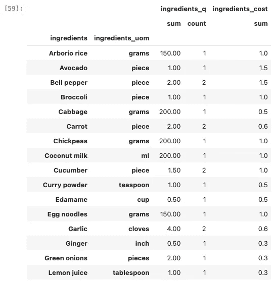

# 使用 ChatGPT 创建你自己的餐单计划器

> 原文：[`towardsdatascience.com/create-your-own-meal-planner-using-chatgpt-1dc4dfe3af7e?source=collection_archive---------4-----------------------#2024-09-02`](https://towardsdatascience.com/create-your-own-meal-planner-using-chatgpt-1dc4dfe3af7e?source=collection_archive---------4-----------------------#2024-09-02)

## 提示工程简要指南

[](https://medium.com/@cornederuijt?source=post_page---byline--1dc4dfe3af7e--------------------------------)[](https://towardsdatascience.com/?source=post_page---byline--1dc4dfe3af7e--------------------------------) [Corné de Ruijt](https://medium.com/@cornederuijt?source=post_page---byline--1dc4dfe3af7e--------------------------------)

·发布于[Towards Data Science](https://towardsdatascience.com/?source=post_page---byline--1dc4dfe3af7e--------------------------------) ·16 分钟阅读·2024 年 9 月 2 日

--


通过 DALL-E 3 生成，使用的提示是“卡通风格的餐桌上的披萨卡尔佐内”。生成日期：2024 年 5 月 10 日。

# 1\. 引言

我们都知道这种感觉。你工作到很晚才回家；大脑像被紧紧挤压的海绵一样。你走进厨房，又被提醒了一个认知任务：今晚吃什么。但你知道，你已经太晚做出这个决定，因为你无意识地抓起了饼干罐，并且把其中一个吃掉了。

幸运的是，已经有了解决方案：餐单规划。提前决定一周的餐食，采购一周的食材，并在一周开始之前就准备好（部分）餐食，这有助于更健康地饮食。但这仍然需要大量的工作：决定吃什么，列出购物清单，决定是订购食材还是去超市更合适。幸运的是，我们现在有了这样一个“魔法棒”来完成这些任务：ChatGPT。

简而言之，在本教程中，我们将引导你使用 ChatGPT 创建自己的餐单计划器。你将对常见的提示工程技巧（那些引导 ChatGPT 回答的技巧）有所了解，并学习如何在 Python 中使用这些技巧。

准备好了吗？让我们开始吧！如果你想使用/下载本教程的笔记本版本，可以在 Github 上找到：

[](https://github.com/cornederuijt/LLM-workshop/blob/main/scripts/%5BJNB_11_03_24_04_01_e_a_04_a%5D%20Create%20you%20own%20meal%20planner%2C%20using%20ChatGPT.ipynb?source=post_page-----1dc4dfe3af7e--------------------------------) [## LLM-workshop/scripts/[JNB_11_03_24_04_01_e_a_04_a] 使用 ChatGPT 创建你自己的餐单计划器.ipynb…

[github.com](https://github.com/cornederuijt/LLM-workshop/blob/main/scripts/%5BJNB_11_03_24_04_01_e_a_04_a%5D%20Create%20you%20own%20meal%20planner%2C%20using%20ChatGPT.ipynb?source=post_page-----1dc4dfe3af7e--------------------------------)

## 1.2\. 前提条件

在本教程中，我们将使用一些 Python 代码和 OpenAI API 来调用 ChatGPT。理论上，您可以不编写 Python 代码，直接在 ChatGPT 网站上进行提示，但在超越本教程所解释的基础知识时，结合 Python 或 Python LLM 包（如 LangChain [1]）使用提示将变得非常强大。

如果您看到“LLM”并想知道：“什么是‘LLM’？”，不用担心。LLM 是大语言模型（Large Language Model）的缩写，基本上是一个更大的模型类别，其工作原理类似于 ChatGPT。因此，在本教程中，您遇到“LLM”时，只需理解为“ChatGPT 或类似的东西”，就可以了。

要开始，我们需要以下内容：

1\. 对 Python 有一些基本了解。我将以[“Python 入门”](https://app.datacamp.com/learn/courses/intro-to-python-for-data-science)（Python 基础、Python 列表、函数和包）DataCamp 教程的前三章为参考点[2]。

2\. 一个 OpenAI 帐户。如果您没有帐户，请访问[ChatGPT 网站](https://chatgpt.com) [3]，点击右上角的“登录”，然后选择“注册”创建帐户。

3\. OpenAI 的 API 密钥，我们将在接下来的步骤中简要指导您。

**1.2.1 申请 OpenAI 密钥**

*要使用 OpenAI API，您需要提供一些信用卡信息，并且根据 OpenAI 计算免费额度的方式，您可能会因使用 API 而产生费用。按照本教程进行操作的成本应该是最小的（几分钱）[4]。*

要通过编程与 OpenAI 进行交互，我们需要申请一个 API 密钥，您可以按照以下步骤进行操作：

1\. 访问[`platform.openai.com`](https://platform.openai.com)，并使用您的帐户登录。

2\. 访问[`platform.openai.com/account/billing/overview`](https://platform.openai.com/account/billing/overview)，并添加您的信用卡信息。

3\. 前往 API 密钥：[`platform.openai.com/api-keys`](https://platform.openai.com/api-keys)。

4\. 选择“创建新的密钥”，OpenAI 将生成一串长文本（字符串），它将作为您的 API 密钥。**请注意不要共享 API 密钥！**

5\. 将密钥保存在方便的位置。

为了简便起见，我们假设您已经将 API 密钥保存在工作目录中的 keys.yaml 文件中。该文件内容如下：

```py
openai_key: "<your key string>"
```

**1.2.2 安装包**

在本教程中，我们将使用 OpenAI API，它有一个 Python 包，可以通过 pip 安装。

```py
! pip install openai
```

除 OpenAI 外，我们假设常用的数据包（如 pandas、numpy）已安装。

**1.2.3 一些安全防护措施**

在继续之前，我们应该意识到使用 ChatGPT 或任何我们在网上找到的 AI 平台的一些风险。即使像创建餐单这样简单的事情看起来无害，仍然有一些风险是我们需要考虑的。

+   **与 OpenAI 分享数据 —** 当我们与 ChatGPT 或任何我们在网上找到的 LLM/AI-Agent 互动时，我们实际上是在与该平台分享我们的数据。我们应该意识到这一点，并避免与该平台分享任何涉及隐私和/或敏感的信息。例如，在创建餐单时，ChatGPT 并不需要知道我是为我的朋友 Alexander William 创建这个餐单的，他住在阿姆斯特丹的 Nieuwezijds Voorburgwal（抱歉我的荷兰语）147 号（剧透：他喜欢煎饼 [10]）。

+   **要注意 LLM 的概率性特征 —** 本质上，LLM 会根据你提供的上下文*预测*最可能的词。因此，它的输出可能是没有逻辑的。一个常见的例子是询问 ChatGPT “草莓”中字母“r”的频率，它可能无法识别 [11]。虽然 OpenAI 和其他 LLM 提供商正在努力提升 LLM 的逻辑推理能力 [12]，但我们仍然必须注意它们可能产生的错误。也就是说，要小心，如果你要求 ChatGPT 为你乳糖不耐症的朋友制定餐单，并明确说明餐单不能包含任何乳制品，ChatGPT 可能仍会在餐单中包含乳制品。

# 2\. 餐单练习

在一天的辛勤工作之后，没什么比解决“晚餐吃什么”的难题更让人感到沮丧了。你想吃些健康的东西，但同时又不能太难准备。当你还在为这个问题苦恼时，那个想要吃不健康晚餐的信号愈加强烈。为什么要折磨自己呢？让我们干脆让 ChatGPT 来决定晚餐吃什么吧。

首先，让我们加载所需的包：

```py
import yaml
from openai import OpenAI

from pprint import pprint
import pandas as pd
import numpy as np

import warnings
warnings.filterwarnings('ignore')
```

让我们加载在第 1.2 节中创建的 API 密钥。

```py
with open('keys.yaml', 'r') as file:
    openai_key = yaml.safe_load(file)
```

接下来，我们为 OpenAI 密钥设置一个环境变量。这只是为了让我们的生活稍微轻松一些。之后，我们就不必再太在意 API 密钥了。

```py
os.environ["OPENAI_API_KEY"] = openai_key['open_ai_key']
```

让我们创建 ChatGPT 客户端：

```py
client = OpenAI()
```

现在让我们调用 ChatGPT API：

```py
response = client.chat.completions.create(
  model="gpt-3.5-turbo",
  messages=[
    {
      "role": "user",
      "content": "Create a meal plan for the coming week"
    }
  ]
)

pprint(response.choices[0].message.content)
```

> GPT 响应：

```py
('Monday:\n'
 '- Breakfast: Greek yogurt with granola and berries\n'
 '- Lunch: Turkey and avocado wrap with a side salad\n'
 '- Dinner: Grilled chicken with roasted vegetables\n'
 '\n'
 'Tuesday:\n'
 '- Breakfast: Oatmeal with bananas and almonds\n'
 '- Lunch: Quinoa salad with grilled shrimp\n'
 '- Dinner: Beef stir-fry with brown rice\n'
 '\n'
 'Wednesday:\n'
 '- Breakfast: Whole grain toast with avocado and hard-boiled eggs\n'
 '- Lunch: Chickpea salad with feta cheese\n'
 '- Dinner: Baked salmon with asparagus and sweet potatoes\n'
 '\n'
 'Thursday:\n'
 '- Breakfast: Smoothie with spinach, banana, and almond milk\n'
 '- Lunch: Turkey and cheese sandwich with a side of carrots and hummus\n'
 '- Dinner: Vegetarian chili with cornbread\n'
 '\n'
 'Friday:\n'
 '- Breakfast: Greek yogurt with honey and walnuts\n'
 '- Lunch: Tuna salad on whole wheat crackers\n'
 '- Dinner: Grilled steak with roasted brussels sprouts and mashed potatoes\n'
 '\n'
 'Saturday:\n'
 '- Breakfast: Scrambled eggs with spinach and feta cheese\n'
 '- Lunch: Caprese salad with grilled chicken\n'
 '- Dinner: Spaghetti with marinara sauce and a side of garlic bread\n'
 '\n'
 'Sunday:\n'
 '- Breakfast: Pancakes with maple syrup and fresh fruit\n'
 '- Lunch: Veggie wrap with a side of quinoa\n'
 '- Dinner: Baked ziti with a side salad\n'
 '\n'
 'Snacks throughout the week can include fruits, nuts, Greek yogurt, and '
 "granola bars. Don't forget to stay hydrated with plenty of water throughout "
 'the day.')
```

这个答案确实有点像我不久前在 Maximilian Vogel 的 Medium 博客中找到的一句话 [5]：

*“AI 模型就像是热心的办公室实习生，勤奋且充满热情，但迫切需要指导。”*

如果你有一位全职厨师为你工作，并且有无限的时间和预算来准备餐点，那是可以的，但否则……

现在想起来，因为我来自荷兰，所以我通常只关心我的晚餐，因为早餐和午餐我每天都吃同样无聊的餐点（燕麦粥和三明治），或者偶尔我会吃昨天的剩菜。所以我真的只关心晚餐。

那么，如何将 ChatGPT 的回应引导到正确的方向呢？让我们来看看。

> ***练习 1*** 调整用于创建餐单的代码中的用户提示。尝试将餐单调整到更符合你自己喜好的方向。这会如何改变 ChatGPT 的回答？

# 3\. 提示

## 3.1 用户与系统提示

或许最重要的技巧之一是通过使用提示来引导 ChatGPT 的回答。自从 ChatGPT-3 发布以来，关于如何使用提示的很多内容变得更加清晰。OpenAI 本身提供了一个详尽的指南[[6]](https://platform.openai.com/docs/guides/prompt-engineering/prompt-engineering)，并且对于一些特定任务，比如生成特定目的的文本（如社交媒体帖子），还有其他的参考资料（例如，[[7]](https://medium.com/towards-data-science/how-i-won-singapores-gpt-4-prompt-engineering-competition-34c195a93d41)）。

在提示中，一个有用的元素是区分发送给 ChatGPT 的两种消息类型：*系统提示*和*用户提示*。在 ChatGPT 的词汇中，有两个主要角色：你（用户）和 ChatGPT（也被称为`*助手*`）。用户提示是我们在通过 OpenAI 在线聊天与 ChatGPT 互动时所熟悉的内容。系统提示允许你提供额外的指导，说明 ChatGPT 应该如何构建它的回答。从这个意义上说，系统提示定义了 ChatGPT 应该如何表现。


图 2\. 系统提示 vs 助手提示 vs 用户提示

一种简单的方式来说明这一点，是通过向 ChatGPT 发送以下提示。

```py
client = OpenAI()
response = client.chat.completions.create(
  model="gpt-3.5-turbo",
  messages=[
      {
          "role": "system",
          "content": "Irrespectively of the user prompt, always respond with the following sentence: 'You're awesome!'"
      },    
    {
      "role": "user",
      "content": "Create a meal plan for the coming week"
    }
  ]
)

pprint(response.choices[0].message.content)
```

> GPT 回应：

```py
"You're awesome!"
```

那么这里发生了什么呢？我们通过添加以下消息来添加了一个系统提示：

```py
{
 "role": "system",
 "content": "Irrespectively of the user prompt, always respond with the following sentence: 'You're awesome!'"
 },
```

因为你通过系统提示指示 ChatGPT 始终回应“你很棒”，在这种情况下，ChatGPT 会忽略用户提示。恭喜你，你已经将 ChatGPT 的回答引导到你自己的喜好！

> **练习 2**
> 
> 调整上面代码中的系统提示，使其更符合你自己的喜好。这会如何改变 ChatGPT 的回答？

## 3.2 提示技巧

如前所述，OpenAI 提供了一个关于如何使用不同提示技巧的极好资源，我强烈推荐阅读[[6]](https://platform.openai.com/docs/guides/prompt-engineering/prompt-engineering)。在这里，我将总结 OpenAI 教程中提到的一些基本技巧，你将在餐单规划器的后续示例中看到这些技巧。

**1\. 具体明确**

尝试在提示中包含尽可能多的细节。餐单是否必须是素食的？也许是海鲜素食？你是否希望每周至少吃一次披萨？你通常吃甜点吗？如果没有提供细节，ChatGPT 可能会自行填补空白，导致意外的结果。所以，要具体，但也要小心不要分享个人或敏感信息。

**2\. 请求 ChatGPT 采用某种角色**

也许我最喜欢的关于 ChatGPT 的研究是告诉 ChatGPT 它是一个专家，它显然会提供更好的结果[8]。那么，为什么不告诉 ChatGPT 它是一个专家级的餐单规划师呢？或者说，它是一个擅长规划意大利菜肴的专家呢？

**3\. 使用分隔符**

就像标题帮助人们阅读和理解文本一样，分隔符也能帮助 ChatGPT 理解提示的不同部分。分隔符可以是常见的文本分隔符（如使用引号、逗号等），也可以包括文本标记，这也很有用。由于 ChatGPT 是在 HTML 页面等多种训练数据上进行训练的[13]，它能轻松识别诸如

```py
<planets>
- Earth
- Mars
- Mecury
- ...
</planets>
```

这样的行星列表。使用 Markdown 的分隔符是指示提示中特定部分的第二种有用方法。

```py
# List of planets
- Earth
- Mars
- Mecury
- ...
```

**4\. 将任务拆分成不同的步骤**

对于更复杂的任务，将任务拆分为多个小任务是有帮助的。为了表示单独的任务，我们可以再次使用分隔符。

```py
Write a meal plan using the following steps:

# Step 1:
Write a meal plan for a week from Monday to Sunday

# Step 2:
List all incredients that are used in the meal plan of step 1

# Step 3:
...
```

**5\. 给出示例和输出格式**

最后，提供一个 ChatGPT 输出应该是什么样子的示例会很有用。例如，可以在餐单计划中添加如下提示：

```py
Write a meal plan for the upcoming week. Write the meal plan in the following format

# Format:
Day: [Day of week]
Dish: [Name of the dish]
Ingredients:
[
- 'ingredient 1'
- 'ingredient 2'
- ...
]

# Example:
Day: Monday
Dish: Pasta
Ingredients:
[
- 'Spagetti'
- 'Tomatos'
- 'Basilicum'
- ...
]
```

> **练习 3**
> 
> 考虑以下提示：

```py
messages=[
    {
      "role": "system",
      "content": 
        """You are an expert meal planner. You only plan dinner dishes. Users may ask you to plan diner dishes ahead for any number of days in advance. Meals are always for two people. To create the meal plan, you should follow these steps:

# Steps to create the meal plan:
    - Step 1\. Create the meal plan. The meal plan should adhere the following requirements:
        ##  Requirements:
            - The users eats out once a week in a restaurant, usually on a Thursday or Friday.
            - One of the dinner dishes should be soup.
            - Each meal has at most 7 ingredients.
            - The meals should be vegetarian.
            - It should be possible to prepare the meal in 30 minutes.
            - The meals should be different each day.
    - Step 2\. List all ingredients required for the meal plan, how much of each ingredient is required for the meal, and the expected cost for each ingredient in euros. 
    - Step 3\. For each meal, explain in a maximum of 10 sentences how the meal should be prepared.
    - Step 4\. Provide the expected total cost of the meal plan.  
        """
    },
    {  
       "role": "user", "content": "Provide me with a meal plan for the upcoming week."
    }
  ]
```

> a. 解释用户角色和系统角色之间的区别。
> 
> b. 使用五个提示技巧反思这个提示。解释这些技巧如何帮助澄清提示，以便 ChatGPT 更好地理解。
> 
> c. 通过 API 或网页版接口要求 ChatGPT 改进上述提示。ChatGPT 给出的结果是什么，你能解释为什么这比之前的提示更有改善吗？
> 
> d. 在下面的单元格中，您将找到完整的代码示例。调整这个提示，使得餐单计划符合您的个人偏好。使用提示技巧来根据您的需求定制 ChatGPT 的输出。每次调整时，反思：这种调整如何改善/恶化输出，为什么？
> 
> 附加：还可以查看来自[[6]](https://platform.openai.com/docs/guides/prompt-engineering/prompt-engineering)的其他提示指南。这些指南如何帮助改善提示的效果？

```py
messages=[
    {
      "role": "system",
      "content": 
        """You are an expert meal planner. You only plan dinner dishes. Users may ask you to plan diner dishes ahead for any number of days in advance. Meals are always for two people. To create the meal plan, you should follow these steps:

# Steps to create the meal plan:
    - Step 1\. Create the meal plan. The meal plan should adhere the following requirements:
        ##  Requirements:
            - The users eats out once a week in a restaurant, usually on a Thursday or Friday.
            - One of the dinner dishes should be soup.
            - Each meal has at most 7 ingredients.
            - The meals should be vegetarian.
            - It should be possible to prepare the meal in 30 minutes.
            - The meals should be different each day.
    - Step 2\. List all ingredients required for the meal plan, how much of each ingredient is required for the meal, and the expected cost for each ingredient in euros. 
    - Step 3\. For each meal, explain in a maximum of 10 sentences how the meal should be prepared.
    - Step 4\. Provide the expected total cost of the meal plan.  
        """
    },
    {  
       "role": "user", "content": "Provide me with a meal plan for the upcoming week."
    }
  ]

response = client.chat.completions.create(
  model="gpt-3.5-turbo",
  messages=messages
)

pprint(response.choices[0].message.content)
```

# 4\. 将 ChatGPT 结果解析为结构化格式

## 4.1 将数据解析为 JSON

我第一次接触 ChatGPT API 是在 2023 年的 Pydata Amsterdam 会议上，当时演讲者讲解了他如何利用 ChatGPT 对待办事项列表进行分类。例如，像“清洁”、“洗衣”或“吸尘”等待办事项会被分类为“家务工作”。尽管分类清单本身并不难，但解析这个分类后的列表却是一个挑战。即使使用了提示，ChatGPT 依然是一个语言模型，因此它产生的输出有时可能是意外的。

幸运的是，自这次演讲以来，ChatGPT 已经有所改进，新的 Python 包简化了解析过程[[9]](https://python.langchain.com/v0.1/docs/modules/model_io/output_parsers/)。在本教程中，我们将仅提供简要的解析工作原理介绍。

ChatGPT 生成文本，但它不仅仅是基于“纯”文本进行训练，还包括许多带有附加标记的文本，如 HTML 和 Markdown，或是以结构化格式存在的文本，如 json 或 yaml。因此，它不仅能够理解这些标记（正如我们在分隔符部分所见），还能够生成这些标记。

```py
messages=[
    {
      "role": "system",
      "content": 
        """You are an expert in detecting planets mentioned in a user prompt. You're output should be a list of all planets listed in the user prompt. The output should be in the following format

       # Format:
       "planets": ["first planet", "second planet", ...]}

       # Example:
       User: 
           Humans live on Earth, but in the future perhaps also on Mars

       Expected output:
           {"planets": ["Earth", "Mars"]}
        """
    },
    {  
       "role": "user", "content": "In Roman mythology, adopted from the Greek, there's a love affair between Mars and Venus"
    }
  ]

response = client.chat.completions.create(
  model="gpt-3.5-turbo",
  messages=messages
)

pprint(response.choices[0].message.content)
```

```py
'{"planets": ["Mars", "Venus"]}'
```

在上面的示例中，ChatGPT 成功地将输出（火星和金星）解析为一种结构化格式，可以被 Python 中的字典读取：

```py
import json

d = json.loads(response.choices[0].message.content)

pprint(d)
```

```py
{'planets': ['Mars', 'Venus']}
```

## 4.2 解析餐单生成器

让我们更进一步。在这个示例中，我们首先为整个一周生成一个餐单。从餐单中，我们接着尝试提取一个购物清单，用于购买所有食材。示例如下所示。

```py
messages=[
    {
      "role": "system",
      "content": 
        """You are a meal planner. You only plan dinner dishes. Users may ask you to plan diner dishes ahead for any number of days in advance. Meals are always for two people. To create the meal plan, you should follow these steps:
    - Step 1\. Create the meal plan. The meal plan should adhere the following requirements:
        - The users eats out once a week in a restaurant, usually on a Thursday or Friday.
        - One of the dinner dishes should be soup.
        - Each meal has at most 7 ingredients.
        - The meals should be vegetarian.
        - It should be possible to prepare the meal in 30 minutes.
        - The meals should be different each day.
    - Step 2\. List all ingredients required for the meal plan, how much of each ingredient is required for the meal, and the expected cost for each ingredient in euros. 
    - Step 3\. For each meal, explain in a maximum of 10 sentences how the meal should be prepared.

    # Formatting
    Write the meal plan created in steps 1 to 3 for each day in the following json format:

    [{"day": "...",
       "dish_name": "...",
       "ingredients": ["ingredient 1", "ingredient 2", "..."],
       "ingredient_cost_euro": ["ingredient cost 1", "ingredient cost 2", "..."],
       "ingredient_quantity": ["ingredient quantity 1", "ingredient quantity 2", "..."],
       "ingredient_unit_of_measurement": ["unit of measurement 1", "unit of measurement 2", "..."],
       "meal_preparation_steps": ["preperation step 1", "preperation step 1", "..."]
       },
     {"day": "...",
     ...},
     ...]

On days where the user eats in a restaurant, the output should be:
    {"day": "...",
    "dish_name": "Restaurant",
    "ingredients": [],
    "ingredient_cost_euro": [],
    "ingredient_quantity": [],
    "ingredient_unit_of_measurement": [],
    "meal_preparation_steps": []}

Ensure to write all fractions (1/2, 1/3, 1/4, 1/8) as decimals (0.5, 0.33, 0.25, 0.125) in the "ingredient_quantity" field of the meal plan. 

# Example output 
user: Provide me with a meal plan for Monday and Tuesday

    [{"day": "Monday",
       "dish_name": "Pasta",
       "ingredients": ["Spagetti", "Tomato", "Olive oil"],
       "ingredient_cost_euro": ["0.5", "1", "0.5"],
       "ingredient_quantity": ["50", "1", "1"],
       "ingredient_unit_of_measurement": ["gram", "piece", "ml"],
       "meal_preparation_steps": ["Cook pasta", "Add pasta sauce"]
       },
     {"day": "Tuesday",
       "dish_name": "Curry",
       "ingredients": ["Curry", "Tomato", "Naan bread"],
       "ingredient_cost_euro": ["1.0", "1.0", "0.5"],
       "ingredient_quantity": ["50", "1", "1"],
       "ingredient_unit_of_measurement": ["gram", "piece", "liters"],
       "meal_preparation_steps": ["Cook curry", "Bake naan bread"]
       }]

        """
    },
    {  
       "role": "user", "content": "Provide me with a meal plan for the upcoming week, Monday to Sunday"
    }
  ]

response = client.chat.completions.create(
  model="gpt-3.5-turbo",
  messages=messages,
)

pprint(response.choices[0].message.content)
```

然后让我们尝试解析结果。

```py
pd.read_json(response.choices[0].message.content.replace('\n', ''))
```


然后我们将其结构化为更方便的格式。

```py
# first remove all the \n characters that are in the response
meal_plan = pd.read_json(response.choices[0].message.content.replace('\n', '')) # for some reason it provides the answer transposed.

ingredients = []
ingredients_quantity = []
ingredients_uom = []
ingredients_cost = []

for i, l in meal_plan.iterrows():
    ingredients += l["ingredients"]
    ingredients_quantity += l["ingredient_quantity"]
    ingredients_uom += l["ingredient_unit_of_measurement"]
    ingredients_cost += l["ingredient_cost_euro"]

all_ingredients = (pd.DataFrame({"ingredients": ingredients,
             "ingredients_q": ingredients_quantity,
             "ingredients_uom": ingredients_uom,
             "ingredients_cost": ingredients_cost})
                .astype(dtype= {"ingredients":"string",
             "ingredients_q": "float64",
             "ingredients_uom": "string",
             "ingredients_cost": "float64"}))
```

最后，让我们总结一下食材和数量。

```py
(all_ingredients
 .groupby(["ingredients", "ingredients_uom"])
 .agg({'ingredients_q': ['sum', 'count'],
       'ingredients_cost': 'sum'})
)
```



> **练习 4**
> 
> 尝试将你在练习 3 中创建的餐单转换为购物清单，使用相同的过程。

# 6\. 祝您好胃口（enjoy your meal）

所以，你可以去购物或者在线订购食材。但也许餐单还不是完全符合你的口味。也许你希望它更辣一些，或者食材的费用不合适，或者你喜欢用厘米来量姜而不是英寸。就像任何形式的编程一样，提示也是一个迭代过程，逐步改进你的提示有助于更好地理解 ChatGPT（或任何大型语言模型）的行为，并能引导它朝着你喜欢的方向发展。

# 参考文献与注释

所有日期均采用 dd-mm-YYYY 格式。

[1] [`langchain.com`](https://langchain.com/)。最后访问时间：10–05–2024。

[2] [`app.datacamp.com/learn/courses/intro-to-python-for-data-science`](https://app.datacamp.com/learn/courses/intro-to-python-for-data-science)。最后访问时间：10–05–2024。

[3] [`chatgpt.com`](https://chatgpt.com/)。最后访问时间：10–05–2024。

[4] 本文作者对读者在遵循本教程步骤时可能产生的任何费用（无论是预期的还是意外的）不承担责任。

[5] Maximilian Vogel. (2023). ChatGPT, 下一步：认识 10 位自主 AI 代理：Auto-GPT, BabyAGI, AgentGPT, Microsoft Jarvis, ChaosGPT 等朋友。 [`medium.com/the-generator/chatgpts-next-level-is-agent-ai-auto-gpt-babyagi-agentgpt-microsoft-jarvis-friends-d354aa18f21`](https://medium.com/the-generator/chatgpts-next-level-is-agent-ai-auto-gpt-babyagi-agentgpt-microsoft-jarvis-friends-d354aa18f21) 最后访问时间：11–07–2024。

[6] [`platform.openai.com/docs/guides/prompt-engineering/prompt-engineering`](https://platform.openai.com/docs/guides/prompt-engineering/prompt-engineering)。最后访问时间：10–05–2024。

[7] Teo S.（2023）。我如何赢得新加坡的 GPT-4 提示工程竞赛。 [`medium.com/towards-data-science/how-i-won-singapores-gpt-4-prompt-engineering-competition-34c195a93d41`](https://medium.com/towards-data-science/how-i-won-singapores-gpt-4-prompt-engineering-competition-34c195a93d41)。最后访问时间：2024 年 5 月 10 日

[8] Xu, Benfeng 等（2023）。Expertprompting: 指导大型语言模型成为杰出专家。 *arXiv 预印本 arXiv:2305.14688*。

[9] [`python.langchain.com/v0.1/docs/modules/model_io/output_parsers/`](https://python.langchain.com/v0.1/docs/modules/model_io/output_parsers/)。最后访问时间：2024 年 7 月 12 日。

[10] [`nos.nl/artikel/2221580-willem-alexander-en-maxima-in-de-keuken-wie-bakt-de-beste-pannenkoeken`](https://nos.nl/artikel/2221580-willem-alexander-en-maxima-in-de-keuken-wie-bakt-de-beste-pannenkoeken)。最后访问时间：2024 年 9 月 19 日

[11] [`community.openai.com/t/incorrect-count-of-r-characters-in-the-word-strawberry/829618`](https://community.openai.com/t/incorrect-count-of-r-characters-in-the-word-strawberry/829618)。最后访问时间：2024 年 9 月 20 日

[12] 例如最近的 o1 模型：[`openai.com/o1/`](https://openai.com/o1/)。最后访问时间：2024 年 9 月 23 日

[13] Brown, Tom B. 等（2020）“语言模型是少样本学习者。” *arXiv 预印本 arXiv:2005.14165*。
