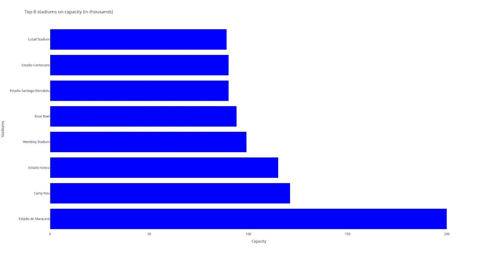

# 创建一个更好的仪表板——神话还是现实？

> 原文：[`towardsdatascience.com/creating-a-better-dashboard-myth-or-reality-3d355b03e52c?source=collection_archive---------2-----------------------#2024-02-17`](https://towardsdatascience.com/creating-a-better-dashboard-myth-or-reality-3d355b03e52c?source=collection_archive---------2-----------------------#2024-02-17)


由 [Lukas Blazek](https://unsplash.com/@goumbik?utm_source=medium&utm_medium=referral) 提供的照片，来源于 [Unsplash](https://unsplash.com/?utm_source=medium&utm_medium=referral)

## 我的 2.0 版本 Beta 版使用 Dash 和 Plotly 构建，而不是 Matplotlib

[](https://radmilamandzhi.medium.com/?source=post_page---byline--3d355b03e52c--------------------------------)[](https://towardsdatascience.com/?source=post_page---byline--3d355b03e52c--------------------------------) [Radmila M.](https://radmilamandzhi.medium.com/?source=post_page---byline--3d355b03e52c--------------------------------)

·发布于 [Towards Data Science](https://towardsdatascience.com/?source=post_page---byline--3d355b03e52c--------------------------------) ·9 分钟阅读·2024 年 2 月 17 日

--

# 介绍

2023 年 2 月，我写了我的第一篇 Medium 文章：

[](https://medium.com/geekculture/how-to-customize-infographics-in-python-tips-and-tricks-e1818aac180f?source=post_page-----3d355b03e52c--------------------------------) [## 如何在 Python 中自定义信息图表：技巧与窍门

### 在 Matplotlib 中绘制图表的 ABC

medium.com](https://medium.com/geekculture/how-to-customize-infographics-in-python-tips-and-tricks-e1818aac180f?source=post_page-----3d355b03e52c--------------------------------)

在这里，我解释了如何使用各种图表创建一个简化的仪表板，包括折线图、饼图和条形图，以及一张分布图。为了绘制这些图表，我使用了“老朋友”Matplotlib [1]，因为我熟悉它的关键字和主要函数。我仍然认为，Matplotlib 是开始 Python 数据之旅的一个伟大库，因为它有一个庞大的集体知识库。如果你在使用 Matplotlib 时遇到不清楚的地方，可以谷歌你的问题，很可能会找到答案。

然而，Matplotlib 在创建交互式和基于网页的可视化时可能会遇到一些困难。对于后者，Plotly [2] 可以是一个不错的替代方案，它允许你创建不寻常的交互式仪表板。另一方面，Matplotlib 是一个功能强大的库，提供了更好的绘图定制控制，适合用于创建发布级别的可视化。

在这篇文章中，我将尝试用**基于 Plotly 的代码**（2）替代**使用 Matlab 的代码**（1）。结构将重复初始的文章，因为图表类型和输入数据[3]是相同的。然而，在这里我将为每种图表类型添加一些关于（1）和（2）相似程度的评论。我写这篇文章的主要目的是回顾我的第一篇文章，并尝试用我当前的知识水平重新制作它。

**注意：** 你会惊讶于构建 choropleth 地图所需的 Plotly 代码是多么简短 :)

但让我们从最基本的开始，我们将首先创建一个 Plotly 线图。

# #1. 线图

线图可以是展示我们数据随时间变化动态的明智选择。在下面的例子中，我们将把线图与散点图结合，使用不同的颜色标记每个位置。

下面是使用 Plotly 的代码片段，生成一张显示 1990–2018 年间 FIFA 世界杯平均观众人数的折线图：每个值都标有标签并附有一个彩色散点。

```py
## Line Plot ##

import plotly.graph_objects as go

time = [1990, 1994, 1998, 2002, 2006, 2010, 2014, 2018]
numbers = [48411, 68626, 44676, 42571, 52609, 49499, 53772, 47371]
labels = ['Italy', 'USA', 'France', 'Japan / South Korea', 'Germany', 
'South Africa', 'Brazil', 'Russia']

fig = go.Figure()

# Line plot
fig.add_trace(go.Scatter(x=time, y=numbers, mode='lines+markers',
                         marker=dict(color='black',size=10), line=dict(width=2.5)))

# Scatter plot
for i in range(len(time)):
    fig.add_trace(go.Scatter(x=[time[i]], y=[numbers[i]],
                             mode='markers', name=labels[i]))

# Layout settings
fig.update_layout(title='Average number of attendees per game in 1990-2018',
                  xaxis=dict(tickvals=time),
                  yaxis=dict(range=[35000, 70000]),
                  showlegend=True,
                  legend=dict(x=0.5, y=-0.2),
                  plot_bgcolor='white')

fig.show()
```

结果如下所示：


使用 Plotly 构建的线图。图片来自作者。

当你将鼠标悬停在 Plotly 图表中的任何点上时，一个窗口会弹出，显示该点的观众人数以及举办比赛的国家名称。

**与 Matplotlib 图表的相似度：** 8 分（满分 10 分）。

总的来说，代码在结构和主要代码块的放置上与初始代码片段非常相似。

**不同之处：** 然而，也有一些差异。例如，请注意如何声明图表元素的细节（例如，线图模式 `lines+markers`，它可以同时显示线条和标记）。

**重要：** 构建此图表时，我使用了 `plotly.graph_objects`（导入时命名为 `go`）模块。它提供了一个自动生成的类层级结构，称为“图形对象”，可以用来表示各种图形。

# #2. 饼图（实际上是一个甜甜圈图）

饼图和甜甜圈图非常适合展示不同数值对总量的贡献：它们被分为若干段，每段显示数据中每个部分的比例值。

这是一个使用 Plotly 构建饼图的代码片段，显示各国世界杯冠军头衔的比例。

```py
## Pie Chart ##

import plotly.express as px

# Data
label_list = ['Brazil', 'Germany', 'Italy', 'Argentina', 'Uruguay', 'France', 'England', 'Spain']
freq = [5, 4, 4, 3, 2, 2, 1, 1]

# Customize colors
colors = ['darkorchid', 'royalblue', 'lightsteelblue', 'silver', 'sandybrown', 'lightcoral', 'seagreen', 'salmon']

# Building chart
fig = px.pie(values=freq, names=label_list, title='Countries with the most FIFA World Cup titles',
             color_discrete_map=dict(zip(label_list, colors)),
             labels={'label': 'Country', 'value': 'Frequency'},
             hole=0.3)

fig.update_traces(textposition='inside', textinfo='percent+label')
fig.show()
```

下面给出了最终的可视化项（顺便说一下，它也是一个互动图表！）：


使用 Plotly 构建的饼图。图片来自作者。

**与 Matplotlib 图表的相似度：** 7 分（满分 10 分）。再次强调，这两个版本的代码逻辑几乎相同。

**不同之处：** 你可能会注意到，借助 `hole` 关键字，可以将饼图转变为甜甜圈图。并且，看看在 Plotly 中显示每个图表片段百分比是如何比 Matplotlib 更加简单直观。

**重要事项：** 我没有使用 `plotly.graph_objects` 模块，而是使用了 `plotly.express` 模块（通常导入为 `px`），该模块包含可以一次性创建完整图形的函数。这是一个易于使用的 Plotly 接口，适用于各种数据类型。

# #3\. 条形图

条形图，无论是垂直的还是水平的，都用于显示不同类别之间的比较。图表的垂直轴（‘Stadium’）表示被比较的具体类别，而水平轴表示测量值，即‘容量’本身。

```py
## Bar Chart ##

import plotly.graph_objects as go

labels = ['Estádio do Maracanã', 'Camp Nou', 'Estadio Azteca',
          'Wembley Stadium', 'Rose Bowl', 'Estadio Santiago Bernabéu',
          'Estadio Centenario', 'Lusail Stadium']
capacity = [200, 121, 115, 99, 94, 90, 90, 89]

fig = go.Figure()

# Horizontal bar chart
fig.add_trace(go.Bar(y=labels, x=capacity, orientation='h', marker_color='blue'))

# Layout settings
fig.update_layout(title='Top-8 stadiums on capacity (in thousands)',
                  yaxis=dict(title='Stadiums'),
                  xaxis=dict(title='Capacity'),
                  showlegend=False,
                  plot_bgcolor='white')

fig.show()
```



使用 Plotly 构建的水平条形图。图片由作者提供。

**与 Matplotlib 图的相似度：** 6 分（满分 10 分）。

总的来说，两个代码片段大致相同，但 Plotly 代码更简洁。

**不同之处：** Plotly 中的代码片段更简短，因为我们不需要写代码来为每个列添加标签——Plotly 会自动完成这一任务，得益于其交互性。

**重要事项：** 在构建这种类型的图时，还使用了 `plotly.express` 模块。对于水平条形图，我们可以使用 `px.bar` 函数，并设置 `orientation='h'`。

# #4\. 分级图

**分级图**是一种非常适合可视化变量在地理区域内变化的工具。热力图与其相似，但热力图是根据变量模式划定的区域，而不是像分级图那样基于地理区域。

下面你可以看到用于绘制分级图的 Plotly 代码。这里每个国家根据其举办 FIFA 世界杯的频率获得不同的颜色。深红色的国家举办了 2 次比赛，浅红色的国家举办了 1 次，其他所有国家（灰色）则没有举办过。

```py
## Choropleth Map ##

import polars as pl
import plotly.express as px

df = pl.read_csv('data_football.csv')
df.head(5)
fig = px.choropleth(df, locations='team_code', color='count', 
                    hover_name='team_name', projection='natural earth',
                    title='Geography of the FIFA World Cups',
                    color_continuous_scale='Reds')
fig.show()
```


使用 Plotly 构建的分级图。图片由作者提供。

**与 Matplotlib 图的相似度：** 4 分（满分 10 分）。

Plotly 中的代码比 Matplotlib 中的代码小三倍。

**不同之处：** 在使用 Matplotlib 构建分级图时，我们需要做很多额外的工作，例如：

+   下载包含形状文件的压缩文件 `ne_110m_admin_0_countries.zip`，以绘制地图本身并显示国家边界、网格线等；

+   从 `mpl_toolkits.basemap` 和 `matplotlib.patches`、`matplotlib.collections` 库中导入 `Basemap`、`Polygon` 和 `PatchCollection` 元素，并使用它们根据我们在 `data_football.csv` 文件中建议的逻辑绘制有色背景。

**重要事项：** 那么 Plotly 是如何做的呢？它使用相同的 `data_football.csv` 文件，并借助 `px.choropleth` 函数显示跨不同地图区域或国家的聚合数据。每个区域的颜色由特定信息的值决定，在我们的例子中是输入文件中的 `count` 变量。

> 如你所见，所有 Plotly 代码比 Matplotlib 中的代码更简洁（或者在构建折线图时相同）。这是因为 Plotly 使得创建复杂图表变得更容易。Plotly 非常适合用几行代码创建交互式可视化。

# 总结：使用 Dash 创建单个仪表盘

Dash 允许在 Python 代码的基础上构建交互式仪表盘，而无需学习复杂的 JavaScript 框架，如 `React.js`。

这里你可以找到代码及其重要部分的注释：

```py
import polars as pl
import plotly.express as px
import plotly.graph_objects as go
import dash
from dash import dcc
from dash import html

external_stylesheets = ['https://codepen.io/chriddyp/pen/bWLwgP.css']

app = dash.Dash(__name__, external_stylesheets=external_stylesheets)

header = html.H2(children="FIFA World Cup Analysis")

## Line plot with scatters ##

# Data
time = [1990, 1994, 1998, 2002, 2006, 2010, 2014, 2018]
numbers = [48411, 68626, 44676, 42571, 52609, 49499, 53772, 47371]
labels = ['Italy', 'USA', 'France', 'Japan / South Korea', 'Germany', 'South Africa', 'Brazil', 'Russia']

# Building chart
chart1 = go.Figure()

chart1.add_trace(go.Scatter(x=time, y=numbers, mode='lines+markers',
                         marker=dict(color='black',size=10), line=dict(width=2.5)))

for i in range(len(time)):
    chart1.add_trace(go.Scatter(x=[time[i]], y=[numbers[i]],
                             mode='markers', name=labels[i]))

# Layout settings
chart1.update_layout(title='Average number of attendees per game in 1990-2018',
                  xaxis=dict(tickvals=time),
                  yaxis=dict(range=[35000, 70000]),
                  showlegend=True,
                  plot_bgcolor='white')

plot1 = dcc.Graph(
        id='plot1',
        figure=chart1,
        className="six columns"
    )

## Pie chart ##

# Data
label_list = ['Brazil', 'Germany', 'Italy', 'Argentina', 'Uruguay', 'France', 'England', 'Spain']
freq = [5, 4, 4, 3, 2, 2, 1, 1]

# Customize colors
colors = ['darkorchid', 'royalblue', 'lightsteelblue', 'silver', 'sandybrown', 'lightcoral', 'seagreen', 'salmon']

# Building chart
chart2 = px.pie(values=freq, names=label_list, title='Countries with the most FIFA World Cup titles',
             color_discrete_map=dict(zip(label_list, colors)),
             labels={'label': 'Country', 'value': 'Frequency'},
             hole=0.3)

chart2.update_traces(textposition='inside', textinfo='percent+label')

plot2 = dcc.Graph(
        id='plot2',
        figure=chart2,
        className="six columns"
    )

## Horizontal bar chart ##

labels = ['Estádio do Maracanã', 'Camp Nou', 'Estadio Azteca',
          'Wembley Stadium', 'Rose Bowl', 'Estadio Santiago Bernabéu',
          'Estadio Centenario', 'Lusail Stadium']
capacity = [200, 121, 115, 99, 94, 90, 90, 89]

# Building chart
chart3 = go.Figure()

chart3.add_trace(go.Bar(y=labels, x=capacity, orientation='h', marker_color='blue'))

# Layout settings
chart3.update_layout(title='Top-8 stadiums on capacity (in thousands)',
                  yaxis=dict(title='Stadiums'),
                  xaxis=dict(title='Capacity'),
                  showlegend=False,
                  plot_bgcolor='white')

plot3 = dcc.Graph(
        id='plot3',
        figure=chart3,
        className="six columns"
    )

## Chropleth map ##

# Data
df = pl.read_csv('data_football.csv')

# Building chart
chart4 = px.choropleth(df, locations='team_code', color='count', 
                    hover_name='team_name', projection='natural earth',
                    title='Geography of the FIFA World Cups',
                    color_continuous_scale='Reds')

plot4 = dcc.Graph(
        id='plot4',
        figure=chart4,
        className="six columns"
    )

row1 = html.Div(children=[plot1, plot2],)
row2 = html.Div(children=[plot3, plot4])
layout = html.Div(children=[header, row1, row2], style={"text-align": "center"})

app.layout = layout

if __name__ == "__main__":
    app.run_server(debug=False)
```

代码注释：

+   首先，我们需要导入所有的库（包括 HTML 模块），并借助字符串 `app = dash.Dash(__name__, external_stylesheets=external_stylesheets)` 初始化仪表盘。

+   然后，我们将每个图形粘贴到 Dash 核心组件中，进一步将它们与其他 HTML 组件（`dcc.Graph`）集成。在这里，`className="six columns"` 需要为每行的图表占据屏幕的一半。

+   然后，我们创建 2 行 `html.Div` 组件，每行包含 2 个图表。此外，可以使用带有 `style` 属性的简单 CSS 来显示仪表盘的标题，并将其放入 `layout` 字符串中。此布局被设置为之前初始化的应用布局。

+   最后，最后一段代码允许在本地运行应用（`app.run_server(debug=False)`）。要查看仪表盘，只需点击链接 [`127.0.0.1:8050/`](http://127.0.0.1:8050/)，你会看到如下图所示的界面。


使用 Dash 构建的最终仪表盘。图片来源：作者。

# 最后说明

说实话，标题中的问题是修辞性的，只有你，亲爱的读者，才能决定当前版本的仪表盘是否比以前的版本更好。但至少我尽力了（而且内心深处我相信 2.0 版本更好）:)

你可能认为这篇文章没有包含任何新信息，但我完全不同意。通过写这篇文章，我想强调随着时间推移提升技能的重要性，即使代码的第一个版本看起来并不差。

我希望这篇文章能鼓励你回顾已完成的项目，并尝试使用新技术重新制作它们。这也是我决定用 Plotly 和 Dash 替代 Matplotlib 的主要原因（此外，后两者使得创建数据分析结果变得更加容易）。

通过改进旧版本或使用新的库而不是以前使用的库来不断提升工作能力，是任何程序员的伟大技能。如果你将这个建议作为习惯，你会看到进步，因为只有实践才能成就完美。

一如既往，谢谢阅读！

# 参考文献

1.  Matplotlib 库的主页：[`matplotlib.org/stable/`](https://matplotlib.org/stable/)

1.  Plotly 库的主页：[`plotly.com/python/`](https://plotly.com/python/)

1.  Fjelstul, Joshua C. “The Fjelstul World Cup Database v.1.0.” 2022 年 7 月 8 日。[`www.github.com/jfjelstul/worldcup`](https://www.github.com/jfjelstul/worldcup)
