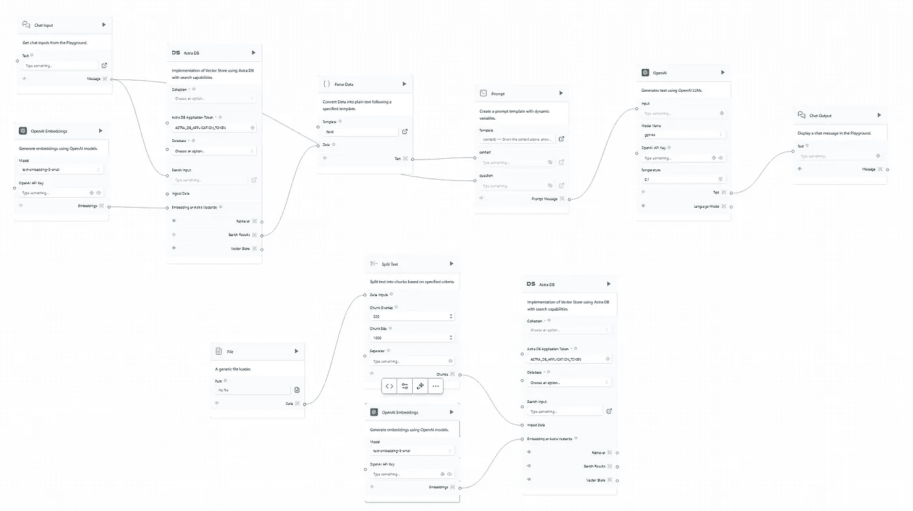
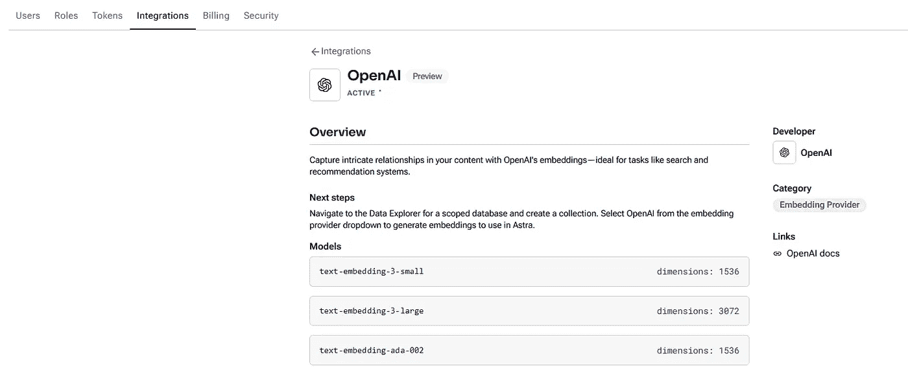
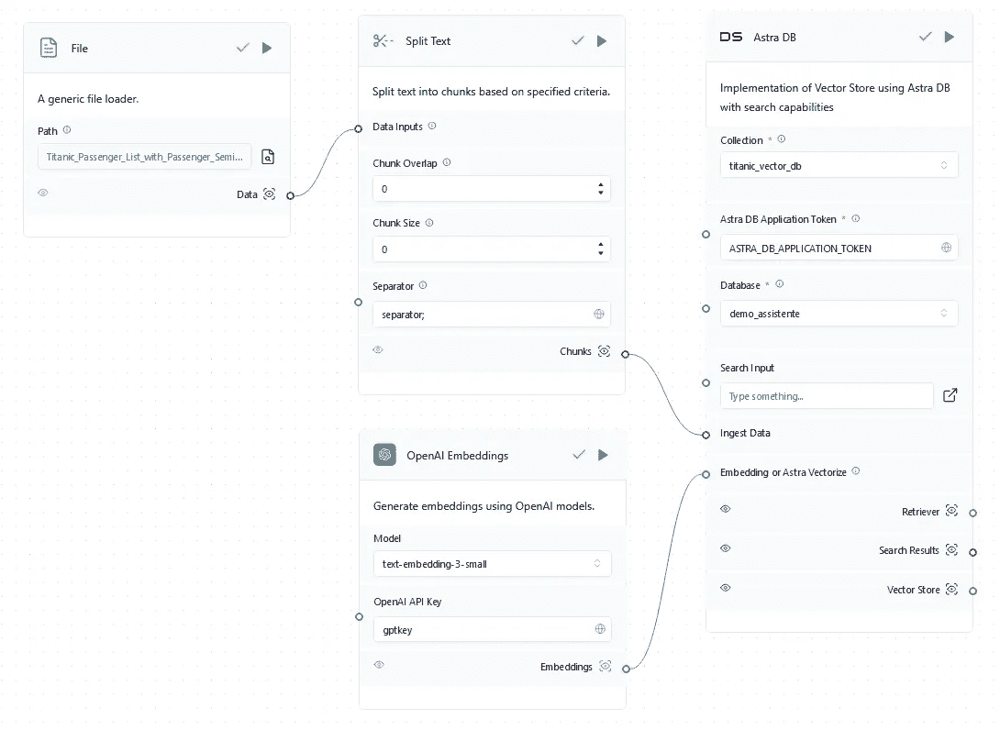
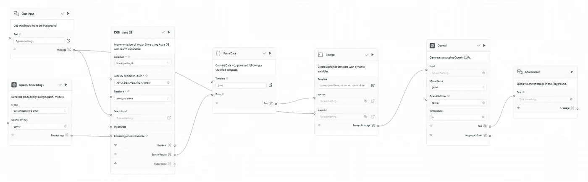
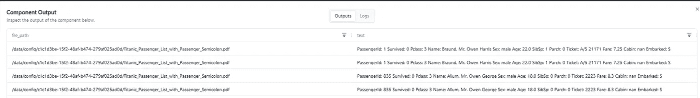
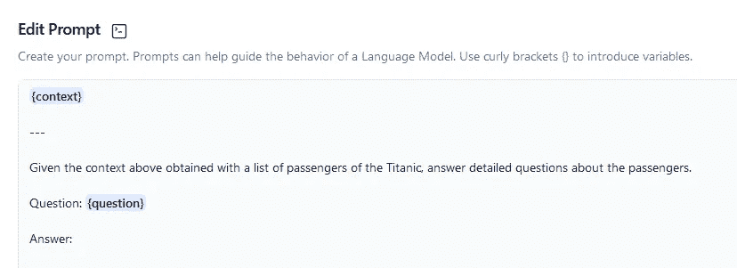
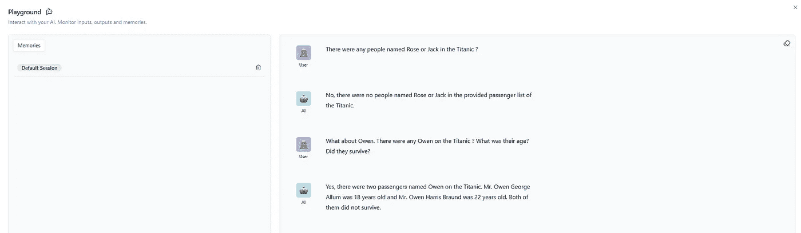

# 使用 Langflow 和 Astra DB 创建 RAG 聊天机器人

> 原文：[`towardsdatascience.com/creating-a-rag-chatbot-with-langflow-and-astra-db-582ad588cf37?source=collection_archive---------6-----------------------#2024-08-21`](https://towardsdatascience.com/creating-a-rag-chatbot-with-langflow-and-astra-db-582ad588cf37?source=collection_archive---------6-----------------------#2024-08-21)

## 通过 Langflow 直观界面创建 RAG 聊天机器人的步骤，将 LLMs 与向量数据库集成，实现基于上下文的响应。

 [Bruno Caraffa](https://brunocaraffa.medium.com/?source=post_page---byline--582ad588cf37--------------------------------)

·发表在[Towards Data Science](https://towardsdatascience.com/?source=post_page---byline--582ad588cf37--------------------------------)·6 分钟阅读·2024 年 8 月 21 日

--

照片由[Igor Omilaev](https://unsplash.com/@omilaev?utm_source=medium&utm_medium=referral)提供，来自[Unsplash](https://unsplash.com/?utm_source=medium&utm_medium=referral)

检索增强生成，或 RAG，是一种自然语言处理，涉及将传统的检索技术与 LLMs 结合，通过将生成属性与检索提供的上下文集成，生成更准确和相关的文本。最近在聊天机器人的背景下广泛使用，为公司提供了利用定制数据的尖端 LLM 模型改进与客户的自动通信的能力。

Langflow 是 Langchain 的图形用户界面，Langchain 是 LLMs 的集中式开发环境。2022 年 10 月，Langchain 发布，到 2023 年 6 月已成为 GitHub 上使用最广泛的开源项目之一。它席卷了人工智能社区，特别是为创建和定制多个 LLMs 开发的框架，具有与最相关的文本生成和嵌入模型集成的功能，链式 LLM 调用的可能性，管理提示的能力，装备向量数据库以加快计算速度的选项，并顺利将结果交付给外部 API 和任务流程。

本文将介绍一个使用 Langflow 创建的端到端 RAG 聊天机器人，并使用著名的 Titanic 数据集。首先，需在 Langflow 平台进行注册，[这里](https://astra.datastax.com/langflow/)。要开始一个新项目，可以根据用户需求快速定制一些有用的预构建流程。要创建 RAG 聊天机器人，最佳选择是选择**Vector Store RAG**模板。图片 1 展示了原始流程：

图片 1 — Langflow Vector Store RAG 模板流程。来源：作者。

该模板已预设 OpenAI 用于嵌入和文本生成，并且这些选项在本文中使用，但其他选项如 Ollama、NVIDIA 和 Amazon Bedrock 也可以轻松集成，只需设置 API 密钥即可。在使用与 LLM 提供商的集成之前，重要的是检查所选择的集成是否在配置中处于激活状态，就像下面的图片 2 所示。另外，像 API 密钥和模型名称这样的全局变量可以定义，以便在流程对象中简化输入。

图片 2 — OpenAI 活跃集成与概览。来源：作者。

在 Vector Store RAG 模板中有两种不同的流程，下面展示了 RAG 的检索部分，其中上下文是通过上传文档、分割、嵌入，然后保存到 Astra DB 的 Vector 数据库中完成的，用户可以在流程界面轻松创建该数据库。目前，默认情况下，Astra DB 对象会检索 Astra DB 应用程序令牌，因此不需要手动收集它。最后，需要创建用于存储嵌入值的集合。该集合的维度需要与嵌入模型中的维度相匹配，这些信息可以在文档中找到，以确保嵌入结果的正确存储。因此，如果选择的嵌入模型是 OpenAI 的 text-embedding-3-small，那么创建的集合维度必须是 1536。下面的图片 3 展示了完整的检索流程。

图片 3 — 来自 Titanic 数据集的检索流程。来源：作者。

用于增强聊天机器人上下文的数据集是[Titanic 数据集](https://www.kaggle.com/datasets/yasserh/titanic-dataset?resource=download)（CC0 许可）。在 RAG 过程结束时，聊天机器人应该能够提供乘客的具体细节并回答关于乘客的复杂问题。但首先，我们在通用文件加载对象上更新文件，然后使用全局变量“separator;”对其进行分割，因为原始格式是 CSV。此外，块重叠和块大小被设置为 0，因为每个块将是一个乘客，并使用分隔符。如果输入文件是纯文本格式，则需要应用块重叠和块大小设置，以正确创建嵌入。最后，向量被存储在 ***titanic_vector_db*** 中，存储在 ***demo_assistente*** 数据库中。

图 4 — 完整的生成流程。来源：作者。

移动到 RAG 的生成流程，如图 4 所示，它是通过用户在聊天中的输入触发的，然后该输入会在数据库中进行搜索，以提供后续提示所需的上下文。所以，如果用户输入与名称“欧文”（Owen）相关的内容，搜索将通过向量数据库的集合运行，寻找与“欧文”相关的向量，检索并通过解析器将其转换为文本，最终获得后续提示所需的上下文。图 5 显示了搜索结果。

图 5 — 在向量数据库中进行的搜索结果，以获得上下文。来源：作者。

回到开始，重新连接嵌入模型到向量数据库也至关重要，必须在检索流程中使用相同的模型来执行有效的搜索，否则搜索将始终为空，因为检索和生成流程中使用的嵌入模型将不一致。此外，这一步突显了在 RAG 中使用向量数据库的巨大性能优势，在该过程中，需要迅速检索上下文并将其传递到提示中，然后再生成任何类型的响应给用户。

在图 6 所示的提示中，上下文来自已通过解析器转换为文本的内容，问题来自原始用户输入。下面的图像展示了如何构建提示，将上下文与问题集成。

图 6 — 将传递给 AI 模型的提示。来源：作者。

在准备好文本生成模型后，现在是时候进行文本生成了。在这个流程中，选择了 GPT4 模型，温度为 0.5，这是聊天机器人的推荐标准。温度控制着由 LLM 进行的预测的随机性。较低的温度将生成更确定和直接的答案，导致更可预测的文本。较高的温度将生成更具创造性的输出，尽管如果太高，模型可能会轻易产生幻觉并产生不连贯的文本。最后，只需使用 OpenAI 的 API 密钥设置全局变量，就这么简单。然后，是时候运行流程并在游乐场上检查结果了。

图片 7 — 展示 RAG 聊天机器人结果的游乐场。来源：作者。

图片 7 中的对话清楚地显示，聊天机器人已经正确获取了上下文，并正确回答了关于乘客的详细问题。尽管发现泰坦尼克号上没有罗斯或杰克可能令人失望，但不幸的是，这是事实。就是这样。RAG 聊天机器人已经创建，当然，可以增强其以提高对话性能并覆盖一些可能的误解，但本文展示了 Langflow 如何轻松地使 LLMs 适应和定制。

最后，部署流程有多种可能性。HuggingFace Spaces 是一种轻松部署 RAG 聊天机器人的方式，具有可扩展的硬件基础设施和本地 Langflow，无需任何安装。Langflow 也可以通过 Kubernetes 集群、Docker 容器或直接在 GCP 中使用 VM 和 Google Cloud Shell 进行安装和使用。有关部署的更多信息，请查看[文档](https://docs.langflow.org/deployment-hugging-face-spaces)。

新时代即将到来，低代码解决方案开始主导未来短期内 AI 在现实世界中的发展方式。本文介绍了 Langflow 如何通过集成多个直观 UI 和模板来革新 AI。如今，任何具备基本 AI 知识的人都可以构建一个复杂的应用程序，而在本十年初，这将需要大量的代码和深度学习框架专业知识。
