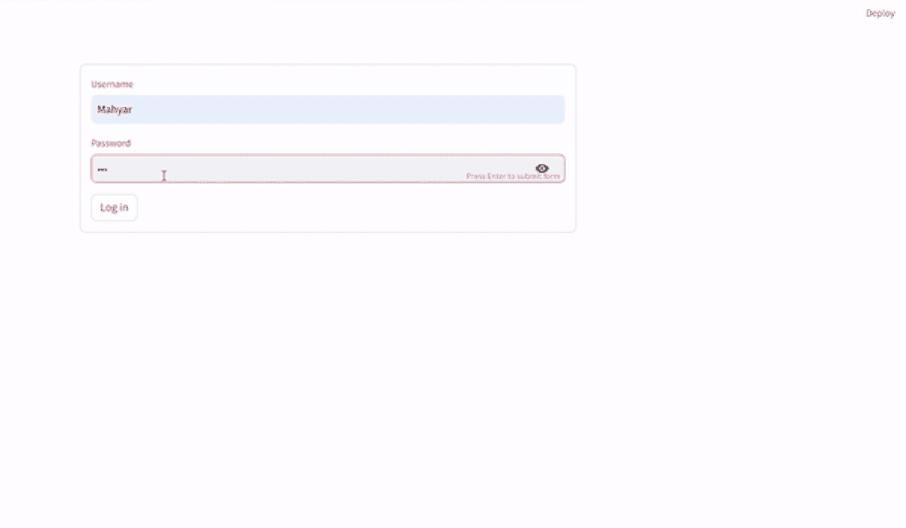

# 创建一个用于卫星影像可视化的 Streamlit 应用：逐步指南

> 原文：[`towardsdatascience.com/creating-a-streamlit-app-for-satellite-imagery-visualization-a-step-by-step-guide-8209593be994?source=collection_archive---------3-----------------------#2024-06-21`](https://towardsdatascience.com/creating-a-streamlit-app-for-satellite-imagery-visualization-a-step-by-step-guide-8209593be994?source=collection_archive---------3-----------------------#2024-06-21)

## 使用 Streamlit 和卫星数据探索地球上的任何时间点

 [Mahyar Aboutalebi, Ph.D. 🎓](https://medium.com/@mahyar.aboutalebi?source=post_page---byline--8209593be994--------------------------------)

·发布于 [Towards Data Science](https://towardsdatascience.com/?source=post_page---byline--8209593be994--------------------------------) ·10 分钟阅读 ·2024 年 6 月 21 日

--

一段关于使用 Streamlit 应用程序可视化地球上任何时间点视频记录，由作者制作

# 目录

1.  **🌟 引言**

1.  **📌 设置**

1.  💾 **设计页面**

1.  🌍 **地图可视化功能**

1.  **📄 结论**

1.  **📚 参考资料**

## **🌟 引言**

分享已经成为我们生活的一部分。每秒钟，成千上万的图片和视频被上传到各种平台，如 X、Instagram 和 TikTok，主要是为了与他人分享瞬间。编码也不例外，我们可以用来与他人分享代码的平台之一就是 Streamlit。我之前已经发布过几篇关于如何通过不同方法下载和可视化卫星影像的文章。在这篇文章中，我将展示如何开发一个不需要设置凭证的 Streamlit 应用。这个应用将列出由 Sentinel-2 卫星捕获的地球上任何地点和任何时间段的影像，允许用户从列表中选择一张影像，并可视化该位置的实际影像（RGB 格式）以及场景分类。这篇文章是开发此应用的逐步指南，旨在与他人共享。如果你…
