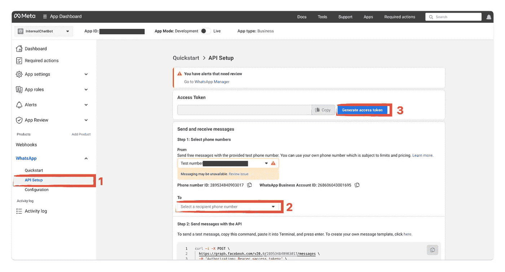

# 使用 GPT-4o 创建 WhatsApp AI 助理

> 原文：[`towardsdatascience.com/creating-a-whatsapp-ai-agent-with-gpt-4o-f0bc197d2ac0?source=collection_archive---------0-----------------------#2024-12-22`](https://towardsdatascience.com/creating-a-whatsapp-ai-agent-with-gpt-4o-f0bc197d2ac0?source=collection_archive---------0-----------------------#2024-12-22)


使用 DALL-E 创建

## 如何使用 Meta API 构建你自己的 LLM 驱动的 Whatsapp 聊天机器人

[](https://medium.com/@lukas.kowejsza?source=post_page---byline--f0bc197d2ac0--------------------------------)[](https://towardsdatascience.com/?source=post_page---byline--f0bc197d2ac0--------------------------------) [Lukasz Kowejsza](https://medium.com/@lukas.kowejsza?source=post_page---byline--f0bc197d2ac0--------------------------------)

·发布在 [Towards Data Science](https://towardsdatascience.com/?source=post_page---byline--f0bc197d2ac0--------------------------------) ·18 分钟阅读·2024 年 12 月 22 日

--

在人工智能和商业管理领域的一个颠覆性变化是将 AI 助理与广泛使用的通信工具整合。想象一下，借助 WhatsApp 与你业务管理或个人助手 AI 进行实时数据请求、更新和任务自动化，你将拥有一个熟悉的聊天界面，这一切都成为可能。

在我们关于创建 AI 驱动的商务经理系列的第三部分中，我将带你一步步了解如何将你的 AI 助理与 WhatsApp 连接，以提升其能力和触及范围。目标是实现一个能够与所有相关数据库表进行交互的 AI 助手，甚至能够自主创建表格和所需工具。作为主要展示，我聚焦于一个商业用例，比如跟踪开支、发票等。不过，你可以轻松将相同的逻辑应用于创建个人助手，例如记录你的任务、项目和创意。

这是我的系列文章的第三部分。在我们开始之前，首先向大家等待的读者道歉，因为我耽搁了一段时间。过去几个月我一直忙于开始一份新的 AI 软件工程工作，并适应新的工作与生活平衡。我已经为这篇文章准备了未来的几个部分，我们将探讨代理工作流中的重大变化，并展示一些更复杂的工作流，涉及多个附加功能。在前两篇文章中使用的一些变通方法对于当时可靠的工具调用是必要的，但由于像 GPT-4o 和 GPT-4o-mini 这样的高性能模型，现在已经不再需要这些方法了。如果你是工具调用和代理工作流开发的新手，我仍然建议从前两部分开始学习。我发现了解如何从零开始构建东西，比依赖像 LangChain 或更具体的 LangGraph 这样的框架（用于深度定制的代理工作流，我将在不久的将来介绍）更为有用。

目前，我们需要先退一步，集中精力关注基础设施。我认为在大多数项目中，尤其是 AI 软件项目中，最好先创建一个可行的端到端产品，然后再避免陷入功能膨胀。我常常发现自己在初期设计选择上过于思考，从而在脑海中构建出过于复杂的产品。为了克服这一点，在几天的开发时间内专注于构建一个可行的端到端产品，真的有助于奠定清晰的基础。之后，你就能知道哪些功能需要优先考虑，并能够收集初步反馈。这将启动一个增量开发过程，这也是我承接项目时的目标。

# 前文回顾

在本系列的早期章节中，我们为我们的 AI 驱动的业务经理奠定了基础：

+   **第一部分**：目标是开发一个原型代理工作流，使其能够与工具对象互动，并减少由底层语言模型（LLM）产生的工具参数中的幻觉。

+   **第二部分**：我们集中精力定义基本功能，组织项目存储库，并使用 SQLModel 构建数据库模式。我们还为数据添加和查询添加了 SQL 工具，并更新了 Tool 类以容纳 SQLModel 对象。此外，我们介绍了 TaskAgent 类，用于自动化代理启动，并设置了 OpenAIAgent 以实现上下文感知的工具使用。

# 本文范围

像往常一样，让我们首先定义本文的范围：

1.  **通过 MetaAPI 将 AI 代理与 WhatsApp 集成** 设置并配置 MetaAPI，以实现 WhatsApp 商业集成。

    确保 AI 代理可以通过 WhatsApp 发送和接收消息。

1.  **设置 Webhooks 并使用 Ngrok 本地运行** 创建一个 FastAPI 应用程序以处理来自 WhatsApp 的 webhook 事件。

    使用 ngrok 将本地 FastAPI 服务器暴露到互联网。

    配置 MetaAPI 以将 webhook 事件发送到 ngrok URL

由于我们正在前进到可部署的服务器，我们还需要调整我们的项目架构。我们基本上是在实现一个 FastAPI 服务器，因此，我偏好的仓库结构是领域驱动设计（DDD），或者更倾向于 DDD。（你可以在 [这里](https://github.com/elokus/WhatsappAgent) 查看仓库结构）

# 1\. 设置 WhatsApp 云 API

首先，你需要熟悉 Meta 提供的云 API。你也可以使用像 Twilio 这样的 SaaS 产品来实现相同的功能，这些产品提供了更友好的集成方式。然而，由于最近的数据泄露事件以及成本效率的考虑，我更倾向于使用 Meta 提供的根 API。

# 1.1 前提条件

1.  在开始之前，你需要通过以下步骤注册一个 Meta 开发者账户：[如何开设 Meta 开发者账户](https://developers.facebook.com/docs/development/register)。在注册过程中，你需要使用电话号码进行身份验证。请注意，这个电话号码不会是你最终 WhatsApp 客户端的号码。相反，你会获得一个由平台分配的测试电话号码，稍后可以更改为另一个电话号码。

1.  注册后，转到你的仪表板并创建一个应用。

1.  此外，你还需要一个 Meta 商业账户（MBA），该账户将与你的真实账户关联，或者你可以创建一个新的账户来关联到你的 MBA。你也可以跳过这一步，因为你将在下一步中自动被提示关联或创建 MBA。

# 1.2 将 WhatsApp 产品添加到你的应用程序

在你创建了一个 Meta 开发者账户中的应用后，你将被要求为其添加产品。在这里，你需要选择 WhatsApp 并按照设置流程进行。如果你还没有这样做，可以在这里创建一个 Meta 商业账户。完成后，你将拥有一个测试的 WhatsApp 商业账户和一个测试的电话号码。

# 1.3 添加接收号码

1.  在应用仪表板的左侧菜单中，导航到

    **WhatsApp** > **API 设置**

    在 **发送和接收消息** 下，选择 **To** 字段并选择 **管理电话号码列表**。在这里，你可以添加一个允许从你的测试电话号码发送和接收消息的电话号码。理想情况下，这应该是你自己的电话号码，因为你想要测试你的应用。在将这个 WhatsApp API 账户与一个真实号码绑定之前，你最多只能添加 5 个接收号码。

1.  在 `WhatsApp > API 设置` 中，你现在可以通过填写 `from` 字段为你的测试电话号码，`to` 字段为你的接收号码（你自己的电话号码）来发送一条测试消息。

1.  生成一个访问令牌。这是你的 `WHATSAPP_API_TOKEN`，我们将在第 6 步中使用它。



截图 ngrok（图片来自作者）

我们已成功设置云 API，如要求所示。下一步，我们将创建一个 Webhook，使其能够与我们的 AI 助理应用进行通信。

为了实现这一点，我们需要在我们的后端应用程序中创建并提供一个端点。这意味着我们的 Python 后端必须通过 URL 访问。这个 URL 将作为 Webhook 端点，AI 助手可以调用它来发送和接收数据。

# 2\. 创建一个 FastAPI 端点

为了被 Webhook 接受，我们的根端点必须验证 Webhook 在添加我们的 URL 时发送的特定 GET 请求。Webhook 将发送三个查询参数：

`hub.mode`、`hub.challenge`、`hub.verify.token`。

验证令牌在创建 Cloud API 的 Webhook 时定义。你的后端应该验证该令牌与定义的值是否匹配，并返回 `hub.challenge` 对象作为响应。首先确保通过 `pip install fastapi uvicorn` 安装 FastAPI 和 Uvicorn。

# 2.1 创建 main.py

创建一个名为 `main.py` 的文件，内容如下：

```py
from fastapi import FastAPI, Query, HTTPException

VERIFICATION_TOKEN = "abcdefg12345"

app = FastAPI()

@app.get("/")
def verify_whatsapp(
    hub_mode: str = Query("subscribe", description="The mode of the webhook", alias="hub.mode"),
    hub_challenge: int = Query(..., description="The challenge to verify the webhook", alias="hub.challenge"),
    hub_verify_token: str = Query(..., description="The verification token", alias="hub.verify_token"),
):
    if hub_mode == "subscribe" and hub_verify_token == VERIFICATION_TOKEN:
        return hub_challenge
    raise HTTPException(status_code=403, detail="Invalid verification token")

@app.get("/health")
def health():
    return {"status": "healthy"}

@app.get("/readiness")
def readiness():
    return {"status": "ready"}
```

在第三行，你可以定义一个 `VERIFICATION_TOKEN`，Webhook 后续会使用该令牌验证后端是否由你控制。在此案例中，我们将其定义为 `"abcdefg12345"`，但你可以定义自己的自定义令牌。

我会继续修改剩余的部分，并很快包括下一部分内容！

# 2.2 运行应用程序

使用 Uvicorn 运行应用程序：

```py
uvicorn main:app --reload
```

# 2.3 本地提供你的 API

现在你的后端已在 `http://localhost:8000` 和/或 `http://127.0.0.1:8000` 本地运行。

我们现在提供以下端点：

+   验证 WhatsApp Webhook：`[`127.0.0.1:8000/?hub.mode=subscribe&hub.challenge=1234&hub.verify_token=abcdefg12345`](http://127.0.0.1:8000/?hub.mode=subscribe&hub.challenge=1234&hub.verify_token=abcdefg12345)`

+   健康检查端点：`[`127.0.0.1:8000/health`](http://127.0.0.1:8000/health)`

+   准备就绪端点：`[`127.0.0.1:8000/readiness`](http://127.0.0.1:8000/readiness)`

你可以使用健康检查端点来检查应用程序是否正在运行。在浏览器中打开 `http://127.0.0.1:8000/health`，你应该会看到：`{"status": "healthy"}`

# 3\. 使用 Ngrok 运行代理服务器

由于我们的服务器在本地运行，WhatsApp Webhook 无法调用该端点进行验证。我们需要的是一个可以被 Webhook 使用的公共 URL。有两个选择：将应用程序部署到云服务器，或创建一个代理服务器隧道。由于我们仍处于开发过程中，我们将使用第二个选项。

1.  访问 [ngrok 注册](https://dashboard.ngrok.com/signup) 并创建一个免费帐户。

1.  在本地安装 ngrok。根据你的系统，你可以使用 Brew、Chocolatey 或直接下载并安装。参见：[设置与安装](https://dashboard.ngrok.com/get-started/setup)。

1.  安装完成后，在终端使用以下命令添加你的认证代码。将 `$YOUR-AUTHENTICATION_TOKEN` 替换为你的 ngrok 认证令牌，该令牌可以在 ngrok 仪表板中的“Your Authtoken”下找到。

1.  通过在终端运行以下命令，开始从本地主机的 8000 端口转发流量：

```py
> ngrok config add-authtoken $YOUR-AUTHENTICATION_TOKEN
> ngrok http http://localhost:8000

Forwarding                    https://<random-string>.ngrok.io -> http://localhost:8000
```

你的本地服务器现在可以通过 ngrok 提供的公共 URL 访问。你应该能看到类似这样的信息：

```py
Forwarding                    https://<random-string>.ngrok.io -> http://localhost:8000
```

使用 ngrok 提供的 HTTPS URL 配置 webhook。

# 4. 实现 Webhook

现在让我们回到 Meta 的 Cloud API，实施所需的 webhook。

1.  访问 [Meta for Developers](https://developers.facebook.com/apps/) 并选择之前创建的应用。

1.  在左侧菜单中，点击 **WhatsApp** > **配置**。

1.  在 **Webhook** 部分，将你的 ngrok HTTPS 转发 URL 粘贴到 **回调 URL** 字段中，并在 **验证令牌** 字段中输入在 `main.py` 中定义的 `VERIFICATION_TOKEN`。

1.  点击确认并保存按钮，等待 webhook 验证你的后端。

1.  在 **Webhook 字段** 部分，启用 **已订阅字段** 下的 `messages` 开关。

就这样！现在你应该能够在 Python 后端服务器中接收 WhatsApp 消息。

# 4.1 理解 Webhook 和会话

Webhook 是 HTTP 回调，它使得程序能够在特定事件发生时（例如新消息或状态更改）接收实时更新。Webhook 通过将包含事件数据的 HTTP 请求发送到预配置的 URL（在我们这个案例中是 ngrok 代理服务器 URL）来实现系统集成和自动化。

为了理解 Meta 生态系统中 webhook 的逻辑和定价，了解一些关于会话的基本原则是很有帮助的。

在 WhatsApp API 中，“会话”开始于以下情况：

**1. 用户发送消息：** 这会打开一个 24 小时的窗口，在此期间，你可以通过文本、图片或其他媒体消息进行回复，**无需额外费用**。

**2. 企业发起联系：** 如果最近没有收到用户消息（即没有打开 24 小时窗口），你的 AI 助手必须使用 **预先批准的模板消息** 来开始会话。你可以添加自定义模板，但它们需要经过 Meta 批准。

只要用户持续回复，每当收到新消息时，24 小时窗口会重新计时。这使得可以在没有额外费用的情况下进行持续互动。一场会话的费用大约为 0.00–0.08 美元。具体定价依据你的会话类型（如营销、公共服务、服务）以及你所在的位置而定。仅供参考：目前服务类会话似乎是免费的。你可以在这里找到具体的定价：[Whatsapp 定价](https://developers.facebook.com/docs/whatsapp/pricing)

# 5. 构建接收消息端点

现在我们已经能够在后端接收消息。由于我们已经订阅了消息对象，每当有消息发送到你的测试号码时，webhook 会创建一个 POST 请求，发送到你在上一步中定义的回调 URL。接下来我们需要做的是在 FastAPI 应用中为 POST 请求构建一个端点。

首先让我们定义需求：

+   **返回 200 HTTP 状态码：** 这是告知 CloudAPI 消息已成功接收的关键。如果未返回状态码，CloudAPI 会尝试重新发送消息，最长可达 7 天。

+   **提取电话号码和消息：** 来自请求的有效载荷包含包括电话号码和消息的数据。我们需要在后端对其进行处理。

+   **过滤传入的对象：** 由于 CloudAPI 可能会为同一消息发送多个事件（例如发送、接收和阅读），后端需要确保只处理一条消息的实例。

+   **处理多种消息类型：** 后端可以处理不同类型的消息，例如文本、语音消息和图像。为了避免扩展文章的范围，我们只会为图像奠定基础，但不会实现到最后。

+   **通过 LLM-Agent 工作流处理：** 提取的信息通过 LLM-Agent 工作流进行处理，我们在系列的前几个部分中开发了这个工作流。你也可以使用其他代理实现，比如 Langchain 或 Langgraph。

# 5.1 定义模型和模式

我们将从 Webhook 接收有效载荷。你可以在 Meta 的文档中找到示例有效载荷：[示例有效载荷](https://developers.facebook.com/docs/whatsapp/cloud-api/webhooks/payload-examples/)

我更喜欢使用 Pydantic 来编写代码，以为我的 Python 代码添加类型安全性。此外，类型注解和 Pydantic 是 FastAPI 应用的最佳搭配。因此，让我们首先定义在端点中使用的模型：

```py
# app/schema.py
from typing import List, Optional  
from pydantic import BaseModel, Field   

class Profile(BaseModel):  
    name: str  

class Contact(BaseModel):  
    profile: Profile  
    wa_id: str  

class Text(BaseModel):  
    body: str

class Image(BaseModel):  
    mime_type: str  
    sha256: str  
    id: str  

class Audio(BaseModel):  
    mime_type: str  
    sha256: str  
    id: str  
    voice: bool  

class Message(BaseModel):  
    from_: str = Field(..., alias="from")  
    id: str  
    timestamp: str  
    text: Text | None = None  
    image: Image | None = None  
    audio: Audio | None = None  
    type: str

class Metadata(BaseModel):  
    display_phone_number: str  
    phone_number_id: str

class Value(BaseModel):  
    messaging_product: str  
    metadata: Metadata  
    contacts: List[Contact] | None = None  
    messages: List[Message] | None = None  

class Change(BaseModel):  
    value: Value  
    field: str  
    statuses: List[dict] | None = None  

class Entry(BaseModel):  
    id: str  
    changes: List[Change]  

class Payload(BaseModel):  
    object: str  
    entry: List[Entry]

class User(BaseModel):  
    id: int  
    first_name: str  
    last_name: str  
    phone: str
    role: str

class UserMessage(BaseModel):  
    user: User  
    message: str | None = None  
    image: Image | None = None  
    audio: Audio | None = None
```

# 5.2 解析传入的消息

接下来，我们将创建一些辅助函数，用于在 FastAPI 中使用依赖注入：

```py
# app/main.py

from app.domain import message_service

def parse_message(payload: Payload) -> Message | None:  
    if not payload.entry[0].changes[0].value.messages:  
        return None  
    return payload.entry[0].changes[0].value.messages[0]  

def get_current_user(message: Annotated[Message, Depends(parse_message)]) -> User | None:  
    if not message:  
        return None  
    return message_service.authenticate_user_by_phone_number(message.from_)  

def parse_audio_file(message: Annotated[Message, Depends(parse_message)]) -> Audio | None:  
    if message and message.type == "audio":  
        return message.audio  
    return None  

def parse_image_file(message: Annotated[Message, Depends(parse_message)]) -> Image | None:  
    if message and message.type == "image":  
        return message.image  
    return None  

def message_extractor(  
        message: Annotated[Message, Depends(parse_message)],  
        audio: Annotated[Audio, Depends(parse_audio_file)],  
):  
    if audio:  
        return message_service.transcribe_audio(audio)  
    if message and message.text:  
        return message.text.body  
    return None
```

+   **解析有效载荷：** `parse_message`函数从传入的有效载荷中提取第一条消息（如果存在）。如果没有找到消息，该函数返回`None`，这样只有有效消息才会被处理。

+   **用户身份验证：** `get_current_user`函数使用`parse_message`依赖注入提取消息，然后根据与消息相关联的电话号码进行身份验证。在这里，我们确保只有经过身份验证的用户才能发送消息。

+   **音频和图像解析：** 如果消息类型分别为“音频”或“图像”，这些功能会从消息中提取音频或图像文件。这使得应用能够处理不同类型的媒体。

+   **消息提取：** `message_extractor`函数尝试从消息中提取文本或将音频转录为文本。这确保无论消息类型如何，内容都能被处理。

在这里，我们有一个来自领域层的导入。整个脚本`message_service`是我们放置所有特定于领域的代码的地方，比如`authenticate_user_by_phone_number`和`transcribe_audio`。

# 5.3 实现 POST 端点

```py
# app/main.py
import threading  
from typing_extensions import Annotated  
from fastapi import APIRouter, Query, HTTPException, Depends  
from app.domain import message_service  
from app.schema import Payload, Message, Audio, Image, User  

# ... rest of the code ...

@app.post("/", status_code=200)  
def receive_whatsapp(  
        user: Annotated[User, Depends(get_current_user)],  
        user_message: Annotated[str, Depends(message_extractor)],  
        image: Annotated[Image, Depends(parse_image_file)],  
):  
    if not user and not user_message and not image:  
        return {"status": "ok"}  
    if not user:  
        raise HTTPException(status_code=401, detail="Unauthorized")  
    if image:  
        return print("Image received")  
    if user_message:  
        thread = threading.Thread(
            target=message_service.respond_and_send_message, 
            args=(user_message, user)
        )  
        thread.daemon = True  
        thread.start()  
    return {"status": "ok"}
```

+   **POST 端点实现：** 该端点处理传入的 POST 请求。它检查用户、消息或图像是否有效。如果没有有效项，它将仅返回一个状态消息给 CloudAPI。如果用户未经过身份验证，它将引发一个`HTTPException`，并返回 401 状态码。

+   **处理图像和消息：** 如果收到图像，我们会简单地打印到标准输出，作为未来图像处理的占位符。如果收到文本消息，它会异步处理，使用单独的线程以避免阻塞主应用程序线程。`message_service.respond_and_send_message` 函数会根据 LLM-Agent 工作流程来处理消息。

**使用线程池处理 Webhook 的解释：** WhatsApp 会一直重发 Webhook，直到收到 200 响应，因此使用线程池来确保消息处理不会阻塞 Webhook 响应。

# 6 消息服务

在我们之前定义了端点的展示层，我们使用了一些 `message_service` 函数，这些函数需要在接下来定义。具体来说，我们需要实现音频负载的处理和转录、用户身份验证，最后调用我们的代理并发送响应回去。我们将把所有这些功能放入 `domain/message_service.py` 文件中。在生产环境中，随着应用程序的扩展，我建议进一步将它们拆分成，比如，`transcription_service.py`、`message_service.py` 和 `authentication_service.py`。

在本节中的多个函数中，我们将向 Meta API 发出请求 `"https://graph.facebook.com/..."`。在所有这些请求中，我们需要包含带有 `WHATSAPP_API_KEY`（我们在 **第 1.3 步** 中创建的）作为 Bearer Token 的授权头。我通常将 API 密钥和令牌存储在 `.env` 文件中，并使用 Python `dotenv` 库来访问它们。我们还会使用带有 `OPENAI_API_KEY` 的 OpenAI 客户端，该密钥也可以存储在 `.env` 文件中。

但为了简便起见，我们可以将它们放置并初始化在 `message_service.py` 脚本的顶部，如下所示：

```py
import os  
import json  
import requests  
from typing import BinaryIO

WHATSAPP_API_KEY = "YOUR_ACCESS_TOKEN"
llm = OpenAI(api_key="YOUR_OPENAI_API_KEY")
```

将“YOUR_ACCESS_TOKEN”替换为您在第 1.3 步中创建的实际访问令牌。

# 6.1 处理和转录音频文件

处理来自 WhatsApp Webhook 的语音记录并不像看起来那么简单。首先，重要的是要知道，传入的 Webhook 只告诉我们数据类型和对象 ID，因此它不包含二进制音频文件。我们首先需要使用 Meta 的 Graph API 下载音频文件。为了下载我们接收到的音频，我们需要发出两个顺序请求。第一个是带有 `object_id` 的 GET 请求，用于获取下载 URL。这个下载 URL 是我们第二个 GET 请求的目标。

```py
def download_file_from_facebook(file_id: str, file_type: str, mime_type: str) -> str | None:  
    # First GET request to retrieve the download URL  
    url = f"https://graph.facebook.com/v19.0/{file_id}"  
    headers = {"Authorization": f"Bearer {WHATSAPP_API_KEY}"}  
    response = requests.get(url, headers=headers)
    if response.status_code == 200:  
            download_url = response.json().get('url')  
            # Second GET request to download the file  
            response = requests.get(download_url, headers=headers)  
            if response.status_code == 200:
                # Extract file extension from mime_type    
                file_extension = mime_type.split('/')[-1].split(';')[0]
                # Create file_path with extension
                file_path = f"{file_id}.{file_extension}"  
                with open(file_path, 'wb') as file:  
                    file.write(response.content)  
                if file_type == "image" or file_type == "audio":  
                    return file_path  
            raise ValueError(f"Failed to download file. Status code: {response.status_code}")  
        raise ValueError(f"Failed to retrieve download URL. Status code: {response.status_code}")
```

在这里，我们基本上是通过对象 ID 获取下载 URL，并使用文件扩展名作为 `file_path` 将文件下载到文件系统。如果发生错误，我们会引发一个 `ValueError`，指示错误发生的位置。

接下来，我们简单地定义一个函数，该函数接受音频二进制数据并使用 Whisper 进行转录：

```py
def transcribe_audio_file(audio_file: BinaryIO) -> str:  
    if not audio_file:  
        return "No audio file provided"  
    try:  
        transcription = llm.audio.transcriptions.create(  
            file=audio_file,  
            model="whisper-1",  
            response_format="text"  
        )  
        return transcription  
    except Exception as e:  
        raise ValueError("Error transcribing audio") from e
```

最后，让我们将下载和转录功能结合起来：

```py
def transcribe_audio(audio: Audio) -> str:  
    file_path = download_file_from_facebook(audio.id, "audio", audio.mime_type)  
    with open(file_path, 'rb') as audio_binary:  
        transcription = transcribe_audio_file(audio_binary)  
    try:  
        os.remove(file_path)  
    except Exception as e:  
        print(f"Failed to delete file: {e}")  
    return transcription
```

# 6.2 用户身份验证

在使用 Meta 提供的测试号码时，我们必须预定义哪些号码可以向我们的聊天机器人发送消息。我不太确定，也没有测试过是否任何号码都可以向我们的聊天机器人发送消息。但无论如何，一旦我们切换到自定义号码，我们不希望任何人能够执行我们的代理聊天机器人。所以我们需要一种方法来验证用户身份。我们有几种方法可以做到这一点。首先，我们必须考虑将用户信息存储在哪里。我们可以使用例如 PostgreSQL 这样的数据库，或者像 Firestore 这样的非关系型数据库。我们可以在文件系统中通过 JSON 文件或`.env`文件来预定义我们的用户。对于本教程，我将选择最简单的方式，将用户硬编码在我们的身份验证函数中的一个列表里。

列表项具有与**步骤 5.1**中定义的`User`模型相同的结构。因此，用户由 ID、名、姓和电话号码组成。我们尚未在我们的代理工作流中实现角色系统。但是在大多数不同用户的使用场景中，例如小型商业助理的示例中，不同的用户将拥有不同的权限和访问范围。目前，我们仅将`"default"`作为占位符角色传递。

```py
def authenticate_user_by_phone_number(phone_number: str) -> User | None:  
    allowed_users = [  
        {"id": 1, "phone": "+1234567890", "first_name": "John", "last_name": "Doe", "role": "default"},  
        {"id": 2, "phone": "+0987654321", "first_name": "Jane", "last_name": "Smith", "role": "default"}  
    ]    
    for user in allowed_users:  
        if user["phone"] == phone_number:  
            return User(**user)  
    return None
```

所以，只需验证电话号码是否在我们的`allowed_users`列表中，如果在，则返回该用户。否则，返回`None`。如果你查看**步骤 5.3**中的端点，你会看到如果用户是`None`，我们会抛出一个错误，以防止进一步处理未授权用户的消息。

# 6.3 发送消息

现在，在我们实际调用代理之前，最后一个辅助函数是`send_whatsapp_message`。我在这个函数中加入了两种模式，因为某些 Meta 特定的 WhatsApp API 逻辑。

基本上，你不允许向用户发送自定义消息作为对话的开始。这意味着，如果用户首先启动对话并向聊天机器人发送消息，你可以回复一条单独的文本消息。否则，如果你希望聊天机器人启动对话，你只能使用已批准的模板，如“Hello World”模板。

还需要提到的是，当我们谈论 Meta 逻辑时，开始后的对话会打开一个 24 小时的对话窗口，在此窗口内你可以向该用户发送消息。这个对话窗口是收费的，而不是单独的消息。根据对话的类型（如营销、支持等），这个过程会变得稍微复杂一些。

你还可以自己定义一个模板并让 Meta 批准。在这一点上我还没有做，所以为了测试我们是否可以从后端向用户发送消息，我使用了“Hello World”模板。如果你添加了一些自定义的已批准模板，你也可以使用此功能将它们发送给用户。

回到代码部分。为了发送消息，我们发起一个 POST 请求并定义一个有效载荷，该载荷可以包括文本内容或模板：

```py
def send_whatsapp_message(to, message, template=True):  
    url = f"https://graph.facebook.com/v18.0/289534840903017/messages"  
    headers = {  
        "Authorization": f"Bearer " + WHATSAPP_API_KEY,  
        "Content-Type": "application/json"  
    }  
    if not template:  
        data = {  
            "messaging_product": "whatsapp",  
            "preview_url": False,  
            "recipient_type": "individual",  
            "to": to,  
            "type": "text",  
            "text": {  
                "body": message  
            }  
        }  
    else:  
        data = {  
            "messaging_product": "whatsapp",  
            "to": to,  
            "type": "template",  
            "template": {  
                "name": "hello_world",  
                "language": {  
                    "code": "en_US"  
                }  
            }  
        }  

    response = requests.post(url, headers=headers, data=json.dumps(data))  
    return response.json()
```

# 6.4 调用我们的代理

最后，我们可以将我们之前的示例中的代理集成。在此阶段，您还可以集成您的自定义代理、Langchain `AgentExecutor`、Langgraph `AgentWorkflow`等。

因此，我们的主要函数 `respond_and_send_message` 将在每个传入消息上被调用，它接受 `user_message` 字符串并将其作为输入对象传递给我们的代理工作流。

```py
# app/domain/message_service.py
import json  
import requests
from app.domain.agents.routing_agent import RoutingAgent  
from app.schema import User  

def respond_and_send_message(user_message: str, user: User):  
    agent = RoutingAgent()  
    response = agent.run(user_message, user.id)  
    send_whatsapp_message(user.phone, response, template=False)
```

调用我们的代理后，我们会得到一个响应消息，我们希望使用 `send_whatsapp_message` 函数将其发送回用户。

现在，您应该能够向测试号码发送消息，并通过代理执行器获得答复。**备注**：在使用 WhatsApp 测试号码时，您必须在 Meta API 应用中注册允许向您的机器人发送消息的电话号码。

通过遵循本指南，您已迈出了创建与 WhatsApp 无缝配合的强大 LLM 驱动聊天机器人的重要一步。这不仅仅是关于实时设置自动化业务通信；更是为未来更先进的基于 AI 的工作流奠定基础。

# **我们做了什么：**

+   **WhatsApp 云 API 集成：**

    我们已经让 Meta 的 WhatsApp 云 API 运行起来了，包括构建用于实时消息处理的 Webhook。

+   **使用 FastAPI 进行后端开发：**

    设置端点以验证 Webhooks、处理传入消息并异步处理响应。

+   **多媒体和认证支持：**

    启用了诸如音频转录和用户认证等功能，以实现更加个性化的互动。图像处理尚未完全实现，但我们已经为此添加了可能性。

# 接下来做什么：

在接下来的部分中，我承诺会更快地发布🙏，我将把实现移至 LangGraph。我将为代理添加更多功能，如创建数据库表+工具。这将使代理更加灵活。我也乐意接受反馈和想法，以确定要添加的功能！

# **总结：**

将 WhatsApp 的覆盖范围和易用性与 LLMs 相结合对于企业和个人使用场景来说是一大胜利。无论您是想要个人助手还是完整的商业工具，本指南都为您提供了实现目标的路径。继续调试、改进和突破界限——这只是您可以构建的开始。

祝编码愉快！🚀

您可以在这里找到完整的代码：[Github 仓库](https://github.com/elokus/WhatsappAgent)

完整链接：[`github.com/elokus/WhatsappAgent`](https://github.com/elokus/WhatsappAgent)
