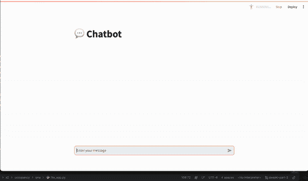
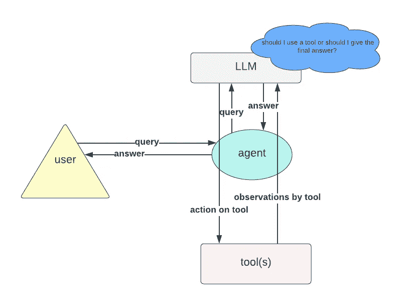

# 使用 OpenAI 助理 API 和 Streamlit 创建助理

> 原文：[`towardsdatascience.com/creating-an-assistant-with-openai-assistant-api-and-streamlit-282d9be9f03e?source=collection_archive---------4-----------------------#2024-06-18`](https://towardsdatascience.com/creating-an-assistant-with-openai-assistant-api-and-streamlit-282d9be9f03e?source=collection_archive---------4-----------------------#2024-06-18)

## 一步步的指南

[](https://medium.com/@vanillaxiangshuyang?source=post_page---byline--282d9be9f03e--------------------------------)[](https://towardsdatascience.com/?source=post_page---byline--282d9be9f03e--------------------------------) [Shuyang Xiang](https://medium.com/@vanillaxiangshuyang?source=post_page---byline--282d9be9f03e--------------------------------)

·发表于[Towards Data Science](https://towardsdatascience.com/?source=post_page---byline--282d9be9f03e--------------------------------) ·6 分钟阅读·2024 年 6 月 18 日

--



作者提供的图片：使用助理 API 和 Streamlit 完成的助理

# OpenAI 助理 API

OpenAI 最近推出了展示代理架构的新功能，例如助理 API。根据 OpenAI 的介绍：

> 助理 API 允许你在自己的应用程序中构建 AI 助理。一个助理有指令，并可以利用模型、工具和文件来响应用户的查询。助理 API 当前支持三种类型的工具：代码解释器、文件搜索和函数调用。

尽管这些进展充满了前景，但它们仍然落后于 LangChain。LangChain 使得创建由 LLM 支持的类似代理的系统成为可能，且在处理自然语言输入和执行基于上下文的操作时更加灵活。

然而，这仅仅是开始。

从高层次来看，与助理 API 的交互可以被视为一个循环：

+   给定用户输入，调用 LLM 来决定是否提供响应或采取特定行动。

+   如果 LLM 的决定足以回答查询，则循环结束。

+   如果一个动作导致了新的观察结果，那么这个观察结果将被包含在提示中，并且 LLM 会再次被调用。

+   然后循环重新开始。



作者提供的图片：LLM 代理循环

不幸的是，尽管有宣布的优势，我发现 API 的文档做得很差，尤其是在与自定义函数调用的交互以及使用如 Streamlit 等框架构建应用时。

在这篇博文中，我将引导你通过使用 OpenAI 助手 API 和自定义函数调用来构建一个 AI 助手，结合 Streamlit 界面，帮助那些有兴趣有效使用助手 API 的人。

# 使用案例：税费计算助手

在这篇博文中，我将展示一个简单的示例：一个能够根据给定收入计算税费的 AI 助手。Langchain 用户可以轻松地通过创建一个带有“税费计算”工具的[代理](https://python.langchain.com/v0.1/docs/modules/agents/)来实现这一点。

这个工具将包括必要的计算步骤和一个设计良好的提示，以确保 LLM 在任何涉及收入或税费的问题中都知道何时调用该工具。

然而，这一过程与 OpenAI 助手 API 的工作方式并不完全相同。虽然代码解释器和文件搜索工具可以直接按照[OpenAI 的文档](https://platform.openai.com/docs/assistants/how-it-works/creating-assistants)以直接的方式使用，但自定义工具则需要稍微不同的方法。

```py
assistant = client.beta.assistants.create(
  name="Data visualizer",
  description="You are great at creating beautiful data visualizations. You analyze data present in .csv files, understand trends, and come up with data visualizations relevant to those trends. You also share a brief text summary of the trends observed.",
  model="gpt-4o",
  tools=[{"type": "code_interpreter"}],
)
```

让我们一步步来解析。我们的目标是：

1.  定义一个根据给定收入计算税费的函数。

1.  使用这个函数开发一个工具。

1.  创建一个可以访问此工具的助手，并在需要计算税费时调用它。

# 助手集成的税费计算功能

请注意，下面段落中描述的税费计算工具仅作为一个示例，用于展示如何使用本文讨论的 API。它不应当用于实际的税费计算。

考虑以下分段函数，它返回给定收入的税费值。请注意，输入被设置为字符串，以便更简单地解析：

```py
def calculate_tax(revenue: str):
    try:
        revenue = float(revenue)
    except ValueError:
        raise ValueError("The revenue should be a string representation of a number.")

    if revenue <= 10000:
        tax = 0
    elif revenue <= 30000:
        tax = 0.10 * (revenue - 10000)
    elif revenue <= 70000:
        tax = 2000 + 0.20 * (revenue - 30000)
    elif revenue <= 150000:
        tax = 10000 + 0.30 * (revenue - 70000)
    else:
        tax = 34000 + 0.40 * (revenue - 150000)

    return tax
```

接下来，我们定义助手：

```py
function_tools = [
    {
        "type": "function",
        "function": {
            "name": "calculate_tax",
            "description": "Get the tax for given revenue in euro",
            "parameters": {
                "type": "object",
                "properties": {
                    "revenue": {
                        "type": "string",
                        "description": "Annual revenue in euro"
                    }
                },
                "required": ["revenue"]
            }
        }
    }
]
# Define the assistant
assistant = client.beta.assistants.create(
    name="Assistant",
    instructions="",
    tools=function_tools,
    model="gpt-4o",
)
```

现在，关键点：

当“calculate_tax”被调用时，助手如何使用该函数？这一部分在 OpenAI 助手文档中说明得不够清楚，许多用户在第一次使用时可能会感到困惑。为了解决这个问题，我们需要定义一个`EventHandler`来管理响应流中的不同事件，特别是如何处理当“calculate_tax”工具被调用时的事件。

```py
 def handle_requires_action(self, data, run_id):
        tool_outputs = []

        for tool in data.required_action.submit_tool_outputs.tool_calls:
            if tool.function.name == "calculate_tax":
                try:
                    # Extract revenue from tool parameters
                    revenue = ast.literal_eval(tool.function.arguments)["revenue"]
                    # Call your calculate_tax function to get the tax
                    tax_result = calculate_tax(revenue)
                    # Append tool output in the required format
                    tool_outputs.append({"tool_call_id": tool.id, "output": f"{tax_result}"})
                except ValueError as e:
                    # Handle any errors when calculating tax
                    tool_outputs.append({"tool_call_id": tool.id, "error": str(e)})
        # Submit all tool_outputs at the same time
        self.submit_tool_outputs(tool_outputs)
```

上面的代码如下工作：对于每个需要操作的工具调用：

+   检查函数名是否为“calculate_tax”。

+   从工具参数中提取收入值。

+   使用`calculate_tax`函数并传入收入值来计算税费。（这就是实际交互发生的地方。）

+   在处理完所有工具调用后，提交收集到的结果。

# 与助手对话

你现在可以按照 OpenAI 文档中的标准步骤与助手互动（因此我不会在这一部分提供过多细节）：

1.  **创建一个线程：** 这代表了用户与助手之间的对话。

1.  **添加用户消息：** 这些可以包括文本和文件，都会被添加到对话线程中。

1.  **创建运行：** 利用与助手关联的模型和工具生成回应，然后将该回应添加回线程中。

以下代码片段演示了如何在我的特定用例中运行助手：代码设置了与助手的流式交互，使用了特定的参数，包括线程 ID 和助手 ID。一个`EventHandler`实例在流期间管理事件。`stream.until_done()`方法保持流式传输，直到所有交互完成。`with`语句确保流结束后能够正确关闭。

```py
 with client.beta.threads.runs.stream(thread_id=st.session_state.thread_id,
                                         assistant_id=assistant.id,
                                         event_handler=EventHandler(),
                                         temperature=0) as stream:
        stream.until_done()
```

# Streamlit 界面

尽管我的文章可以在这里结束，但我注意到在 Streamlit 论坛上有许多类似的询问（[像这个](https://discuss.streamlit.io/t/openai-assistants-api-streaming/64690/3)），用户在界面上无法使流式传输正常工作，尽管它在终端中运行良好。这促使我深入探讨。

为了成功将流式传输集成到您的应用中，您需要扩展前面提到的`EventHandler`类的功能，特别是处理文本创建、文本增量和文本完成。以下是显示文本到 Streamlit 界面并管理聊天历史记录的三个关键步骤：

1.  **处理文本创建（**`**on_text_created**`**）：** 为每个助手的回应初始化并显示一个新的文本框，更新用户界面以反映前面操作的状态。

1.  **处理文本增量（**`**on_text_delta**`**）：** 当助手生成文本时，动态更新当前文本框，使增量更改得以实现，而无需刷新整个界面。

1.  **处理文本完成（**`**on_text_done**`**）：** 通过添加一个新的空文本框来完成每个交互片段，为下一个交互做准备。此外，它会将已完成的对话片段记录在`chat_history`中。

例如，考虑以下代码片段来管理文本增量：

```py
def on_text_delta(self, delta: TextDelta, snapshot: Text):
    """
    Handler for when a text delta is created
    """
    # Clear the latest text box
    st.session_state.text_boxes[-1].empty()

    # If there is new text, append it to the latest element in the assistant text list
    if delta.value:
        st.session_state.assistant_text[-1] += delta.value

    # Re-display the updated assistant text in the latest text box
    st.session_state.text_boxes[-1].info("".join(st.session_state["assistant_text"][-1]))
```

这段代码完成了三个主要任务：

+   **清除最新的文本框：** 清空最近的文本框内容（`st.session_state.text_boxes[-1]`），以便为新输入做好准备。

+   **将增量值追加到助手文本中：** 如果有新文本（`delta.value`），它会将该文本追加到存储在`st.session_state.assistant_text[-1]`中的助手文本。

+   **重新显示更新后的助手文本：** 更新最新文本框的内容，反映到目前为止所有助手文本的合并内容（`st.session_state["assistant_text"][-1]`）。

作者视频：这篇文章中的助手

# 结论

本文演示了如何使用 OpenAI Assistant API 和 Streamlit 构建一个能够计算税收的 AI 助手。

我做了这个简单的项目，旨在突出**Assistant API**的功能，尽管它的文档不够清晰。我的目标是澄清一些模糊之处，并为那些有兴趣使用 Assistant API 的人提供一些指导。希望这篇文章对你有所帮助，并鼓励你进一步探索这个强大工具的其他可能性。

由于空间限制，我尽量避免包含不必要的代码片段。不过，如果需要，请访问我的[Github 仓库](https://github.com/ShuyangenFrance/openai_assistant)查看完整实现。
