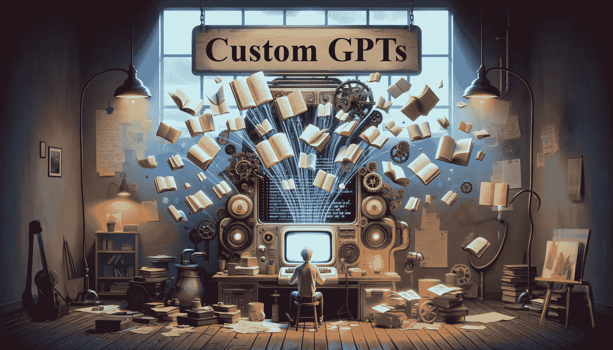

# 为了（大量）乐趣和（一点点）利润创建 OpenAI GPTs

> 原文：[`towardsdatascience.com/creating-openai-gpts-for-lots-of-fun-and-a-little-profit-331471490ccf?source=collection_archive---------3-----------------------#2024-03-18`](https://towardsdatascience.com/creating-openai-gpts-for-lots-of-fun-and-a-little-profit-331471490ccf?source=collection_archive---------3-----------------------#2024-03-18)

## 我是如何为创意工作创建定制 GPTs，这些创意作品来源于公共领域的作品

 [Robert A. Gonsalves](https://robgon.medium.com/?source=post_page---byline--331471490ccf--------------------------------)

·发布于[Towards Data Science](https://towardsdatascience.com/?source=post_page---byline--331471490ccf--------------------------------) ·18 分钟阅读·2024 年 3 月 18 日

--

**定制 GPTs**，*图像由 AI 图像创作程序 DALL-E 3 生成，并由作者编辑*

OpenAI 在 2023 年 11 月 6 日的[DevDay 大会](https://devday.openai.com/)上宣布了让客户自己构建“GPTs”的计划。以下是他们当天在[相关博客](https://openai.com/blog/introducing-gpts)中所说的内容。

> 我们正在推出可以为特定目的创建的 ChatGPT 定制版本——称为 GPTs。GPTs 是一种全新的方式，任何人都可以创建一个量身定制的 ChatGPT 版本，以便在日常生活、特定任务、工作或家庭中更具帮助性——然后与他人分享这一创作。例如，GPTs 可以帮助你学习任何棋类游戏的规则，帮助教孩子数学，或者设计贴纸。——OpenAI

创建定制版本的 ChatGPT 听起来非常棒。但有一个前提：你必须拥有 GPT Plus 或企业账户才能使用新的 GPTs。费用从每月 20 美元起。然而，如果其他 GPT Plus 用户与您的定制 GPT 互动，OpenAI 会根据用户互动的数量支付给您一定的版权费。

# 创建定制 GPTs

我花了一个月的时间实验定制 GPTs，以了解该系统的优势和局限性。我建立了一个名为…的创意写作聊天机器人
