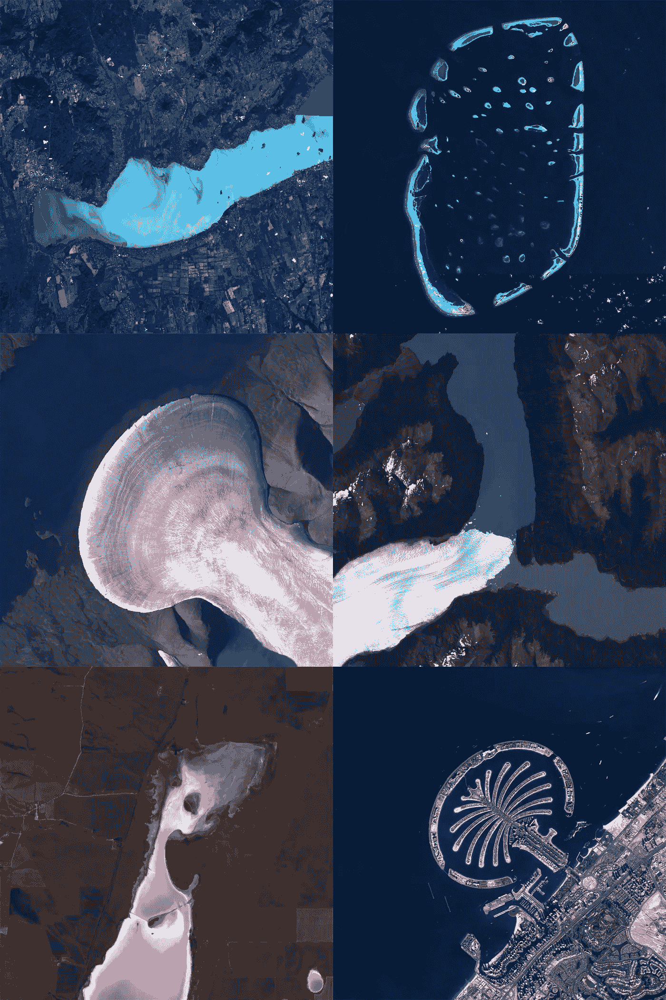

# 创建卫星图像时间推移

> 原文：[`towardsdatascience.com/creating-satellite-image-timelapses-2b479f86ff52?source=collection_archive---------6-----------------------#2024-03-24`](https://towardsdatascience.com/creating-satellite-image-timelapses-2b479f86ff52?source=collection_archive---------6-----------------------#2024-03-24)



## 你将从新的 ESA Sentinel Hub API 下载卫星图像，并使用纯 Python 将它们合并为动画 GIF。

[](https://medium.com/@janosovm?source=post_page---byline--2b479f86ff52--------------------------------)[](https://towardsdatascience.com/?source=post_page---byline--2b479f86ff52--------------------------------) [Milan Janosov](https://medium.com/@janosovm?source=post_page---byline--2b479f86ff52--------------------------------)

·发表于[Towards Data Science](https://towardsdatascience.com/?source=post_page---byline--2b479f86ff52--------------------------------) ·阅读时长 9 分钟·2024 年 3 月 24 日

--

前不久，我在我的文章《深入了解 ESA 的 Sentinel API》中总结了如何收集和准备来自欧洲航天局 Sentinel 卫星的卫星图像数据。从那时起，ESA 对 Sentinel Hub 进行了多年来未曾见过的重要更新，并更新了 API 访问方法。因此，我简要回顾了如何从当前 API 获取数据。作为额外的应用案例，我还展示了如何使用纯 Python 将下载的卫星图像快照合并为动画 GIF。本文旨在帮助你入门，并根据特定的使用案例和数据集，提供进一步探索 API 的可能性。

*所有图像均由作者创作。*

# 1\. 入门

首先，你需要安装 sentinelhub Python 库，你可以在 Jupyter Notebook 中运行以下代码单元来完成安装：

```py
import sys
!{sys.executable} -m pip install sentinelhub --upgrade 
```

然后，你还需要[注册](https://docs.sentinel-hub.com/api/latest/api/overview/authentication/#registering-oauth-client)并创建你的访问令牌。你可以在此处阅读如何操作，并让你的账户顺利运行…
