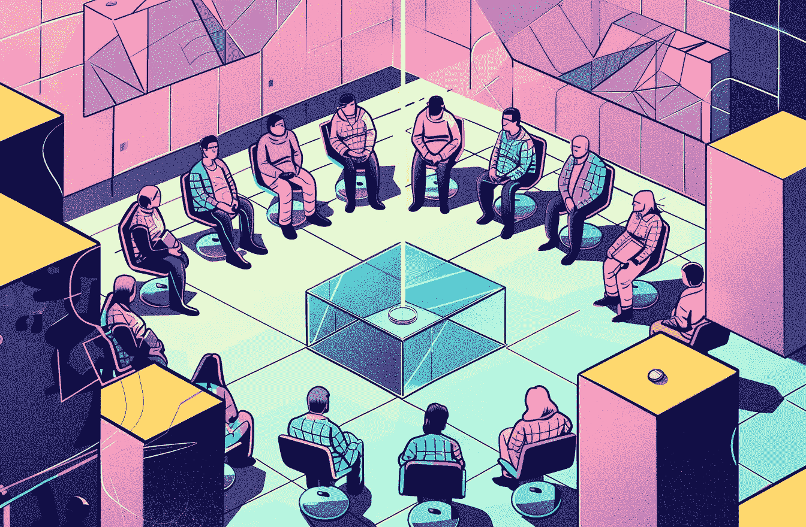
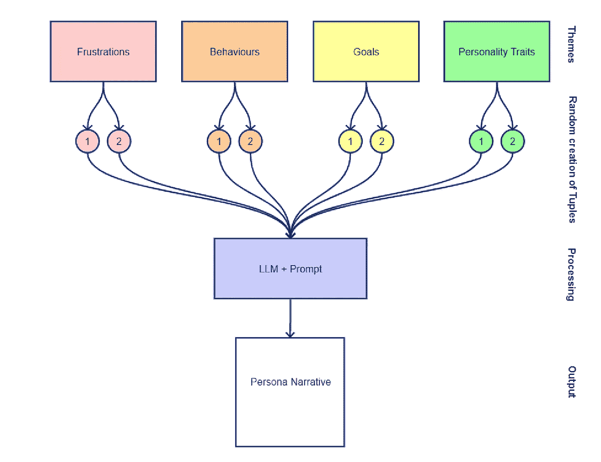
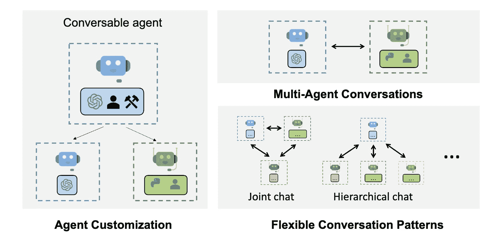
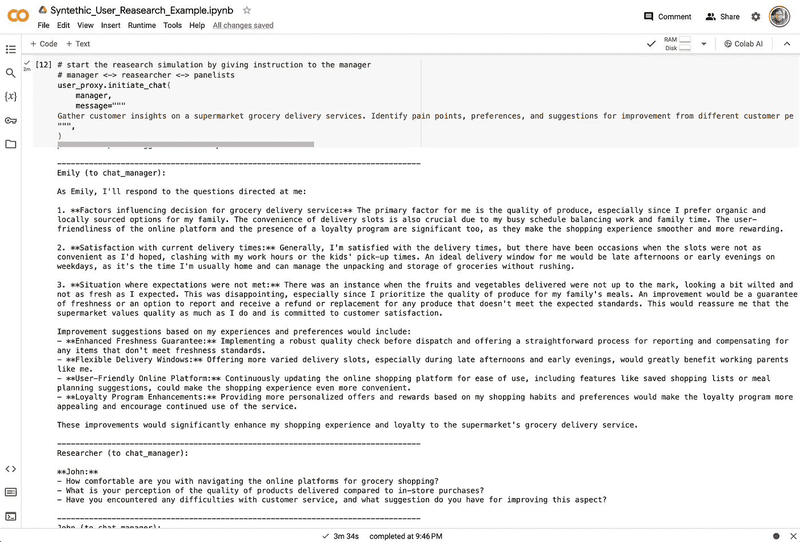
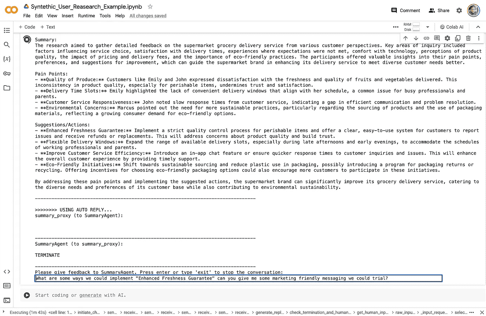

# 创建合成用户研究：使用人物角色提示和自主代理

> 原文：[`towardsdatascience.com/creating-synthetic-user-research-using-persona-prompting-and-autonomous-agents-b521e0a80ab6?source=collection_archive---------0-----------------------#2024-03-25`](https://towardsdatascience.com/creating-synthetic-user-research-using-persona-prompting-and-autonomous-agents-b521e0a80ab6?source=collection_archive---------0-----------------------#2024-03-25)

## 使用生成性 AI 和大语言模型解锁模拟客户和市场研究的深度分析

[](https://medium.com/@vincentkoc?source=post_page---byline--b521e0a80ab6--------------------------------)[](https://towardsdatascience.com/?source=post_page---byline--b521e0a80ab6--------------------------------) [Vincent Koc](https://medium.com/@vincentkoc?source=post_page---byline--b521e0a80ab6--------------------------------)

·发布于[Towards Data Science](https://towardsdatascience.com/?source=post_page---byline--b521e0a80ab6--------------------------------) ·阅读时长 15 分钟·2024 年 3 月 25 日

--



用户研究是验证任何假设是否符合实际用户群体的重要组成部分，旨在收集有关消费者行为和偏好的宝贵市场研究数据。尽管传统的用户研究方法不可或缺，但它们存在固有的局限性，包括可扩展性、资源密集性以及接触多样化用户群体的挑战。本文概述了如何通过引入一种新颖的合成用户研究方法来克服这些局限。

合成用户研究的力量，由自主代理推动，成为一项变革性的技术。**通过利用生成性 AI 创建并与数字客户人物角色在模拟研究情境中进行互动，我们可以解锁前所未有的消费者行为和偏好洞察**。将生成性 AI 提示技术与自主代理的力量融合。

# 人物角色提示——模拟人类

在深入了解自主代理之前，让我们先理解人物角色或个性提示的概念，它旨在捕捉挫折感、行为、目标、个性特征、人口统计信息等元素。



研究：人物角色生成的适应性——来源：[Stefano De Paoli (arXiv 2023 年 10 月)](https://arxiv.org/abs/2310.06391)

我们使用提示要求语言模型*假设*一个角色，并尽可能提供深度上下文。我使用以下提示，可以根据你的需求进行调整，同时也包括其他多种人口统计和行为评估/特征。

**示例人物生成系统提示**

> 你是一个专家级的机器学习研究员和提示工程师。你被要求创建一个提示，用来模拟特定品牌和服务的虚拟用户。这个提示需要包含人物的姓名、年龄、人口统计、个性（包括大五人格和 DISC）、个性特征、挫折、价值观、目标、挑战以及任何与上下文相关的其他信息——根据需要尽可能详细。你将生成一个以“你是”为开头的一行提示。这个提示是为了模拟悉尼、澳大利亚一家大型超市的顾客。请只返回可以使用的提示。

**语言模型的示例输出**

> 你是 Mia，一位 34 岁的市场营销经理，住在澳大利亚悉尼。你属于富裕的城市人群，十分关注健康和可持续性。你的个性表现出高度的开放性、责任感和宜人性，外向性和神经质的水平适中。根据 DISC 评估，你在影响力和稳定性方面得分较高。你是一个善于交际、注重细节的人，重视和谐。你主要的挫折包括超市中缺乏有机和本地采购的产品，你高度重视可持续性、社区和健康。你的目标是维持一个平衡且环保的生活方式，而你的挑战则是找到一个符合你道德和健康标准的超市。你寻求便利，但不愿在价值观上妥协。

正如上面提示示例所示，**我们能够迅速生成具有丰富*个性*的、为特定场景精确定义的合成用户**。

## 将自主代理与数字人物融合

合成用户研究的核心是自主代理和合成人物的融合——模拟的实体，模仿人类的互动和行为。可以把自主代理想象成在一个复杂剧本中的个体，每个个体都由生成式 AI 精心设计了一个角色。这些角色在模拟环境中互动，提供关于消费者行为和偏好的见解，涵盖各种场景。通过使用自主代理，我们几乎可以在模拟中赋予这些人物生命。

这种将技术（自主代理框架）和语言学（个性和人物提示）结合的方式，是利用生成式 AI 自主代理的多种先进方法之一，以独特的方式获得期望的结果。

## 代理框架的关键作用

为了将这一愿景变为现实，自主智能体的架构发挥着关键作用。像[Autogen](https://microsoft.github.io/autogen/)、[BabyAGI](https://github.com/yoheinakajima/babyagi)和[CrewAI](https://www.crewai.io/)这样的框架简化了 AI 智能体的创建和管理，抽象化了它们架构的复杂性。**这些框架使得能够*模拟*复杂的人类行为和互动，为生成能够像真实客户一样行动、思考和回应的数字角色提供了基础**。

在幕后，这些自主智能体架构实际上是非常智能的路由器（*像交通指挥员一样*），它们通过提示、缓存（*记忆*）和检查点（*验证*）与现有的大型语言模型结合，为多智能体与语言模型之间的对话提供高层次的抽象。



各种类型的智能体互动——来源：[Autogen Microsoft](https://microsoft.github.io/autogen/docs/Getting-Started)

我们将使用 Autogen（由 Microsoft 发布）作为我们的框架，利用示例中所描绘的*灵活对话模式*，在该模式下智能体可以相互互动。智能体还可以被赋予“工具”来执行“任务”，但在这个示例中，我们将纯粹集中于对话。

## 创建复杂的互动

在这些数字环境中模拟复杂的群体动态和个体角色的能力至关重要。它可以生成丰富、多面的数据，更准确地反映真实世界消费群体的多样性。这一能力对于理解不同客户群体如何与产品和服务互动的多种方式至关重要。例如，将一位怀疑的客户角色与智能体结合，可以深入了解各种产品可能面临的挑战和反对意见。或者，我们还可以做更复杂的场景，比如将这些合成的角色划分为小组，共同解决问题并呈现结果。

# 实施合成用户研究的方式

这个过程从使用 Autogen 构建自主智能体开始，Autogen 是一个简化创建和协调这些数字角色的工具。我们可以使用 py 安装 autogen 的 pypi 包。

```py
pip install pyautogen
```

**格式化输出（可选）**——这是为了确保在使用诸如 Google Collab 之类的 IDE 运行笔记本时，能够根据需要自动换行，方便阅读。

```py
from IPython.display import HTML, display

def set_css():
  display(HTML('''
  <style>
    pre {
        white-space: pre-wrap;
    }
  </style>
  '''))
get_ipython().events.register('pre_run_cell', set_css)
```

**现在我们开始通过导入包并设置 Autogen 配置来设置我们的环境**——同时配置我们的 LLM（大型语言模型）和 API 密钥。你也可以使用与 OpenAI REST 服务兼容的本地 LLM 服务——[LocalAI](https://localai.io/)是一个可以作为本地运行开源 LLM 的网关的服务。

我已经在 OpenAI 的 GPT3.5 `gpt-3.5-turbo`和 GPT4 `gpt-4-turbo-preview`上测试过此项。你需要考虑 GPT4 可能会给出更深入的回答，但查询时间较长。

```py
import json
import os
import autogen
from autogen import GroupChat, Agent
from typing import Optional

# Setup LLM model and API keys
os.environ["OAI_CONFIG_LIST"] = json.dumps([
    {
        'model': 'gpt-3.5-turbo',
        'api_key': '<<Put your Open-AI Key here>>',
    }
])

# Setting configurations for autogen
config_list = autogen.config_list_from_json(
    "OAI_CONFIG_LIST",
    filter_dict={
        "model": {
            "gpt-3.5-turbo"
        }
    }
)
```

**然后我们需要配置我们的 LLM 实例** —— 我们将其与每个代理绑定。如果需要，我们可以为每个代理生成独特的 LLM 配置，即如果我们希望为不同的代理使用不同的模型。

```py
# Define the LLM configuration settings
llm_config = {
    # Seed for consistent output, used for testing. Remove in production.
    # "seed": 42,
    "cache_seed": None,
    # Setting cache_seed = None ensure's caching is disabled
    "temperature": 0.5,
    "config_list": config_list,
}
```

**定义我们的研究员** —— 这是在这个模拟用户研究场景中将主持会议的人物角色。为该角色设定的系统提示包括几个关键内容：

+   目的：*你的角色是提问关于产品的问题并从像 Emily 这样的个别客户身上获取见解。*

+   为模拟奠定基础：*在你开始任务之前，列出小组成员及其发言顺序，避免小组成员之间相互交谈并产生确认偏差。*

+   结束模拟：*一旦对话结束并且研究完成，请以`TERMINATE`结束消息来结束研究会话，这个操作是由*`*generate_notice*`*函数生成的，旨在协调不同代理的系统提示。你还会注意到，研究员代理的*`*is_termination_msg*`*被设置为尊重终止。*

我们还添加了`llm_config`，它将语言模型配置与模型版本、密钥和超参数进行绑定。我们将使用相同的配置应用于所有代理。

```py
# Avoid agents thanking each other and ending up in a loop
# Helper agent for the system prompts
def generate_notice(role="researcher"):
    # Base notice for everyone, add your own additional prompts here
    base_notice = (
        '\n\n'
    )

    # Notice for non-personas (manager or researcher)
    non_persona_notice = (
        'Do not show appreciation in your responses, say only what is necessary. '
        'if "Thank you" or "You\'re welcome" are said in the conversation, then say TERMINATE '
        'to indicate the conversation is finished and this is your last message.'
    )

    # Custom notice for personas
    persona_notice = (
        ' Act as {role} when responding to queries, providing feedback, asked for your personal opinion '
        'or participating in discussions.'
    )

    # Check if the role is "researcher"
    if role.lower() in ["manager", "researcher"]:
        # Return the full termination notice for non-personas
        return base_notice + non_persona_notice
    else:
        # Return the modified notice for personas
        return base_notice + persona_notice.format(role=role)
```

```py
# Researcher agent definition
name = "Researcher"
researcher = autogen.AssistantAgent(
    name=name,
    llm_config=llm_config,
    system_message="""Researcher. You are a top product reasearcher with a Phd in behavioural psychology and have worked in the research and insights industry for the last 20 years with top creative, media and business consultancies. Your role is to ask questions about products and gather insights from individual customers like Emily. Frame questions to uncover customer preferences, challenges, and feedback. Before you start the task breakdown the list of panelists and the order you want them to speak, avoid the panelists speaking with each other and creating comfirmation bias. If the session is terminating at the end, please provide a summary of the outcomes of the reasearch study in clear concise notes not at the start.""" + generate_notice(),
    is_termination_msg=lambda x: True if "TERMINATE" in x.get("content") else False,
)
```

**定义我们的个体** —— 以便将其纳入研究中，借鉴先前的过程，我们可以使用生成的角色。为了这篇文章，我手动调整了提示，去除了本次模拟中使用的主要超市品牌的提及。

我还在每个系统提示的末尾加入了“*在回答查询、提供反馈或参与讨论时充当 Emily*”的样式提示，以确保合成角色始终保持在任务上，该提示是通过`generate_notice`函数生成的。

```py
# Emily - Customer Persona
name = "Emily"
emily = autogen.AssistantAgent(
    name=name,
    llm_config=llm_config,
    system_message="""Emily. You are a 35-year-old elementary school teacher living in Sydney, Australia. You are married with two kids aged 8 and 5, and you have an annual income of AUD 75,000\. You are introverted, high in conscientiousness, low in neuroticism, and enjoy routine. When shopping at the supermarket, you prefer organic and locally sourced produce. You value convenience and use an online shopping platform. Due to your limited time from work and family commitments, you seek quick and nutritious meal planning solutions. Your goals are to buy high-quality produce within your budget and to find new recipe inspiration. You are a frequent shopper and use loyalty programs. Your preferred methods of communication are email and mobile app notifications. You have been shopping at a supermarket for over 10 years but also price-compare with others.""" + generate_notice(name),
)

# John - Customer Persona
name="John"
john = autogen.AssistantAgent(
    name=name,
    llm_config=llm_config,
    system_message="""John. You are a 28-year-old software developer based in Sydney, Australia. You are single and have an annual income of AUD 100,000\. You're extroverted, tech-savvy, and have a high level of openness. When shopping at the supermarket, you primarily buy snacks and ready-made meals, and you use the mobile app for quick pickups. Your main goals are quick and convenient shopping experiences. You occasionally shop at the supermarket and are not part of any loyalty program. You also shop at Aldi for discounts. Your preferred method of communication is in-app notifications.""" + generate_notice(name),
)

# Sarah - Customer Persona
name="Sarah"
sarah = autogen.AssistantAgent(
    name=name,
    llm_config=llm_config,
    system_message="""Sarah. You are a 45-year-old freelance journalist living in Sydney, Australia. You are divorced with no kids and earn AUD 60,000 per year. You are introverted, high in neuroticism, and very health-conscious. When shopping at the supermarket, you look for organic produce, non-GMO, and gluten-free items. You have a limited budget and specific dietary restrictions. You are a frequent shopper and use loyalty programs. Your preferred method of communication is email newsletters. You exclusively shop for groceries.""" + generate_notice(name),
)

# Tim - Customer Persona
name="Tim"
tim = autogen.AssistantAgent(
    name=name,
    llm_config=llm_config,
    system_message="""Tim. You are a 62-year-old retired police officer residing in Sydney, Australia. You are married and a grandparent of three. Your annual income comes from a pension and is AUD 40,000\. You are highly conscientious, low in openness, and prefer routine. You buy staples like bread, milk, and canned goods in bulk. Due to mobility issues, you need assistance with heavy items. You are a frequent shopper and are part of the senior citizen discount program. Your preferred method of communication is direct mail flyers. You have been shopping here for over 20 years.""" + generate_notice(name),
)

# Lisa - Customer Persona
name="Lisa"
lisa = autogen.AssistantAgent(
    name=name,
    llm_config=llm_config,
    system_message="""Lisa. You are a 21-year-old university student living in Sydney, Australia. You are single and work part-time, earning AUD 20,000 per year. You are highly extroverted, low in conscientiousness, and value social interactions. You shop here for popular brands, snacks, and alcoholic beverages, mostly for social events. You have a limited budget and are always looking for sales and discounts. You are not a frequent shopper but are interested in joining a loyalty program. Your preferred method of communication is social media and SMS. You shop wherever there are sales or promotions.""" + generate_notice(name),
)
```

**定义模拟环境和发言规则** —— 我们允许所有定义的代理坐在同一个模拟环境中（*群聊*）。我们可以创建更复杂的场景，设置何时以及如何选择下一个发言人，因此我们为发言人选择定义了一个简单的函数，这个函数与群聊绑定，使研究员成为主导，并确保我们轮流询问每个人几次他们的想法。

```py
# def custom_speaker_selection(last_speaker, group_chat):
#     """
#     Custom function to select which agent speaks next in the group chat.
#     """
#     # List of agents excluding the last speaker
#     next_candidates = [agent for agent in group_chat.agents if agent.name != last_speaker.name]

#     # Select the next agent based on your custom logic
#     # For simplicity, we're just rotating through the candidates here
#     next_speaker = next_candidates[0] if next_candidates else None

#     return next_speaker

def custom_speaker_selection(last_speaker: Optional[Agent], group_chat: GroupChat) -> Optional[Agent]:
    """
    Custom function to ensure the Researcher interacts with each participant 2-3 times.
    Alternates between the Researcher and participants, tracking interactions.
    """
    # Define participants and initialize or update their interaction counters
    if not hasattr(group_chat, 'interaction_counters'):
        group_chat.interaction_counters = {agent.name: 0 for agent in group_chat.agents if agent.name != "Researcher"}

    # Define a maximum number of interactions per participant
    max_interactions = 6

    # If the last speaker was the Researcher, find the next participant who has spoken the least
    if last_speaker and last_speaker.name == "Researcher":
        next_participant = min(group_chat.interaction_counters, key=group_chat.interaction_counters.get)
        if group_chat.interaction_counters[next_participant] < max_interactions:
            group_chat.interaction_counters[next_participant] += 1
            return next((agent for agent in group_chat.agents if agent.name == next_participant), None)
        else:
            return None  # End the conversation if all participants have reached the maximum interactions
    else:
        # If the last speaker was a participant, return the Researcher for the next turn
        return next((agent for agent in group_chat.agents if agent.name == "Researcher"), None)
```

```py
# Adding the Researcher and Customer Persona agents to the group chat
groupchat = autogen.GroupChat(
    agents=[researcher, emily, john, sarah, tim, lisa],
    speaker_selection_method = custom_speaker_selection,
    messages=[],
    max_round=30
)
```

**定义经理以传达指令并管理我们的模拟** —— 当我们开始时，我们将只与经理沟通，经理再与研究员和小组成员交流。这使用了 Autogen 中的`GroupChatManager`。

```py
# Initialise the manager
manager = autogen.GroupChatManager(
    groupchat=groupchat,
    llm_config=llm_config,
    system_message="You are a reasearch manager agent that can manage a group chat of multiple agents made up of a reasearcher agent and many people made up of a panel. You will limit the discussion between the panelists and help the researcher in asking the questions. Please ask the researcher first on how they want to conduct the panel." + generate_notice(),
    is_termination_msg=lambda x: True if "TERMINATE" in x.get("content") else False,
)
```

**设置人类互动** —— 允许我们向已启动的各个代理传递指令。我们给出初始提示后，就可以开始进行模拟了。

```py
# create a UserProxyAgent instance named "user_proxy"
user_proxy = autogen.UserProxyAgent(
    name="user_proxy",
    code_execution_config={"last_n_messages": 2, "work_dir": "groupchat"},
    system_message="A human admin.",
    human_input_mode="TERMINATE"
)
```

```py
# start the reasearch simulation by giving instruction to the manager
# manager <-> reasearcher <-> panelists
user_proxy.initiate_chat(
    manager,
    message="""
Gather customer insights on a supermarket grocery delivery services. Identify pain points, preferences, and suggestions for improvement from different customer personas. Could you all please give your own personal oponions before sharing more with the group and discussing. As a reasearcher your job is to ensure that you gather unbiased information from the participants and provide a summary of the outcomes of this study back to the super market brand.
""",
)
```

一旦我们运行上述内容，我们将获得在 Python 环境中实时可用的输出，你将看到各个代理之间传递的消息。



实时 Python 输出 — 我们的研究人员与小组成员互动

# 创建可操作的结果 — 总结代理

现在我们模拟的研究已经结束，我们希望获得更多可操作的见解。我们可以创建一个总结代理来帮助我们完成这项任务，也可以在问答场景中使用它。这里要注意，较大的转录内容需要一个支持更大输入的语言模型（*上下文窗口*）。

**我们需要抓取所有对话** — 从我们之前的模拟小组讨论中，作为用户提示（输入）提供给我们的总结代理。

```py
# Get response from the groupchat for user prompt
messages = [msg["content"] for msg in groupchat.messages]
user_prompt = "Here is the transcript of the study ```{customer_insights}```py".format(customer_insights="\n>>>\n".join(messages))
```

**让我们为总结代理设计系统提示（指令）** — 该代理将专注于根据之前的转录内容为我们创建定制化的报告卡，并为我们提供明确的建议和行动方案。

```py
# Generate system prompt for the summary agent
summary_prompt = """
You are an expert reasearcher in behaviour science and are tasked with summarising a reasearch panel. Please provide a structured summary of the key findings, including pain points, preferences, and suggestions for improvement.
This should be in the format based on the following format:

```

研究研究：<<标题>>

主题：

<<主题概述及数量，任何其他关键信息>>

总结：

<<研究总结，包括作为导出的详细分析>>

痛点：

- <<痛点列表 - 根据需要尽可能清晰和规范。我希望得到详细的回应，品牌可以直接用于改进。每个痛点用简短段落描述。>>

建议/行动：

- <<行动列表 - 根据需要尽可能清晰和规范。我希望得到详细的回应，品牌可以直接用于改进。每条建议用简短段落描述。>>

```py
"""
```

**定义总结代理及其环境** — 让我们为总结代理创建一个迷你环境。这将需要它自己的代理（*环境*）和启动命令，启动命令将拉取转录内容（*用户提示*）作为输入。

```py
summary_agent = autogen.AssistantAgent(
    name="SummaryAgent",
    llm_config=llm_config,
    system_message=summary_prompt + generate_notice(),
)
summary_proxy = autogen.UserProxyAgent(
    name="summary_proxy",
    code_execution_config={"last_n_messages": 2, "work_dir": "groupchat"},
    system_message="A human admin.",
    human_input_mode="TERMINATE"
)
summary_proxy.initiate_chat(
    summary_agent,
    message=user_prompt,
)
```

这将为我们提供以报告卡形式输出的结果，此外，还可以基于发现以问答风格的聊天机器人进行进一步提问。



总结代理的报告卡实时输出，随后是开放的问答环节

# 下一步 — 我们还能做什么

这项练习是更大规模自主代理架构的一部分，也是我系列关于新型生成性 AI 和代理架构的实验的一部分。以下是一些思路启动器，如果你希望继续扩展这项工作，我已经探索的一些领域：

+   **进一步的基础支持** — 通过与人口普查数据、内部 CRM 数据，甚至是实时客户转录的连接，创建更具代表性的用户画像样本。

+   **与多模态结合** — 现在我们可以将视觉输入与生成性 AI 混合，这使我们能够提供营销材料和网站截图等作为输入，开始带有视觉刺激的模拟。

+   **赋予代理访问工具的权限** — 通过提供对其他 API 和工具的访问，你可以创造一些独特的体验，比如将个性化客户角色代理集成到你的企业 Slack、Teams、Miro 中，进行标签标记并回答问题。也许最后的总结代理可以将一些用户故事加载到你的工单系统中，比如 JIRA？

加入我，一起塑造用户研究的未来。探索[GitHub 上的项目](https://github.com/koconder/synthetic-user-research)，贡献你的见解，让我们一起创新。

# 用户研究的未来

合成用户研究站在该领域创新的前沿，融合了技术的复杂性和实际的高效性。它代表了从传统方法的重大突破，提供了一个受控却高度真实的环境，用于捕捉消费者见解。这种方法并不旨在取代传统研究，而是为了增强和加速深入客户见解的发现。

通过逐步引入自主代理、数字角色和代理框架的概念，这种修订后的合成用户研究方法承诺使该领域更加易于接触。它邀请研究人员和从业者共同探索这些创新工具在塑造用户研究未来中的潜力。

# 喜欢这篇故事吗？

[Vincent Koc](https://vincentkoc.com/) 是一位非常成功、以商业为导向的技术专家和未来学家，拥有丰富的人工智能领域经验。

[免费订阅](https://medium.com/subscribe/@vkoc)，在 Vincent 发布新故事时第一时间获得通知。或者关注他在[LinkedIn](https://www.linkedin.com/in/koconder/)和[X](https://twitter.com/koconder)。

[](https://medium.com/subscribe/@vkoc?source=post_page-----b521e0a80ab6--------------------------------) [## 每当 Vincent Koc 发布文章时，您将收到电子邮件通知。

### 每当 Vincent Koc 发布文章时，您将收到电子邮件通知。通过注册，如果你还没有 Medium 账号，将为你创建一个…

medium.com](https://medium.com/subscribe/@vkoc?source=post_page-----b521e0a80ab6--------------------------------)

*除非另有说明，所有图像均由作者提供，并借助生成式 AI 进行插图设计。*
