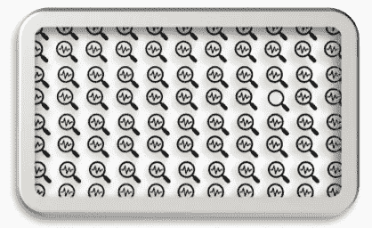
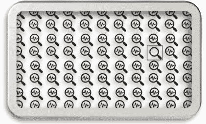

# 使用不同抽样技术的信用卡欺诈检测

> 原文：[`towardsdatascience.com/credit-card-fraud-detection-with-different-sampling-techniques-cece7734acc5?source=collection_archive---------2-----------------------#2024-12-15`](https://towardsdatascience.com/credit-card-fraud-detection-with-different-sampling-techniques-cece7734acc5?source=collection_archive---------2-----------------------#2024-12-15)

## 信用卡

## 如何处理不平衡数据

 [Mythili Krishnan](https://medium.com/@krishnan.mythili?source=post_page---byline--cece7734acc5--------------------------------)

·发表于 [Towards Data Science](https://towardsdatascience.com/?source=post_page---byline--cece7734acc5--------------------------------) ·10 分钟阅读·2024 年 12 月 15 日

--

图片由 [Bermix Studio](https://unsplash.com/@bermixstudio?utm_source=medium&utm_medium=referral) 提供，来自 [Unsplash](https://unsplash.com/?utm_source=medium&utm_medium=referral)

信用卡欺诈检测是所有金融机构面临的一个问题。一般来说，欺诈检测非常具有挑战性，因为欺诈者不断提出新的创新方式来进行欺诈，因此很难找到可以检测到的模式。例如，在图示中，所有图标看起来都一样，但其中有一个图标与其他图标略有不同，我们需要找出那个。你能找出来吗？

这就是计划：

图片来源：作者

在此背景下，让我为今天的内容提供一个计划，并向你介绍在我们的用例“信用卡欺诈检测”中你将学到的内容：

1\. 什么是数据不平衡

2\. 数据不平衡的可能原因

3\. 为什么类别不平衡在机器学习中是一个问题
