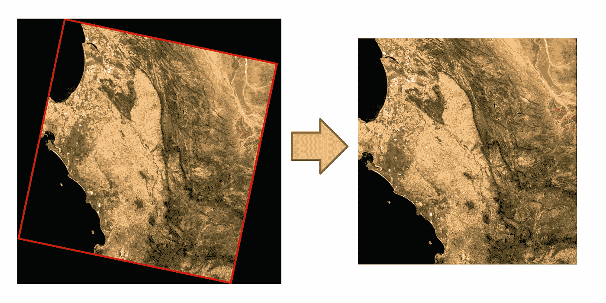

# 使用 Python 裁剪 Landsat 场景的边界框

> 原文：[`towardsdatascience.com/cropping-landsat-scenes-from-their-bounding-box-using-python-eef353d8cc67?source=collection_archive---------6-----------------------#2024-02-04`](https://towardsdatascience.com/cropping-landsat-scenes-from-their-bounding-box-using-python-eef353d8cc67?source=collection_archive---------6-----------------------#2024-02-04)

## 使用 stac 文件移除 Landsat 卫星图像的外边框

 [Conor O'Sullivan](https://conorosullyds.medium.com/?source=post_page---byline--eef353d8cc67--------------------------------)

·发表于 [Towards Data Science](https://towardsdatascience.com/?source=post_page---byline--eef353d8cc67--------------------------------) ·阅读时间 8 分钟·2024 年 2 月 4 日

--

（来源：作者）

用卫星图像讲故事是非常直接的。迷人的景观做了大部分工作。然而，视觉化它们需要一些工作，例如 [选择和缩放 RGB 通道](https://medium.com/towards-data-science/visualising-the-rgb-channels-of-satellite-images-with-python-6d541af1f98d)。在这篇文章中，我们将更进一步。我们将看到如何去除那个丑陋的边界框。具体来说，我们将：

+   使用**stac**文件裁剪和旋转 Landsat 场景

+   讨论如何在保持像素地理位置的同时完成此操作

我们将讨论一些关键的 Python 代码，并且你可以在 [GitHub](https://github.com/conorosully/medium-articles/blob/master/src/remote%20sensing/landsat_cropping.ipynb) 上找到完整的项目。

# 下载 Landsat 场景

我们首先下载一个 Landsat 场景。你可以通过 [EarthExplorer](https://earthexplorer.usgs.gov/) 门户网站来实现。如果你想使用 Python，下面的文章会指导你完成整个过程：

 ## 使用 Python 下载 Landsat 卫星图像

### 使用 landsatxplore Python 包简化 Landsat 场景下载

towardsdatascience.com

最终，你应该会有一个像**图 1**这样的文件夹。这里面包含了所有文件…
