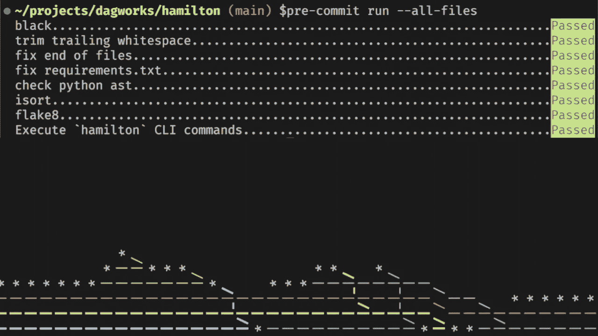
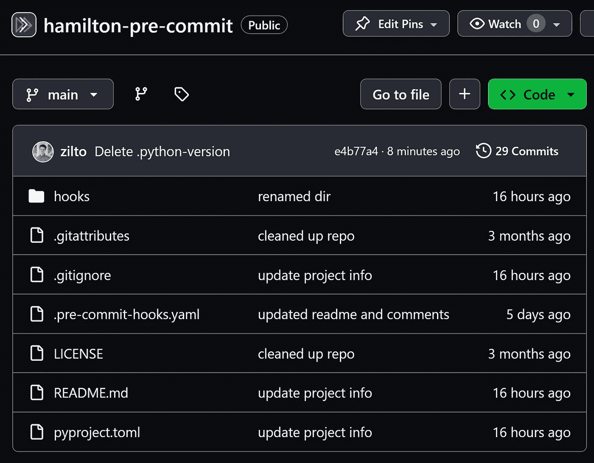
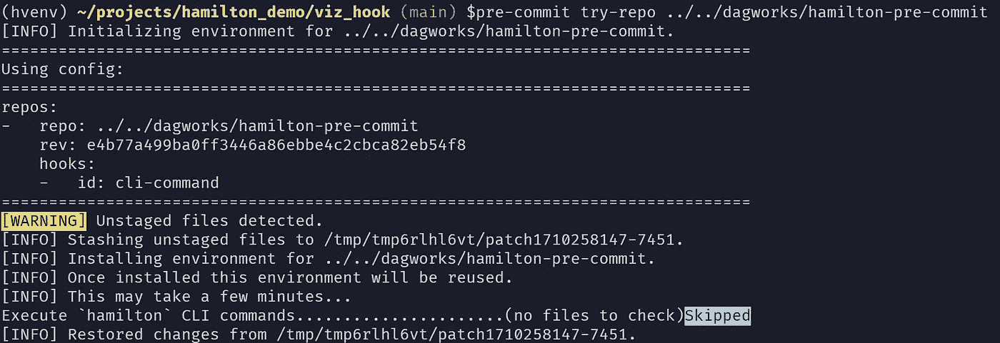
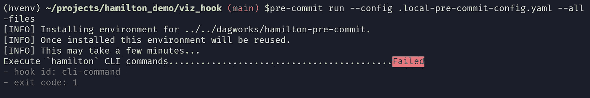
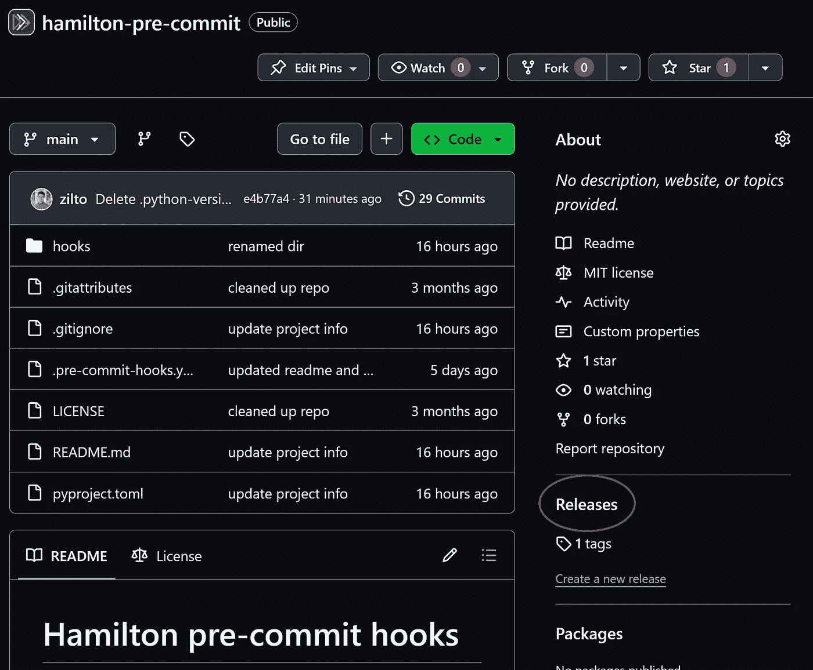
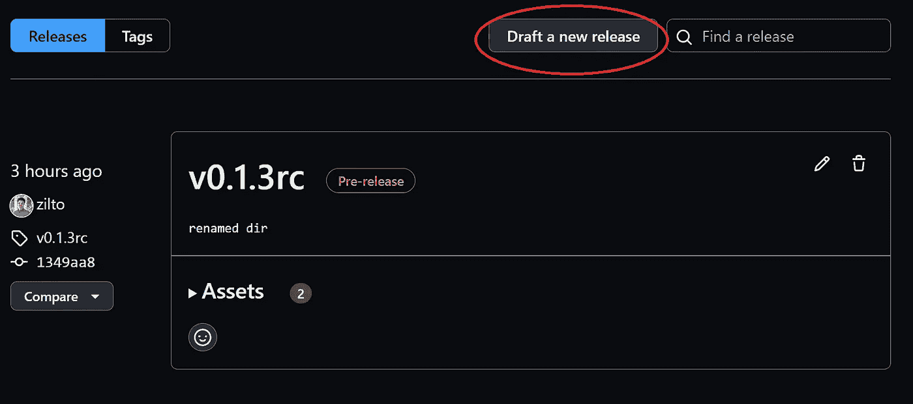
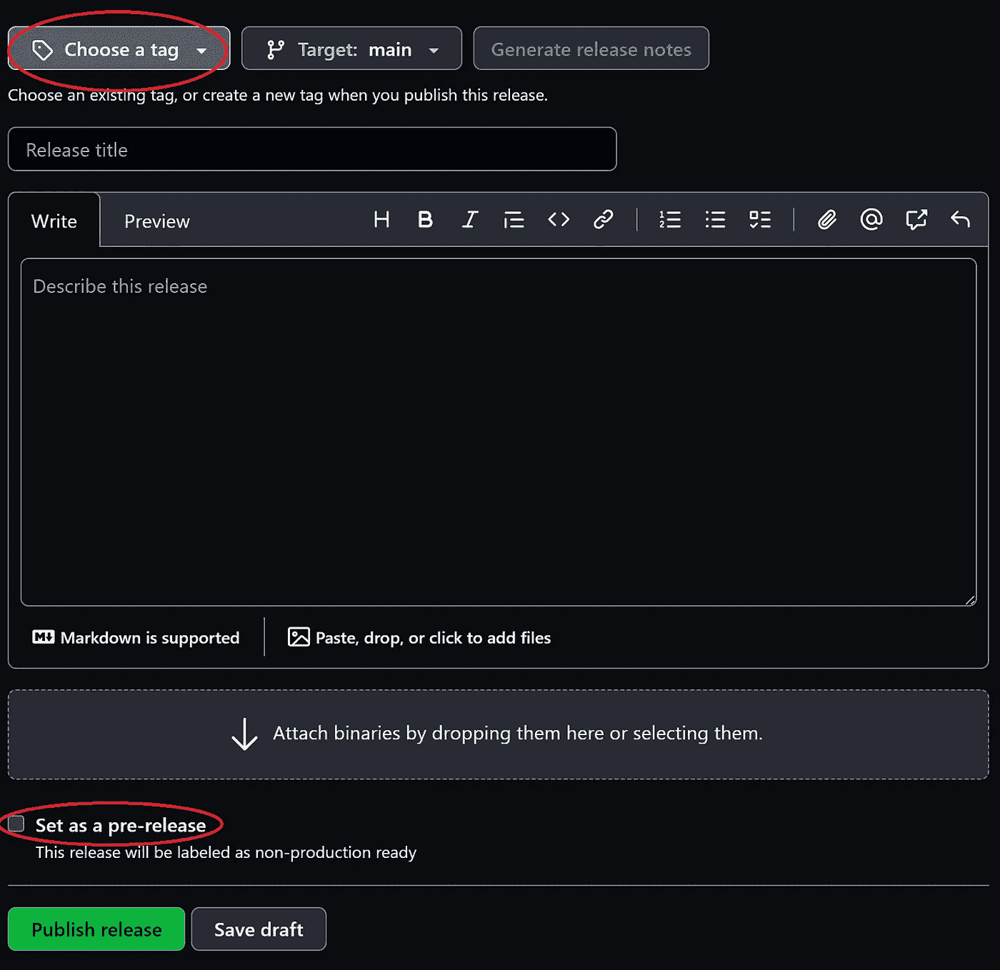

# 为了更安全的代码更改创建自定义预提交钩子

> 原文：[`towardsdatascience.com/custom-pre-commit-hooks-for-safer-code-changes-d8b8aa1b2ebb?source=collection_archive---------5-----------------------#2024-03-14`](https://towardsdatascience.com/custom-pre-commit-hooks-for-safer-code-changes-d8b8aa1b2ebb?source=collection_archive---------5-----------------------#2024-03-14)

## 编写你的第一个预提交钩子的逐步指南

[](https://medium.com/@thijean?source=post_page---byline--d8b8aa1b2ebb--------------------------------)[](https://towardsdatascience.com/?source=post_page---byline--d8b8aa1b2ebb--------------------------------) [Thierry Jean](https://medium.com/@thijean?source=post_page---byline--d8b8aa1b2ebb--------------------------------)

·发表于[Towards Data Science](https://towardsdatascience.com/?source=post_page---byline--d8b8aa1b2ebb--------------------------------) ·8 分钟阅读·2024 年 3 月 14 日

--



预提交运行结果，包括我们的 Hamilton 钩子！

大多数软件使用`git`版本控制系统来更新和分发代码。一个协作编写代码的挑战是，在每个贡献者有自己关于什么是干净代码的风格和看法时，如何确保遵循特定的标准。

[**预提交钩子**](https://pre-commit.com/)是一些在提交代码更改之前自动执行的脚本或命令。它们可以强制执行样式规则，并在代码提交和分发之前捕捉错误。值得注意的钩子包括检查文件的语法错误、排序导入以及规范化引号。它们是任何项目中不可或缺的工具，尤其是那些有多个贡献者的开源项目。

# 为什么要创建自定义的预提交钩子？

我想创建预提交钩子来验证 Python 库[Hamilton](https://github.com/dagworks-inc/hamilton)的数据流定义，但我发现大多数在线资源分散且仅限于基本用法。

在这篇文章中，你将找到：

1.  如何在你的项目中开始使用预提交钩子

1.  开发自定义预提交钩子的逐步教程

为了引导讨论，我将通过[这个 GitHub 仓库](https://github.com/DAGWorks-Inc/hamilton-pre-commit)介绍我为 Hamilton 开发的预提交钩子。

# 开始使用预提交钩子

钩子是直接内嵌在`git`版本控制系统中的机制。你可以在`.git/hooks`目录下找到项目的钩子（该目录默认可能是隐藏的）。虽然通常称之为“预提交钩子”，但 git 钩子涵盖了整个[git 生命周期](https://pre-commit.com/#supported-git-hooks)。例如，你可以在提交后或推送前触发钩子。此外，钩子可以用任何编程语言编写。特别地，[Ruff](https://github.com/astral-sh/ruff)库为了性能提升，使用 Rust 重新实现了许多基于 Python 的钩子。

与专注于代码行为的软件测试不同，钩子可以看作是你在每次保存文件时执行的轻量级检查。虽然你可以预期测试会随着代码库的变化而变化，但你的代码编写指南和预提交钩子可能会保持不变。

## 项目设置

假设我们在目录`/my-project`中开始一个新的 Python 项目（或使用一个现有项目）。与预提交钩子协作的推荐方式是通过[pre-commit](https://github.com/pre-commit/pre-commithttps://github.com/pre-commit/pre-commit) Python 库。我们可以通过以下步骤进行设置：

1.  使用`git init`为你的项目创建一个 git 仓库

1.  使用`pip install pre-commit`安装预提交库

1.  将`.pre-commit-config.yaml`添加到你的代码库中。以下是一个示例：

```py
# .pre-commit-config.yaml
repos:
    # repository with hook definitions
-   repo: https://github.com/pre-commit/pre-commit-hooks
    rev: v2.3.0  # release version of the repo
    hooks:  # list of hooks from the repo to include in this project
    -   id: end-of-file-fixer
    -   id: trailing-whitespace
    -   id: check-yaml
        args: ['--unsafe']  # add arguments to `check-yaml`

    # download another repository with hooks
-   repo: https://github.com/psf/black
    rev: 22.10.0
    hooks:
    -   id: black
```

4\. 使用`pre-commit install`安装钩子。它将从`.pre-commit-config.yaml`读取指令，并在`.git/hooks/pre-commit`中本地安装钩子

5\. 提交更改或手动运行钩子，使用`pre-commit run --all-files`来触发钩子

# 创建一个自定义的预提交钩子

[社区维护的钩子](https://pre-commit.com/hooks.html)提供了灵活性，可以根据你的编码规范进行定制。它们通常能满足你 98%的需求。然而，现成的解决方案并不了解你使用的具体工具或团队的内部惯例。例如，你可能希望验证内部配置或强制执行项目的目录结构。

在我们的案例中，我们希望创建一个钩子来验证 Python 代码中的 Hamilton 数据流定义。我们的钩子脚本将利用`[hamilton](https://blog.dagworks.io/p/a-command-line-tool-to-improve-your)` [CLI 工具](https://blog.dagworks.io/p/a-command-line-tool-to-improve-your)来进行验证，这将为我们提供一个简单的代码示例。

## 1\. 设置你的预提交钩子仓库

如**项目设置**部分所介绍，要使项目能够在`.pre-commit-config.yaml`中引用并通过`pre-commit install`本地安装，预提交钩子需要存在于公共代码库中。

之前，我们在项目目录`/my-project`中定义了`.pre-commit-config.yaml`并安装了钩子。现在，我们将创建一个`/my-hooks`目录，在其中定义我们自定义的钩子。你可以参考我们的`[hamilton-pre-commit](https://github.com/DAGWorks-Inc/hamilton-pre-commit)` [仓库](https://github.com/DAGWorks-Inc/hamilton-pre-commit)查看整体结构。



[hamilton-pre-commit 仓库的截图](https://github.com/dagworks-inc/hamilton-pre-commit)

## 2\. 编写钩子的逻辑

在`hooks/`目录下，我们有一个文件`__init__.py`来[使目录成为可发现的 Python 模块](https://docs.python.org/3/tutorial/modules.html)，以及我们的脚本`cli_command.py`。它包含一个单一的函数`main()`，该函数从`sys.argv`读取一组`hamilton` CLI 命令。然后，它将这些命令逐一作为子进程执行，并封装在一个`try/except`语句中。

```py
# hooks/cli_command.py
import sys
import json
import subprocess

PASS = 0
FAIL = 1

def main() -> int:
    """Execute a list of commands using the Hamilton CLI"""    
    commands = sys.argv[1:]

    if len(commands) == 0:
        return PASS

    exit_code = PASS
    for command in commands:
        try:
            args = command.split(" ")
            # insert `--json-out` for proper stdout parsing
            args.insert(1, "--json-out")
            result = subprocess.run(args, stdout=subprocess.PIPE, text=True)
            response = json.loads(result.stdout)

            if response["success"] is False:
                raise ValueError

        except Exception:
            exit_code |= FAIL

    return exit_code

if __name__ == "__main__":
    raise SystemExit(main())
```

一开始，我们将`exit_code = PASS`，但任何异常或失败的命令都会将`exit_code = FAIL`。`main()`函数将退出码返回给`SystemExit`异常。为了使预提交钩子成功，我们需要在所有命令成功后返回`PASS`。将`PASS=0`和`FAIL=1`的做法可能违背直觉，但这些值是标准的[系统退出码](https://stackoverflow.com/questions/9426045/difference-between-exit0-and-exit1-in-python/9426054#9426054)。

我们使用 Python 是为了方便，但这个简单的逻辑也可以用像 Bash 这样的轻量级脚本语言来实现。你可以访问[预提交团队维护的钩子](https://github.com/pre-commit/pre-commit-hooks)查看更多示例。

## 3\. 定义钩子的入口点

现在，你的钩子仓库(`/my-hooks`)必须包含一个`.pre-commit-hooks.yaml`文件，该文件指定了可用的钩子以及如何在安装后执行它们。

```py
- id: cli-command
  name: Execute `hamilton` CLI commands
  description: This hook executes a command using the `hamilton` CLI.
  entry: cli-command
  language: python
  types: [python]
  stages: [pre-commit, pre-merge-commit, manual]
  pass_filenames: false
```

在我们的案例中，我们设置了`id: cli-command`和`entry: cli-command`，添加了一些元数据，并将编程语言指定为 Python。重要的是，`files`属性没有设置为让我们的钩子在每次提交时运行。在你的情况下，你可能希望将`files: "*.py"`设置为在每次编辑的 Python 文件上运行你的钩子（了解更多[可用选项](https://pre-commit.com/#new-hooks.)）。

到目前为止，我们在`hooks/cli_command.py`下创建了一个 Python 脚本，并在`.pre-commit-hooks.yaml`中添加了一个入口点为`cli-command`的钩子。然而，你需要在 Python 项目的文件`pyproject.toml`中显式地将这两者连接起来。

```py
[project.scripts]
cli-command = "hooks.cli_command:main"
```

这一行的意思是“入口点`cli-command`指向`hooks.cli_command`中的`main`函数”。

> 如果你在 Python 项目中使用`setup.cfg`，可以参考[这个示例](https://github.com/pre-commit/pre-commit-hooks/blob/main/setup.cfg)。

## 4\. 本地测试你的钩子

首先，你应该通过单元测试验证钩子逻辑。然而，我们不会深入讨论测试，因为它值得单独的一篇文章。我们的`hamilton-pre-commit`仓库目前没有测试，因为底层 CLI 在主 Hamilton 仓库中已进行测试。你可以访问[官方维护的 pre-commit 钩子](https://github.com/pre-commit/pre-commit-hooks/tree/main/tests)查看测试示例。

其次，你应该通过在本地尝试运行你的 pre-commit 钩子来验证`.pre-commit-hooks.yaml`和入口点是否正确配置。理想情况下，你应该避免每次想测试更改时都添加提交来触发钩子。pre-commit 库提供了一些工具来简化这个过程，但它需要一些手动步骤，详细步骤可以参考[pre-commit GitHub 问题](https://github.com/pre-commit/pre-commit/issues/850)。

1.  转到你希望测试钩子的目录`/my-project`。

1.  执行`pre-commit try-repo ../LOCAL/PATH/TO/my-hooks`，然后你应该会看到一个本地初始化消息。



一个限制是，你不能通过此命令直接将`args`传递给钩子。

3\. 将`Using config:`下找到的配置复制到本地文件，并添加`args`部分。我们创建了`.local-pre-commit-config.yaml`，但你可以使用任何名称。

```py
# my-project/.local-pre-commit-config.yaml
repos:
  - repo: ../../dagworks/hamilton-pre-commit
    rev: e4b77a499ba0ff3446a86ebbe4c2cbca82eb54f8
    hooks:
    - id: cli-command
      args: [
        hamilton build my_func2.py
      ]
```

4\. 使用本地钩子通过`pre-commit run --config .local-pre-commit-config.yaml --all-files`。`--all-files`标志会将钩子应用到仓库中的所有文件，而不是仅应用于当前暂存的文件。



> 添加测试时，始终从让测试失败开始。你可不想添加一个总是成功的测试`(:^)`

## 5\. 发布你的 pre-commit 钩子

你快完成了！你有一个工作的钩子脚本，已经在 git 仓库中进行了测试和打包。现在，你只需将它发布到线上即可。我们将展示 GitHub 托管项目的步骤，但你的 pre-commit 钩子可以放在任何可以通过`git clone`访问的地方。

1.  从你的 GitHub 仓库，进入**发布**部分



GitHub 仓库的主页。

2\. 点击**草拟新版本**



GitHub 仓库的**发布**部分

3\. 在新发布页面上，你需要添加版本标签、标题和描述。如果这是你的第一次发布，我建议将标签设置为`v0.1.0`，以[遵循语义版本控制](https://semver.org/)，这是 GitHub 推荐的做法。

当你在进行更改并想要发布实验版本时，你可以将版本设置为`v0.1.1-rc`（即“发布候选版”），并使用复选框将其标记为预发布版本。



GitHub 上的**新版本**表单。

`.pre-commit-config.yaml`文件中的`rev`值需要与你设置的**版本标签**匹配。

```py
repos:
- repo: https://github.com/DAGWorks-Inc/hamilton-pre-commit
  rev: v0.1.3rc
  hooks:
    - id: cli-command
      # ...
```

# 结束语

恭喜！你已经完成了这篇文章！现在，你可以使用 pre-commit 钩子来提高你项目中的代码质量。了解了它们的内部机制后，你可以开始编写自己的钩子了！

在重新发明轮子之前，不要忘记查看社区维护的许多钩子：[`pre-commit.com/hooks.html`](https://pre-commit.com/hooks.html)

查看[Hamilton](https://github.com/DAGWorks-Inc/hamilton)库，以便用 Python 编写数据流！

在[LinkedIn](https://www.linkedin.com/in/thierry-jean/)上找到我，并查看我在[DAGWorks 博客](https://blog.dagworks.io/)上的更多文章
