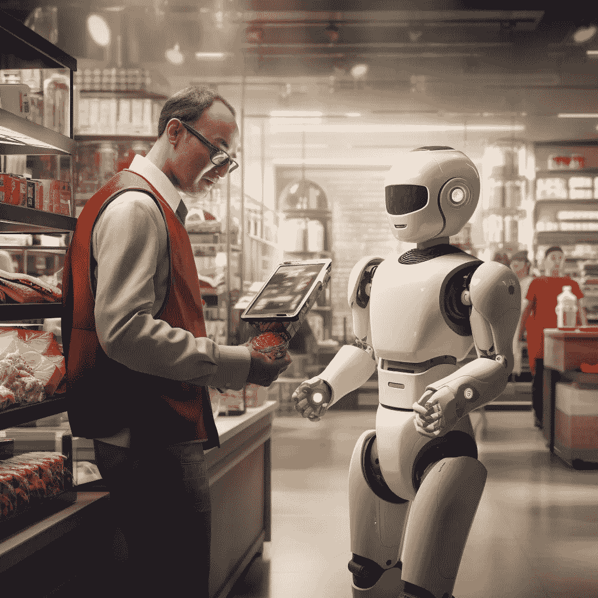

# 使用人工智能进行顾客画像：通过 OpenAI 从日常清单构建购物券

> 原文：[`towardsdatascience.com/customer-profiling-with-artificial-intelligence-building-grocery-coupons-from-everyday-lists-using-7fd9267c4791?source=collection_archive---------7-----------------------#2024-01-21`](https://towardsdatascience.com/customer-profiling-with-artificial-intelligence-building-grocery-coupons-from-everyday-lists-using-7fd9267c4791?source=collection_archive---------7-----------------------#2024-01-21)

## 这就是我如何在 Python 中使用 OpenAI API，通过几行代码创建优惠券。

 [Piero Paialunga](https://piero-paialunga.medium.com/?source=post_page---byline--7fd9267c4791--------------------------------)

·发表于[Towards Data Science](https://towardsdatascience.com/?source=post_page---byline--7fd9267c4791--------------------------------) ·阅读时间：9 分钟·2024 年 1 月 21 日

--

图像由作者使用[Midjourney](https://www.midjourney.com/home?callbackUrl=%2Fexplore)制作

我来自意大利，最近刚成为美国的永久居民。我住在俄亥俄州，并且从一家知名的大型超市购买食品。

引起我注意的一件事是，收银员要求顾客注册他们的**购物卡**，并设置用户名和条形码。

这张购物卡是奖励那些在购买日常生活用品时，能比没有卡的人节省更多钱的顾客。

这也非常好，因为它可以节省在购物中心旁的加油站的油费。

当然，作为一名数据科学家（而且还是个相当痴迷的科学家），我开始思考将我的所有购物清单保存在一张卡上的含义。这让我想到了这样一句话：

> “数据是新的石油”

作者：Clive Humby，意思是，对于非数据科学家来说，一个人的购物清单只是一个八卦工具，而对于数据科学家来说，它是做[**顾客画像**](https://www.surveymonkey.com/market-research/resources/what-is-customer-profiling/#:~:text=Customer%20profiling%20is%20a%20marketing,to%20reach%20your%20ideal%20customers.) **的工具，去描绘这个购物清单背后的顾客。**
