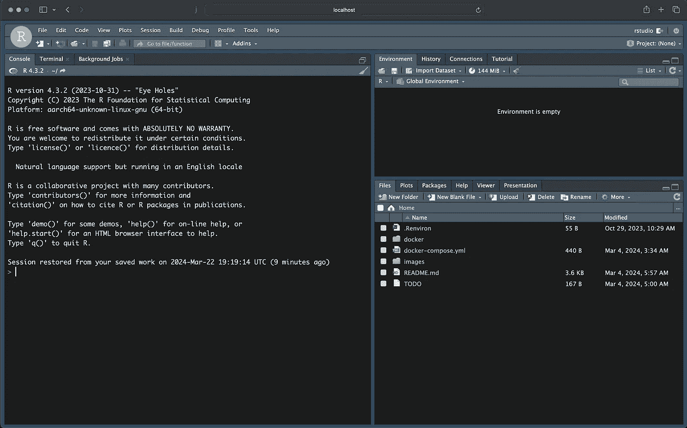

# 使用 Docker Compose 定制 RStudio 容器

> 原文：[`towardsdatascience.com/customizing-rstudio-container-with-docker-compose-60cdfe0e8894?source=collection_archive---------1-----------------------#2024-03-23`](https://towardsdatascience.com/customizing-rstudio-container-with-docker-compose-60cdfe0e8894?source=collection_archive---------1-----------------------#2024-03-23)

## 一步步指南，帮助你定制和启动在容器内运行的 RStudio Server，使用 Docker Compose

[](https://medium.com/@rami.krispin?source=post_page---byline--60cdfe0e8894--------------------------------)[](https://towardsdatascience.com/?source=post_page---byline--60cdfe0e8894--------------------------------) [Rami Krispin](https://medium.com/@rami.krispin?source=post_page---byline--60cdfe0e8894--------------------------------)

·发布在 [Towards Data Science](https://towardsdatascience.com/?source=post_page---byline--60cdfe0e8894--------------------------------) ·6 分钟阅读·2024 年 3 月 23 日

--

在这篇文章中，我们将回顾如何设置一个 [Docker-Compose](https://docs.docker.com/compose/) 工作流，在容器内启动 RStudio Server。我们将介绍 Docker Compose 设置过程，并讨论何时应考虑使用它。最后，我们将演示如何将 [上一篇文章](https://medium.com/towards-data-science/running-rstudio-inside-a-container-e9db5e809ff8) 中介绍的 `docker run` 工作流转换为 Docker Compose 流程，并使用 Docker Compose 启动 [Rocker RStudio 镜像](https://hub.docker.com/r/rocker/rstudio)。

相关文章：

[](/running-rstudio-inside-a-container-e9db5e809ff8?source=post_page-----60cdfe0e8894--------------------------------) ## 在容器内运行 RStudio

### 一步步指南，帮助你在容器内设置 RStudio 服务器，并使用本地 RStudio 设置

towardsdatascience.com

完成本教程后，你将能够将 `docker run` 设置转换为 `docker-compose.yml` 文件，并通过 `docker-compose` 命令无缝启动 RStudio 容器。


使用 Docker Compose 在容器内启动 RStudio Server（截图由作者提供）

## 动机

在开始之前，让我们先解释一下 Docker Compose 是什么以及何时应考虑使用它。

从 **什么** 开始 — Docker Compose 是一个简化的框架，用于启动单个或多个容器。它是 `docker run` 命令的封装器，并通过 YAML 文件管理容器启动设置。建议在以下情况下使用 Docker Compose 工作流，而不是直接使用 `docker run` 命令 **当**：

+   `docker run` 命令的参数数量增加，且通过 CLI 管理变得更加复杂。

+   你定期使用并与容器进行工作

+   复杂度较高（例如，启动多个容器并行等）

我们使用 `docker-compose.yml` 文件来设置 Docker Compose 框架，并通过 `docker-compose` 命令启动它。这个过程包括将 `docker run` 参数映射为 YAML 格式。简单的 `docker-compose.yml` 文件设置将包括以下两个参数：

+   **版本** — 当前的 Docker Compose 版本为 3.9

+   **服务** — 启动容器的列表及其相应的参数

让我们通过以下示例来说明将 `docker run` 命令参数映射到 `docker-compose.yml` 文件的过程：

```py
docker run -argument_a argument_a_values \
-argument_b argument_b_values \
-argument_c argument_c_values \
IMAGE_NAME/IMAGE_TAG
```

该命令有以下三个参数 — `argument_a`、`argument_b`、`argument_c`，它们对应的值为 `argument_a_values`、`argument_b_values`、`argument_c_values`，并调用以下镜像 — `IMAGE_NAME/IMAGE_TAG`。

以下 `docker-compose.yml` 文件表示上述 `docker run` 参数的映射：

```py
version: "3.9"
services:
  my_service:
    image: "IMAGE_NAME/IMAGE_TAG"
    argument_a:
      - "argument_a_values"
    argument_b:
      - "argument_b_values"
    argument_c:
      - "argument_c_values"
```

如上所述，`version` 和 `services` 参数分别定义了 Docker Compose 的版本以及运行时要启动的镜像列表。在此案例中，我们使用最新版本 3.9，并在 `services` 参数下定义了一个名为 `my_service` 的容器。在 `my_service` 部分下，我们按照标准的 YAML 格式定义了与上述 `docker run` 命令参数对应的运行时参数。

需要注意的是，`docker run` 命令参数与其在 `docker-compose.yml` 文件中的设置之间的命名约定映射并非总是逐一对应的。Docker Compose 文档是识别参数设置的极好资源。

在接下来的部分，我们将连接各个部分，并将我们在上一教程中设置的 `docker run` 命令映射到 `docker-compose.yml` 文件。

## 使用 Docker Compose 设置 RStudio

回顾在 上一教程 中，我们使用以下 `docker run` 命令在容器内启动了 RStudio 服务器：

```py
docker run --rm -ti \
-v .:/home/rstudio \
-v $HOME/.config/rstudio:/home/rstudio/.config/rstudio \
-v $HOME/.Renviron:/home/rstudio/.Renviron \
-e PASSWORD=yourpassword \
-p 8787:8787 rocker/rstudio
```

简而言之，上述运行命令使用了以下参数：

+   卷或 `v` 用于将本地文件夹与容器文件系统挂载

+   环境变量或 `e` 用于将 RStudio 服务器密码设置为环境变量

+   端口或 `p` 用于映射本地端口与容器端口之间的关系

以下 YAML 文件表示上述 `docker run` 命令的映射：

```py
version: "3.9"
services:
  rstudio:
    image: "rocker/rstudio"
    ports:
      - "8787:8787"
    volumes:
      - type: "bind"
        source: "."
        target: "/home/rstudio"
      - type: "bind"
        source: "$HOME/.config/rstudio"
        target: "/home/rstudio/.config/rstudio"
      - type: "bind"
        source: "$HOME/.Renviron"
        target: "/home/rstudio/.Renviron"
    environment:
      - PASSWORD=yourpassword
```

我们在 `services` 参数下设置了一个名为 `rstudio` 的单一服务，并定义了相应的运行参数：

+   `image` — 定义镜像名称，在这种情况下，使用 RStudio Rocker 镜像 `rocker/rstudio`

+   `ports` — 设置本地机器与容器之间的端口映射。

+   `volumes` — 映射文件夹挂载，使用 `type` 参数定义挂载类型，使用 `source` 和 `target` 参数定义本地和容器文件夹路径映射。更多关于卷参数的细节可以在 [这里](https://docs.docker.com/storage/) 找到。

+   `environment` — 定义环境变量，在这种情况下，我们设置 `PASSWORD` 变量来定义 RStudio 服务器的密码。

一旦 YAML 文件设置完成，我们可以在 CLI 上使用 `docker-compose` 命令来启动 RStudio 容器：

```py
docker-compose up
```

`up` 参数用于启动容器。你应该期待以下输出：

```py
[+] Running 2/2
 ✔ Network rstudio-docker_default      Created                                                                                                                                                                   0.1s
 ✔ Container rstudio-docker-rstudio-1  Created                                                                                                                                                                   0.1s
Attaching to rstudio-docker-rstudio-1
rstudio-docker-rstudio-1  | [s6-init] making user provided files available at /var/run/s6/etc...
rstudio-docker-rstudio-1  | exited 0.
rstudio-docker-rstudio-1  | [s6-init] ensuring user provided files have correct perms...
rstudio-docker-rstudio-1  | exited 0.
rstudio-docker-rstudio-1  | [fix-attrs.d] applying ownership & permissions fixes...
rstudio-docker-rstudio-1  | [fix-attrs.d] done.
rstudio-docker-rstudio-1  | [cont-init.d] executing container initialization scripts...
rstudio-docker-rstudio-1  | [cont-init.d] 01_set_env: executing...
rstudio-docker-rstudio-1  | skipping /var/run/s6/container_environment/HOME
rstudio-docker-rstudio-1  | skipping /var/run/s6/container_environment/PASSWORD
rstudio-docker-rstudio-1  | skipping /var/run/s6/container_environment/RSTUDIO_VERSION
rstudio-docker-rstudio-1  | [cont-init.d] 01_set_env: exited 0.
rstudio-docker-rstudio-1  | [cont-init.d] 02_userconf: executing...
rstudio-docker-rstudio-1  | [cont-init.d] 02_userconf: exited 0.
rstudio-docker-rstudio-1  | [cont-init.d] done.
rstudio-docker-rstudio-1  | [services.d] starting services
rstudio-docker-rstudio-1  | [services.d] done.
```

启动容器后，你可以通过浏览器使用本地主机地址和端口号访问 RStudio 服务器，在这种情况下是 — [`localhost:8787`](http://localhost:8787)：



容器内的 RStudio 服务器（截图由作者提供）

**注意：** 使用 `docker-compose up` 命令启动容器后，CLI 会保持附加到终端，直到停止它。或者，你可以添加 `d` 参数以脱离模式运行：

```py
docker-compose up -d
```

同样，`docker-compose down` 命令停止容器的运行时间。

## 总结

在本教程中，我们回顾了如何设置 Docker Compose 框架来启动 RStudio 容器。这包括设置 `docker-compose.yml` 文件并使用 `docker-compose` 命令简洁地启动容器。

使用 Docker Compose 封装 `docker run` 命令的动机是：

+   高效简洁 — 只需一次设置，之后使用 `docker-compose` 命令启动简单（相比长的 `docker run` 命令）。

+   更高复杂度 — 它简化了单个或多个容器无缝启动的过程。例如，一个好的使用案例是同时运行 RStudio 和 Postgres 数据库。在这种情况下，你可以设置 Docker Compose 进程来启动这两个容器，使它们并行工作。

## 资源

+   在容器内运行 RStudio — `towardsdatascience.com/running-rstudio-inside-a-container-e9db5e809ff8`

+   Docker Compose — [`docs.docker.com/compose/`](https://docs.docker.com/compose/)

+   Rocker 项目 — [`rocker-project.org/`](https://rocker-project.org/)

+   Docker Hub — [`hub.docker.com/`](https://hub.docker.com/)

+   RStudio Docker Compose 模板 — [`github.com/RamiKrispin/rstudio-docker-template`](https://github.com/RamiKrispin/rstudio-docker-template)
