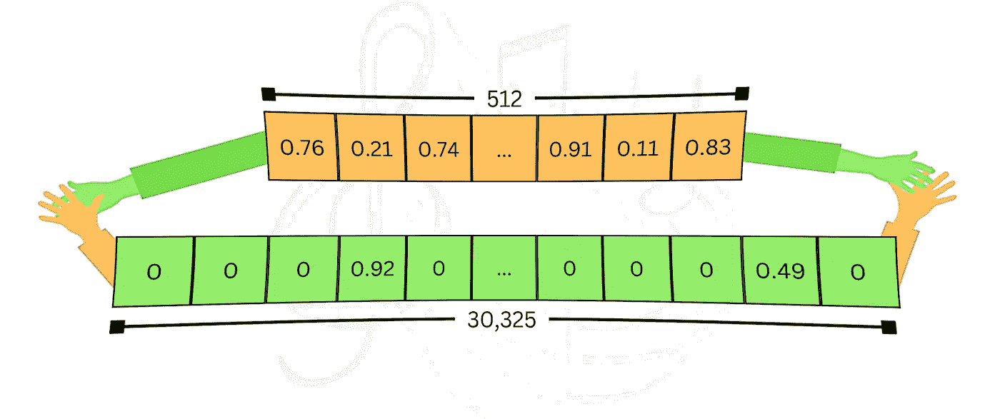

# 稠密和稀疏嵌入之间的舞蹈：启用 LangChain-Milvus 中的混合搜索

> 原文：[`towardsdatascience.com/dance-between-dense-and-sparse-embeddings-enabling-hybrid-search-in-langchain-milvus-7c8de54dda24?source=collection_archive---------8-----------------------#2024-11-19`](https://towardsdatascience.com/dance-between-dense-and-sparse-embeddings-enabling-hybrid-search-in-langchain-milvus-7c8de54dda24?source=collection_archive---------8-----------------------#2024-11-19)

## 如何在 langchain-milvus 中创建和搜索多向量存储

[](https://ohadeytan.medium.com/?source=post_page---byline--7c8de54dda24--------------------------------)[](https://towardsdatascience.com/?source=post_page---byline--7c8de54dda24--------------------------------) [Ohad Eytan](https://ohadeytan.medium.com/?source=post_page---byline--7c8de54dda24--------------------------------)

·发表于 [Towards Data Science](https://towardsdatascience.com/?source=post_page---byline--7c8de54dda24--------------------------------) ·6 分钟阅读·2024 年 11 月 19 日

--

*这篇博客由* [***Omri Levy***](https://www.linkedin.com/in/levyomri/)*和* ***Ohad Eytan*** 共同撰写，作为我们在* [*IBM Research Israel*](https://research.ibm.com/labs/israel) *所做工作的一个部分。*

# 简介

最近，我们——IBM 研究院——需要在[*Milvus*](https://milvus.io/)向量存储中使用混合搜索。由于我们已经在使用[*LangChain*](https://www.langchain.com/)框架，因此我们决定动手贡献所需的功能，以便在[*langchain-milvus*](https://github.com/langchain-ai/langchain-milvus)中启用它。我们添加了对**稀疏嵌入**的支持（[PR](https://github.com/langchain-ai/langchain/pull/25284)）和通过*langchain*接口进行**多向量搜索**（[PR](https://github.com/langchain-ai/langchain-milvus/pull/11)）。

在这篇博客中，我们将简要介绍稠密嵌入和稀疏嵌入之间的区别，以及如何利用混合搜索来同时使用这两者。我们还将提供一段代码演示，展示如何在*langchain-milvus*中使用这些新功能。

要使用这篇博客中的代码，你需要安装一些包：

```py
pip install langchain_milvus==0.1.6
pip install langchain-huggingface==0.1.0
pip install "pymilvus[model]==2.4.8"
```

并导入以下内容：

```py
from langchain_huggingface import HuggingFaceEmbeddings
from langchain_milvus.utils.sparse import BM25SparseEmbedding
from langchain_milvus.vectorstores import Milvus
```

你还可以在[这个 Gist](https://gist.github.com/omriel1/3b8ea57cc14b896237c47d5417eaec8f)中查看并克隆完整代码。

让我们开始吧。

# 稠密嵌入

使用向量存储的最常见方式是稠密嵌入。在这里，我们使用一个预训练模型将数据（通常是文本，但也可以是其他媒体如图片等）嵌入到高维向量中，并将其存储在向量数据库中。这些向量有几百个（甚至几千个）维度，每个条目是一个浮动点数。通常，向量中的所有条目都被非零值占据，因此称为“稠密”。给定查询，我们使用相同的模型将其嵌入，向量存储根据向量相似性检索相关的相似数据。使用*langchain-milvus*，只需要几行代码。让我们看看是如何完成的。

首先，我们使用[来自 HuggingFace 的模型](https://huggingface.co/sentence-transformers/all-MiniLM-L6-v2)来定义向量存储：

```py
dense_embedding = HuggingFaceEmbeddings(model_name=
    "sentence-transformers/all-MiniLM-L6-v2")
vector_store = Milvus(
    embedding_function=dense_embedding,
    connection_args={"uri": "./milvus_dense.db"}, # Using milvus-lite for simplicity
    auto_id=True,
)
```

第二步，我们将数据插入到向量存储中：

```py
document = [
    "Today was very warm during the day but cold at night",
    "In Israel, Hot is a TV provider that broadcasts 7 days a week",
]
vector_store.add_texts(documents)
```

在后台，每个文档都通过我们提供的模型嵌入到一个向量中，并与原始文本一起存储。

最后，我们可以搜索查询并打印出得到的结果：

```py
query = "What is the weather? is it hot?"
dense_output = vector_store.similarity_search(query=query, k=1)
print(f"Dense embeddings results:\n{dense_output[0].page_content}\n")

# output: Dense embeddings results: 
#         Today was very warm during the day but cold at night
```

在这里，查询被嵌入，向量存储进行（通常是近似的）相似性搜索，并返回它找到的最接近的内容。

稠密嵌入模型经过训练，能够捕捉数据的**语义意义**并将其表示在多维空间中。这个优点非常明显——它使得语义搜索成为可能，这意味着结果是基于查询的含义进行的。但有时这还不够。如果你寻找特定的关键词，甚至是没有更广泛意义的词（如名称），语义搜索可能会误导你，这种方法将会失败。

# 稀疏嵌入

在大规模语言模型（LLM）流行之前，且学习模型尚未广泛应用时，搜索引擎使用了传统方法，如[TF-IDF](https://en.wikipedia.org/wiki/Tf%E2%80%93idf)或其现代增强版[BM25](https://en.wikipedia.org/wiki/Okapi_BM25)（它在[Elastic](https://www.elastic.co/blog/practical-bm25-part-1-how-shards-affect-relevance-scoring-in-elasticsearch)中的应用而闻名），来搜索相关数据。使用这些方法时，维度的数量是词汇表的大小（通常是数万个，远大于稠密向量空间），每个条目代表关键词与文档的相关性，同时考虑到该术语的频率及其在文档语料库中的稀有性。对于每个数据点，大多数条目都是零（对于不出现的词），因此被称为“稀疏”。尽管在底层实现有所不同，但通过*langchain-milvus*接口，它变得非常相似。让我们看看它是如何运作的：

```py
sparse_embedding = BM25SparseEmbedding(corpus=documents)
vector_store = Milvus(
    embedding_function=sparse_embedding,
    connection_args={"uri": "./milvus_sparse.db"},
    auto_id=True,
)
vector_store.add_texts(documents)

query = "Does Hot cover weather changes during weekends?"
sparse_output = vector_store.similarity_search(query=query, k=1)
print(f"Sparse embeddings results:\n{sparse_output[0].page_content}\n")

# output: Sparse embeddings results:
#         In Israel, Hot is a TV provider that broadcast 7 days a week
```

BM25 在精确的关键词匹配中非常有效，对于缺乏明确语义意义的术语或名称非常有用。然而，它无法捕捉查询的意图，并且在许多需要语义理解的情况下会产生不好的结果。

> 注意：“稀疏嵌入”一词还指代像 SPLADE 或 Elastic Elser 这样的先进方法。这些方法也可以与 Milvus 一起使用，并且可以集成到混合搜索中！



图片来源：作者

# 混合搜索

如果你交换上面两个示例中的查询，并用对方的嵌入进行搜索，两者都会产生错误的结果。这证明了每种方法都有其优点，但也有其缺点。混合搜索将两者结合，旨在发挥两者的最佳优势。通过使用稠密和稀疏嵌入索引数据，我们可以执行既考虑语义相关性又考虑关键词匹配的搜索，并根据自定义权重平衡结果。同样，内部实现更为复杂，但*langchain-milvus*使得使用起来相当简单。让我们看看它是如何工作的：

```py
vector_store = Milvus(
    embedding_function=[
        sparse_embedding,
        dense_embedding,
    ],
    connection_args={"uri": "./milvus_hybrid.db"}, 
    auto_id=True,
)
vector_store.add_texts(documents)
```

在这个设置中，应用了稀疏和稠密嵌入。让我们用相等的权重来测试混合搜索：

```py
query = "Does Hot cover weather changes during weekends?"
hybrid_output = vector_store.similarity_search(
    query=query,
    k=1,
    ranker_type="weighted",
    ranker_params={"weights": [0.49, 0.51]},  # Combine both results!
)
print(f"Hybrid search results:\n{hybrid_output[0].page_content}")

# output: Hybrid search results:
#         In Israel, Hot is a TV provider that broadcast 7 days a week
```

这会使用每个嵌入函数搜索相似的结果，给每个得分加上权重，并返回得分最高的结果。我们可以看到，稍微增加对稠密嵌入的权重后，我们得到了期望的结果。第二个查询也是如此。

如果我们给稠密嵌入更多的权重，我们将再次得到无关的结果，就像只有稠密嵌入时那样：

```py
query = "When and where is Hot active?"
hybrid_output = vector_store.similarity_search(
    query=query,
    k=1,
    ranker_type="weighted",
    ranker_params={"weights": [0.2, 0.8]},  # Note -> the weights changed
)
print(f"Hybrid search results:\n{hybrid_output[0].page_content}")

# output: Hybrid search results:
#         Today was very warm during the day but cold at night
```

在稠密和稀疏之间找到正确的平衡并非一项简单的任务，可以看作是更广泛的超参数优化问题的一部分。当前在这一领域有正在进行的研究和工具，试图解决这类问题，例如[IBM 的 AutoAI for RAG](https://dataplatform.cloud.ibm.com/docs/content/wsj/analyze-data/autoai-programming-rag.html?context=wx&audience=wdp#autorag-implement)。

你可以通过多种方式适应并使用混合搜索方法。例如，如果每个文档都有一个相关的标题，你可以使用两个稠密嵌入函数（可能使用不同的模型）——一个用于标题，另一个用于文档内容——并在两个索引上执行混合搜索。Milvus 目前支持最多 10 个不同的向量字段，为复杂的应用提供了灵活性。还提供了用于索引和重新排序方法的额外配置。你可以查看[Milvus 文档](https://milvus.io/docs/multi-vector-search.md)，了解可用的参数和选项。

# 结束语

现在通过 LangChain 可以轻松访问 Milvus 的多向量搜索功能，你可以轻松地将混合搜索集成到你的应用程序中。这为你在应用中应用不同的搜索策略打开了新的可能性，使得根据具体用例定制搜索逻辑变得更加容易。对我们来说，这是一个为开源项目做贡献的好机会。我们日常使用的许多库和工具都是开源的，能够回馈社区感到非常高兴。希望它能对其他人有所帮助。

最后，特别感谢[Erick Friis](https://github.com/efriis)和[Cheng Zi](https://github.com/zc277584121)在*langchain-milvus*项目中的所有努力，特别是在这些 PR 中。如果没有他们的付出，这项工作是无法完成的。
