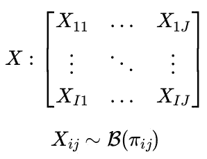
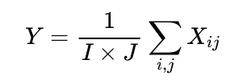
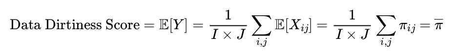
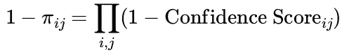
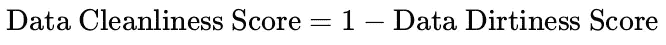

# 数据脏乱度评分

> 原文：[`towardsdatascience.com/data-dirtiness-score-fe2ca5678d40?source=collection_archive---------1-----------------------#2024-03-02`](https://towardsdatascience.com/data-dirtiness-score-fe2ca5678d40?source=collection_archive---------1-----------------------#2024-03-02)

## 测量表格数据集质量的新方法

[](https://medium.com/@simon.grah?source=post_page---byline--fe2ca5678d40--------------------------------)[](https://towardsdatascience.com/?source=post_page---byline--fe2ca5678d40--------------------------------) [Simon Grah](https://medium.com/@simon.grah?source=post_page---byline--fe2ca5678d40--------------------------------)

·发表于[Towards Data Science](https://towardsdatascience.com/?source=post_page---byline--fe2ca5678d40--------------------------------) ·阅读时间：11 分钟·2024 年 3 月 2 日

--

> 本文是关于涉及大型语言模型（LLM）数据清洗实践系列文章的第一篇，重点讨论如何量化数据集的清洁度或脏乱度


图片来自[Fabizio Conti](https://unsplash.com/@conti_photos?utm_source=medium&utm_medium=referral) 在[Unsplash](https://unsplash.com/?utm_source=medium&utm_medium=referral)

# 从为什么开始

本文介绍了一种用于评估数据集脏乱度的概念，这个话题由于缺乏与数据清洗相关的具体评分或损失函数而面临挑战。这里的主要目标是建立一个可以有效衡量数据集清洁度的指标，将这一概念转化为具体的优化问题。

数据清洗定义为一个两阶段过程：

1.  首先，**检测数据错误**，如格式问题、重复记录和离群值；

1.  其次，**修复**这些**错误**。

每个阶段的评估通常依赖于将脏乱的数据集与清洁（真实）版本进行比较，使用分类指标如召回率、精确度和 F1 得分进行错误检测（例如，参见[大型基础模型能处理你的数据吗？](https://arxiv.org/abs/2205.09911)，[检测数据错误：我们在哪儿，需要做什么？](https://cs.uwaterloo.ca/~ilyas/papers/AbedjanVLDB2016.pdf)）以及用于数据修复任务的准确率或重叠度度量（例如，参见[自动数据修复：我们准备好部署了吗？](https://www.semanticscholar.org/reader/5191f08424a3ec0cdaf2b3285860216caca57463)或[HoloClean：通过概率推理进行整体数据修复](https://arxiv.org/abs/1702.00820)）。

然而，这些指标是任务特定的，并未提供一个统一的衡量标准来评估包含各种错误类型的数据集的整体清洁度。

本讨论聚焦于**结构化且整洁的表格数据集**（见[《整洁数据 | 统计软件期刊》](https://www.jstatsoft.org/article/view/v059i10)），**将数据清洗与更广泛的数据质量问题区分开来**，后者包括数据治理、数据溯源、目录管理、数据漂移等。

# 评分蓝图

以下所有假设都是*数据脏污评分*所依赖的基础。这些假设大多来自文章《如何量化数据质量？》。当然，所有这些假设都可以被辩论和批评，但明确陈述这些假设对促进讨论至关重要。

**数据错误与违反约束有关**，这些约束来源于对数据的**期望**。例如，如果期望 ID 列不应有缺失值，那么 ID 列中存在缺失值就构成了约束违反。

无期望则无忧。**缺乏期望意味着不会对评分产生影响**。换句话说，若没有预定义的期望，就无法识别数据问题，因此也无法违反不存在的约束。

**数据问题应能定位到具体单元格**。评分依赖于能够将错误精确定位到数据集中特定单元格的能力。

**数据错误的置信度分数**。并非所有数据错误都能以相同的确定性被识别。每个检测到的问题应标记一个置信度级别，表示该问题确实是一个错误的可能性有多大。这种方法承认一些错误可能存在解释空间。我们建议将置信度级别分为四个顺序类别：`低`、`中`、`高`和`确定`。这些类别分别对应 0.25、0.5、0.75 和 1 的概率值。

**单元格对整体评分的均匀影响**。数据集中的每个单元格对脏数据评分都有相同的潜在影响。解决与某个单元格相关的问题可能会解决其他单元格的问题，这表明在评分计算中单元格的权重是均匀分布的。

# 一个简化示例以便说明

在检查数据集时，凭一眼就能发现潜在的数据质量问题并不罕见。请考虑以下用于分析的简单数据集：

```py
Student#,Last Name,First Name,Favorite Color,Age
1,Johnson,Mia,periwinkle,12
2,Lopez,Liam,blue,green,13
3,Lee,Isabella,,11
4,Fisher,Mason,gray,-1
5,Gupta,Olivia,9,102
6,,Robinson,,Sophia,,blue,,12
```

该示例来自书籍[《有效数据科学的数据清洗》](https://github.com/PacktPublishing/Cleaning-Data-for-Effective-Data-Science)，它展示了一个代表六年级班级的数据集中存在的数据质量问题。该数据集包含每个学生的多个变量，组织方式是每个学生有 6 个学生和 5 个变量。

在检查时，某些条目可能因明显的不一致性或错误而引起关注：

+   学号为`Student#` 2（Liam Lopez）的学生条目似乎在`Favorite Color`列中有一个额外的值，看起来像是两个值（'blue,green'）合并在了一起。通常情况下，这一列应只包含一个值。鉴于不确定性，该问题被标记为`high`置信度级别，需进一步检查。

+   下一位学生，Isabella Lee，缺少`Favorite Color`值。鉴于该列不应有任何缺失项，因此该问题已被以`certain`置信度识别为需要修正。

+   学号为 4 的学生 Mason Fisher 的记录列出了`-1`的年龄，这是一个不可信的值。这可能代表一个表示缺失数据的哨兵值，因为使用这种占位符是常见做法。然而，年龄应该是正整数，因此需要审查这一条目。

+   学号为 5 的学生 Olivia Gupta 所在的行虽然没有结构性错误，但却呈现出一个不寻常的情况，因为有多个解释是合理的。`Favorite Color`和`First Name`字段可能被交换，因为`Olivia`既可以是名字，也可以是颜色。此外，数字`9`可能表示颜色代码，但这一假设缺乏支持证据。而且，一名六年级学生的年龄为`102`是不太可能的，这表明可能存在拼写错误（例如将`102`写成了`12`）。

+   最后一行包含多余的逗号，表示可能存在数据摄取问题。然而，除了这个格式问题之外，条目本身似乎有效，因此在识别该错误的性质时，给出了`high`的置信度级别。

根据我们的指导方针计算数据脏度分数，我们可以通过引入一个 Python 中的`DataIssue`类来采用系统化的方法，该类旨在封装数据问题的各个方面：

```py
@dataclass
class DataIssue:
    type_of_issue: str
    expectation: str
    constraint_violated: str
    confidence_score: float
    location: np.ndarray
```

为了定位特定错误，使用一个大小为`(6, 5)`的`numpy`数组，其中每个元素对应数据集中的一个单元格。该数组由 0 和 1 组成，1 表示数据集中相应单元格可能存在问题。

所有已识别的数据问题将在此之后实例化：

```py
# Issue with Student# 2 - Extra value in 'Favorite Color'
issue_1 = DataIssue(
    type_of_issue="Extra Value",
    expectation="Single value in 'Favorite Color'",
    constraint_violated="It looks like two values ('blue,green') have been merged",
    confidence_score=0.75, # `high`
    location=np.array([
		[0, 0, 0, 0, 0],
		[0, 0, 0, 1, 0],
		[0, 0, 0, 0, 0],
		[0, 0, 0, 0, 0],
		[0, 0, 0, 0, 0],
		[0, 0, 0, 0, 0]
		], 
	)
)

# Issue with Student# 3 - Missing 'Favorite Color'
issue_2 = DataIssue(
    type_of_issue="Missing Value",
    expectation="No missing values in 'Favorite Color'",
    constraint_violated="Non-null constraint",
    confidence_score=1.0, # `certain`
    location=np.array([
		[0, 0, 0, 0, 0],
		[0, 0, 0, 0, 0], 
		[0, 0, 0, 1, 0], 
		[0, 0, 0, 0, 0], 
		[0, 0, 0, 0, 0], 
		[0, 0, 0, 0, 0]
		], 
	)
)

# Issue with Student# 4 - Implausible Age
issue_3 = DataIssue(
    type_of_issue="Implausible Value",
    expectation="Positive integer for 'Age'",
    constraint_violated="Positive integer constraint",
    confidence_score=1.0, # `certain`
    location=np.array([
		[0, 0, 0, 0, 0],
		[0, 0, 0, 0, 0], 
		[0, 0, 0, 0, 0], 
		[0, 0, 0, 0, 1], 
		[0, 0, 0, 0, 0], 
		[0, 0, 0, 0, 0]
		], 
	)
)

# Issues with Student# 5 - Multiple potential issues
issue_4 = DataIssue(
    type_of_issue="Structural/Typographical Error",
    expectation="Consistent and plausible data entries",
    constraint_violated="The `Favorite Color` and `First Name` fields might be swapped, considering `Olivia` can be both a name and a colour",
    confidence_score=0.25, # `low`
    location=np.array([
		[0, 0, 0, 0, 0],
		[0, 0, 0, 0, 0], 
		[0, 0, 0, 0, 0], 
		[0, 0, 0, 0, 0], 
		[0, 0, 1, 1, 0], 
		[0, 0, 0, 0, 0]
		], 
	)
)

issue_5 = DataIssue(
    type_of_issue="Typecasting error",
    expectation="`Favorite Color` must only contain values from known color strings",
    constraint_violated="`9` is not a valid colour name",
    confidence_score=0.75, # `high`
    location=np.array([
		[0, 0, 0, 0, 0],
		[0, 0, 0, 0, 0], 
		[0, 0, 0, 0, 0], 
		[0, 0, 0, 0, 0], 
		[0, 0, 0, 1, 0], 
		[0, 0, 0, 0, 0]
		],
	)
)

issue_6 = DataIssue(
    type_of_issue="Anomaly",
    expectation="Realistic age values for 6th-grade students",
    constraint_violated="An age of `102` is highly improbable",
    confidence_score=0.75, # `high`
    location=np.array([
		[0, 0, 0, 0, 0],
		[0, 0, 0, 0, 0], 
		[0, 0, 0, 0, 0], 
		[0, 0, 0, 0, 0], 
		[0, 0, 0, 0, 1], 
		[0, 0, 0, 0, 0]
		], 
	)
)

# Issue with last row - Superfluous commas
issue_7 = DataIssue(
    type_of_issue="Formatting Error",
    expectation="Correct delimiter usage",
    constraint_violated="Duplicate commas as separators",
    confidence_score=1.0, # `certain`
    location=np.array([
		[0, 0, 0, 0, 0],
		[0, 0, 0, 0, 0], 
		[0, 0, 0, 0, 0], 
		[0, 0, 0, 0, 0], 
		[0, 0, 0, 0, 0], 
		[1, 1, 1, 1, 1]
		], 
	)
)
```

将多个数据错误归类为特定的`DataIssue`实例可能带有一定的主观性，类似于软件开发中的错误报告过程。字段—`type_of_issue`、`expectation`和`constraint_violated`—有助于阐明错误的性质，便于在调查或审查时理解。

计算数据脏度分数时，关键元素是错误的位置和相关的置信度分数。在这个示例中，置信度分数是基于对错误存在性的感知确定的。

> *指向相同单元格的重复问题显著增加了问题存在的可能性。*

现在我们已经拥有所需的所有信息，让我们看看如何计算这个小数据集的脏度分数。

# 计算数据脏度分数

> *数据脏污得分* *代表了* ***数据集中包含错误的单元格的预期比例***。*

该得分的理论和计算详见附录中的`得分理论`部分。

通过使用针对各个问题的置信得分作为每个单元格中错误独立概率的估计值，我们可以应用基本的概率原理来计算每个单元格出现问题的可能性，从而得出*数据脏污得分*。

以下是一个 Python 函数，用于根据已识别的数据问题列表计算该指标：

```py
def compute_data_dirtiness_score(data_issues: List[DataIssue]) -> float:
    """
    Computes the Data Dirtiness Score based on a list of data issues.
    Each issue's impact on data quality is represented by a confidence score 
    and its location within the dataset.
    The function aggregates these impacts to estimate the overall 'dirtiness' 
    of the dataset, with higher scores indicating lower quality.

    Parameters:
        data_issues: A list of DataIssue instances, 
        each detailing a specific data quality issue.

    Returns:
        The overall Data Dirtiness Score for the dataset, as a float.
    """

    # Stack the probability arrays of a cell being error-free per issue
    stacked_error_free_probs = np.stack(
        [(1 - issue.confidence_score*issue.location) for issue in data_issues],
        axis=-1,
    )

    # Calculate the combined matrix probabilities of an issue for each cell
    probs_issue = 1 - np.prod(stacked_error_free_probs, axis=-1)

    # Find the average probability across all cells to get the dirtiness score
    data_dirtiness_score = np.mean(probs_issue)

    return data_dirtiness_score
```

让我们计算之前展示的数据集的得分：

```py
compute_data_dirtiness_score(data_issues)
```

> *数据脏污得分：31.87%*

为了改善（降低）这一得分，一个自然的步骤是解决最简单的错误，例如纠正最后一行中作为分隔符的重复逗号。

这是数据集的新版本：

```py
Student#,Last Name,First Name,Favorite Color,Age
1,Johnson,Mia,periwinkle,12
2,Lopez,Liam,blue,green,13
3,Lee,Isabella,,11
4,Fisher,Mason,gray,-1
5,Gupta,Olivia,9,102
6,Robinson,Sophia,blue,12
```

让我们再次重新计算得分，以查看改善效果。

```py
compute_data_dirtiness_score(data_issues)
```

> *数据脏污得分：15.21%*

在纠正后重新评估得分，显示出显著的改善，由于错误影响了一个相对较小的数据集中的整个行，得分减少了一半。

总结来说，这一度量为监控和改进数据集的清洁度提供了一种定量方法，通过迭代纠正已识别的数据错误。

# 后续步骤与挑战

为数据创建预期或约束条件可能具有挑战性并且成本较高，因为它需要人工标注和领域知识。一个解决方案是自动化生成约束条件和数据错误检测，之后由人工审查并调整这些自动化的约束条件，可以通过删除问题或修改置信得分来完成。为此，LLMs（大语言模型）是非常好的候选者（参见 [Jellyfish: A Large Language Model for Data Preprocessing](https://www.semanticscholar.org/reader/7e17ef56273063dfa838de30b7cc0546b2e5ee10)、[Can language models automate data wrangling?](http://josephorallo.webs.upv.es/escrits/MLJ-DataWranglingAutomation.pdf) 或 [Large Language Models as Data Preprocessors](https://arxiv.org/abs/2308.16361)）。

某些约束条件和违规情况的可能性并不总是非常明确，这就需要一个置信得分来考虑这种不确定性。即便是专家，对于特定的数据问题也可能并不总是达成一致，因此，当自动化技术被用于检测这些问题时，估算的可能性就显得特别有用。

那么对于缺失的期望或漏掉的数据错误怎么办？错误检测的有效性直接影响清洁度得分，可能导致得分过于乐观。然而，也有一个反论点需要考虑：那些更难检测到、因此更隐蔽的错误，可能对数据可用性或下游应用的影响并不那么重要。这表明，当这些错误被识别为问题时，应该赋予较低的置信度得分，反映其较低的重要性。尽管这种方法并非没有缺陷，但它有助于通过相应地加权这些被忽视的错误的重要性，从而限制它们对总体脏污得分的影响。

另一个需要考虑的方面是得分的动态特性。解决一个问题可能会影响其他问题，这引发了如何高效更新得分而不产生太多麻烦的问题。

还有一个问题是，在计算清洁度得分时，是否应将索引和列名作为数据集单元的一部分，因为它们的准确性也会影响数据清理过程（例如，参见 [使用 ChatGPT 进行列类型标注](https://arxiv.org/abs/2306.00745)）。

本系列的未来文章将探讨与此相关的各种主题，包括数据错误的分类法、利用 LLM 进行自动化问题检测，以及数据修正和修复的策略。敬请关注！

-> 第二篇文章链接：LLMs 驱动的数据质量错误检测。

# 参考文献

+   [基础模型能处理你的数据吗？](https://arxiv.org/abs/2205.09911)

+   [检测数据错误：我们处于什么阶段，接下来需要做什么？](https://cs.uwaterloo.ca/~ilyas/papers/AbedjanVLDB2016.pdf)

+   [自动化数据修复：我们准备好部署了吗？](https://www.semanticscholar.org/reader/5191f08424a3ec0cdaf2b3285860216caca57463)

+   [HoloClean：通过概率推理进行全局数据修复](https://arxiv.org/abs/1702.00820)

+   [整洁数据 | 统计软件期刊](https://www.jstatsoft.org/article/view/v059i10)

+   如何量化数据质量？

+   [有效数据科学的数据清理](https://github.com/PacktPublishing/Cleaning-Data-for-Effective-Data-Science)

+   [水母：一种用于数据预处理的大型语言模型](https://www.semanticscholar.org/reader/7e17ef56273063dfa838de30b7cc0546b2e5ee10)

+   [语言模型能否自动化数据整理？](http://josephorallo.webs.upv.es/escrits/MLJ-DataWranglingAutomation.pdf)

+   [作为数据预处理器的大型语言模型](https://arxiv.org/abs/2308.16361)

+   [使用 ChatGPT 进行列类型标注](https://arxiv.org/abs/2306.00745)

# 得分理论

让我们深入探讨如何计算数据集的*数据脏污得分*，表示为 𝒟。该数据集包含 I 行，代表个体，以及 J 列，代表不同的变量。

我们引入一个与 𝒟 维度相同的矩阵 X，具有 I 行和 J 列：



在这个矩阵中，每个元素 X_{ij} 遵循一个参数为 π_{ij} 的伯努利分布。如果数据集 𝒟 中单元格 (i, j) 没有数据问题，则 X_{ij} 的值为 0；如果有问题，则 X_{ij} 的值为 1，概率 𝔼[X_{ij}] = π_{ij} 表示问题发生的可能性。

接下来，我们定义一个随机变量 Y，表示数据集 𝒟 中存在问题的单元格的比例。Y 的公式如下：



*数据脏污度分数*是 Y 的期望值：



为了将此与我们之前的讨论联系起来，每个单元格数据错误的置信度分数与概率 π_{ij} 之间的关系由以下公式表示：



这意味着，单元格无错误的概率是通过该单元格潜在错误的置信度分数的补数相乘计算出来的。

如果所有的置信度分数都设置为 1，表示对错误的绝对确定性，则脏污度分数简化为数据集中有错误的单元格的比例。

计算数据集的脏污度分数或清洁度分数本质上给出了相同的见解，只是从不同的角度来看。*数据清洁度分数*的公式只是 1 减去 *数据脏污度分数*：



通过这种方式，完全没有错误的数据集将具有 100% 的清洁度分数和 0% 的脏污度分数。

# 变更

编辑-2024–03–21：将置信度值转换为序数类别：`低`、`中`、`高` 和 `确定`。这些分别表示概率 0.25、0.5、0.75 和 1。
