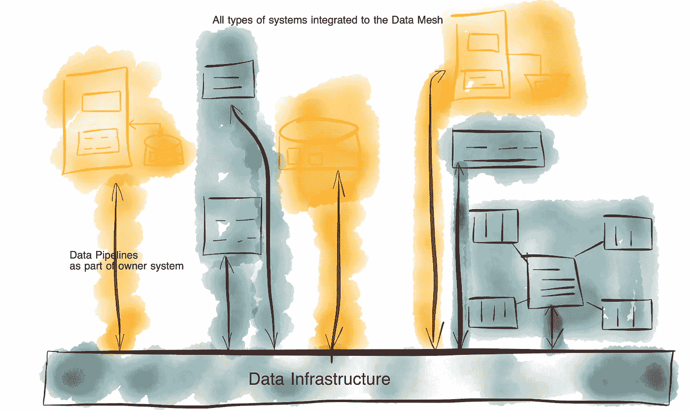

# 数据工程，重新定义

> 原文：[`towardsdatascience.com/data-engineering-redefined-643249cbbadd?source=collection_archive---------1-----------------------#2024-06-28`](https://towardsdatascience.com/data-engineering-redefined-643249cbbadd?source=collection_archive---------1-----------------------#2024-06-28)

## 今天数据工程的实践方式以及为什么我们应该重新定义它

 [Bernd Wessely](https://medium.com/@bernd.wessely?source=post_page---byline--643249cbbadd--------------------------------)

·发布于 [Towards Data Science](https://towardsdatascience.com/?source=post_page---byline--643249cbbadd--------------------------------) ·阅读时间 7 分钟·2024 年 6 月 28 日

--

# 今天数据工程的问题是什么？

如果你搜索关于数据工程到底是什么的清晰定义，你会发现有太多不同的提议，结果让你更加困惑，而非得到答案。

但为了更好地解释需要重新定义的内容，我将使用一个更流行的定义，它清楚地代表了我们目前面临的现状和混乱：

> 数据工程是开发、实施和维护系统与流程的过程，这些系统与流程接收原始数据并生成支持下游应用场景（如分析和机器学习）所需的高质量、一致性信息。数据工程是安全、数据管理、DataOps、数据架构、编排和软件工程的交集。数据工程师管理数据工程生命周期，从获取源系统的数据开始，直到为应用场景（如分析或机器学习）提供数据为止。
> 
> — Joe Reis 和 Matt Housley 在《数据工程基础》中

这是一个很好的定义，那么问题是什么呢？

让我们看一下第一句话，我将重点突出我们应该深入探讨的部分：

***…接收原始数据并生成支持下游应用场景的高质量、一致性的信息…***

因此，数据工程将原始数据***转化***为（生成）支持应用场景的信息。虽然这里只给出了分析或机器学习两个示例，但我认为这包括所有其他潜在的应用场景。

***数据转换***是让我和我所有的同事数据工程师抓狂的原因。数据转换是将*正确的逻辑*应用于原始数据的巨大任务，以将其转化为能够支持各种智能用例的信息。

应用正确的逻辑实际上是*应用程序*的主要任务。应用程序是实现推动业务（用例）逻辑的系统——我继续称其为应用程序，并隐含地也指代那些足够小以适应微服务架构的服务。应用程序通常由应用开发人员（如果你愿意，可以称之为软件工程师）构建。但为了符合我们当前对数据工程的定义，数据工程师现在必须实现业务逻辑。整个混乱开始于这一错误的做法。

我写过一篇关于这个话题的文章，我在文中强调了[“数据工程**是**软件工程…”](https://medium.com/@bernd.wessely/data-engineering-is-software-engineering-a4c5df052492)。不幸的是，我们已经有了数百万个脆弱的数据管道，这些管道是由数据工程师实现的。这些管道有时——甚至可惜的是，很多时候——没有达到你对应用程序所期望的软件质量。但更大的问题是，这些管道往往包含不协调的、因此不正确的，有时甚至是隐藏的业务逻辑。

然而，解决方案并不是让所有数据工程师都转变为应用开发人员。数据工程师仍然需要是合格的软件工程师，但他们绝不应转变为应用开发人员。相反，我主张重新定义数据工程为“*全关于数据的流动、操作和管理*”。这个定义来自《*What Is Data Engineering? by* Lewis Gavin *(O’Reilly, 2019)》。然而，这是与当前实践的明显不同，我们应该**将操作限制为纯技术性操作**。

> 我们不应再允许在应用程序之外开发和使用业务逻辑。

很明确，数据工程不应该实现业务逻辑。现代应用开发的趋势实际上是将无状态的应用逻辑与状态管理分开。我们不会将应用逻辑放入数据库，也不会将持久化状态（或数据）放入应用程序。在函数式编程社区中，他们开玩笑说：“我们相信教会与国家的分离”。如果你现在想问：“笑话在哪里？”，那么[这可能有帮助](https://en.wikipedia.org/wiki/Functional_programming)。但现在没有任何笑话：“我们应该相信业务逻辑与业务数据的分离”。因此，我认为我们应该明确将数据问题留给数据工程师，逻辑问题留给应用开发人员。

那么，仍然允许数据工程师进行的“技术操作”是什么呢？我将其定义为*任何不改变或添加新的业务信息的数据操作*。我们仍然可以进行分区、桶分、重新格式化、归一化、索引、技术聚合等操作，但一旦需要涉及实际的业务逻辑时，我们应当将其交给负责相应数据集的业务领域的应用程序开发人员。

# 为什么数据工程被偏离了

分离关注点的简单而明显的原则 —— 作者提供的图像

为什么我们偏离了这个简单而明显的原则？

我认为这种转变可以归因于数据库快速发展为多功能系统的趋势。最初，数据库只是作为企业数据的简单持久存储解决方案。它们提供了非常有用的抽象，能够将数据持久化的功能从应用程序的实际业务逻辑中卸载出来。然而，供应商迅速通过在其数据库产品中嵌入软件开发功能来吸引应用程序开发人员，从而增强了这些系统的功能。这一整合使得数据库从简单的数据存储库转变为全面的平台，结合了复杂的编程语言和工具，支持全面的软件开发。因此，数据库演变成了强大的转换引擎，使得数据专家能够在传统应用程序之外实现业务逻辑。随着大型数据仓库的出现，这一转变的需求得到了进一步加强，数据仓库旨在整合分散的数据存储——这一问题在微服务架构兴起后变得更加突出。这一技术进步使得在数据库内结合业务逻辑和业务数据变得既实际又高效。

最终，并非所有软件工程师都屈服于将应用程序逻辑捆绑在数据库中的诱惑，仍然保留了清晰分离的希望。随着数据量和复杂性的不断增长，大数据工具如 Hadoop 及其后继者应运而生，甚至在某些领域取代了传统数据库。这一转变为将业务逻辑从数据库中移出并返回给应用程序开发人员提供了机会。然而，数据工程不仅仅包括数据迁移和管理的观念已经深入人心。我们开发了许多工具来支持商业智能、先进分析和复杂的转换管道，从而能够实现复杂的业务逻辑。

这些工具已成为现代数据架构（MDS）的核心组成部分，使得数据工程成为一门独立的学科。MDS 包括一整套用于数据处理和转化的工具，但这些工具对于典型的应用开发人员或软件工程师来说仍然相对陌生。尽管有可能[“将数据库翻转过来”](https://martin.kleppmann.com/2015/03/04/turning-the-database-inside-out.html)并将业务逻辑重新迁移到应用层，但我们未能完全把握这一机会。实现业务逻辑的这一不幸做法至今依然由数据工程师承担。

# 数据工程如何被重新定义

让我们更精确地定义一下“*关于数据的流动、操作和管理*”到底包含了什么。

数据工程师可以并且应该提供最成熟的工具和平台，供应用开发人员使用，以便处理数据。这也是[“自服务数据平台”](https://martinfowler.com/articles/data-monolith-to-mesh.html#DataAndSelf-servePlatformDesignConvergence)在数据网格中的主要思想。然而，定义和维护业务逻辑的责任仍然在业务领域内。这些人对业务了解得更多，知道应如何将业务转型逻辑应用于数据。

好吧，那么像数据仓库系统这样的好主意以及更广泛的[“数据工程生命周期”](https://medium.com/towards-data-engineering/data-engineering-lifecycle-d1e7ee81632e)（由 Joe Reis 和 Matt Housley 定义）怎么办呢？

数据工程生命周期已完成 — 图片由作者根据 Joe Reis 和 Matt Housley 的观点制作

“数据管道”实际上只是应用程序之间的代理，但如果业务逻辑要在管道中实现，这些系统应被视为企业中的独立应用程序。这些应用程序应由业务领域的应用开发人员维护，而不是由数据工程师维护。

数据从源头（在他们的参考中称为“生成”）到提供给消费者的流动其实在理想化的情况下被简化了。从“反向 ETL”输出的数据再次作为下游应用程序的输入。而不仅仅是“反向 ETL”，还有“分析”和“机器学习”会创建输出，供下游的分析和操作性应用程序使用。数据在组织中的流动并不会在机器学习模型的训练或应用，或商业分析的创建时结束。这些应用的结果需要在公司内部进一步处理，因此必须集成到整体的业务流程中（通过蓝色框和箭头表示）。这种观点模糊了仍然在操作性和分析性层面之间实行的严格区分，[我已经将其消除作为数据网格的核心目标](https://medium.com/towards-data-science/challenges-and-solutions-in-data-mesh-part-1-24cd45290805)。

那么，数据工程师的真正任务是什么？我们应该发展企业架构，使得应用开发人员能够将业务逻辑重新带入他们的应用程序，同时允许这些应用程序之间无缝交换和共享数据。数据工程师实际上构建了“数据基础设施”和所有通过数据网格将业务逻辑整合到互联的业务应用程序中的工具。这比仅提供不同类型的数据库、一种数据仓库或数据湖（无论是在本地还是在云中）要复杂得多。它包括工具和基础设施的实施，治理和数据共享原则的定义和应用（包括建模），最终实现企业中的**普遍数据供应**。然而，业务逻辑的实现应该绝对不在数据工程的范围之内。

数据基础设施作为数据工程师为所有应用程序开发人员提供的服务 — 作者图片

这种重新定义的数据工程实践与我在这三部分系列文章中提出的调整后的数据网格方法相一致：

 ## 数据网格中的挑战与解决方案 — 第一部分

### 为什么由 Zhamak Dehghani 定义的数据网格面临挑战，以及如何解决这些问题。

towardsdatascience.com  [## 数据网格中的挑战与解决方案 — 第二部分

### “数据即产品”是数据网格中的核心原则。为什么当前的定义需要调整，以便完全实现…

[数据网格中的挑战与解决方案 — 第三部分](https://towardsdatascience.com/challenges-and-solutions-in-data-mesh-part-3-dacb917f3c91?source=post_page-----643249cbbadd--------------------------------)

### 通过联合企业数据建模实现数据网格中的互操作性的实用方法

[数据网格中的挑战与解决方案 — 第三部分](https://towardsdatascience.com/challenges-and-solutions-in-data-mesh-part-3-dacb917f3c91?source=post_page-----643249cbbadd--------------------------------)
