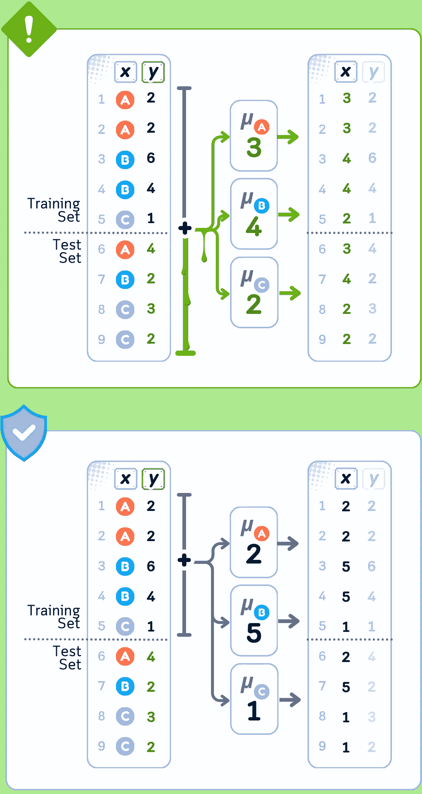
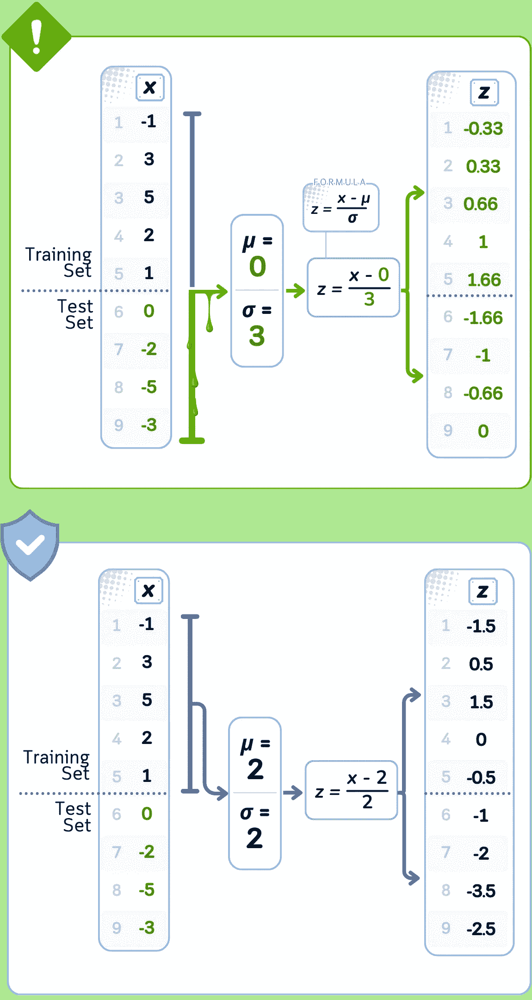

# 数据泄露在预处理中的解释：带代码示例的视觉指南

> 原文：[`towardsdatascience.com/data-leakage-in-preprocessing-explained-a-visual-guide-with-code-examples-33cbf07507b7?source=collection_archive---------2-----------------------#2024-10-30`](https://towardsdatascience.com/data-leakage-in-preprocessing-explained-a-visual-guide-with-code-examples-33cbf07507b7?source=collection_archive---------2-----------------------#2024-10-30)

## 数据预处理

## 10 种隐蔽的预处理管道泄露方式

[](https://medium.com/@samybaladram?source=post_page---byline--33cbf07507b7--------------------------------)[](https://towardsdatascience.com/?source=post_page---byline--33cbf07507b7--------------------------------) [Samy Baladram](https://medium.com/@samybaladram?source=post_page---byline--33cbf07507b7--------------------------------)

·发表于[Towards Data Science](https://towardsdatascience.com/?source=post_page---byline--33cbf07507b7--------------------------------) ·阅读时间 14 分钟·2024 年 10 月 30 日

--

`⛳️ 更多[数据预处理](https://medium.com/@samybaladram/list/data-preprocessing-17a2c49b44e4)解释：· 缺失值填补 · 类别编码 · 数据缩放 · 离散化 · 过采样与欠采样 ▶ 数据泄露在预处理中的应用`

在我教授机器学习的经验中，学生们经常遇到这样的问题：“我的模型表现得很好——准确率超过 90%！但是当我提交给隐藏数据集进行测试时，结果不如预期。哪里出了问题？”这种情况几乎总是指向数据泄露。

数据泄露发生在测试数据的某些信息在数据准备步骤中悄悄地（或泄露）进入训练数据时。这种情况通常发生在常规的数据处理任务中，而你未曾察觉。当这种情况发生时，模型**从不该看到的测试数据中学习**，使得测试结果具有误导性。

让我们看看常见的数据预处理步骤，并准确了解数据泄漏时会发生什么——希望你可以在自己的项目中避免这些“管道问题”。


所有视觉图：作者使用 Canva Pro 创建。优化为移动端显示；在桌面端可能会显得过大。

# 定义

数据泄漏是机器学习中一个常见的问题，它发生在不应该被模型看到的数据（例如测试数据或未来数据）被意外用来训练模型时。这可能导致模型过拟合，在新的、未见过的数据上表现不佳。

现在，让我们集中讨论以下数据预处理步骤中的数据泄漏问题。进一步，我们还将看到这些步骤对应的 `scikit-learn` 预处理方法名称，并且在文章的最后会看到代码示例。


# 缺失值填充

在处理真实数据时，你经常会遇到缺失值。与其删除这些不完整的数据点，不如用合理的估计值来填充它们。这可以帮助我们保留更多的数据进行分析。

填充缺失值的简单方法包括：

1.  使用 `SimpleImputer(strategy='mean')` 或 `SimpleImputer(strategy='median')` 用该列的平均值或中值来填充

1.  使用 `KNNImputer()` 查看相似数据点并使用它们的值

1.  使用 `SimpleImputer(strategy='ffill')` 或 `SimpleImputer(strategy='bfill')` 用数据中前一个或后一个值来填充

1.  使用 `SimpleImputer(strategy='constant', fill_value=value)` 用相同的数字或文本填充所有缺失的位置

这个过程被称为填充，虽然它很有用，但我们需要小心如何计算这些替代值，以避免数据泄漏。

## **数据泄漏案例：简单填充（均值）**

当你使用所有数据的均值来填充缺失值时，均值本身包含了来自训练集和测试集的信息。这个组合均值不同于仅使用训练数据计算的均值。由于这个不同的均值进入了训练数据，你的模型从它本不该看到的测试数据中学习。总结一下：

🚨 **问题所在** 使用完整数据集计算均值

❌ **我们做错了什么** 使用训练集和测试集的统计数据来计算填充值

💥 **后果** 训练数据包含受测试数据影响的平均值


均值填充泄漏发生在使用从所有数据行计算得到的平均值（4）填充缺失值，而不是正确地只使用训练数据的平均值（3），导致错误的填充值。

## **数据泄漏案例：KNN 填充**

当你使用 KNN 填充缺失值时，算法会从训练集和测试集找到相似的数据点。它创建的替代值是基于这些邻近点的，这意味着测试集的值直接影响训练数据中的内容。由于 KNN 会查看实际的邻近值，因此这种训练和测试信息的混合比简单的均值填充更为直接。总结来说：

🚨 **问题** 在完整数据集上寻找邻居

❌ **我们做错了什么** 使用测试集样本作为潜在的邻居进行填充

💥 **后果** 使用直接的测试集信息填充缺失值


KNN 填充泄漏发生在使用训练集和测试集数据共同寻找最近邻（生成 3.5 和 4.5 的值），而不是正确地只使用训练数据的模式来填充缺失值（生成 6 和 6 的值）。

# 类别编码

有些数据以类别的形式出现，而不是数字——比如颜色、名称或类型。由于模型只能处理数字，我们需要将这些类别转换为数值。

转换类别的常见方法包括：

1.  使用`OneHotEncoder()`为每个类别创建单独的 1 和 0 的列（也叫虚拟变量）

1.  使用`OrdinalEncoder()`或`LabelEncoder()`为每个类别分配一个数字（如 1，2，3）

1.  使用`OrdinalEncoder(categories=[ordered_list])`与自定义类别顺序反映自然层级（如 small=1，medium=2，large=3）

1.  使用`TargetEncoder()`根据类别与我们试图预测的目标变量的关系将类别转换为数字

我们转换这些类别的方式会影响模型学习的效果，因此在这个过程中需要小心不要使用测试数据的信息。

## 数据泄露案例：**目标编码**

当你使用目标编码在所有数据上转换类别值时，编码值是基于来自训练集和测试集的目标信息计算的。替换每个类别的数字是包含测试数据的目标值的平均值。这意味着你的训练数据会被赋予已经包含来自测试集的目标值信息，这些信息它本不应该知道。总结来说：

🚨 **问题** 计算类别时使用了完整的数据集

❌ **我们做错了什么** 使用所有目标值计算类别替换

💥 **后果** 训练特征包含未来目标信息



目标编码泄漏发生在使用所有数据替换类别的平均目标值（A=3，B=4，C=2），而不是正确地只使用训练数据的平均值（A=2，B=5，C=1），导致类别值错误。

## 数据泄露案例：独热编码

当你使用所有数据将类别转换为二进制列，然后选择要保留的列时，选择是基于训练集和测试集中的模式。这意味着你决定保留或删除某些二进制列时，受到了测试数据中目标预测能力的影响，而不仅仅是训练数据。这意味着你选择的列集部分受到了本不应该使用的测试集关系的影响。总结：

🚨 **问题所在** 从完整数据集中确定类别

❌ **我们做错了什么** 基于所有唯一值创建二进制列

💥 **后果** 特征选择受到测试集模式的影响


当使用所有唯一值（A、B、C、D）从完整数据集创建类别列，而不是仅正确使用训练数据中存在的类别（A、B、C）时，会发生独热编码泄漏，导致错误的编码模式。

# 数据缩放

数据中的不同特征往往具有非常不同的范围——有些可能在千位，而其他则可能是很小的小数。我们调整这些范围，使所有特征具有相似的尺度，从而帮助模型更好地工作。

常见的缩放调整方法包括：

1.  使用`StandardScaler()`使得值集中在 0 附近，大多数值在-1 和 1 之间（均值=0，方差=1）

1.  使用`MinMaxScaler()`将所有值缩放到 0 和 1 之间，或者使用`MinMaxScaler(feature_range=(min, max))`来设置自定义范围

1.  使用`FunctionTransformer(np.log1p)`或`PowerTransformer(method='box-cox')`来处理非常大的数字，使数据分布更加接近正态分布

1.  使用`RobustScaler()`通过不受异常值影响的统计量调整缩放（使用四分位数而非均值/方差）

虽然缩放有助于模型公平地比较不同的特征，但我们需要仅使用训练数据来计算这些调整，以避免数据泄漏。

## 数据泄漏案例：标准化缩放

当你使用所有数据标准化特征时，用于计算的平均值和分布值来自训练集和测试集。这些值与仅使用训练数据时得到的不同。这意味着你训练数据中的每个标准化值都使用了关于测试集分布的信息来进行调整。总结：

🚨 **问题所在** 使用完整数据集计算统计量

❌ **我们做错了什么** 使用所有值计算均值和标准差

💥 **后果** 使用测试集分布缩放训练特征



标准化泄漏发生在使用完整数据集的平均值（μ=0）和分布（σ=3）来规范化数据时，而不是仅正确使用训练数据的统计量（μ=2，σ=2），导致错误的标准化值。

## 数据泄漏案例：**最小-最大缩放**

当你使用所有数据的最小值和最大值进行特征缩放时，这些边界值可能来自测试集。你训练数据中的缩放值是根据这些边界计算的，这些边界可能与仅使用训练数据时得到的边界不同。这意味着训练数据中的每个缩放值都使用了来自测试集的完整值范围进行调整。总结如下：

🚨 **问题所在** 使用完整数据集查找边界

❌ **我们做错了什么** 从所有数据点中确定最小/最大值

💥 **后果** 使用测试集范围对训练特征进行归一化


使用完整数据集的最小值（-5）和最大值（5）来进行缩放，而不是仅正确使用训练数据的范围（最小值=-1，最大值=5）进行缩放，从而导致值的缩放错误。

# 离散化

有时，将数字分组为类别比使用精确的值更好。这有助于机器学习模型更容易地处理和分析数据。

创建这些分组的常见方法包括：

1.  使用`KBinsDiscretizer(strategy='uniform')`使每个组覆盖相同大小的值范围

1.  使用`KBinsDiscretizer(strategy='quantile')`使每个组包含相同数量的数据点

1.  使用`KBinsDiscretizer(strategy='kmeans')`通过聚类找到数据中的自然分组

1.  使用`QuantileTransformer(n_quantiles=n, output_distribution='uniform')`基于数据中的分位数创建分组

虽然分组值可以帮助模型更好地发现模式，但我们决定分组边界的方式需要仅使用训练数据，以避免泄漏。

## **数据泄漏案例：等频分箱**

当你使用所有数据创建具有相等数据点数量的箱时，箱之间的分割点是通过训练集和测试集共同确定的。这些分割值与仅使用训练数据时得到的值不同。这意味着，当你将数据点分配到训练数据的箱中时，你使用的是受测试集值影响的分割点。总结如下：

🚨 **问题所在** 使用完整数据集设置阈值

❌ **我们做错了什么** 使用所有数据点确定箱的边界

💥 **后果** 使用测试集分布对训练数据进行分箱


等频分箱泄漏发生在使用所有数据设置箱的分割点（-0.5，2.5）时，而不是仅正确使用训练数据来设置边界（-0.5，2.0），从而导致值的分组错误。

## 数据泄漏案例：等宽分箱

当你使用所有数据创建相等大小的箱时，确定箱宽度所使用的范围来自训练集和测试集。这一总范围可能比仅使用训练数据得到的范围更宽或更窄。这意味着当你将数据点分配到训练数据中的箱时，使用的箱边界是基于整个测试集的范围计算得出的。总结如下：

🚨 **问题** 使用完整数据集计算范围

❌ **我们做错了什么** 基于完整数据分布设置箱宽

💥 **后果** 使用测试集边界对训练数据进行分箱


等宽分箱泄漏发生在使用完整数据集范围（-3 到 6）将数据划分为相等大小的组时，而不是仅正确使用训练数据的范围（-3 到 3），从而导致错误的分组。

# 重采样

当你的数据中某些类别的示例比其他类别多得多时，我们可以使用`imblearn`中的重采样技术，通过创建新样本或删除现有样本来平衡它们。这有助于模型公平地学习所有类别。

添加样本的常见方法（过采样）：

1.  使用`RandomOverSampler()`从较小类别中复制现有示例

1.  使用`SMOTE()`为较小类别创建新的合成示例，通过插值法生成

1.  使用`ADASYN()`在模型最难处理的区域创建更多示例，重点关注决策边界

删除样本的常见方法（欠采样）：

1.  使用`RandomUnderSampler()`随机删除较大类别中的示例

1.  使用`NearMiss(version=1)`或`NearMiss(version=2)`根据与较小类别的距离从较大类别中删除示例

1.  使用`TomekLinks()`或`EditedNearestNeighbours()`根据与其他类别的相似度仔细选择要删除的示例

平衡数据有助于模型更好地学习，但创建或删除样本的过程应该仅使用来自训练数据的信息，以避免数据泄漏。

## **数据泄漏案例：过采样（SMOTE）**

当你在所有数据上使用 SMOTE 创建合成数据点时，算法会从训练集和测试集中挑选附近的点来创建新样本。这些新点是通过将测试集样本的值与训练数据混合生成的。这意味着你的训练数据得到了直接使用测试集信息创建的新样本。总结如下：

🚨 **问题** 使用完整数据集生成样本

❌ **我们做错了什么** 使用测试集邻居创建合成点

💥 **后果** 训练数据被包含测试集影响的样本增强


过采样泄漏发生在基于整个数据集的类别计数（A×4, B×3, C×2）重复数据点时，而不是仅根据训练数据（A×1, B×2, C×2）来决定每个类别重复的次数。

## 数据泄漏案例：欠采样（Tomek 链接）

当你使用 Tomek 链接在所有数据中删除数据点时，算法会找到来自训练集和测试集的最近邻成对数据点，它们的标签却不同。根据这些数据点与测试集数据点的距离来决定是否从训练集中移除这些点。这意味着你的最终训练数据是由它与测试集值之间的关系决定的。总结如下：

🚨 **问题** 使用完整数据集移除样本

❌ **我们做错了什么** 使用测试集关系识别成对数据

💥 **后果** 基于测试集模式减少训练


欠采样泄漏发生在基于整个数据集的类别比例移除数据点时（A×4，B×3，C×2），而不是正确地仅使用训练数据（A×1，B×2，C×2）来决定从每个类别中保留多少样本。

# 最后的评论

在预处理数据时，你需要确保训练数据和测试数据完全分开。任何时候你使用所有数据的信息来转换值——无论是填补缺失值、将类别转换为数字、特征缩放、创建区间，还是平衡类别——都会有将测试数据的信息混入训练数据的风险。这会使得模型的测试结果不可靠，因为模型已经从它本不该看到的模式中学习了。

解决方案很简单：**始终先转换你的训练数据，保存这些计算结果，然后将其应用到你的测试数据上。**

# 🌟 数据预处理 + 分类（带有泄漏）代码总结

让我们看看在预测一个简单的高尔夫比赛数据集时，数据泄漏是如何发生的。这是一个不好的示例，不应当被遵循，仅用于演示和教育目的。

```py
import pandas as pd
import numpy as np
from sklearn.compose import ColumnTransformer
from sklearn.preprocessing import StandardScaler, OrdinalEncoder, KBinsDiscretizer
from sklearn.impute import SimpleImputer
from sklearn.model_selection import train_test_split
from sklearn.tree import DecisionTreeClassifier
from sklearn.metrics import accuracy_score
from imblearn.pipeline import Pipeline
from imblearn.over_sampling import SMOTE

# Create dataset
dataset_dict = {
    'Outlook': ['sunny', 'sunny', 'overcast', 'rain', 'rain', 'rain', 'overcast', 'sunny', 'sunny', 'rain', 'sunny', 'overcast', 'overcast', 'rain', 'sunny', 'overcast', 'rain', 'sunny', 'sunny', 'rain', 'overcast', 'rain', 'sunny', 'overcast', 'sunny', 'overcast', 'rain', 'overcast'],
    'Temperature': [85.0, 80.0, 83.0, 70.0, 68.0, 65.0, 64.0, 72.0, 69.0, 75.0, 75.0, 72.0, 81.0, 71.0, 81.0, 74.0, 76.0, 78.0, 82.0, 67.0, 85.0, 73.0, 88.0, 77.0, 79.0, 80.0, 66.0, 84.0],
    'Humidity': [85.0, 90.0, 78.0, 96.0, 80.0, 70.0, 65.0, 95.0, 70.0, 80.0, 70.0, 90.0, 75.0, 80.0, 88.0, 92.0, 85.0, 75.0, 92.0, 90.0, 85.0, 88.0, 65.0, 70.0, 60.0, 95.0, 70.0, 78.0],
    'Wind': [False, True, False, False, False, True, True, False, False, False, True, True, False, True, True, False, False, True, False, True, True, False, True, False, False, True, False, False],
    'Play': ['No', 'No', 'Yes', 'Yes', 'Yes', 'No', 'Yes', 'No', 'Yes', 'Yes', 'Yes', 'Yes', 'Yes', 'No', 'No', 'Yes', 'Yes', 'No', 'No', 'No', 'Yes', 'Yes', 'Yes', 'Yes', 'Yes', 'Yes', 'No', 'Yes']
}
df = pd.DataFrame(dataset_dict)
X, y = df.drop('Play', axis=1), df['Play']

# Preprocess AND apply SMOTE to ALL data first (causing leakage)
preprocessor = ColumnTransformer(transformers=[
    ('temp_transform', Pipeline([
        ('imputer', SimpleImputer(strategy='mean')),
        ('scaler', StandardScaler()),
        ('discretizer', KBinsDiscretizer(n_bins=4, encode='ordinal'))
    ]), ['Temperature']),
    ('humid_transform', Pipeline([
        ('imputer', SimpleImputer(strategy='mean')),
        ('scaler', StandardScaler()),
        ('discretizer', KBinsDiscretizer(n_bins=4, encode='ordinal'))
    ]), ['Humidity']),
    ('outlook_transform', OrdinalEncoder(handle_unknown='use_encoded_value', unknown_value=-1), 
     ['Outlook']),
    ('wind_transform', Pipeline([
        ('imputer', SimpleImputer(strategy='constant', fill_value=False)),
        ('scaler', StandardScaler())
    ]), ['Wind'])
])

# Transform all data and apply SMOTE before splitting (leakage!)
X_transformed = preprocessor.fit_transform(X)
smote = SMOTE(random_state=42)
X_resampled, y_resampled = smote.fit_resample(X_transformed, y)

# Split the already transformed and resampled data
X_train, X_test, y_train, y_test = train_test_split(X_resampled, y_resampled, test_size=0.5, shuffle=False)

# Train a classifier
clf = DecisionTreeClassifier(random_state=42)
clf.fit(X_train, y_train)

print(f"Testing Accuracy (with leakage): {accuracy_score(y_test, clf.predict(X_test)):.2%}")
```

上面的代码使用了`ColumnTransformer`，这是 scikit-learn 中的一个工具，允许我们对数据集中的不同列应用不同的预处理步骤。

这是数据集中每一列预处理策略的详细说明：

`**温度**`**：

-** 均值填充处理任何缺失值

- 标准化缩放以规范化值（均值=0，标准差=1）

- 等宽离散化为 4 个区间，意味着将连续值分类为 4 个等宽区间

`**湿度**`**：

-** 与温度相同的策略：均值填充 → 标准化缩放 → 等宽离散化（4 个区间）

`**展望**`**（类别）**：

- 序数编码：将类别值转换为数值

- 通过将未知值设置为-1 来处理

`**风速**` **（二元）**：

- 对缺失值进行常数填充（填充为 False）

- 标准化缩放以规范化 0/1 值

`**比赛**` **（目标）**：

- 标签编码将“是/否”转换为 1/0

- 在预处理后应用 SMOTE 通过创建少数类别的合成示例来平衡类别

- 使用简单的决策树来预测目标

整个流水线演示了数据泄漏，因为**所有的转换在拟合过程中都看到整个数据集**，在实际的机器学习场景中这将是不合适的，我们需要确保测试数据与训练过程完全分开。

这种方法也可能会显示出人为提高的测试准确度，因为在预处理步骤中使用了测试数据的特征！

# 🌟 数据预处理 + 分类（无泄漏）代码总结

这是没有数据泄漏的版本：

```py
import pandas as pd
import numpy as np
from sklearn.compose import ColumnTransformer
from sklearn.preprocessing import StandardScaler, OrdinalEncoder, KBinsDiscretizer
from sklearn.impute import SimpleImputer
from sklearn.model_selection import train_test_split
from sklearn.tree import DecisionTreeClassifier
from sklearn.metrics import accuracy_score
from imblearn.pipeline import Pipeline
from imblearn.over_sampling import SMOTE

# Create dataset
dataset_dict = {
    'Outlook': ['sunny', 'sunny', 'overcast', 'rain', 'rain', 'rain', 'overcast', 'sunny', 'sunny', 'rain', 'sunny', 'overcast', 'overcast', 'rain', 'sunny', 'overcast', 'rain', 'sunny', 'sunny', 'rain', 'overcast', 'rain', 'sunny', 'overcast', 'sunny', 'overcast', 'rain', 'overcast'],
    'Temperature': [85.0, 80.0, 83.0, 70.0, 68.0, 65.0, 64.0, 72.0, 69.0, 75.0, 75.0, 72.0, 81.0, 71.0, 81.0, 74.0, 76.0, 78.0, 82.0, 67.0, 85.0, 73.0, 88.0, 77.0, 79.0, 80.0, 66.0, 84.0],
    'Humidity': [85.0, 90.0, 78.0, 96.0, 80.0, 70.0, 65.0, 95.0, 70.0, 80.0, 70.0, 90.0, 75.0, 80.0, 88.0, 92.0, 85.0, 75.0, 92.0, 90.0, 85.0, 88.0, 65.0, 70.0, 60.0, 95.0, 70.0, 78.0],
    'Wind': [False, True, False, False, False, True, True, False, False, False, True, True, False, True, True, False, False, True, False, True, True, False, True, False, False, True, False, False],
    'Play': ['No', 'No', 'Yes', 'Yes', 'Yes', 'No', 'Yes', 'No', 'Yes', 'Yes', 'Yes', 'Yes', 'Yes', 'No', 'No', 'Yes', 'Yes', 'No', 'No', 'No', 'Yes', 'Yes', 'Yes', 'Yes', 'Yes', 'Yes', 'No', 'Yes']
}
df = pd.DataFrame(dataset_dict)
X, y = df.drop('Play', axis=1), df['Play']

# Split first (before any processing)
X_train, X_test, y_train, y_test = train_test_split(X, y, test_size=0.5, shuffle=False)

# Create pipeline with preprocessing, SMOTE, and classifier
pipeline = Pipeline([
    ('preprocessor', ColumnTransformer(transformers=[
        ('temp_transform', Pipeline([
            ('imputer', SimpleImputer(strategy='mean')),
            ('scaler', StandardScaler()),
            ('discretizer', KBinsDiscretizer(n_bins=4, encode='ordinal'))
        ]), ['Temperature']),
        ('humid_transform', Pipeline([
            ('imputer', SimpleImputer(strategy='mean')),
            ('scaler', StandardScaler()),
            ('discretizer', KBinsDiscretizer(n_bins=4, encode='ordinal'))
        ]), ['Humidity']),
        ('outlook_transform', OrdinalEncoder(handle_unknown='use_encoded_value', unknown_value=-1), 
         ['Outlook']),
        ('wind_transform', Pipeline([
            ('imputer', SimpleImputer(strategy='constant', fill_value=False)),
            ('scaler', StandardScaler())
        ]), ['Wind'])
    ])),
    ('smote', SMOTE(random_state=42)),
    ('classifier', DecisionTreeClassifier(random_state=42))
])

# Fit pipeline on training data only
pipeline.fit(X_train, y_train)

print(f"Training Accuracy: {accuracy_score(y_train, pipeline.predict(X_train)):.2%}")
print(f"Testing Accuracy: {accuracy_score(y_test, pipeline.predict(X_test)):.2%}")
```

## 与泄漏版本的主要区别

1.  首先拆分数据，然后再进行任何处理

1.  所有的转换（预处理，SMOTE）都在流水线内

1.  流水线确保：

    - 预处理参数仅从训练数据中学习

    - SMOTE 仅适用于训练数据

    - 测试数据在预测之前完全不可见

这种方法提供了更现实的性能估计，因为它保持了训练数据和测试数据之间的正确分离。

## 技术环境

本文使用 Python 3.7，scikit-learn 1.5 和 imblearn 0.12。虽然讨论的概念通常适用，但具体的代码实现可能会因版本不同略有差异。

## 关于插图

除非另有说明，所有插图均由作者创建，并结合了 Canva Pro 授权的设计元素。

𝙎𝙚𝙚 𝙢𝙤𝙧𝙚 𝘿𝙖𝙩𝙖 𝙋𝙧𝙚𝙥𝙧𝙤𝙘𝙚𝙨𝙨𝙞𝙣𝙜 𝙢𝙚𝙩𝙝𝙤𝙙𝙨 𝙝𝙚𝙧𝙚:


[Samy Baladram](https://medium.com/@samybaladram?source=post_page-----33cbf07507b7--------------------------------)

## 数据预处理

[查看列表](https://medium.com/@samybaladram/list/data-preprocessing-17a2c49b44e4?source=post_page-----33cbf07507b7--------------------------------)6 个故事！[](../Images/f7ead0fb9a8dc2823d7a43d67a1c6932.png)

𝙔𝙤𝙪 𝙢𝙞𝙜𝙝𝙩 𝙖𝙡𝙨𝙤 𝙡𝙞𝙠𝙚:


[Samy Baladram](https://medium.com/@samybaladram?source=post_page-----33cbf07507b7--------------------------------)

## 分类算法

[查看列表](https://medium.com/@samybaladram/list/classification-algorithms-b3586f0a772c?source=post_page-----33cbf07507b7--------------------------------)8 篇文章

[Samy Baladram](https://medium.com/@samybaladram?source=post_page-----33cbf07507b7--------------------------------)

## 回归算法

[查看列表](https://medium.com/@samybaladram/list/regression-algorithms-b0b6959f1b39?source=post_page-----33cbf07507b7--------------------------------)5 篇文章
