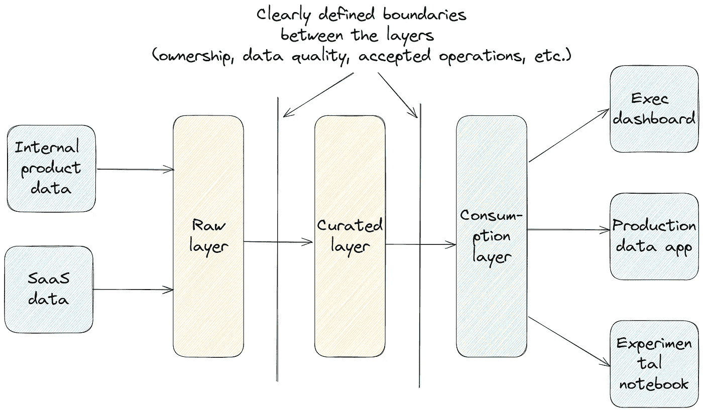
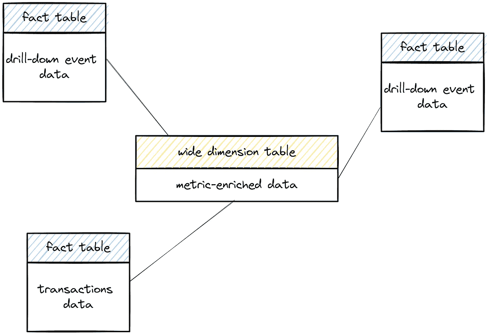

# 后现代数据架构的数据建模技术

> 原文：[`towardsdatascience.com/data-modeling-techniques-for-the-post-modern-data-stack-03fc2e4a210c?source=collection_archive---------4-----------------------#2024-07-20`](https://towardsdatascience.com/data-modeling-techniques-for-the-post-modern-data-stack-03fc2e4a210c?source=collection_archive---------4-----------------------#2024-07-20)

## 一套通用的技术和原则，用于为您的后现代数据架构设计一个强大、成本高效、可扩展的数据模型。

 [Mahdi Karabiben](https://mahdiqb.medium.com/?source=post_page---byline--03fc2e4a210c--------------------------------)

·发表于[数据科学探索](https://towardsdatascience.com/?source=post_page---byline--03fc2e4a210c--------------------------------) ·8 分钟阅读·2024 年 7 月 20 日

--

图片由[Michael Dziedzic](https://unsplash.com/@lazycreekimages?utm_source=medium&utm_medium=referral)提供，来自[Unsplash](https://unsplash.com/?utm_source=medium&utm_medium=referral)

在过去的几年里，随着现代数据架构（MDS）为数据的移动、转换和交互引入了新的模式和标准，维度数据建模逐渐成为过去的遗物。取而代之的是，数据团队依赖于一张大表（One-Big-Tables，OBT）并层层叠加 dbt 模型来应对新的使用场景。然而，这些方法导致了数据团队成为成本中心，并且过程不可扩展。因此，随着我们进入一个“后现代”数据架构时代，这一时代的特点是追求降低成本、整理数据平台和限制模型泛滥，数据建模正在经历一次复兴。

这一转变使数据团队面临一个两难选择：我们是应该回归到几十年前为完全不同的数据生态系统定义的严格数据建模方法，还是可以根据今天的技术和业务问题引入基于新的原则的建模方法？

我认为，对于大多数公司而言，正确的答案介于两者之间。本文将讨论一套数据建模标准，旨在避免模型泛滥，同时不限制新数据产品的交付速度。这些标准足够通用，适用于大多数“后现代”数据平台，但总会有一些边缘情况或行业需要不同的方法。

# 三层（[Medallion](https://www.databricks.com/glossary/medallion-architecture)）架构仍然是一个安全的选择，但有一些需要注意的事项。

从历史来看，当谈到数据建模时，数据团队通常指的是我们为仓库的“*消费*”层定义的模型，这一层是我们展示给消费者的，也是外部工具与之交互的层。然而，数据的旅程开始得远远早于它到达这一层，许多数据建模的决策是在这个过程中做出的。

就层次化方法而言，随着数据湖（以及其后的数据湖仓）兴起，三层/Medallion 架构依然是大多数使用案例中最合适的方法。你从第一层开始，该层包含原始数据；然后是执行技术清洗但没有业务逻辑转换的层；最后是存储已准备好使用的转换后的消费表的层。

三层/Medallion 架构的鸟瞰图（图片来源：作者）

然而，在定义架构各个层次的细节时，有一些需要注意的事项：

+   **从右侧开始，定义左侧需要发生的事情**：在任何技术公司中，都有许多内部系统生成*潜在有用*的数据。无论是 CRM、RevOps 还是营销软件，采取“带来一切”的方法，往往会让你背负管理成千上万可能永远不会使用的表格的负担。避免这种不必要复杂性的关键是首先关注你的数据使用（位于数据平台右侧的消费用例），然后定义来自公司各个系统的所需数据输入。一旦你有了所有实际有用的上游表的列表，就只将这些表带入原始层，并随着新业务需求的出现逐步引入新的表格。

+   **最小化中间节点**：虽然 Medallion 架构在（非常）高层次上由三个（理论上）层次构成，但你可能最终会在 Curated 层和 Consumption 层之间增加一些中间步骤。这些中间步骤可能是执行某些任务（如跟踪历史或处理敏感数据）所必需的，但如果你为每一个需求都开辟了中间步骤的空间，它们也可能变得冗余。理想情况下，你希望精简你的层次，并将不同的操作归类到同一个逻辑步骤中。

+   **定义清晰且可执行的层之间的边界**：尽管这看起来很明显，但在很多情况下，你可能会忍不住说，“*让我直接在我的消费模型中引用这个原始表格*。”这就像午夜后想吃不健康的零食一样，你最终会后悔屈服于这种诱惑。如果你决定仅在清洗层中执行快照和格式更新，那么就不要开始添加过滤器以更快地交付数据。这会为不同团队在使用共享清洗后的模型时带来不一致性和混淆。相反，如果你注意到某个边界过于严格或不必要，完全可以将其移动，并开始在不同的层次上执行某些操作，但这需要沟通并标准化。这同样适用于数据消费：例如，如果你希望在清洗后的数据上直接运行实验，你应该确保必要的防护措施到位。

# 更宽广、度量增强的维度表是前进的道路

在“传统”的维度数据建模中，维度表并不是度量的存储地。相反，度量应该通过事实表中存储的度量来计算。当时，这种做法是有道理的：它简化了维度表的管理（特别是在跟踪历史数据时），将定量数据和描述性数据分开，并允许依赖于中心事实表并由不同维度丰富的分析。

然而，在今天的世界中，这种分离似乎显得有些勉强。在大多数情况下，维度表的历史通过每日或每小时的快照来跟踪（便宜的存储，值得一提），而我们今天构建的分析通常是围绕维度表本身展开的。考虑到这一点，给定度量的计算可以嵌入到这些表中，而不会产生重大负面后果。这种方法的转变显著减少了为了回答基本问题而需要进行的维度表和事实表之间的连接。此外，它还与今天需要多个来自不同事实表的度量来计算派生度量的分析方法保持一致，所有这些都是分析给定维度的一部分。

带有中心度量增强的维度表的示例数据模型（图片由作者提供）

[Maxime Beauchemin](https://medium.com/u/9f4d525c99e2?source=post_page---user_mention--03fc2e4a210c--------------------------------)，[他对数据工程领域做出了巨大贡献](https://maximebeauchemin.medium.com/functional-data-engineering-a-modern-paradigm-for-batch-data-processing-2327ec32c42a)，基于这一原则开发了全面的数据建模方法：[面向实体的数据建模](https://preset.io/blog/introducing-entity-centric-data-modeling-for-analytics/)。他关于这种方法的文章是非常重要的阅读资料，我相信，和他的功能性数据工程范式类似，面向实体的数据建模将引领许多数据团队（以及整个领域）朝着正确的方向前进。

我也相信，数据团队通过采用“分层”指标的方法将受益匪浅。与其把所有指标视为同等重要，或每次都需要决定是否将某个指标添加到维度表中，不如将指标分为两类：

+   **通用指标**：这些是需要在公司内部高度管理和标准化的关键指标（比如年复合收入（ARR）或日活跃用户（DAU））。作为一个通用定义，你可以认为任何在至少两个独立用例中相关或使用的指标都是通用指标。这些指标应该是你维度表的一部分，并具有清晰的多方所有权（例如，一个团队可以拥有该指标的定义，而另一个团队则拥有它所依赖的数据的一部分）。确定某个指标是否应该是某个维度表的一部分的另一种方式是，查看它是否是实体/维度本身的特征，而不仅仅是在特定场景下才相关的计算。

+   **实验性指标**：与通用指标不同，这些指标用于特定的用例，或仍在不断完善中。可以把它想象成一个仅与构建该功能的团队相关的特定指标。在这种情况下，若将该指标作为数据模型的一部分，可能会导致不必要的摩擦并增加复杂性。此时更合适的方法是将该指标定义为语义层的一部分（如果有的话），或在数据仓库消费层的下游计算该指标。然而，值得注意的是，如果实验性指标开始在多个用例中使用，或进入生产/关键数据产品，它可以晋升为通用指标。

# 保持灵活性并限制继承逻辑

随着新用例的出现，并且你不断增强和更新消费层以支持它们，重要的是要牢记以下关键原则。

## **保持数据的最精细粒度**

在添加新的数据流时，如果最细粒度的数据并不立即需要，你可以决定在数据到达消费层之前对其进行预聚合，以降低成本并避免可能的昂贵查询（毕竟已经不是 2021 年了）。虽然这一决定听起来合情合理，但通常会导致不必要的摩擦和挫败感，因为数据消费者在需要时无法深入分析。

当你决定将某个实体或事件流引入数据平台时（因为某个用例需要它），通常更安全的做法是将最细粒度的数据作为消费层的一部分呈现出来，然后在其上构建聚合。更一般来说，在设计数据模型时，尽量始终优先考虑灵活性，并最小化你所做的单向决策的数量。

## 避免继承的逻辑

即使你在理论上是公司唯一的“官方”数据团队，也不要感到惊讶，发现公司内的其他部门有他们的“幽灵”数据团队。随着每个人都试图利用数据来获得优势并做出数据驱动的决策（这很不错！），会出现一些情况，其他团队（比如从事 SaaS 应用程序的团队或你的功能团队）会在他们使用的工具中定义自己的业务逻辑和指标（因为大多数 B2B SaaS 工具提供内置的分析功能）。

这种情况让你处于一个微妙的境地，因为你要么可以导入你不拥有（且无法管理）的“继承”业务逻辑，要么可以通过一个漫长的过程重新定义数据仓库中的逻辑。我的建议是始终选择第二种方案，因为这最终将帮助你最小化潜在问题的范围，避免隐性逻辑的变化。然而，这种努力在某些情况下可能代价过高——在这种情况下，你可以选择在数据到达数据平台后定义详细的检查，以确保你的假设仍然有效，且上游工具中定义的逻辑没有发生变化（这也有助于确保你的数据仓库逻辑始终与上游逻辑保持同步）。

随着数据团队在预算有限、质量重于数量的环境中不断过渡，做出适合自己情况的设计决策并能带来长期最大回报变得尤为重要。按照某种数据建模方法照搬使用，或完全忽视数据建模，都是导致错误方向的做法。相反，重要的是为自己武装上匹配需求的技术和原则，帮助你做出明智的设计决策，并能够构建适合团队发展的数据模型。

本文讨论的技术通常是一个可靠的选择，有助于为你打下正确的基础，但最终最重要的是理解自己（当前和未来）使用案例的需求，与数据消费者沟通，了解他们当前的困难，并监控数据平台的使用情况和成本。

*如果你想获取更多数据工程的内容，可以订阅我的新闻通讯《Data Espresso》，在其中我讨论与数据工程和技术相关的各种话题：*

 [## Data Espresso | Mahdi Karabiben | Substack

### 数据工程的更新与评论，伴随你下午的浓缩咖啡。点击阅读由 Mahdi 编写的《Data Espresso》…

dataespresso.substack.com](https://dataespresso.substack.com/?source=post_page-----03fc2e4a210c--------------------------------)
