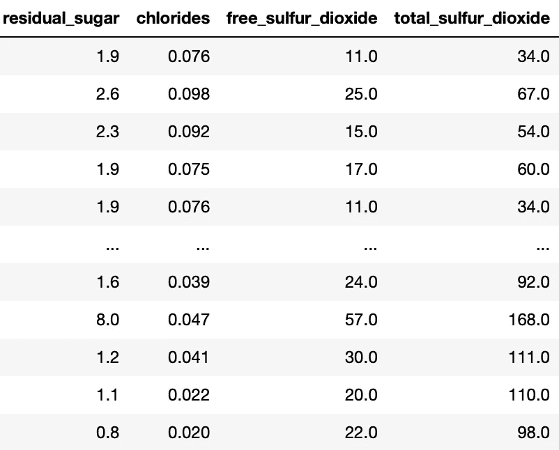

# 数据缩放基础：标准化与最小-最大缩放解析

> 原文：[`towardsdatascience.com/data-scaling-101-standardization-and-min-max-scaling-explained-60789833e160?source=collection_archive---------3-----------------------#2024-08-10`](https://towardsdatascience.com/data-scaling-101-standardization-and-min-max-scaling-explained-60789833e160?source=collection_archive---------3-----------------------#2024-08-10)

## 何时使用 MinMaxScaler 与 StandardScaler 或其他方法

 [Haden Pelletier](https://medium.com/@pelletierhaden?source=post_page---byline--60789833e160--------------------------------)

·发表于[Towards Data Science](https://towardsdatascience.com/?source=post_page---byline--60789833e160--------------------------------) ·5 分钟阅读·2024 年 8 月 10 日

--

图片由[Sven Mieke](https://unsplash.com/@sxoxm?utm_source=medium&utm_medium=referral)提供，来源于[Unsplash](https://unsplash.com/?utm_source=medium&utm_medium=referral)

## 什么是缩放？

当你第一次将数据集加载到 Python 脚本或笔记本中，并查看你的数值特征时，你可能会注意到它们的量纲不同。

这意味着每一列或特征的范围都会有所不同。例如，一个特征的值范围可能是 0 到 1，而另一个特征的值范围可能是 1000 到 10000。

以 UCI 机器学习库中的[酒质数据集](https://archive.ics.uci.edu/dataset/186/wine+quality)为例（[CC by 4.0 许可证](https://creativecommons.org/licenses/by/4.0/legalcode)）。

来自 UCI 酒质数据集的几个特征。图像来源：作者

缩放本质上是将所有特征拉近到相似或相同的范围或尺度的过程，比如将它们转换为所有值都在 0 到 1 之间。

## 何时（以及为什么）需要进行缩放

在训练/拟合机器学习模型之前对特征进行缩放有几个重要原因：

1.  **确保所有特征对模型的贡献是相等的。** 当某个特征的范围很大时...
