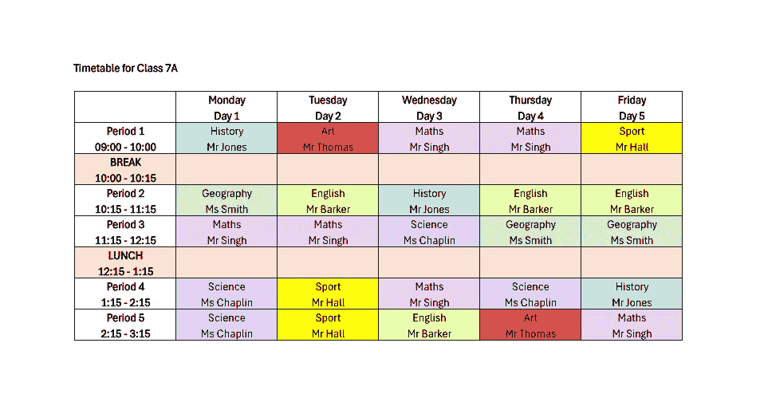
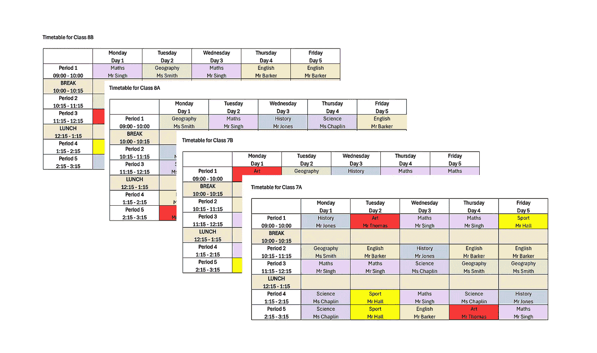

# 《学校的数据科学，第一部分：使用 Python 和 OR-Tools 自动化课程表管理》

> 原文：[`towardsdatascience.com/data-science-for-schools-automate-timetabling-with-python-and-or-tools-part-1-f627c140a206?source=collection_archive---------3-----------------------#2024-06-12`](https://towardsdatascience.com/data-science-for-schools-automate-timetabling-with-python-and-or-tools-part-1-f627c140a206?source=collection_archive---------3-----------------------#2024-06-12)

## 一种免费的、人类参与的方式来组织教职员工的替代工作

 [Matt Chapman](https://medium.com/@mattchapmanmsc?source=post_page---byline--f627c140a206--------------------------------)

·发表于 [Towards Data Science](https://towardsdatascience.com/?source=post_page---byline--f627c140a206--------------------------------) ·阅读时间：10 分钟·2024 年 6 月 12 日

--

想象一下学校的课程表：

图片由作者提供

看起来很简单，对吧？

错了！

制定课程表是一项令人头疼的工作。它需要花费大量时间，而且由于可能有高达 20% 的教职员工在某一天生病或缺席，因此它会不断需要调整。

结果是，一堆由学校的“数据人员”维护的庞大 Excel 表格：

我们总是担心“`timetable_8b_final_FINAL_v2.xlsx`”的第 21 个标签页崩溃。图片由作者提供

我知道这一点，因为我来自一个教师家庭。我的妻子是教师，我的父母都是教师，甚至我的三位祖父母也是教师。坦率来说，我很惊讶我自己不是教师。

相反，我选择了一个同样疯狂的职业——数据科学。作为一名数据科学家，我经常认为学校在数据驱动的自动化和分析方面有很大的潜力。

# Python 来拯救我们

在这篇文章中，我们将使用 Python 来自动化生成教职员工的课程表。
