# 数据科学与可持续性 — 模拟循环经济

> 原文：[`towardsdatascience.com/data-science-for-sustainability-simulate-a-circular-economy-b6a13d4b0451?source=collection_archive---------4-----------------------#2024-03-28`](https://towardsdatascience.com/data-science-for-sustainability-simulate-a-circular-economy-b6a13d4b0451?source=collection_archive---------4-----------------------#2024-03-28)

## 利用数据科学模拟循环模式对快时尚零售商 CO2 排放和水资源使用的影响。

 [Samir Saci](https://s-saci95.medium.com/?source=post_page---byline--b6a13d4b0451--------------------------------)

·发表于[Towards Data Science](https://towardsdatascience.com/?source=post_page---byline--b6a13d4b0451--------------------------------) ·阅读时间 11 分钟·2024 年 3 月 28 日

--

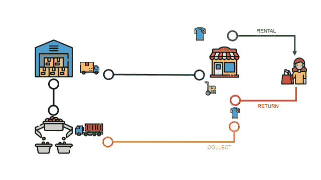

租赁模式 — （作者提供的图片）

循环经济是一种经济模式，旨在最小化浪费并最大化资源效率。

这涉及到设计专注于长寿命、再利用和回收的产品和流程。

> 为什么不租用你的衣服，而是购买它呢？！

一些时尚零售商已实施**订阅模式**。

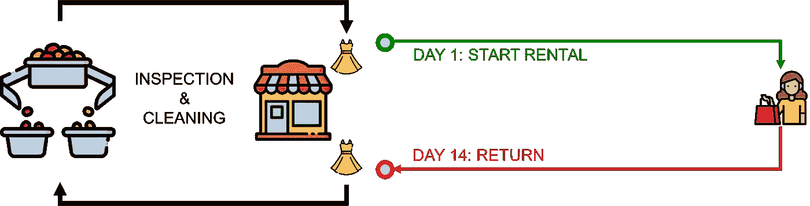

循环租赁模式 — （作者提供的图片）

客户支付定期费用，以在**特定期限**内使用某个产品或服务。

> 这种循环经济模式的可持续性如何？

目标是减少产品生命周期中的环境影响。

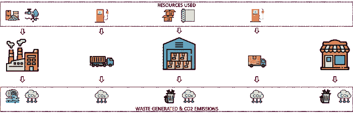

产品生命周期 — （作者提供的图片）

> 你能否利用数据科学来估算一个实验性租赁模式的减排效果？

作为供应链部门的数据科学家，你可以建立模拟模型来评估这些举措的有效性。

本文将估算实施一个包含**400 个项目**的租赁模式对**时尚零售商**的环境影响。

# 快时尚的循环租赁模式

## 支持供应链的脱碳

你是一个国际**服装集团**供应链部门的**数据科学经理**，该集团在全球拥有门店。

为了支持[联合国可持续发展目标](https://s-saci95.medium.com/what-are-the-sustainable-development-goals-sdgs-988a1eb2b62b)，该公司承诺减少其环境足迹。

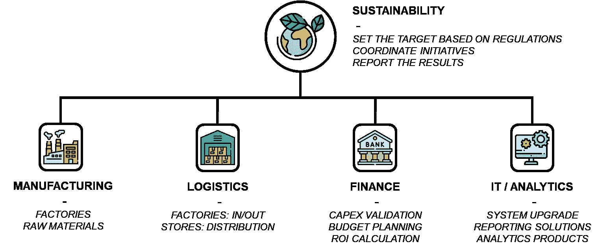

可持续发展路线图项目团队 — （图片由作者提供）

因此，您的**可持续发展部门**的同事们已经准备了一份**涉及多个部门的路线图，旨在到 2030 年减少碳足迹**。

在这些举措中，已决定在**10 家店铺**中尝试实施一个 circular economy 模型。

如果您不熟悉循环经济的概念，可以阅读这篇文章：

 ## 数据科学支持循环经济实施

### 如何利用数据科学支持快速时尚零售商实施循环经济？

[towardsdatascience.com

这些地点将向客户提供**租赁订阅模型**，范围限于 400 个商品。

在实施此附加服务之前，物流和可持续发展团队要求您提供支持，以估算我们可以达到的排放削减量。

## 操作假设

店铺的库存由分销规划员通过[ERP](https://www.youtube.com/shorts/v0_R8P6MLQ0)系统进行管理。

+   店铺由中央仓库补货

+   工厂为中央仓库提供补货

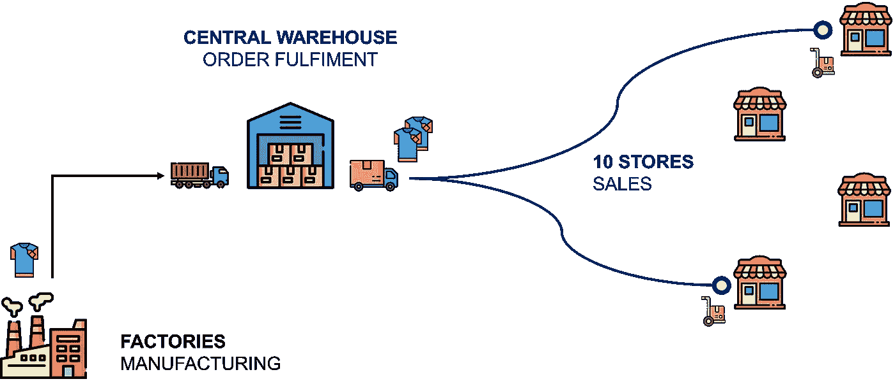

分销网络 — （图片由作者提供）

对于本次仿真，我将使用为关于绿色库存管理文章设计的模型，并考虑以下假设：

+   **365 天**的销售交易，涵盖**10 个**地点

+   **3,300 个活跃的 SKU**，其中**400 个 SKU**包含在循环经济模型中

+   库存定期审查政策规则：**2 天**

这意味着你的店铺每两天都会从中央仓库补货。

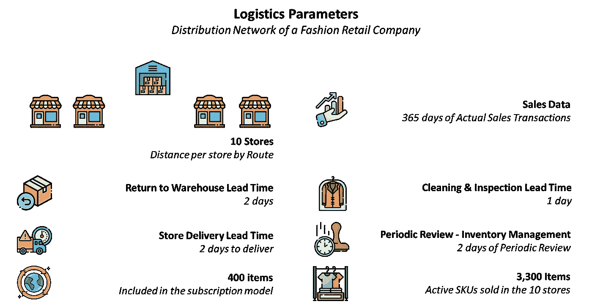

物流参数 — （图片由作者提供）

我们将添加与循环模型相关的假设

+   循环商品从仓库的交货周期：**2 天**

+   仓库清洁和检查：**1 天**

+   返回仓库交货周期：**2 天**

当商品在租赁期结束后返回时，需花费两天时间将其送回仓库。

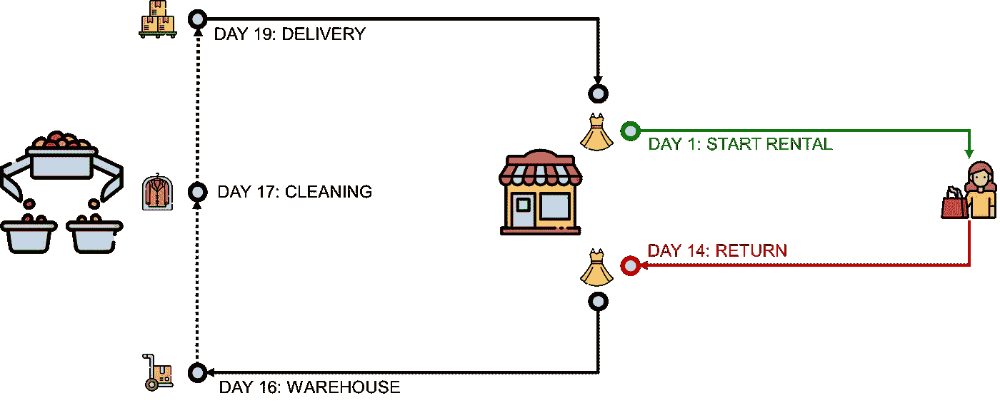

循环过程 — （图片由作者提供）

还需要一天时间来检查并清洁商品。

最终，商品将在额外的两天后返回到店铺。

现在我们已经引入了假设，可以专注于仿真。

# 循环模型的仿真模型

我们循环模型的主要参数将是租赁周期。

> 为了最大化减少排放，最佳的租赁周期是多少？

目标是测试多个租赁周期，观察其对 CO2 排放和水使用量减少的影响。

## 库存管理模型

与标准的线性模型不同，我们的库存将包含两种类型的物品。

如果客户租赁一件裙子，她可能

+   租赁一件前客户退还的裙子（经过清洁处理）。

+   租赁一件来自工厂的新裙子。

我将应用先进先出（FIFO）原则，协调这些流向每个店铺订单。

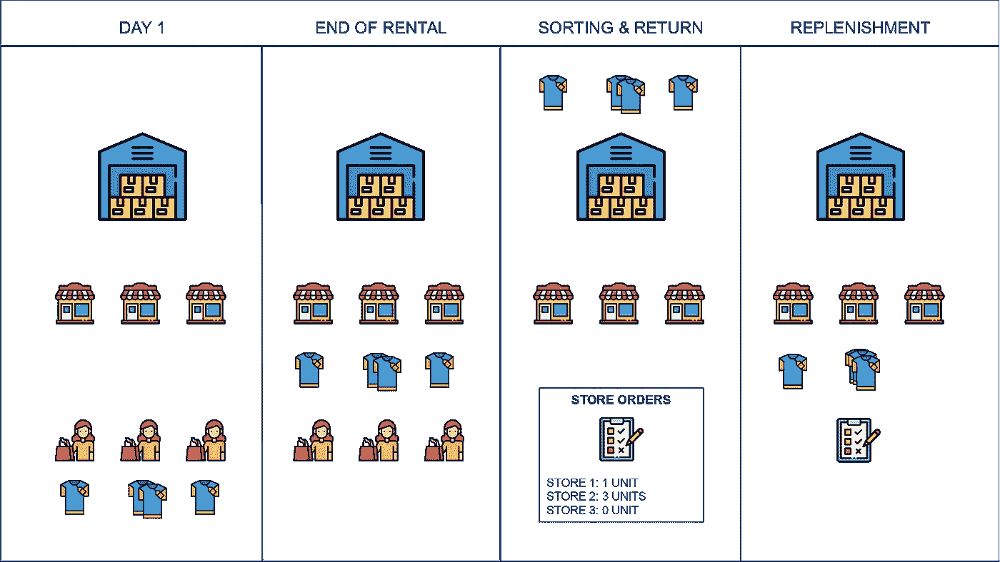

循环物品上的 FIFO 原则 — （图片由作者提供）

以上面的例子为例，

+   经过清洁和检查后，这四个退还的物品可供订购。

+   店铺 2 发送了第一个补货订单，数量为 3 个单位。

+   店铺 1 随后发送了一个补货订单，数量为 1 个单位。

因为**店铺 2**首先下单，所以到达仓库的**前三个单位**将发货到那里。

如果退货商品库存过低，订单将使用新商品完成。

这些额外的参数已在模拟模型中添加，基于我在以下文章中展示的例子。

 ## 可持续性数据科学 - 绿色库存管理

### 模拟店铺配送频率对时尚零售商 CO2 排放的影响

towardsdatascience.com

## 使用生命周期评估估算节省

为了评估你的循环经济表现，我们聚焦于

+   供应链总 CO2e 排放量**（千克 CO2e）**

+   生产和交付商品到店铺所使用的水量**（L）**

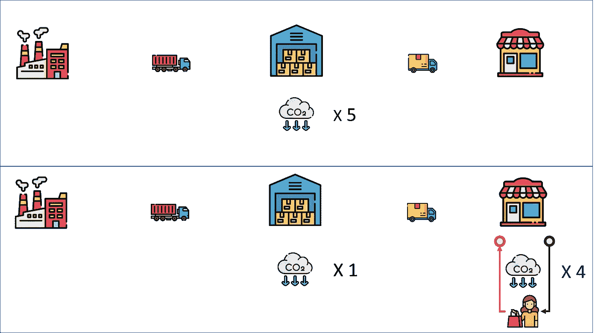

线性模型（上）与循环模型（下）—（图片由作者提供）

在上面的例子中，我们将从购买 5 次该商品转换为租赁 5 次该商品。

循环模型的足迹包括

+   **一个完整的生命周期** 从原材料提取到店铺交付。

+   **四次退货周期**，包括逆向物流和清洁过程。

然后我们可以使用以下公式估算节省，

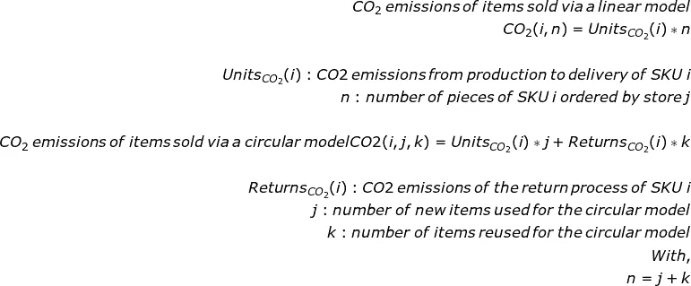

CO2 排放（线性与循环）—（图片由作者提供）

这种方法背后的主要假设是，物品的重复使用百分比将驱动节省。

如果你需要更多关于生命周期评估的信息，

 ## 什么是生命周期评估？LCA

### 了解生命周期评估如何帮助企业评估产品在整个生命周期中的环境影响…

towardsdatascience.com

这些公式应与每个项目在分析范围内的**生命周期评估**指标配对使用。

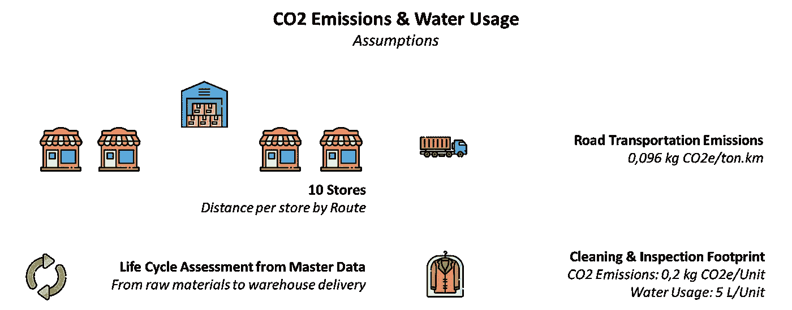

假设 — （图片来自作者）

+   排放量和水资源数据来自主数据。

+   额外的影响通过上述参数进行估算。

需要定义的另一个参数是**租赁时长**。

## 模拟场景

在与商品和物流团队讨论后，您已选择了**2、7、14 和 28 天**作为潜在的租赁时长。

您将使用实际的销售交易来模拟每个场景的正向和反向流动。

现在，让我们看看这四种不同租赁周期的结果。

> 你能猜到哪个时期能够提供最高的排放（和水资源使用）减少吗？

💡 在 Medium 上关注我，获取更多关于 🏭 供应链分析、🌳 可持续发展和 🕜 生产力相关的文章。

# 7 天租赁周期的模拟

既然我们已经在正确的假设下构建了模型，我们可以开始探索结果，假设**租赁周期为一周**。

## 循环百分比

> **新物品的使用百分比是多少？**

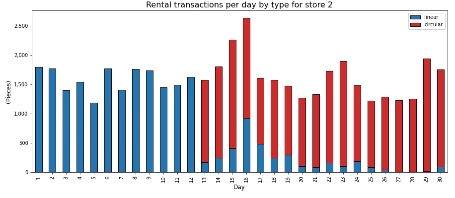

店铺 2 每天的循环物品百分比 — （图片来自作者）

**💡 见解**

+   在前 12 天，已归还物品的库存为零，因此店铺**仅使用新物品进行租赁**。

+   当出现流量高峰时，例如第 16 天，已归还物品的累计库存无法满足需求。

**循环百分比（%）是**租赁交易中已归还物品的比例。

这是影响循环模型环境表现的重要参数。

在前 12 天，由于我们使用新物品，租赁模型的碳足迹最高。

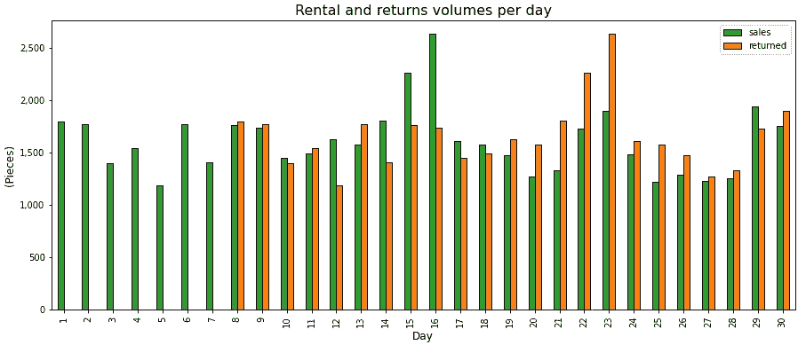

每日归还物品数量 — （图片来自作者）

这可以通过查看归还物品的数量轻松解释。

确实，我们可以看到第一批租赁物品是在**第 8 天**被归还的。

经过**5 天**的归还流程（取货、清洁和店铺发货）后，这些物品将在**第 13 天**进行新销售。

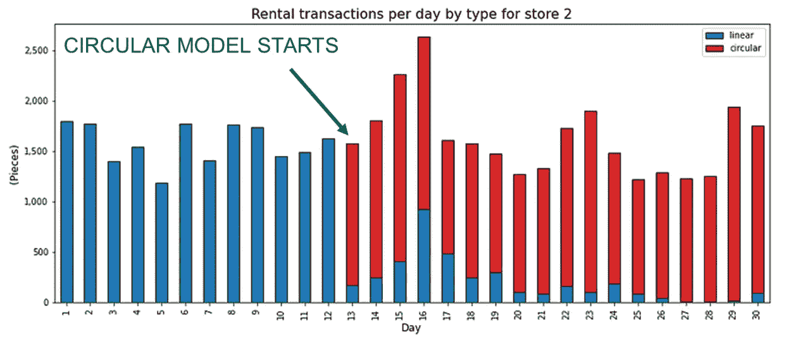

从第 13 天开始，循环物品的百分比逐渐增加 — （图片来自作者）

从这一天起，我们实现了租赁物品和归还物品的平衡分布，能够获得足够的库存，以便重复使用超过 75%的物品。

> 每个物品平均租赁多少次？

这个[c](https://www.youtube.com/watch?v=eGH4ZQYT3-4)图展示了物品在模拟期间按租赁周期数量的分布。

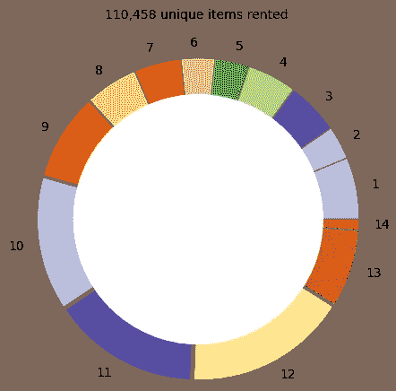

六个月内的循环次数 — （图片来自作者）

例如，9.8%的物品已被使用了 10 次。

**💡 见解**

+   **110,458 个独特物品**被用来完成**951,856 笔租赁交易** *每个物品平均租赁* ***8.61 次循环。***

+   一些物品可以达到**14 次循环**。

+   库存中有一部分物品仅使用了一次。

> **每件商品的环境影响是什么？**

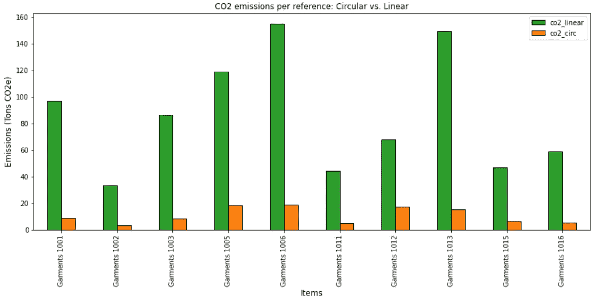

10 个 SKU 的 CO2 排放量 — （图片来源：作者）

让我们以一件外套租给**35 名客户**为例，使用的仅是**10 件独特的外套**。

我们将线性模型的排放量（绿色的**co2_linear**）定义为如果这些客户**购买**了 35 件外套时的总足迹。

循环模型的排放量（橙色的**co2_circ**）仅包括**10 件独特外套**的生产和**退货管理的物流**。

> 排放减少与租赁周期数之间是否存在关联？

## 需求波动性的影响是什么？

正如预期的那样，CO2e 减排量与周期数呈线性关系。

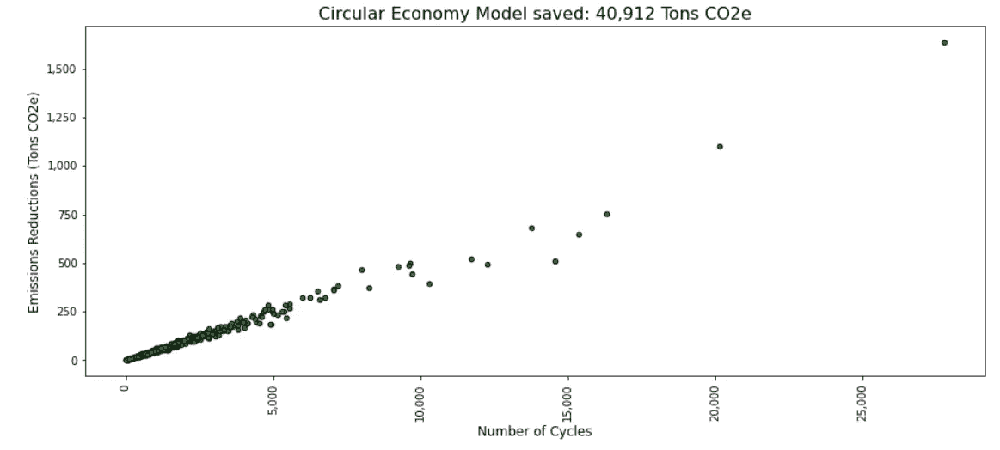

CO2 排放减少 = f（周期）— （图片来源：作者）

> **什么因素影响了重复使用商品的百分比？**

因此，我们希望实现**100%的租赁交易**为重复使用的商品，并限制**新商品购买**的数量。

> 什么因素影响了重复使用商品交易的百分比？

当需求高度波动时，退货商品的库存很快耗尽。因此，你需要购买新生产的商品。

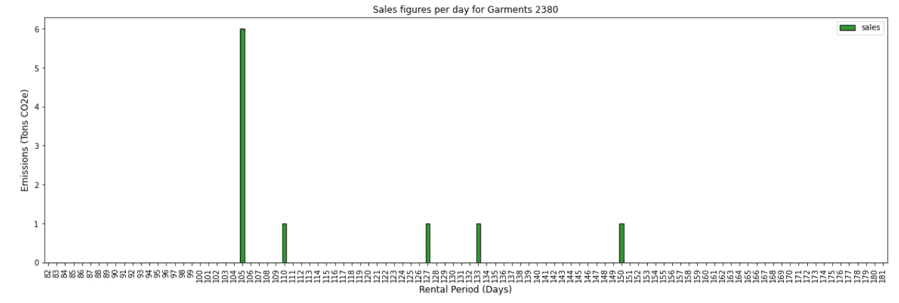

高变动需求 SKU 示例 — （图片来源：作者）

在上述例子中，需求分布高度偏斜。

+   该参考产品的总需求量的 60%发生在第 105 天的高峰期。

+   因此，循环率（通过重复使用商品完成的销售交易百分比）**仅为 40%**。

> 如果需求是稳定的，会怎样呢？

以下柱状图显示了 SKU 服装 1018 的销售分布；这款高销量商品有着稳定的分布。

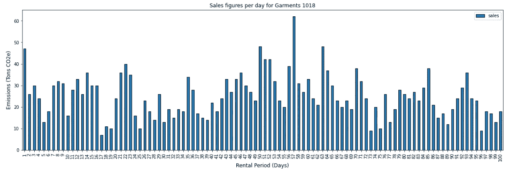

低变动需求 SKU 示例 — （图片来源：作者）

+   除了前几天，需求分布为建立退货商品的库存提供了足够的灵活性。

+   因此，我们可以实现**89%**的销售交易为重复使用的产品。

通过这两个例子，你开始理解需求波动性与循环系数之间的关系。

## 引入变异系数

让我介绍一下变异系数 CV：

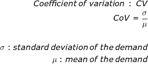

变异系数 — （图片来源：作者）

当变异系数 CV > 1 时，需求分布可以被视为不稳定。

> 400 件在范围内的商品的变动性是多少？

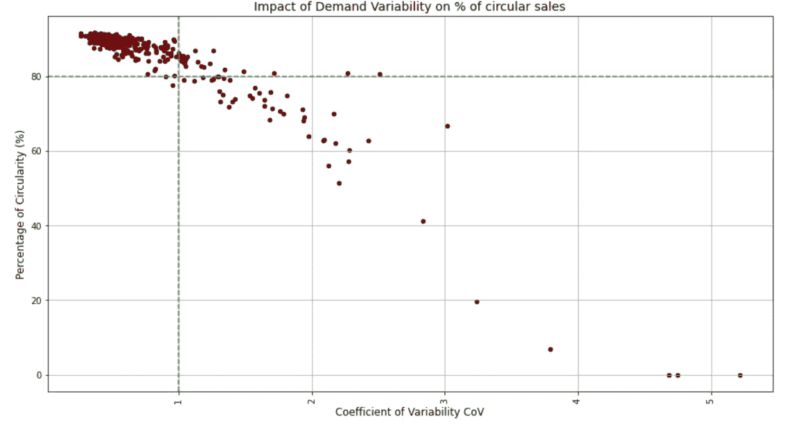

（图片来源：作者）

**💡 洞察**

+   **99.9%**的**CV<1**的商品，其循环率销售百分比超过**80%**

+   然而，一些**CV > 1.5**的商品，其循环率百分比高于 70%。

从逻辑上讲，我们可以看到每个租赁项目的排放减少影响，

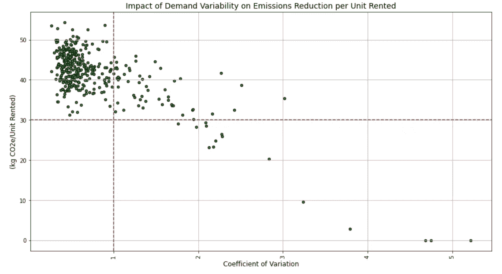

每单位排放 = f（变异系数）— （图片来源：作者）

**💡 洞察**

+   **CV<1**的物品中有 100%具有高于**30 kg CO2e 每单位租赁**的排放减少。

由于我们无法控制需求波动，让我们通过**调整租赁期**来探索如何增加排放减少量。

# 不同租赁期的模拟

在前一部分中，我们模拟了**7 天**的租赁期。

现在我们可以在**2 天**到**28 天**之间运行模型。

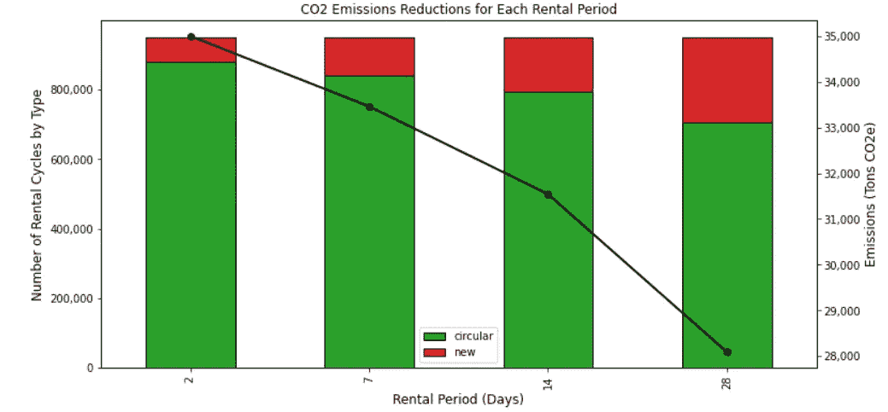

每种情境下的 CO2 排放减少量 — （图片来源：作者）

**💡 见解**

+   当租赁期增加时，减少的排放水平会下降。

+   最优租赁期为 2 天，CO2 排放减少量达到 35 千吨 CO2e。

+   延长租赁期会减少使用循环物品的比例。

通过查看 2 天租赁期内物品的循环利用率，可以验证这一点，

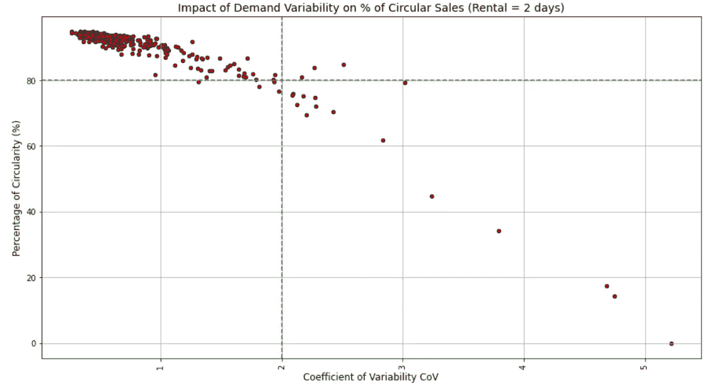

需求变动的影响（租赁期 = 2 天） — （图片来源：作者）

**💡 见解**

+   **99%**的**CV < 2**物品中，有超过 80%的租赁交易是通过重复使用的物品完成的（与 7 天租赁期时的**CV<1**相比）。

这意味着**短期租赁期**在应对需求波动时提供了**更多灵活性**。

不出所料，我们可以看到水资源节约的趋势也与此相同，

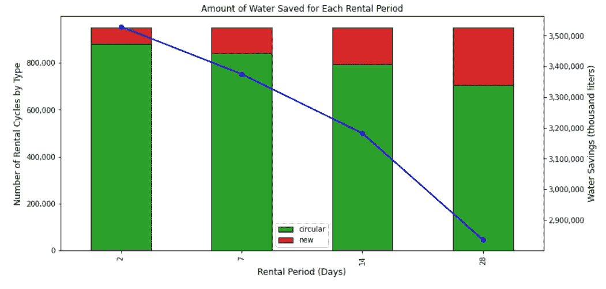

水资源节约 — （图片来源：作者）

随着租赁期的增加，物品的可租赁性下降。

因此，你会失去库存灵活性来应对需求波动。

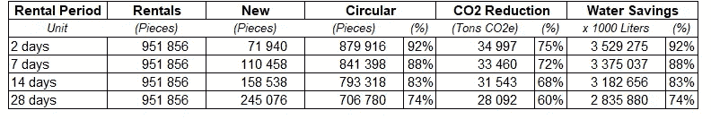

汇总结果 — （图片来源：作者）

然而，你的循环模型在 28 天租赁期下的表现依然令人印象深刻（60%的 CO2 减少，相比于线性模型）。

这张表格有助于推动讨论，并在商业需求与可持续性目标之间找到平衡。

# 结论

即使在最坏情况下，**28 天**的租赁期也能实现**60%的 CO2 减少**和**-74%的水资源使用减少**。

这意味着由于退货产品的物流产生的额外排放，并没有抵消通过重新使用产品所带来的节省。

然而，这假设商店和物流操作能够管理 400 个物品的租赁流程。

需要额外的参数来进行完整评估，

+   需要额外的员工和系统来管理退货流程

+   需要额外的包装或处理材料吗？

> 我们能否减少上游流程的环境影响？

## 供应链网络优化

为了进一步减少环境影响，你可以探索减少上游流程（*采购、生产和仓库交付*）环境影响的解决方案。

> 哪种工厂网络能够最小化 CO2 排放、水资源使用或生产成本？

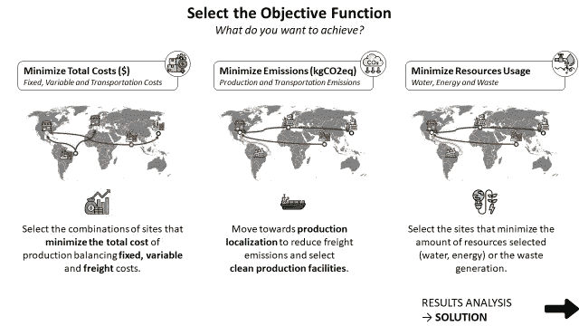

供应链网络设计问题 — （图片来源：作者）

**可持续供应链优化**是一种集成经济约束和环境指标的网络设计方法。

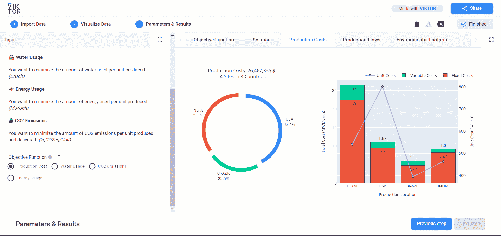

可持续供应链优化 [试用： [应用程序](https://cloud.viktor.ai/public/sustainable-supply-chain-network-optimization)] — （图片由作者提供）

在上一篇文章中，我介绍了一款支持供应商选择的网络应用程序，旨在**最小化供应链的环境影响**。

该解决方案可以与循环模式结合，最大化减少足迹并优化资源使用。

🚀 现在试用应用程序！

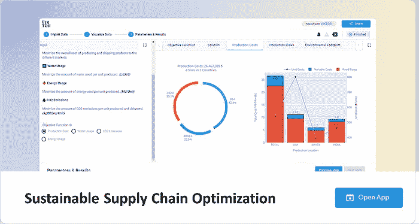

访问应用程序试用一下！— [[应用程序](https://cloud.viktor.ai/public/sustainable-supply-chain-network-optimization)]

# 关于我

让我们在[Linkedin](https://www.linkedin.com/in/samir-saci/)和[Twitter](https://twitter.com/Samir_Saci_)上保持联系。我是一名供应链工程师，利用数据分析改善物流运营并降低成本。

如果您需要供应链转型的咨询或建议，请通过[Logigreen Consulting](https://www.logi-green.com/)与我联系。

如果您对数据分析和供应链感兴趣，请访问我的网站。

 [## Samir Saci | 数据科学与生产力

### 关注数据科学、个人生产力、自动化、运筹学和可持续性等领域的技术博客…

[samirsaci.com](https://samirsaci.com/?source=post_page-----b6a13d4b0451--------------------------------)

💡 在 Medium 上关注我，获取更多关于🏭供应链分析、🌳可持续性和🕜生产力的相关文章。

# 参考文献

+   “美国的干洗和洗衣服务”报告，由 IBISWorld 发布

+   “服装清洁和洗衣服务的碳足迹：综述” 由 T. Randell、M. Sohail 和 M. Reynolds 编写（《清洁生产杂志》，2016 年）
