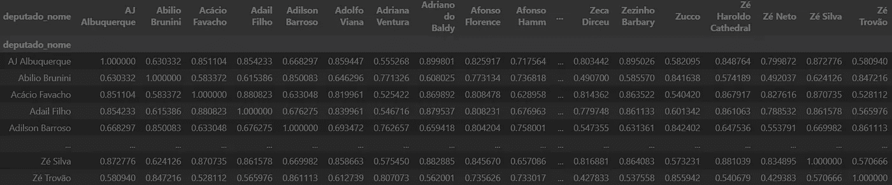
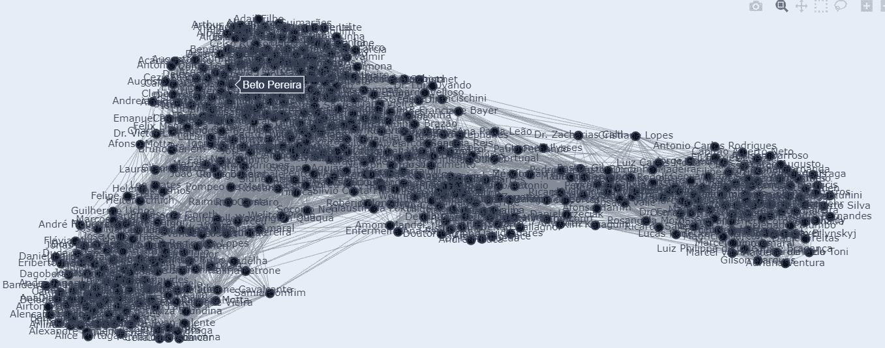
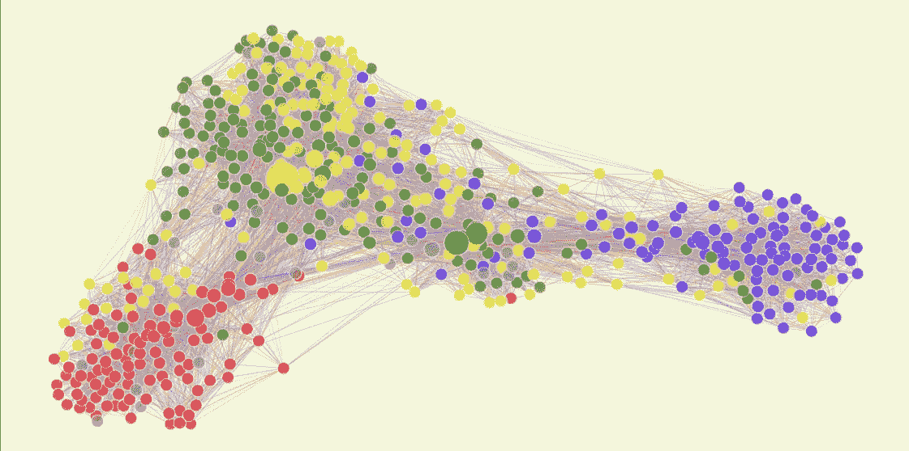
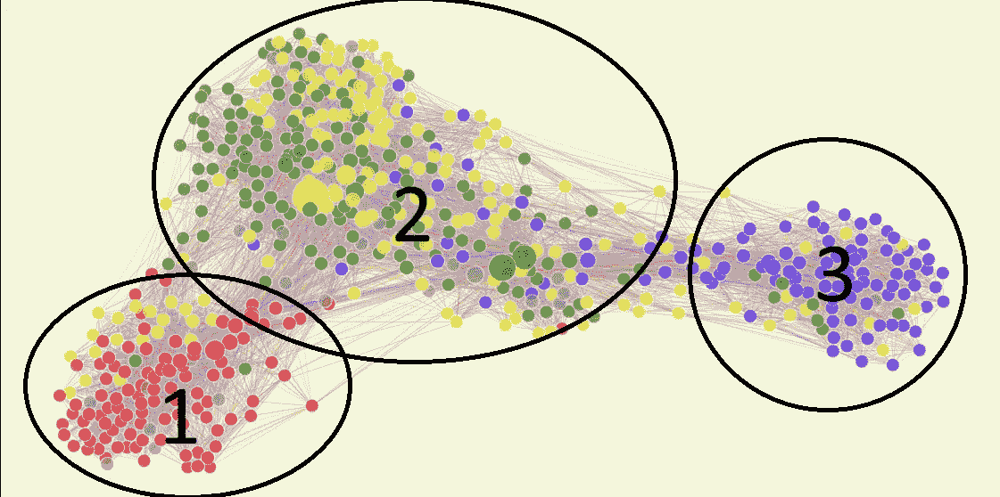
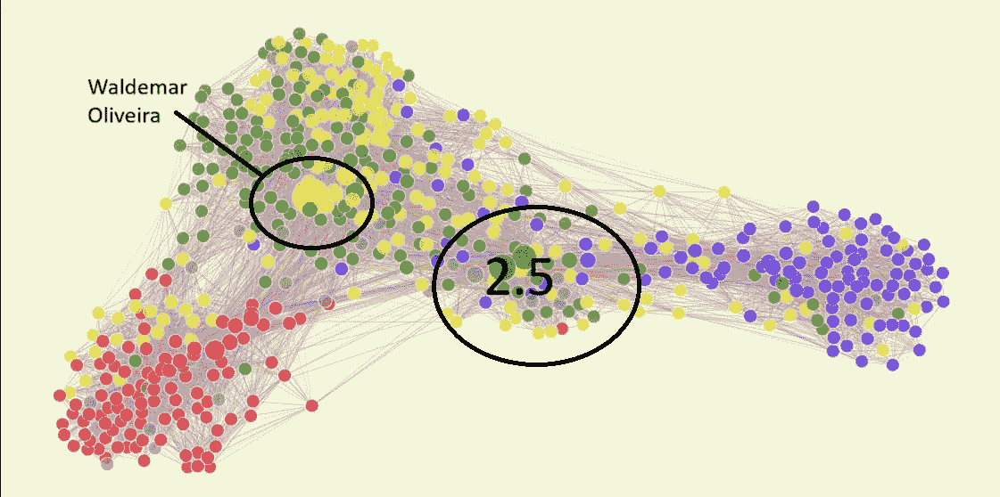

# 数据科学与政治的结合

> 原文：[`towardsdatascience.com/data-science-meets-politics-709cf00c88e2?source=collection_archive---------3-----------------------#2024-09-27`](https://towardsdatascience.com/data-science-meets-politics-709cf00c88e2?source=collection_archive---------3-----------------------#2024-09-27)

## 揭示国会动态与网络

[](https://medium.com/@luizvenosa21?source=post_page---byline--709cf00c88e2--------------------------------)[](https://towardsdatascience.com/?source=post_page---byline--709cf00c88e2--------------------------------) [Luiz Venosa](https://medium.com/@luizvenosa21?source=post_page---byline--709cf00c88e2--------------------------------)

·发表于[Towards Data Science](https://towardsdatascience.com/?source=post_page---byline--709cf00c88e2--------------------------------) ·阅读时间：8 分钟·2024 年 9 月 27 日

--


巴西国会 — [Gustavo Leighton](https://unsplash.com/@g_leighton?utm_content=creditCopyText&utm_medium=referral&utm_source=unsplash)拍摄的照片，来自[Unsplash](https://unsplash.com/photos/a-black-and-white-photo-of-a-building-YS03LgfZs-k?utm_content=creditCopyText&utm_medium=referral&utm_source=unsplash)

# 谁能理解政治人物？

很少有一群人能像国家国会成员那样难以理解。在几乎每个国家，虚伪的政治人物形象在民众中臭名昭著。后台交易和米色信封常常出现在政治剧集中。与此同时，他们是最需要理解的群体之一，因为他们的行动直接影响着国家的未来。

为了理解国会，我将基于一句流行的格言——“以行动评判人，而非言辞”。因此，我将根据议员的投票历史对国会议员进行比较和分组。通过这种方式，我们可以揭示那些隐晦的模式，理解国会的真正动态。

对于这个项目，我将重点关注我的祖国——巴西的众议院（Camara dos Deputados），但这一方法也可以应用于任何国家。

# 数据收集

首先，我们需要数据。

我下载了 2023 年至 2024 年 5 月 18 日之间所有投票法案的数据，以及每位国会议员的投票记录。所有数据都可以在巴西国会的[开放数据门户](https://dadosabertos.camara.leg.br/)找到。然后，我创建了两个不同的 pandas 数据框，一个包含所有投票法案，另一个记录了每个国会议员在每次投票中的投票情况。

```py
votacoes = pd.concat([pd.read_csv('votacoes-2023.csv', header=0, sep=';'),  pd.read_csv('votacoes-2024.csv', header=0, sep=';')])
votacoes_votos_dep = pd.concat([pd.read_csv('votacoesVotos-2023.csv', sep=';', quoting=1) ,  pd.read_csv('votacoesVotos-2024.csv', sep=';', on_bad_lines='warn', quoting=1, encoding='utf-8')])
```

对于***votacoes***数据框，我只选择了**idOrgao**为 180 的条目，这意味着它们是在国会的主会议厅投票的。所以，我们有大部分国会议员的投票数据。然后，我使用*votacoes_Ids*列表来过滤***votacoes_votos_dep***数据框。

```py
plen = votacoes[votacoes['idOrgao'] == 180]
votacoes_ids = plen['id'].unique()
votacoes_votos_dep = votacoes_votos_dep[votacoes_votos_dep['idVotacao'].isin(votacoes_ids)]
```

现在，在***votacoes_votos_dep***中，每个投票都是一行，包含国会议员的姓名和投票会话 ID，用于识别谁进行了投票以及投票的内容。因此，我创建了一个透视表，使每行代表一位国会议员，每列表示一项投票，将“是”编码为 1，“否”编码为 0，并删除了超过 280 位代表没有投票的投票。

```py
votacoes_votos_dep['voto_numerico'] = votacoes_votos_dep['voto'].map({'Sim': 1, 'Não':0})
votes_pivot = votacoes_votos_dep.pivot_table(index='deputado_nome', columns='idVotacao', values='voto_numerico').dropna(axis=1, thresh=280)
```

在计算相似度矩阵之前，我将所有剩余的 NAs 填充为 0.5，以避免干扰国会议员的位置设置。最后，我们计算每个代表的向量之间的余弦相似度，并将其存储在数据框中。

```py
from sklearn.metrics.pairwise import cosine_similarity
similarity_matrix = cosine_similarity(votes_pivot)
similarity_df = pd.DataFrame(similarity_matrix, index=votes_pivot.index, columns=votes_pivot.index)
```



相似度矩阵 - 图片由作者提供

# 构建国会网络图

现在，使用有关国会议员投票相似度的信息，通过[N[etworkx](https://networkx.org/)](https://networkx.org/)构建网络。每个节点将代表一位成员。

```py
import networkx as nx

names = similarity_df.columns
# Create the graph as before
G = nx.Graph()
for i, name in enumerate(names):
    G.add_node(name)
```

然后，连接两个节点的边代表这两位国会议员投票行为相似度至少为 75%。此外，为了解决一些国会议员与其他高相似度成员的关系问题，我只选择了前 25 位相似度最高的国会议员来添加边。

```py
threshold = 0.75
for i in range(len(similarity_matrix)):
    for j in range(i + 1, len(similarity_matrix)):
        if similarity_matrix[i][j] > threshold:
            # G.add_edge(names[i], names[j], weight=similarity_matrix[i][j])
            counter[names[i]].append((names[j], similarity_matrix[i][j]))
for source, target in counter.items():
    selected_targets = sorted(target, key=lambda x: x[1], reverse=True)[:26]
    for target, weight in selected_targets:
        G.add_edge(source, target, weight=weight)
```

为了可视化网络，你需要决定每个节点在平面上的位置。我决定使用弹簧布局，它将边作为弹簧，将节点拉近，同时尽量分开。添加种子值可以保证结果的可复现性，因为这是一个随机过程。

```py
pos = nx.spring_layout(G, k=0.1,  iterations=50, seed=29)
```

最后，我们使用 Go 图形绘制网络，并根据节点的位置单独添加边和节点。

```py
 # Create Edges
edge_x = []
edge_y = []
for edge in G.edges():
    x0, y0 = pos[edge[0]]
    x1, y1 = pos[edge[1]]
    edge_x.extend([x0, x1, None])
    edge_y.extend([y0, y1, None])

# Add edges as a scatter plot
edge_trace = go.Scatter(x=edge_x, y=edge_y, line=dict(width=0.5, color='#888'), hoverinfo='none', mode='lines')
# Create Nodes
node_x = []
node_y = []
for node in G.nodes():
    x, y = pos[node]
    node_x.append(x)
    node_y.append(y)

# Add nodes as a scatter plot
node_trace = go.Scatter(x=node_x, y=node_y, mode='markers+text', hoverinfo='text', marker=dict(showscale=True, colorscale='YlGnBu', size=10, color=[], line_width=2))

# Add text to the nodes
node_trace.text = list(G.nodes())

# Create a figure
fig = go.Figure(data=[edge_trace, node_trace],
                layout=go.Layout(showlegend=False, hovermode='closest', margin=dict(b=0,l=0,r=0,t=0), xaxis=dict(showgrid=False, zeroline=False, showticklabels=False), yaxis=dict(showgrid=False, zeroline=False, showticklabels=False)))

fig.show()
```

结果：



图片由作者提供

好的，这是一个不错的开始。可以看到国会议员的不同簇，表明这准确地捕捉到了国会中的政治立场和联盟。但它还是有点乱，很难真正看出其中的关系。

为了改善可视化效果，我设置只有在鼠标悬停在节点上时才显示名称。同时，我根据国会网站上的政党和联盟为节点着色，并根据它们连接的边数调整大小。



图片由作者提供

看起来好多了。我们有三个簇，簇与簇之间有些节点，且每个簇中有一些较大的节点。同时，在每个簇中，某一特定颜色占据了多数。好了，让我们来分析一下。

# 解释结果

首先，让我解释一下颜色的含义。红色代表当前左翼政府的基础，也就是总统所在党派的国会议员或公共盟友，PT、PSOL、PCdoB 等。蓝色代表反对派，由 PL（前总统所在党派）领导，另有一个右翼党派，NOVO。

绿色和黄色代表巴西政治中的一种现象，称为“中间派”或“大中间”。中间派由未与任何党派结盟的政党组成，这些政党总是与当前政府结盟，并将他们的支持交换为政府职位或国有企业的任命。黄色代表以 UNIAO 为中心的群体，UNIAO 是巴西最大的政党。绿色则是以 MDB 为中心的群体，MDB 是一个历史悠久的党派，曾经掌握大部分“中间派”的控制权。

那么，我们回到图表：



图像来源：作者

第一组似乎主要由红色组成，代表当前政府及其最亲密的盟友。内部的黄色点主要来自 AVNATE，尽管他们公开与 UNIAO 在同一个联盟中，但似乎在政治上更多地倾向于左翼。

网络模型捕捉到的另一个有趣的动态是每个更大群体内部特定党派和意识形态的分组。在第一组中，紧靠第一号基础的下方，有七个节点非常接近。这些节点代表 PSOL 的国会议员，PSOL 是一个激进的左翼党派。有趣的是，即使在左翼阵营内部，他们也被表示为网络中的一个子群体。

第二组似乎主要由我们之前所称的“中间派”（Centrao）构成。和往常一样，他们是政府的基础部分；他们比第三组更接近第一组，我们可以看到预期中的绿色和黄色混合，以及一些蓝色的点。这意味着许多本应在反对派的国会议员投票方式与政府相似。为什么？嗯，PL，现在的“反对派”党，曾经是一个典型的“中间派”党派。因此，历史上的成员仍然像典型的“中间派”那样行事。

值得注意的是，我们在第二组中看到了最大的节点。一个是黄色的，代表政府在众议院的领袖瓦尔德马尔·奥利维拉（Waldemar Oliveira）。他在国会中非常重要，因为大部分议员会根据他的指示投票。其他两个最大的节点也在第二组中，但位于我所称的第二组半（Group 2.5）中。



图像来源：作者

第二组半（Group 2.5）行为背后的原因超出了本文讨论的范围；简单来说，这是一个由标榜为“右翼”的国会议员组成的群体，但他们的行为更像是“中间派”。他们只有在偶尔与右翼投票时才会接近第三组，但每当涉及第二组关心的投票时，他们会脱离并与第二组投票。

最后，第三组与另外两组的分布不同。它是国会中最小的一组，且主要由 PL 党派的代表组成。它呈现出更“分散”的特点，因为其成员和第二组之间有很多空隙，表明他们并非总是一起投票。同时，没有超大的节点，因此没有明确的领导者对整个区块施加影响。这种模式是合理的，并与现实相符，因为反对派在当前国会中未能取得太多成功。

# 结论

总结来说，使用网络分析巴西国会提供了关于政治联盟和投票行为的宝贵见解。我们对投票模式的可视化展示揭示了三个不同的群体：政府的支持基础、“中间派”（Centrao）以及反对派。该图有效地展示了各党派之间微妙的关系，揭示了公众立场的偏差，并突出了具有影响力的人物。

这种数据驱动的方法增强了我们对政治动态的理解，提供了对立法机构内部复杂互动的清晰视觉呈现。通过利用这样的分析工具，我们可以促进政治过程中的透明度，并推动关于国家政治状况的更有根据的讨论。

现在图表已经准备好，我们可以用它来回答类似的问题：

1.  中间派何时与政府或反对派投票？

1.  网络的重要性与员工支出之间有联系吗？

1.  网络中的对齐程度与地理位置之间有相关性吗？

如果你喜欢这篇文章并想阅读更多关于用数据科学分析政治的见解，可以在[这里](https://medium.com/@luizvenosa21)关注我，不要错过。感谢阅读。

请在评论中告诉我你对这种分析政治动态的方法的看法，以及是否有任何地方做得不对。
