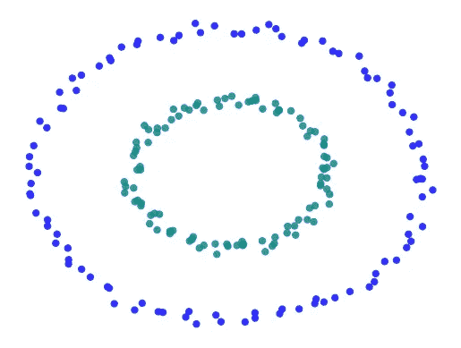

# 数据科学技能 101：如何解决任何问题，第二部分

> 原文：[`towardsdatascience.com/data-science-skills-101-how-to-solve-any-problem-part-ii-38cd0e5e5dbc?source=collection_archive---------9-----------------------#2024-05-30`](https://towardsdatascience.com/data-science-skills-101-how-to-solve-any-problem-part-ii-38cd0e5e5dbc?source=collection_archive---------9-----------------------#2024-05-30)

## *六种你可以在现实生活中应用的简单技巧*

 [Josh Taylor](https://medium.com/@thejoshtaylor?source=post_page---byline--38cd0e5e5dbc--------------------------------)

·发表于 [Towards Data Science](https://towardsdatascience.com/?source=post_page---byline--38cd0e5e5dbc--------------------------------) ·阅读时间 8 分钟·2024 年 5 月 30 日

--

本系列的第一部分讨论了解决问题技能日益增长的需求。随着我们的世界越来越多地被 AI 自动化，这些技能比以往任何时候都更加重要。

本文继续概述了解决任何问题的实际策略。接下来将介绍三种技巧，并通过实际应用示例进行说明。

## 提醒：测试你的问题解决能力：

第一篇文章还包括了一个问题，用来测试你的问题解决技能。

提醒一下，任务是绘制一条线，在下图中将蓝色点和绿色点完全分开：

一个需要解决的问题；你能否只用一条直线将两组点分开？ 来源：作者

还在找答案吗？以下三种技巧应该有助于解决这个难题（如果没有，答案会在文章末尾给出！）

## 4\. 降低精度

来源：作者

**理解我们的太阳系：N 体问题**
