# 数据科学支持循环经济实施

> 原文：[`towardsdatascience.com/data-science-to-implement-a-circular-economy-c9de824e73be?source=collection_archive---------4-----------------------#2024-03-20`](https://towardsdatascience.com/data-science-to-implement-a-circular-economy-c9de824e73be?source=collection_archive---------4-----------------------#2024-03-20)

## 您如何利用数据科学来支持快时尚零售商实施循环经济？

 [Samir Saci](https://s-saci95.medium.com/?source=post_page---byline--c9de824e73be--------------------------------)

·发表于 [Towards Data Science](https://towardsdatascience.com/?source=post_page---byline--c9de824e73be--------------------------------) ·阅读时间 10 分钟·2024 年 3 月 20 日

--

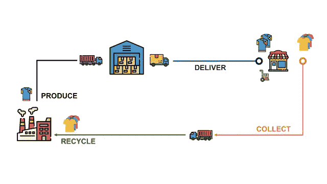

（图片来自作者）

循环经济是一种经济系统，其中资源在一个封闭的循环中被使用、重复使用或回收，而不是被提取并作为废弃物丢弃。

> 您退还给您最喜欢的快时尚零售商的旧衣物会发生什么？

目标是最大化资源利用，并在每个生命周期结束时再生产品或材料。

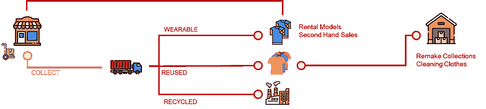

服装退还后的处理流程 — （图片来自作者）

它们被收集并分类为三种不同的类别

+   **可穿戴衣物**：这些将作为二手衣物转售。

+   **再利用的衣物**：这些将被转化为其他产品，如“重制系列”或清洁用布。

+   **回收衣物**：这些将被粉碎成纺织纤维，用来制造绝缘材料。

> 作为数据科学经理，您如何支持公司向循环经济的转型？

这需要对您的**物流**和供应链**运营**进行重大**转型**，以将这些过程纳入价值链。

在本文中，我们将探讨如何通过提供**监控**、**诊断**和**优化工具**，利用**数据科学**支持**向循环经济的转型**。

# 什么是循环经济？

## 数据科学支持绿色转型

您是一个国际**服装集团**的**物流部门**的数据科学经理，该公司在全球拥有门店。

该公司在亚洲的工厂生产服装、包包和配饰。

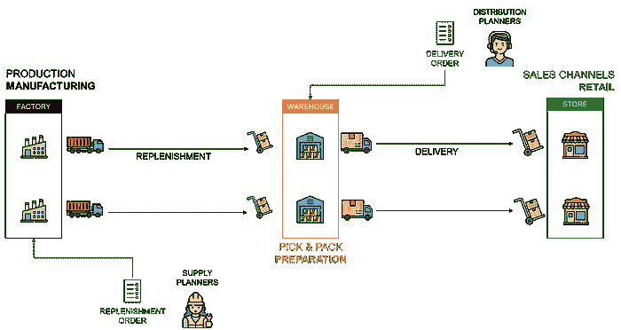

供应链网络 — （图片来自作者）

这些工厂向中央仓库交付货物，以补充商店的库存。

去年，你的首席执行官公开承诺支持[联合国可持续发展目标](https://s-saci95.medium.com/what-are-the-sustainable-development-goals-sdgs-988a1eb2b62b)，并特别关注地球的目标。

17 个可持续发展目标 [文章：[链接](https://s-saci95.medium.com/what-are-the-sustainable-development-goals-sdgs-988a1eb2b62b)] — （图片来源：作者）

因此，**可持续发展团队**正在制定一个**路线图**，计划到 2030 年减少碳足迹。

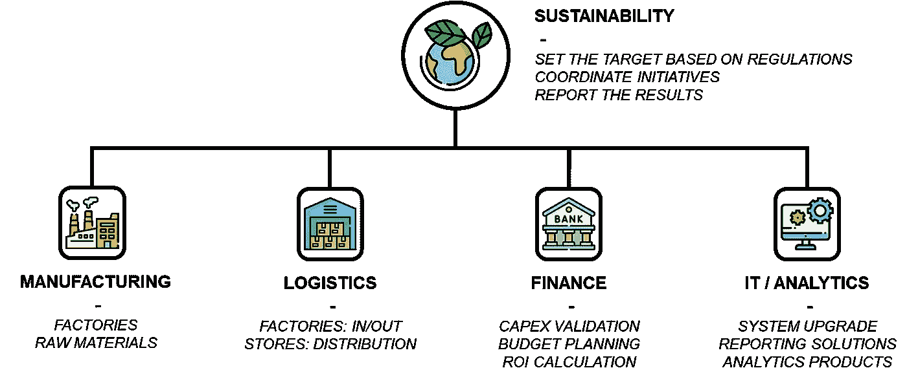

可持续发展路线图项目团队 — （图片来源：作者）

已经组建了一个项目团队，团队成员包括来自运营部门（制造和物流）、财务经理和 IT 专家的专家。

作为数据科学经理，你为**物流**部门在转型中的**实施挑战**提供**分析解决方案**。

## 分销网络的转型

需要对分销网络进行彻底重组，以包括这个逆向流动。

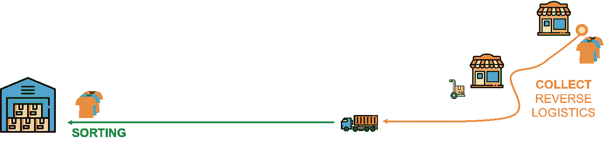

逆向物流 — （图片来源：作者）

目标是实施一套过程来

1.  提供客户在商店的**“收集箱”**中投放旧衣服的选项。

1.  组织将这些箱子转移到一个中央仓库。

1.  在仓库实施过程，将物品分类为**三类**以**进一步处理**。

由于本节重点是物流管理，我们将不会深入探讨回收过程的细节。

> 如何通过数据支持这些解决方案的设计和实施？

你的任务是**设计先进的分析工具**，以**监控**运营的 KPI 并**优化**过程。

在下一节中，我们将详细介绍组织在实施这些过程变更时可能面临的运营挑战。

# 数据科学支持运营

多年来，你与物流团队合作，实施**报告**和**优化**工具用于**前向物流**。

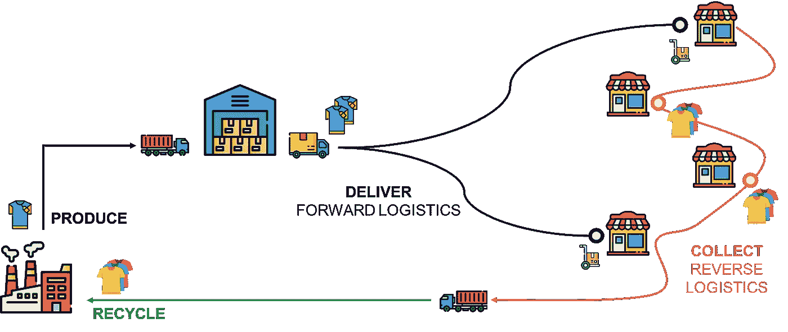

逆向物流 — （图片来源：作者）

**他们有额外的要求，需要管理收集和分类过程，为向循环经济过渡做好准备**。

> 我们需要监控和优化哪些额外的过程？

在本节中，我们将简要介绍几个过程设计需求的示例以及相关的分析解决方案。

## 描述性分析：产品跟踪与可追溯性

因为法规要求，你必须确保产品的使用和处理尽可能可持续。

因此，物流团队需要能够**追踪**和**追溯**产品的整个**生命周期**。

产品追踪与可追溯性 — （图片来源：作者）

对于正向物流，产品从工厂到商店的追踪。

+   **主数据数据库**将包括（库存单位）SKU 编号、产品信息（尺寸、颜色、包装）

+   **生产系统**可以提供批次号（如果需要调用商品时很有用）、生产日期和工厂位置。

+   **仓库与运输管理**可以沿着物流链追踪产品，从仓库接收直到店铺交付。

> 如何通过高级分析支持退货商品的追踪？

对于逆向物流，物流部门需要你的支持来监控“退货”产品从**回收箱**到**分拣中心**的流动。

物流管理系统 — （图片来源：作者）

不同的物流系统记录交易数据，可以作为数据源用来构建自动化的流动监控工具：

+   **企业资源计划（ERP）**记录店铺的客户退货信息，包括**店铺位置**、SKU ID、数量、**回收箱 ID**和**回收时间**。

+   **运输管理系统**记录了回收箱的取件情况，包括商店位置、回收箱 ID 和取件时间**。**

+   **仓库管理系统**跟踪从接收商品到分拣过程结束的商品信息，包括 SKU ID、回收箱、接收时间、分拣结束时间和最终目的地。

数据仓库结合来自多个来源的数据 — （图片来源：作者）

使用中央数据仓库的商业智能方法可以支持创建统一的追踪数据源，这些数据源可用于审计或报告。

如果你需要更多关于如何实现它的细节，可以查看这篇文章。

 ## 什么是商业智能？

### 发现适用于供应链优化的数据驱动决策工具。

towardsdatascience.com

现在你已经为操作提供了**透明度**，接下来让我们专注于流程优化。

## 预测性分析：分拣网络设计

物流团队希望设计一个**分拣中心网络**，以**最小化**逆向流动的环境**影响**。

最优网络可能与当前网络不同，因为你需要在销售后收集商品并将回收材料重新引入链条中。

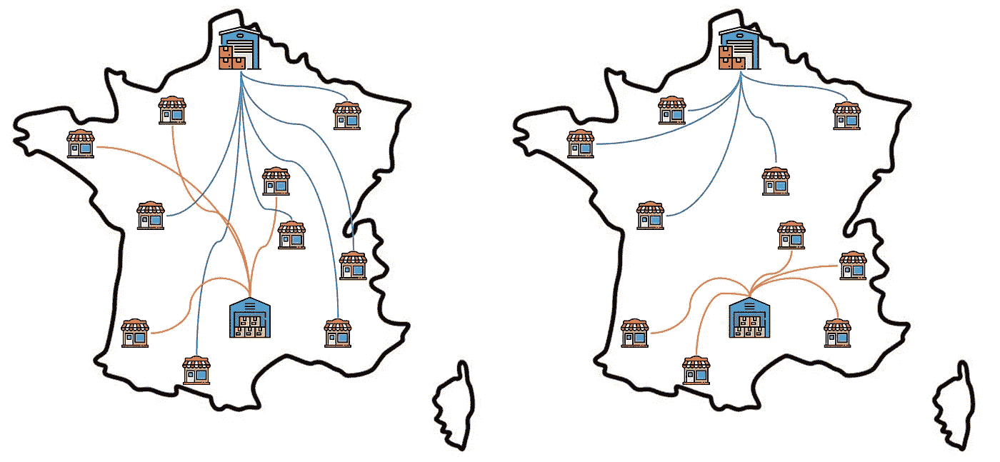

网络设计 — （图片来源：作者）

它们与您分享了

+   一个潜在排序地点的列表及其能力**（单位/天）**

+   来自仓库的反向流量预报**（单位/天）**

> ***问题***：我们应该将排序中心放置在哪里，以最小化成本和二氧化碳排放？

这将提醒您供应链网络优化问题，您需要为此设计一个工厂网络。

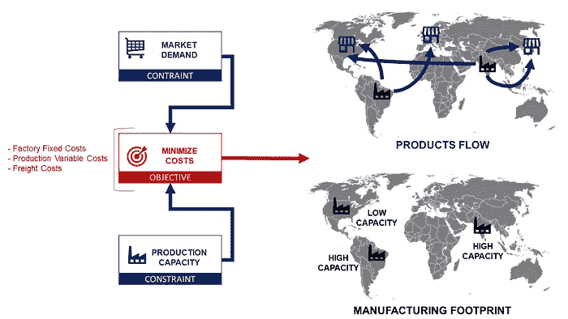

供应链网络问题 — （图片来源：作者）

市场需求必须由具有有限产能和不同成本的工厂来满足，以生产和交付商品。

线性规划用于选择合适的工厂，在满足一组约束条件的同时最小化总体成本。

更多细节，请查看这个详细示例

 ## 使用蒙特卡洛模拟的强健供应链网络

### 在设计供应链网络时，您是否考虑了需求波动？

towardsdatascience.com

> 我们如何将这个解决方案调整到排序网络设计问题上？

这个问题可以很容易地适应新的问题。

+   需求 => 从仓库收集的单位**（单位/天）**。

+   工厂产能 => 每个中心的排序能力**（单位/天）**。

然后，您可以根据目标选择最佳的排序地点集。

+   **最小化总成本？**

    算法将考虑**运输成本**（从仓库到每个排序地点）和每个中心的**排序成本**。

+   **最小化二氧化碳排放？**

    算法将尽力**最小化**从仓库到选定中心的距离。

现在，您已选择了最佳的排序中心集，您可以**组织反向流**。

## 处方分析：反向流优化

运输团队请求您支持设计一个工具，将正确的排序中心分配给每个仓库。

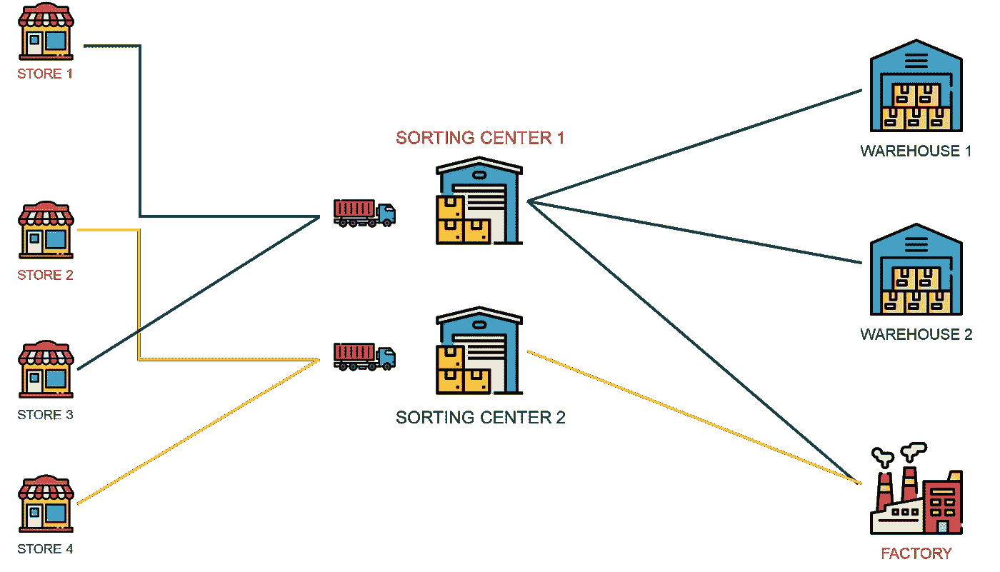

反向物流规划问题 — （图片来源：作者）

事实上，随着体积和产能的变化，最好每周或每天动态地为每个仓库分配一个排序中心。

> ***问题***：对于每个仓库 i，应该由哪个中心对退货进行排序，以最小化运输成本？

在上一篇文章中，我讨论了一个类似的问题：供应计划问题。

供应计划问题 — （图像来源：作者）

多个工厂为配送中心补货，配送中心存储商品并将其配送到门店。

为了解决这个问题，我们还使用线性规划来

+   优化从工厂到配送中心的上游流动

+   从正确的仓库向每个门店配送

该解决方案在**稍作调整**后可以使用

1.  定义（或预测）从分拣中心到最终回收地点的货物流量

1.  定义每个分拣中心的能力

你可以按照本文中详细介绍的方法（并使用代码）进行操作。

 ## 使用线性规划与 Python 进行供应计划

### 你需要将库存分配到哪里，以满足客户需求并减少运输成本？

towardsdatascience.com

现在我们已经设计了分拣位置的网络，并开发了优化反向流动的工具，我们可以着手进行绩效监控。

你听说过**可持续供应链优化**吗？

# 分析解决方案的实施

## 如何实施分析能力？

供应链是指多个方交换物料、信息或资金资源，以履行客户需求的过程。

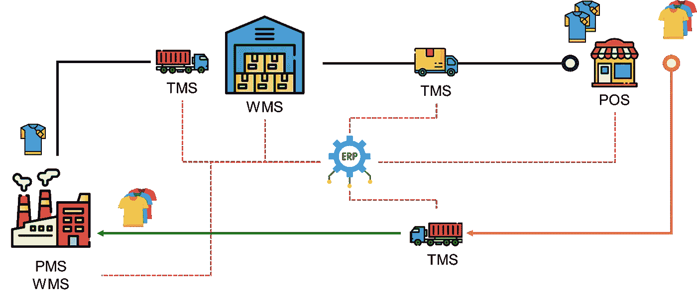

用于监控流动的系统 — （图像来源：作者）

为了交换和存储信息，这些方使用不同的系统：

+   运输管理系统（TMS），

+   销售点（POS）系统用于管理销售数据

+   仓储和生产管理系统

它们连接到一个中央**企业资源规划（ERP）**系统，该系统集中管理端到端的操作。

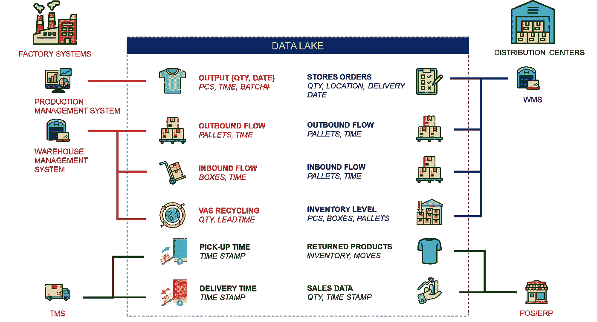

供应链集成：可以从系统中捕获关键数据 — （图像来源：作者）

这些系统可以纳入数据架构中，用于收集、处理和分析来自多个来源的交易数据。

这个集中来源的统一且清洁的数据可以用于

1.  部署上一节中介绍的分析产品。

1.  实施绩效指标来监控反向流动的“健康”状况。

## 实施绩效指标

物流管理需要能够可视化一组指标，以跟踪循环经济实施的进度，并在需要时进行调整。

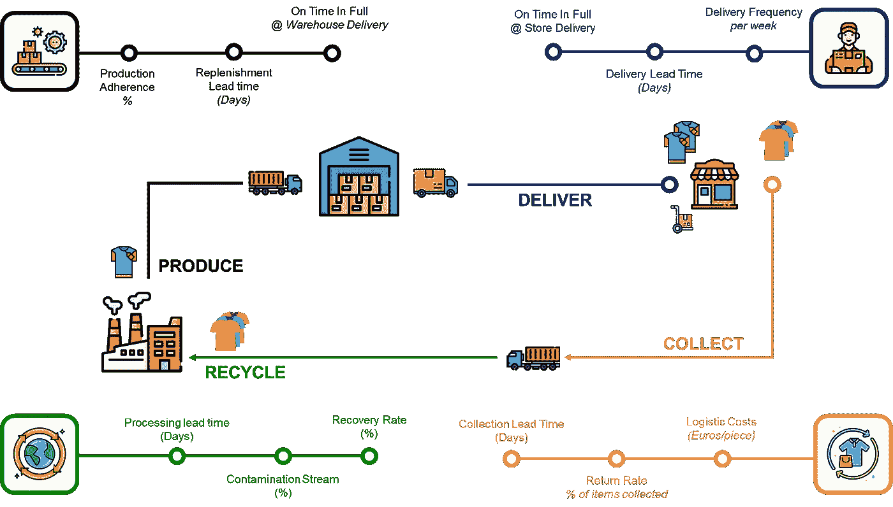

绩效管理分析 — （图像来源：作者）

他们希望跟踪关键绩效指标（KPI）以

**物流绩效**

+   补货、配送和收货**提前期**

+   **每件商品的仓储和运输成本**

+   仓库和门店配送的**准时且完整（OTIF）**

这些指标侧重于你的收集网络的表现，可以通过仓储和运输管理系统收集。

相关的回收过程的额外关键绩效指标（不在本文范围内）可以被添加来进行测量。

+   **生产遵从率**：生产的数量/计划数量的百分比。

+   **回收率**：成功回收的可回收材料的百分比。

+   **污染率**：流中发现的不可回收材料的百分比。

+   **处理前置时间**：处理一定量收集材料所需的时间和资源。

按照本节中介绍的方法论和解决方案，你拥有了**监控和优化支持循环经济的流程**的正确解决方案。

# 结论

这些额外的约束将需要付出努力和资源来转变组织。

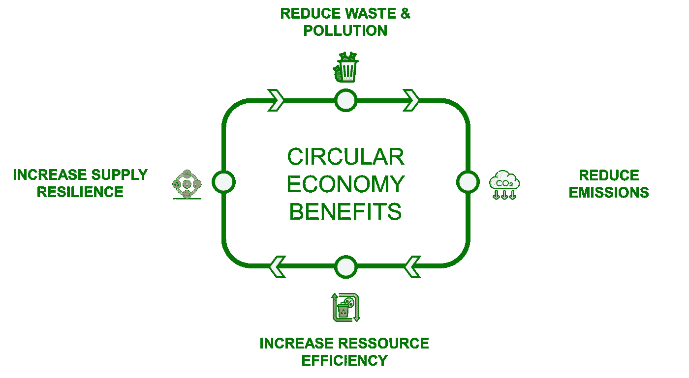

益处 —（作者提供的图片）

然而，时尚零售公司通过实施循环经济原则，可以实现多个环境效益。

+   减少废物和污染，以符合未来的法规要求。

+   减少温室气体排放，以达到目标。

+   通过减少对有限资源的依赖，并通过回收增加原材料供应来源，从而提高韧性。

因此，你可能开发的各种先进分析工具，可以成为你组织的战略资产。

## 供应链网络优化

作为下一步，你可以着手优化可持续供应链网络，以减少上游流动的影响。

供应链网络设计问题 —（作者提供的图片）

可持续供应链优化是一种将成本减少与环境责任相结合的网络设计方法。

可持续供应链优化应用程序 —（作者提供的图片）

作为分析解决方案的一个例子，我已部署此简单的网络应用程序，以支持选择供应商/工厂并最小化生产和交付产品的环境影响。

🚀 了解更多信息！👇

 ## 创建一个可持续的供应链优化网络应用程序

### 帮助你的组织结合可持续采购和供应链优化，以控制成本和减少环境影响…

[towardsdatascience.com

> 为什么不租赁你的连衣裙而不是购买它呢？！

## 模拟循环经济的表现

在另一篇文章中，我模拟了**为时尚零售商实施订阅模型**。

循环租赁模式文章：[链接]——（图片由作者提供）

这个想法是让客户支付定期费用，以在**特定时期**内访问某个产品或服务。

目标是减少产品生命周期中的环境影响。

线性模型（上）与循环模型（下）——（图片由作者提供）

在上述示例中，我们将 5 次购买转换为 5 次租赁相同的物品，这样你只需支付费用即可节省开支。

+   **一个完整的周期**从原材料提取到商店交付。

+   **四个退货周期**配合逆向物流和清洗过程。

更多详情，

 ## 可持续发展中的数据科学——模拟循环经济

### 使用数据科学模拟循环模型对快时尚行业的 CO2 排放和水使用的影响……

towardsdatascience.com

# 关于我

让我们在[Linkedin](https://www.linkedin.com/in/samir-saci/)和[Twitter](https://twitter.com/Samir_Saci_)上连接。我是一名[供应链工程师](https://www.samirsaci.com/about/)，通过数据分析优化物流操作并降低成本。

如果你需要有关供应链转型的咨询或建议，请通过[Logigreen Consulting](https://www.logi-green.com/)与我联系。

如果你对数据分析和供应链感兴趣，请访问我的网站。

 [## Samir Saci | 数据科学与生产力

### 这是一个专注于数据科学、个人生产力、自动化、运筹学和可持续性的技术博客……

samirsaci.com](https://samirsaci.com/?source=post_page-----c9de824e73be--------------------------------)

💡 在 Medium 上关注我，获取更多关于🏭供应链分析、🌳可持续发展和🕜生产力的相关文章。

📘 你的供应链分析完整指南：[分析备忘单](https://bit.ly/supply-chain-cheat)

💌 免费将最新文章直接送达你的邮箱：[订阅邮件](https://www.samirsaci.com/#/portal/signup)
