# 关于 Voronoi 图的一切：分析东京公共交通站点的服务区域

> 原文：[`towardsdatascience.com/data-snack-use-voronoi-to-analyze-service-areas-of-transit-stations-in-tokyo-b1179b9dc2a3?source=collection_archive---------10-----------------------#2024-08-16`](https://towardsdatascience.com/data-snack-use-voronoi-to-analyze-service-areas-of-transit-stations-in-tokyo-b1179b9dc2a3?source=collection_archive---------10-----------------------#2024-08-16)

## 在获取一些略显有趣的统计见解的同时，探索数据科学技术

[](https://medium.com/@martin-jurran?source=post_page---byline--b1179b9dc2a3--------------------------------)[](https://towardsdatascience.com/?source=post_page---byline--b1179b9dc2a3--------------------------------) [马丁·朱兰](https://medium.com/@martin-jurran?source=post_page---byline--b1179b9dc2a3--------------------------------)

·发布于[Towards Data Science](https://towardsdatascience.com/?source=post_page---byline--b1179b9dc2a3--------------------------------) ·12 分钟阅读·2024 年 8 月 16 日

--


数据科学与公共交通：梦之队。（图片来源：作者，插图由[三船隆志提供，遵循免费使用协议](https://www.irasutoya.com/p/terms.html)）

随着世界日益城市化[[1](https://www.un.org/development/desa/pd/content/urbanization-0)]，公共交通已经成为城市生活中无处不在的一部分。世界上可能最具城市化特点的地方是东京[[2]](http://www.demographia.com/db-worldua.pdf)—这座规模无与伦比的繁忙大都市，其中大多数人都主要依赖公共交通[[3](http://demographia.com/db-htld-rail.htm)]来处理日常事务。

本文将向你介绍在城市规划背景下的*Voronoi 图*概念，并用它来划分东京火车站的服务区域。我们将利用获得的服务区域来获取一些或许略显有趣的关于车站周边的统计数据。

## 介绍

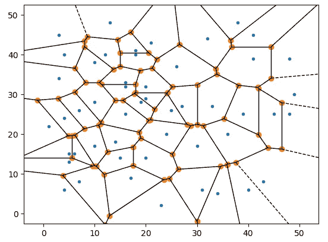

Voronoi 图（图片来源：作者）

Voronoi 图和 Delaunay 三角剖分在许多科学领域得到了广泛应用。[[4](https://www.researchgate.net/publication/325582898_Constrained_Construction_of_Planar_Delaunay_Triangulations_without_Flipping)] *Voronoi 图*，也被称为*Voronoi 网格*，用于将平面表面划分为对应于特定点的独立区域。

这个问题在许多不同的情况下频繁出现。[5]

下面是一些例子：

+   *墨尔本政府（2024-）*，当他们将学生分配到最近的学校时[[6](https://www.findmyschool.vic.gov.au/)]

+   *约翰·斯诺（1813–1853）*，当他将伦敦霍乱爆发与水泵的位置相关联时[[4](https://www.researchgate.net/publication/325582898_Constrained_Construction_of_Planar_Delaunay_Triangulations_without_Flipping)]

+   *勒内·笛卡尔（1596–1650）*，当他研究物质相对于恒星的分布时[[4](https://www.researchgate.net/publication/325582898_Constrained_Construction_of_Planar_Delaunay_Triangulations_without_Flipping)]

如今，Voronoi 图在许多领域中被广泛应用，包括计算机科学、地理学，尤其是城市规划。城市规划是我想要向你们详细介绍的领域——我们将确定世界最大都市——东京的公共交通站点的服务区域。

**Voronoi 的组成部分**

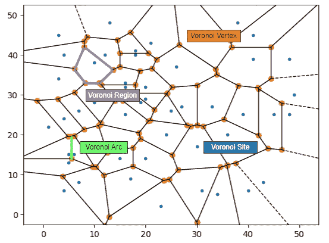

Voronoi 图的组成部分（图片来自作者）

Voronoi 图由多个不同的结果集组成，每个结果集有不同的名称和用途：

+   🔵 *Voronoi 站点*是计算*Voronoi 区域*的参考位置。

+   🟣 *Voronoi 区域*包含表面上所有距离相关*Voronoi 站点*比任何其他站点更近的点。

+   🟢 *Voronoi 弧线*是两条*Voronoi 区域*之间的边界直线段[[4](https://www.researchgate.net/publication/325582898_Constrained_Construction_of_Planar_Delaunay_Triangulations_without_Flipping)]

+   🟠 *Voronoi 顶点*是 Voronoi 弧线交点的地方。

**Voronoi 的距离函数**

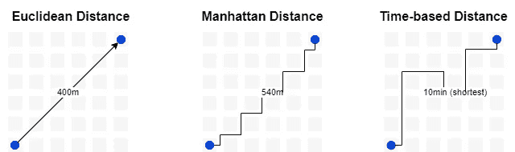

比较各种距离函数（图片来自作者）

城市规划中的*Voronoi 图*通常基于距离/参考系统关系。距离是根据某些度量标准计算的，例如实际距离或旅行时间。计算该距离的方法有多种：

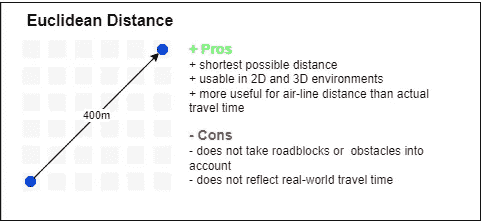

欧几里得距离概述（图片来自作者）

*欧几里得距离*。是坐标系中两点之间的航空距离。它假设两点之间有开阔空间，没有任何阻碍物。它是最基本的计算距离的方法。


曼哈顿距离概述（图片来自作者）

*曼哈顿距离*。忽略航空距离，并引入一种距离函数来近似城市网格中的旅行时间——就像在曼哈顿一样。它更适合某些城市环境。

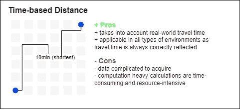

基于时间的距离概述（图片来自作者）

*基于时间的距离*。这是最准确的度量标准，但也是获取最复杂的度量标准。

此外，基于时间的距离可能会导致异常，因为不同区域之间的旅行时间可能与实际距离不成线性关系，从而可能导致沃罗诺伊区域的不均匀划分 [[10](http://alumni.cs.ucr.edu/~weiw/paper/VD_highways.pdf)]——就像下面的例子一样。

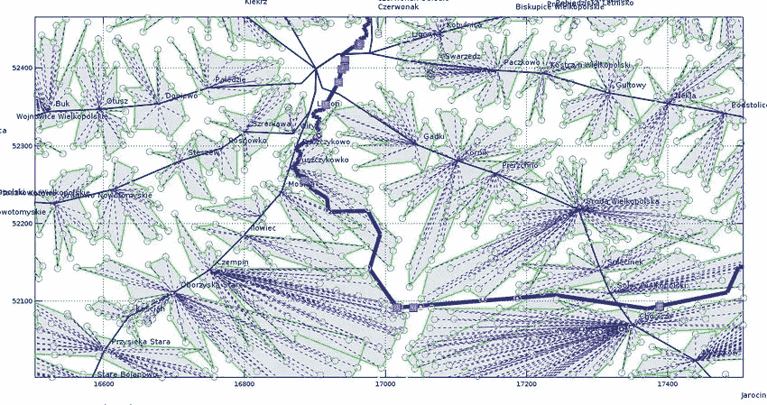

图 5. 选定区域的沃罗诺伊图，包括地理（a）、道路（b）和旅行时间距离（c）。宽蓝线表示沃尔塔河，而品红色的块状区域表示桥梁的位置 [[11](https://www.researchgate.net/figure/Voronoi-diagrams-of-selected-areas-for-geographical-a-road-b-and-travel-time_fig5_336071639)]

现在，我们已经掌握了开始进行现实案例——东京公共交通所需的所有基础知识。让我们开始吧！

# 评估东京的交通系统

城市规划中最重要的方面之一就是公共交通网络——尤其是在像东京这样的地方。东京是许多人向往的地方——尤其是公共交通爱好者。

因此，东京为我们提供了一个完美的例子，可以在现实生活中应用沃罗诺伊图。

## **概念**

想象一张城市地图，上面标有公共交通站点。每个站点服务其周围的区域，这被称为服务区。那么，我们如何确定这些服务区呢？

为了更好地理解如何实现我们的目标——获取公共交通车站的服务区，我将*沃罗诺伊图*融入我们的公共交通视角：

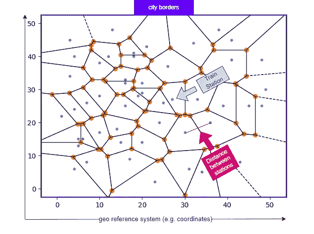

一个关于如何使用沃罗诺伊图来获取服务区的概念（图源：作者）

+   🔵 *沃罗诺伊站点* 现在是东京的一个火车站

+   🟢 *沃罗诺伊弧线* 现在是划分火车站服务区的边界

+   🟣 *沃罗诺伊区域* 现在是基于我们距离函数定义的一个特定火车站所服务的区域

这就是*沃罗诺伊图*能为我们提供的东西。通过根据到最近车站的距离将地图划分为多个区域，我们就有了一个非常简单的方法来定义火车站的服务区。

现在，概念已经清晰，我们可以开始实际的实施了。

## 确定东京

我们需要定义我们想要为其创建*沃罗诺伊图*的区域。这个过程通常被称为定义*边界框*。

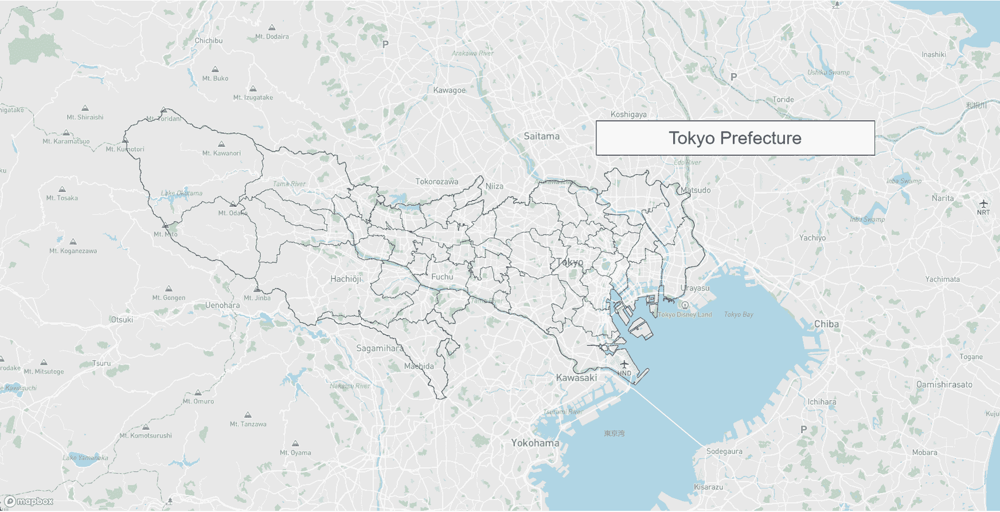

东京市与东京府的区别（图源：作者）

当有人提到“东京”时，它对不同的人可能意味着不同的事情。

有些人可能会将其看作是：

**1) 繁华的城市（东京市）**，有着高耸的摩天大楼和充满活力的街头文化，而其他人可能会将其视为一个

**2) 都道府县（东京府）**，拥有迷人的风景和自然美景，而其他人可能会提到

**3) 大东京地区**，这是世界上人口最多的都市区 [[8](https://en.wikipedia.org/wiki/Greater_Tokyo_Area)]，由多个独立的城市组成（例如东京、埼玉、横滨等）。

**然而，重要的是要明确我们所说的“东京”到底指的是什么，以避免混淆。**

> **使用府县定义**使我们能够区分东京与其邻近的城市，如埼玉、千叶和横滨，同时包含大多数人通常所说的“在东京”的位置。

*东京府*将成为我们所有后续*Voronoi*计算的基本边界框。

为了获取有关东京府的地理空间信息，我们求助于官方政府来源，具体如下：

**数据集：** [国家土地数值信息 | 行政边界数据 (mlit.go.jp)](https://nlftp.mlit.go.jp/ksj/gml/datalist/KsjTmplt-N03-v2_3.html)，根据开放数据政策授权，允许商业使用。 [利用規約 (mlit.go.jp)](https://nlftp.mlit.go.jp/ksj/other/agreement.html#agree-01)

## 定位火车站

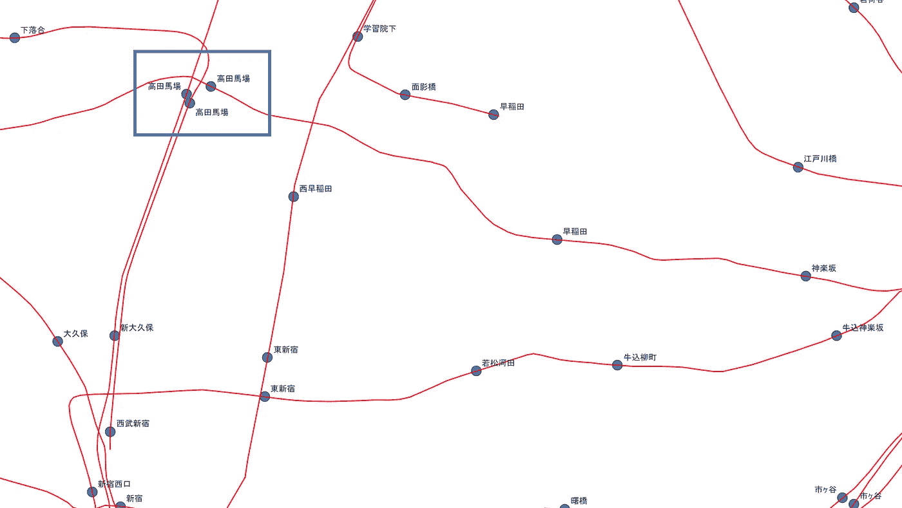

视觉检查我们的数据集。我在正确的位置找到了高田马场。（图片来自作者）

日本政府提供了一个可靠的火车站信息来源。他们的网站提供了一个详细的数据集，包含全国各地的所有火车站，以及其他相关元数据。

**值得注意的是，该数据集仅关注日本政府定义的火车站，可能不包括地铁和单轨列车等大众交通工具，但包括了人们通常不认为是火车的交通方式，例如特定的缆车。**

通过结合额外的数据来源，可能有机会提高检索数据的准确性。[[9](https://www.odpt.org/)] 在本文中，我将继续使用政府数据集，不进行进一步的增强。

**数据集：** [国家土地数值信息 | 铁路数据 (mlit.go.jp)](https://nlftp.mlit.go.jp/ksj/gml/datalist/KsjTmplt-N02-2023.html)，根据开放数据政策授权，允许商业使用。 [利用規約 (mlit.go.jp)](https://nlftp.mlit.go.jp/ksj/other/agreement.html#agree-01)

## 获取服务区域

现在我们已经确定了东京的边界以及相关火车站的列表，接下来可以开始计算我们的服务区域。我们将使用[*KNIME*](https://www.knime.com/)，这是一款功能强大的科学计算工具，通过抽象化许多复杂性，最大程度减少了对深入数学知识或编程的需求。

[](https://www.knime.com/?source=post_page-----b1179b9dc2a3--------------------------------) [## 开放创新 | KNIME

### 免费和开源，包含所有数据分析工具。通过视觉工作流构建器创建数据科学解决方案…

[www.knime.com](https://www.knime.com/?source=post_page-----b1179b9dc2a3--------------------------------)

**1\. 提取数据**

我们从连接数据源到工具开始。幸运的是，KNIME 提供了一套地理空间操作工具，我们可以直接使用这些工具。

我们继续创建两个节点来导入我们的数据。[*GeoFile Reader node*](https://hub.knime.com/center%20for%20geographic%20analysis%20at%20harvard%20university/extensions/sdl.harvard.features.geospatial/latest/org.knime.python3.nodes.extension.ExtensionNodeSetFactory$DynamicExtensionNodeFactory:4e3ecfd9) 能够处理 Shapefile 和 geojson 数据类型。

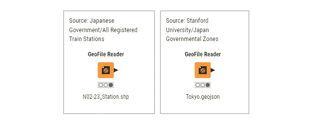

在 KNIME 中进行数据导入（图片来源：作者）

要使用这两个数据集，必须进行一些准备工作。

1.  我们使用 [*Column Filter node*](https://hub.knime.com/knime/extensions/org.knime.features.base/latest/org.knime.base.node.preproc.filter.column.DataColumnSpecFilterNodeFactory) 删除了一些字段，因为每个数据集中的字段数量过多。

1.  为了增强可读性，我们使用 [*Column Renamer node*](https://hub.knime.com/knime/extensions/org.knime.features.base/latest/org.knime.base.node.preproc.column.renamer.ColumnRenamerNodeFactory) 对数据集中的某些列进行了重命名。

1.  为了避免后续的混淆，我们使用 [*Column Renamer node*](https://hub.knime.com/knime/extensions/org.knime.features.base/latest/org.knime.base.node.preproc.column.renamer.ColumnRenamerNodeFactory) 给每个数据集中相同的列赋予唯一的名称。

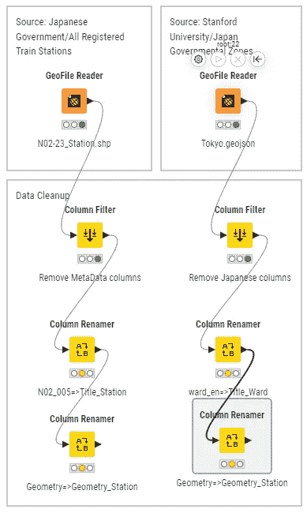

在 KNIME 中进行数据提取（图片来源：作者）

完成数据提取和准备工作后，我们现在可以继续进行计算了。

**2\. 处理数据**

我们的下一个目标是获取每个车站的 Voronoi 多边形，从而使我们能够推导出它们各自的服务区域。

1.  我们使用东京县数据集创建了 Voronoi 图的边界框，利用 [*Bounding Box node*](https://hub.knime.com/center%20for%20geographic%20analysis%20at%20harvard%20university/extensions/sdl.harvard.features.geospatial/latest/org.knime.python3.nodes.extension.ExtensionNodeSetFactory$DynamicExtensionNodeFactory:381035ea)。

1.  为了执行计算，我们需要的是车站的点而不是多边形表示。[*Geometry to Point node*](https://hub.knime.com/center%20for%20geographic%20analysis%20at%20harvard%20university/extensions/sdl.harvard.features.geospatial/latest/org.knime.python3.nodes.extension.ExtensionNodeSetFactory$DynamicExtensionNodeFactory:f470594) 用于将它们转换为点。

1.  我们使用[*Voronoi (Thiessen) Polygon 节点*](https://hub.knime.com/center%20for%20geographic%20analysis%20at%20harvard%20university/extensions/sdl.harvard.features.geospatial/latest/org.knime.python3.nodes.extension.ExtensionNodeSetFactory$DynamicExtensionNodeFactory:bfd518e5)进行 Voronoi 计算，生成多边形和关联的 ID。然而，由于我们还需要车站元数据，我们必须通过[*空间连接节点*](https://hub.knime.com/center%20for%20geographic%20analysis%20at%20harvard%20university/extensions/sdl.harvard.features.geospatial/latest/org.knime.python3.nodes.extension.ExtensionNodeSetFactory$DynamicExtensionNodeFactory:38149a19)将 Voronoi 多边形与这些信息再次连接。

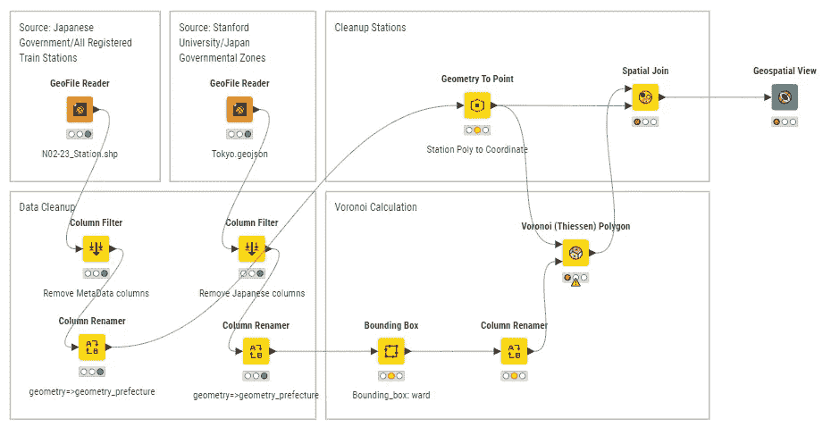

KNIME 中的整个工作空间（图片来自作者）

这就是我们在 KNIME 中获取车站服务区所需的一切。让我们看看结果。

**服务区（V1）**

现在我们可以看到 Voronoi 图已经将我们的地图划分，给每个车站分配了一个独特的区域。

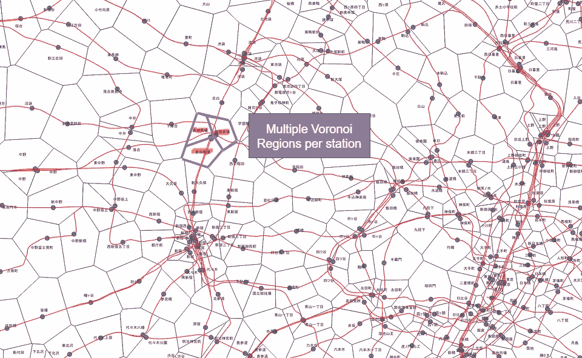

一站多服务区——出了点问题。使用 QGIS 进行可视化（图片来自作者）

我们应当记住，像高田马场这样的车站，在现实中看起来像一个车站，但实际上由多个车站组成。因此，我们需要做一些额外的工作，确保我们的计算能够准确反映这一点。

**清理数据和服务区（V2）**

车站数据集包含一个额外的 ID，该 ID 根据车站的公共名称和/或实际外观对车站进行分组。通过利用这个 ID 和[*Group By 节点*](https://hub.knime.com/knime/extensions/org.knime.features.database/latest/org.knime.database.node.manipulation.groupby.DBGroupByNodeFactory)，我们可以将各个车站合并成一个。

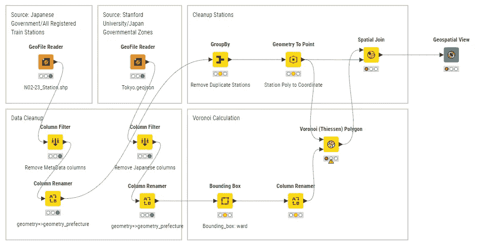

KNIME 中的整个工作空间（图片来自作者）

在合并各个车站后，我们能够创建一个更准确的服务区数据集，更好地反映人们在现实中看到车站的方式。看看高田马场——它现在位于一个单一的 Voronoi 区域内。

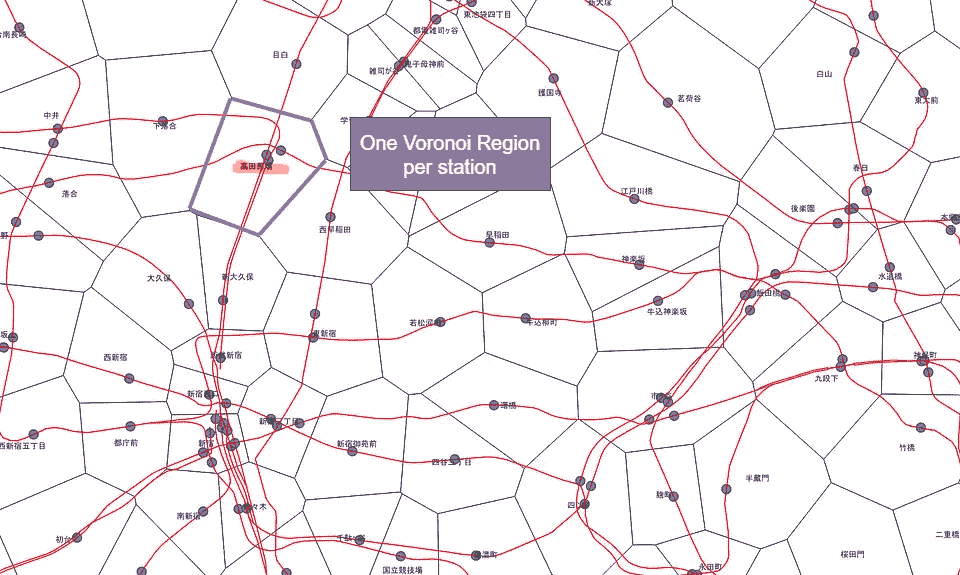

清理后的数据集：现在每个车站有一个服务区，通过 QGIS 进行可视化（图片来自作者）

**结果**

我们已经完成了计算，并得到了可以提供有用见解和统计数据的服务区域。

若要自己探索结果，您可以在这个 GitHub 仓库中找到所有内容：

[](https://github.com/martinjurran/KNIME-Tokyo-StationServiceAreas/tree/main?source=post_page-----b1179b9dc2a3--------------------------------) [## GitHub - martinjurran/KNIME-Tokyo-StationServiceAreas: 计算服务区的 KNIME 工作流…

### 计算东京车站服务区和餐厅密度分析的 KNIME 工作流……

github.com](https://github.com/martinjurran/KNIME-Tokyo-StationServiceAreas/tree/main?source=post_page-----b1179b9dc2a3--------------------------------)

接下来，我们将获取一些可以从服务区中导出的现实生活统计数据。

## 统计示例 — 餐馆密度

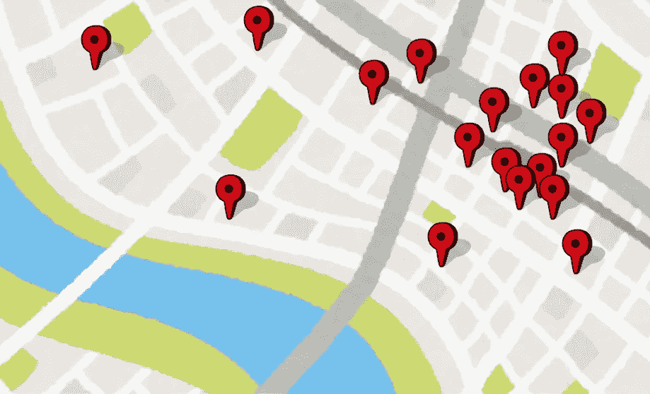

在日本找餐馆并不难——但它们的密度最高在哪里呢？（插图由 [高桥三船提供，使用许可为自由使用](https://www.irasutoya.com/p/terms.html)）

在规划度假时，最大的麻烦之一就是决定住在哪里。我的意思是，你肯定想选择一个靠近餐馆、商店和其他有趣场所的位置，对吧？

但面对这么多选择，找到完美的地点可能会让人困惑。这就是我们新获取的 *交通站点服务区* 能够帮助我们的地方：

> 目标：识别周围有最多兴趣点 (POI) 的车站。为了简化问题，我们将专注于餐馆。

**获取数据**

对商业用途有价值的数据似乎经常受到保护，并且难以获取。对于餐馆来说，目前没有官方的来源可供使用。

最准确的来源，如企业注册信息或谷歌地图，要么价格高昂，要么未获得大规模处理的批准。

[Overpass API](https://overpass-api.de/) 是由 OpenStreetMap 基金会提供的，它是我们获取所需数据的唯一来源之一。通过在 [Overpass Turbo](https://overpass-turbo.eu/) 中执行一个简单的查询，我们可以获取东京所有的餐馆数据。

```py
nwramenity=restaurant;
out center;
```

数据会立即在 Overpass Turbo 中显示，并且可以导出为我们选择的文件格式：

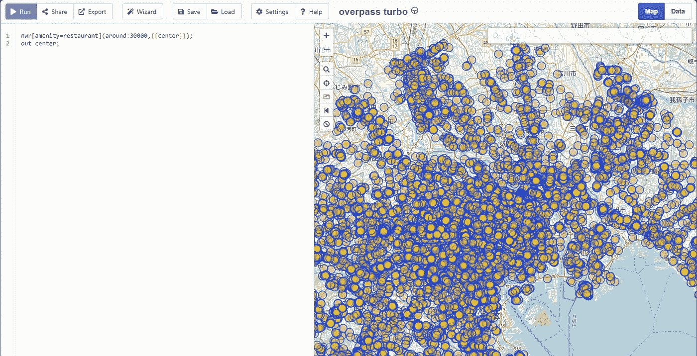

Overpass Turbo 用户界面（图片由作者提供）

我们现在拥有了东京所有餐馆的完整数据集。尽管数据有其局限性，因为这些数据是众包的，未经验证，且可能主要集中在市区最受欢迎的地点——毕竟人们通常在这些地方进行贡献。但因为它是我们能获得的最佳数据，我们将继续使用它。

**数据集：** [overpass turbo (overpass-turbo.eu)](https://overpass-turbo.eu/)，数据遵循 [开放数据库许可证 (ODbL)](https://en.wikipedia.org/wiki/Open_Database_License)

**将兴趣点 (POI) 与其服务区匹配**

要计算车站服务区内餐馆的数量，我们需要将兴趣点 (POI) 与其各自的服务区匹配。

我已将车站服务区作为图层导入到 QGIS 中。该应用程序提供了直接计算区域内节点数量的功能。

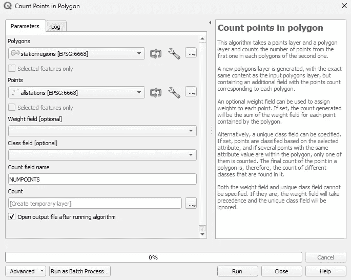

在 QGIS 中计算多边形内的点数（图片由作者提供）

每个服务区的餐厅数量未能满足我们的要求，因为一些大型区域有很多餐厅——但这些餐厅之间的距离较长。因此，我们需要开发一个新的指标来解决这一情形。最简单的方法是计算餐厅的密度。

**POI 密度公式**

对于简单的排名，*餐厅/km²每个服务区*可能是一个好的表现方式。这样，我们可以找到餐厅密度最高的服务区。

> 在某些情况下，服务区可能很小，但餐厅数量很多，这可能会夸大它们的得分。然而，在我们的情况中，这不是一个问题。小型服务区可能意味着附近有其他车站和更多的餐厅。

公式如下：

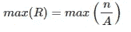

计算 POI 密度的公式

> 其中：
> 
> *R* = POI 密度因子，单位为 n/km²
> 
> *A* = 多边形面积，单位为 km²
> 
> *n* = POI 的数量

我们将*POI 数量/服务区面积*数据集导入 KNIME，并对每个服务区运行我们的公式。

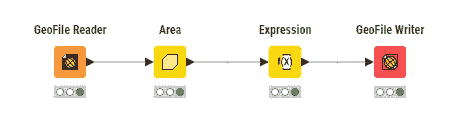

在 KNIME 中计算 POI 密度（图像由作者提供）

最后，我们获得了餐厅密度最高的区域。让我们来看看结果。

**结果**

餐厅密度最高的前 20 个车站服务区是：


按餐厅密度排序的前 25 个车站，用 Tableau Public 可视化（图像由作者提供）

我们还可以通过地图查看结果，以获得更多的洞察：

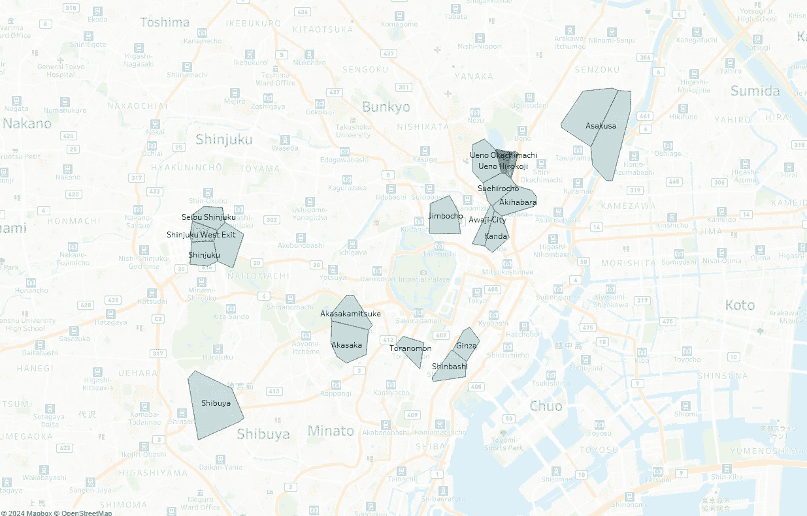

按餐厅密度排序的前 20 个车站服务区，用 Tableau Public 可视化（图像由作者提供）

我们可以看到，密度最高的区域呈现出集群的形式。我做了一些进一步的研究，发现东京由多个独立的城市组成（例如台东区、涩谷区、千代田区）。这些集群某种程度上代表了东京所由的各个城市——有趣！

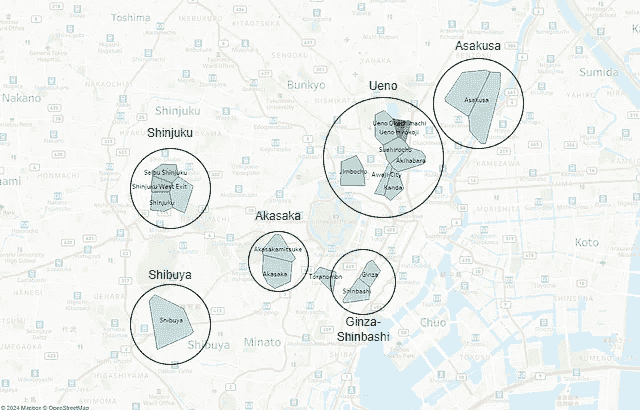

我们识别到的高餐厅密度集群（图像由作者提供）

需要注意的是，我们的数据集是众包收集的，可能并不完全具有代表性或完整性，因为它可能偏向那些经过特别详细调查的区域。

**然而，根据我们所拥有的数据，上野御徒町站无疑是赢家。**

餐厅密度最高的车站服务区：上野御徒町站

如果你有兴趣进一步探索数据，可以查看 Tableau Public 页面，在那里你可以与可视化进行交互，并深入了解结果：

[`public.tableau.com/app/profile/martin.jurran/viz/Tokyo-RestaurantDensity/Map#1`](https://public.tableau.com/app/profile/martin.jurran/viz/Tokyo-RestaurantDensity/Map#1)

# 结论


服务区域密度最高的车站。Ameya Yokocho 是上野-御徒町车站服务区域的一部分。

Voronoi 图比我们常常意识到的更具多功能性和实用性。它们使我们能够发现洞察，例如**识别出上野-御徒町车站是东京府餐馆密度最高的区域**。

即使是像 Uber 这样的主要公司，可能也在使用 Voronoi 图来高效地分配司机到接送位置。它们的广泛应用使得 Voronoi 图在多个行业中都具有很高的价值，尤其是因为它们可以用极少的资源进行计算。

我鼓励你探索 Voronoi 图的功能，看看它们如何能带给你好处。通过将它们纳入你的工具集中，你可以提升数据分析能力，并获得更有洞察力的统计数据。

# 来源

[[1](https://www.un.org/development/desa/pd/content/urbanization-0)] 联合国 (2018 年 9 月 13 日)，城市化，[`www.un.org/development/desa/pd/content/urbanization-0`](https://www.un.org/development/desa/pd/content/urbanization-0#:~:text=The%20world%20is%20becoming%20increasingly,around%20two%2Dthirds%20in%202050.)

[[2](http://www.demographia.com/db-worldua.pdf)] Demographia (2023 年 1 月 24 日)，全球城市区第 19 次年度报告，[`www.demographia.com/db-worldua.pdf`](http://www.demographia.com/db-worldua.pdf)

[[3](http://demographia.com/db-htld-rail.htm)] Demographia (2003 年 1 月 1 日)，铁路交通有效的地方及原因，[`demographia.com/db-htld-rail.htm`](http://demographia.com/db-htld-rail.htm)

[[4](https://www.researchgate.net/publication/325582898_Constrained_Construction_of_Planar_Delaunay_Triangulations_without_Flipping)] Vera Galishnikova, Peter Jan Pahl (2018 年 3 月 15 日)，无翻转约束平面 Delaunay 三角剖分的构建，[`www.researchgate.net/publication/325582898_Constrained_Construction_of_Planar_Delaunay_Triangulations_without_Flipping`](https://www.researchgate.net/publication/325582898_Constrained_Construction_of_Planar_Delaunay_Triangulations_without_Flipping)

[5] Liebling T.M., Pournin L. (2010)，Voronoi 图与 Delaunay 三角剖分：无处不在的“连体双胞胎”。《数学文献》 数学主题分类：01A65, 49-03, 52C99, 68R99, 70–08, 92–08

[[6](https://www.findmyschool.vic.gov.au/)] 墨尔本政府 (2024)，学校学区图，[`www.findmyschool.vic.gov.au/`](https://www.findmyschool.vic.gov.au/)

[[7](https://en.wikipedia.org/wiki/Taxicab_geometry)] 维基百科 (2024)，出租车几何，[`en.wikipedia.org/wiki/Taxicab_geometry`](https://en.wikipedia.org/wiki/Taxicab_geometry)

[8] 维基百科 (2024)，大东京地区，[`en.wikipedia.org/wiki/Greater_Tokyo_Area`](https://en.wikipedia.org/wiki/Greater_Tokyo_Area)

[[9](https://www.odpt.org/)] 公共交通开放数据中心 (2024)，数据集 — 公共交通オープンデータセンター 数据目录网站，[ttps://www.odpt.org/](https://www.odpt.org/)

[[10](http://alumni.cs.ucr.edu/~weiw/paper/VD_highways.pdf)] D.T. Lee, Chung-Shou Liao, Wei-Bung Wang (N/A), 基于时间的 Voronoi 图，[`alumni.cs.ucr.edu/~weiw/paper/VD_highways.pdf`](http://alumni.cs.ucr.edu/~weiw/paper/VD_highways.pdf)

[[11](https://www.researchgate.net/figure/Voronoi-diagrams-of-selected-areas-for-geographical-a-road-b-and-travel-time_fig5_336071639)] 智能混合公共交通系统规划解决方案 — 以波兹南都市圈作为卫星城连接的案例研究 — ResearchGate 上的科学图表。 [`www.researchgate.net/figure/Voronoi-diagrams-of-selected-areas-for-geographical-a-road-b-and-travel-time_fig5_336071639`](https://www.researchgate.net/figure/Voronoi-diagrams-of-selected-areas-for-geographical-a-road-b-and-travel-time_fig5_336071639)

图标来自[可爱免费素材集 いらすとや (irasutoya.com)](https://www.irasutoya.com/)，© 高桥三舟


（图像由作者提供，插图来自[高桥三舟根据自由使用许可](https://www.irasutoya.com/p/terms.html)）
