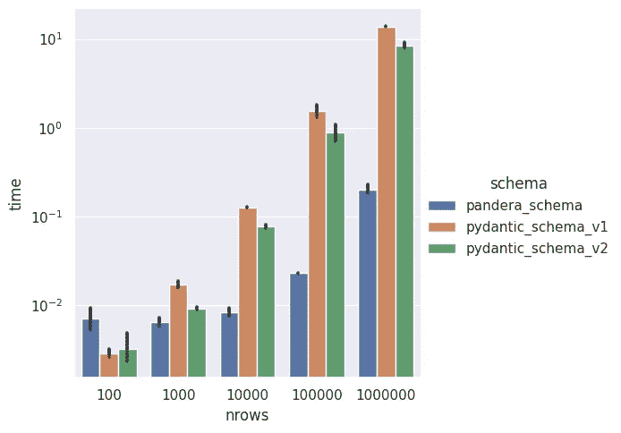

# 使用 Pandera 进行 Python 数据验证

> 原文：[`towardsdatascience.com/data-validation-with-pandera-in-python-f07b0f845040?source=collection_archive---------0-----------------------#2024-11-18`](https://towardsdatascience.com/data-validation-with-pandera-in-python-f07b0f845040?source=collection_archive---------0-----------------------#2024-11-18)

## 验证你的数据框以用于生产机器学习管道

[](https://gabrielfurnieles.medium.com/?source=post_page---byline--f07b0f845040--------------------------------)[](https://towardsdatascience.com/?source=post_page---byline--f07b0f845040--------------------------------) [Gabriel Furnieles](https://gabrielfurnieles.medium.com/?source=post_page---byline--f07b0f845040--------------------------------)

·发表于 [Towards Data Science](https://towardsdatascience.com/?source=post_page---byline--f07b0f845040--------------------------------) ·9 分钟阅读·2024 年 11 月 18 日

--


图像由 [NightCafe](https://creator.nightcafe.studio/) 生成。

数据验证是生产应用中至关重要的一步。你需要确保你获取的数据与管道兼容，并且没有意外的值出现。此外，验证数据是一种安全措施，可以防止任何损坏或不准确的信息被进一步处理，并在初步步骤中及时发出警告。

Python 已经有一个很棒的开源项目来处理这个任务，叫做 [Pydantic](https://docs.pydantic.dev/latest/)。然而，当处理像机器学习中那样的大型数据框对象时，[Pandera](https://pandera.readthedocs.io/en/stable/index.html) 是一种更快、更可扩展的验证数据方式（请查看[这篇文章](https://www.union.ai/blog-post/pandera-0-17-adds-support-for-pydantic-v2)和公开的笔记本）。



Pandera 和 Pydantic 的逐行验证性能比较，适用于不同大小的 pandas.DataFrame 对象。图片来源于 [source](https://www.union.ai/blog-post/pandera-0-17-adds-support-for-pydantic-v2#:~:text=%22records%22))-,Benchmarking%20Pandera%E2%80%99s%20row%2Dwise%20validation%20with%20Pydantic,-Because%20Pandera%20validates)。

此外，Pandera 提供对多种数据框库的支持，如 `pandas`、`polars`、`dask`、`modin` 和 `pyspark.pandas`。有关更多信息，请参考 [Pandera 文档📄](https://pandera.readthedocs.io/en/stable/index.html)。

> **免责声明。** Pandera 是一个开源项目，采用 MIT 许可证。我与 Pandera 团队或 Union.ai 没有任何关系。此帖子没有商业目的。

# 使用 Pandera 验证数据

Pandera 有两种定义验证器的方式：**Schemas**和**Models**。我将专注于第二种方式，因为它与 Pydantic 模型相似，并且代码更简洁。

要定义 Pandera 模型，创建一个继承自 DataframeModel 的子类，并开始声明数据框必须具有的列和数据类型：

```py
import pandera as pa

class UserModel(pa.DataFrameModel):
    id: int
    username: str
    email: str
    is_active: bool
    membership: str
    creation_date: pd.DatetimeTZDtype
```

```py
# Use
df = pd.DataFrame(...)
UserModel.validate(df) # <- If invalidad raises SchemaError
```

请注意，为了定义用户创建时间戳，我使用了 Pandas 原生的日期类型，而不是像`datetime.datetime`这样的其他类型。Pandera 仅支持内建的 Python、NumPy 和 Pandas 数据类型。你也可以创建[自定义数据类型](https://pandera.readthedocs.io/en/stable/dtypes.html#logical-data-types)，但这是一个高级话题，在大多数情况下不常用。

## 验证列属性

使用 Pandera，除了验证数据类型外，你还可以验证其他列属性：

```py
class UserModel(pa.DataFrameModel):
    id: int  = pa.Field(unique=True, ge=0)
    username: str = pa.Field(str_matches=r"^[a-zA-Z0-9_]+$")
    email: str = pa.Field(str_matches=r"^[a-zA-Z0-9_.+-]+@[a-zA-Z0-9-]+\.[a-zA-Z0-9-.]+$")
    is_active: bool
    membership: str = pa.Field(isin=["premium", "free"])
    creation_date: pd.DatetimeTZDtype = pa.Field(dtype_kwargs={"unit": "ns", "tz": "UTC"})
```

在这里，我像使用 pydantic 一样使用 Pandera 的 Field。

+   首先，我指定`id`列不得包含重复值，并且这些值必须大于或等于 0。

+   在`username`和`email`中，我使用正则表达式检查字符串是否有效。用户名只能包含字母数字字符和下划线，而电子邮件地址还可以包含短横线和点，但必须始终遵循“smth@smth.smth”的模式。

+   `membership`只能取列表中的值。更好的方法是使用 StrEnum 来定义有效值，而不是硬编码它们。

+   最后，`creation_date`必须以纳秒为单位，并使用 UTC 时区。这行代码可以更简洁，使用`typing`库中的 Annotated：`creation_date: Annotated[pd.DatetimeTZDtype, "ns", "UTC"]`。

查看[文档](https://pandera.readthedocs.io/en/stable/reference/generated/pandera.api.dataframe.model_components.Field.html#pandera.api.dataframe.model_components.Field)，阅读所有 Field 选项😋

## 自定义验证

有时需要添加自定义验证。Pandera 允许你注入[列/索引检查](https://pandera.readthedocs.io/en/stable/dataframe_models.html#dataframe-checks:~:text=as%20class%20methods.-,Column/Index%20checks,-%C2%B6)（单列的自定义检查）和[数据框检查](https://pandera.readthedocs.io/en/stable/dataframe_models.html#dataframe-checks:~:text=1%3A%20%3CCheck%20check_means%3E-,DataFrame%20Checks,-%C2%B6)（多个列之间的检查）。

```py
import pandera as pa
from pandera.typing import Series

class UserModel(pa.DataFrameModel):
    id: int = pa.Field(unique=True, ge=0)
    username: str = pa.Field(str_matches=r"^[a-zA-Z0-9_]+$")
    email: str = pa.Field(
        str_matches=r"^[a-zA-Z0-9_.+-]+@[a-zA-Z0-9-]+\.[a-zA-Z0-9-.]+$"
    )
    is_active: bool
    membership: str = pa.Field(isin=["premium", "free"])
    creation_date: Annotated[pd.DatetimeTZDtype, "ns", "UTC"]

    # column/index checks
    @pa.check("username", name="username_length")
    def username_length(cls, x: Series[str]) -> Series[bool]:
        """
        Check username length is between 1 and 20 characters
        """
        return x.str.len().between(1, 20)

    @pa.check("creation_date", name="min_creation_date")
    def min_creation_date(cls, x: Series[pd.DatetimeTZDtype]) -> Series[bool]:
        """
        Check creation date is after 2000-01-01
        """
        return x >= dt.datetime(2000, 1, 1, tzinfo=dt.timezone.utc)

    # dataframe check
    @pa.dataframe_check
    def membership_is_valid(
        cls, df: pd.DataFrame, name="membership_is_valid"
    ) -> Series[bool]:
        """
        Check account age for free memebers is <= 30 days
        """
        current_time = dt.datetime.now(dt.timezone.utc)
        thirty_days = dt.timedelta(days=30)

        return (df["membership"] == "premium") | (
            (df["membership"] == "free")
            & ((current_time - df["creation_date"]) <= thirty_days)
        )
```

请记住，你正在处理整个列对象（`Series`），因此检查中的操作应向量化以提高性能。

## 其他配置

**别名** 当列名由于语言语法无法声明为 Python 变量时，Pandera 允许为列验证器设置别名，以匹配数据框。

```py
class MyModel(pa.DataFrameModel):
    alias_column: int = pa.Field(..., alias="Alias Column")
    ...
```

**严格和强制** 当`strict`选项设置为 true 时，它会强制验证的数据框仅包含在 Pandera DataFrameModel 中定义的列。另一方面，当启用`coerce`选项时，Pandera 会尝试将列数据强制转换为与模型的数据类型匹配。

```py
class MyModel(pa.DataFrameModel):
    ...

    class Config:
        strict = True # defaul: False
        coerce = True # default: False
```

`coerce`选项也可以在字段级别使用，方法是`pa.Field(..., coerce=True)`

**懒惰验证** 默认情况下，当验证检查未通过时，Pandera 会抛出错误。这可能会令人烦恼，因为它只显示遇到的第一个验证错误，并阻止其余数据的检查。

在某些情况下，最好让整个数据框架进行验证，并在一次运行中收集所有错误，而不是一个个修复它们并等待验证再次运行。前者是懒惰验证所做的。

```py
df = pd.DataFrame(...)
Mymodel.validate(df, lazy_validation=True)
```

# 带有数据验证的机器学习生产管道


使用[NightCafe](https://creator.nightcafe.studio/)生成的图像。

因为大多数机器学习管道是在 Python 中使用表格数据编码成数据框架结构进行训练的，所以**Pandera**是一个验证其输入和输出的强大工具。

```py
# pipeline.py

class MLPipeline:
    """General ML Pipeline"""
    def __init__(self, model_id: str):
        self.model_id = model_id

    def load_model(self) -> None:
        ...

    def transform_data(self, df: pd.DataFrame) -> pd.DataFrame:
        ...   # <- Potential invalid data error
        return df_transform

    def predict(self, df: pd.DataFrame) -> pd.DataFrame:
        self.load_model()
        df_transform = self.transform(df)
        df['score'] = self.model.predict(df_transform)  # <- Potential invalid data error
        return df
```

我们希望避免模型因无效数据而抛出错误。那样意味着我们已经做了将模型加载到内存中和处理原始数据的所有工作，但结果是白费力气，浪费资源，还阻止了其余数据点的评估。

同样，如果模型的输出结构不正确，我们的后处理管道（将结果上传到数据库，通过 RESTful API 返回结果等）将会失败。

在使用 Pandera 定义验证模型后，我们可以利用其[用于管道集成的装饰器](https://pandera.readthedocs.io/en/stable/decorators.html#:~:text=Auto%20color%20theme-,Decorators%20for%20Pipeline%20Integration,-%C2%B6)来执行输入/输出验证。

```py
# models.py
import pandera as pa

class InputModel(pa.DataFrameModel):
    ...

class PredictorModel(pa.DataFrameModel):
    ...

# OutputModel inherits all InputModel validation fields
# and also includes the score
class OutputModel(InputModel):
    score: float = pa.Field(ge=0, le=1) # assuming model returns probab.
```

```py
# pipeline.py
import pandera as pa
from .models import InputModel, PredictorModel, OutputModel

class MLPipeline:
    """General ML Pipeline"""
    def __init__(self, model_id: str):
        self.model_id = model_id

    def load_model(self) -> None:
        ...

    @pa.check_io(df=InputModel.to_schema(), out=PredictorModel.to_schema(), lazy=True)
    def transform_data(self, df: pd.DataFrame) -> pd.DataFrame:
        ...
        return df_transform

    @pa.check_output(OutputModel.to_schema(), lazy=True)
    def predict(self, df: pd.DataFrame) -> pd.DataFrame:
        self.load_model()
        df_transform = self.transform(df)  
        df['score'] = self.model.predict(df_transform)
        return df
```

因为我们在机器学习管道中生成了一个中间数据框对象`df_transform`，所以最好也对它进行验证以防止错误。*predict*方法的输入不需要验证，因为它已经在*transform_data*中完成了。

## 处理无效行

我们不希望我们的管道因为某些数据点包含不正确的数据而中断。如果发生验证错误，策略应该是将有问题的数据点单独处理，并继续使用其余数据运行管道。管道不能停止！🔥

Pandera 模型有自动移除所有无效行的选项：

```py
class MyModel(pa.DataFrameModel):
    ...

    class Config:
        drop_invalid_rows = True
```

然而，丢弃所有无效行而不记录它们可能是危险的。你需要知道为什么这些数据点无效，以便稍后可以向客户或数据工程师沟通错误的原因。

这就是为什么我不使用 Pandera 装饰器，而是创建我自己的验证辅助函数：

```py
from typing import Tuple
import logging

logging.basicConfig(level=logging.INFO)
logger = logging.getLogger(__name__)

def log_pandera_errors(exc: pa.errors.SchemaErrors) -> None:
    """
    Logs all errors from a SchemaErrors exception.
    """
    for err_type, categories in exc.message.items():
        for _, errors in categories.items():
            for err in errors:
                logger.error(f"{err_type} ERROR: {err['column']}. {err['error']}")

def handle_invalid(
    df: pd.DataFrame, exc: pa.errors.SchemaErrors
) -> Tuple[pd.DataFrame, pd.DataFrame]:
    """
    Handles invalid data in a DataFrame based on a SchemaErrors exception.
    """
    log_pandera_errors(exc)

    df_failure = exc.failure_cases

    # Check for errors that cannot be resolved
    # i.e. they aren't associated with a specific row index
    nan_indices = df_failure["index"].isna()
    if nan_indices.any():
        error_msg = "\n".join(
            f"    - Column: {row['column']}, check: {row['check']}, "
            f"failure_case: {row['failure_case']}"
            for row in df_failure[nan_indices].to_dict("records")
        )
        raise ValueError(
            f"Schema validation failed with no possibility of continuing:\n{error_msg}\n"
            "The pipeline cannot continue 😢. Resolve before rerunning"
        )

    invalid_idcs = df.index.isin(df_failure["index"].unique())
    df_invalid = format_invalid_df(df.loc[invalid_idcs, :], exc)
    df_valid = df.iloc[~invalid_idcs]

    return df_valid, df_invalid

def validate(
    df: pd.DataFrame, model: pa.DataFrameModel
) -> Tuple[pd.DataFrame, pd.DataFrame]:
    """
    Validates a DataFrame against a DataFrameModel and handles errors.
    """
    try:
        return model.validate(df, lazy=True), pd.DataFrame()
    except pa.errors.SchemaErrors as ex:
        return handle_invalid(df, ex)
```

输出强制某些错误并移除列`id`：

```py
# Error output
ERROR:__main__:SCHEMA ERROR: UserModel. column 'id' not in dataframe. Columns in dataframe: ['username', 'email', 'membership', 'is_active', 'creation_date']
ERROR:__main__:DATA ERROR: username. Column 'username' failed element-wise validator number 0: str_matches('^[a-zA-Z0-9_]+$') failure cases: b%09
ERROR:__main__:DATA ERROR: email. Column 'email' failed element-wise validator number 0: str_matches('^[a-zA-Z0-9_.+-]+@[a-zA-Z0-9-]+\.[a-zA-Z0-9-.]+$') failure cases: ef.com
ERROR:__main__:DATA ERROR: UserModel. DataFrameSchema 'UserModel' failed element-wise validator number 0: <Check membership_is_valid> failure cases: c, ef.com, free, True, 2000-12-31 00:00:00+00:00

ValueError: Schema validation failed with no possibility of continuing:
    - Column: UserModel, check: column_in_dataframe, failure_case: id
The pipeline cannot continue 😢. Resolve before rerunning
```

如果发生无法解决的错误且涉及整个列，则管道无法继续。

## 测试

最后但同样重要的是，Pandera 模型和模式还包括根据定义生成示例数据的方法。你需要安装 `[hypothesis](https://hypothesis.readthedocs.io/en/latest/)` 库才能使用它。

然而，在用一些示例测试后，我不推荐使用它。一旦你开始添加一些约束，生成合成数据的速度就会变得很慢，而且大多数时候生成的数据缺乏多样性（生成的数据无法覆盖整个限制空间，并且会重复）。我找到的最佳替代方法是为你想要测试的每个模型添加数据生成器——毕竟，在管道中需要验证的数据框架也不多——。

```py
class UserModel(pa.DataFrameModel):
    ...

    def sample(size: int = 10) -> pd.DataFrame:
        """Added method to generate valid test data manually"""
        current_time = dt.datetime.now(dt.timezone.utc)
        return pd.DataFrame(
            {
                "id": range(size),
                "username": [f"user_{i}" for i in range(size)],
                "email": [f"user_{i}@example.com" for i in range(size)],
                "is_active": [True] * size,
                "membership": ["premium"] * size,  # All premium to pass checks
                "creation_date": [current_time] * size,
            }
        )
```

# 结论

数据验证对于每个数据处理管道都至关重要，尤其是在机器学习中。Pandera 通过提供一种灵活且高效的基于模型的方法来简化数据框架中的数据验证工作。

使用 Pandera，你可以定义强制列类型、范围，甚至复杂条件约束的模型类。这样可以在数据管道的早期阶段轻松发现数据质量问题，确保数据在到达下一步之前符合预期标准。

通过将 Pandera 集成到机器学习管道中，你可以创建强大的数据检查，帮助防止错误并提高模型输出的可靠性。

最终在测试中使用的 pandera.DataFrameModel：

```py
import pandas as pd
import pandera as pa
from pandera.typing import Series
from typing import Annotated
import datetime as dt

class UserModel(pa.DataFrameModel):
    id: int = pa.Field(unique=True, ge=0, coerce=False)
    username: str = pa.Field(str_matches=r"^[a-zA-Z0-9_]+$")
    email: str = pa.Field(
        str_matches=r"^[a-zA-Z0-9_.+-]+@[a-zA-Z0-9-]+\.[a-zA-Z0-9-.]+$"
    )
    is_active: bool
    membership: str = pa.Field(isin=["premium", "free"])
    creation_date: Annotated[pd.DatetimeTZDtype, "ns", "UTC"]

    @pa.check("username", name="username_length")
    def username_length(cls, x: Series[str]) -> Series[bool]:
        """
        Check username length is between 1 and 20 characters
        """
        return x.str.len().between(1, 20)

    @pa.check("creation_date", name="min_creation_date")
    def min_creation_date(cls, x: Series[pd.DatetimeTZDtype]) -> Series[bool]:
        """
        Check creation date is after 2000-01-01
        """
        return x >= dt.datetime(2000, 1, 1, tzinfo=dt.timezone.utc)

    @pa.dataframe_check
    def membership_is_valid(
        cls, df: pd.DataFrame, name="membership_is_valid"
    ) -> Series[bool]:
        """
        Check account age for free memebers is <= 30 days
        """
        current_time = dt.datetime.now(dt.timezone.utc)
        thirty_days = dt.timedelta(days=30)

        return (df["membership"] == "premium") | (
            (df["membership"] == "free")
            & ((current_time - df["creation_date"]) <= thirty_days)
        )

    class Config:
        strict = True
        coerce = True

    def sample(size: int = 10) -> pd.DataFrame:
        """Added method to generate valid test data manually"""
        current_time = dt.datetime.now(dt.timezone.utc)
        return pd.DataFrame(
            {
                "id": range(size),
                "username": [f"user_{i}" for i in range(size)],
                "email": [f"user_{i}@example.com" for i in range(size)],
                "is_active": [True] * size,
                "membership": ["premium"]
                * size,  # All premium to avoid date restrictions
                "creation_date": [current_time] * size,
            }
        )
```

*嗨，我是 Gabriel Furnieles，一名专注于人工智能、数据管道和 MLOps 的数学工程师。我希望你喜欢这篇文章并觉得它有帮助，如果是这样，请考虑关注我* [*Gabriel Furnieles*](https://medium.com/u/e77c10fd9715?source=post_page---user_mention--f07b0f845040--------------------------------)，*并订阅我的通讯，这样故事就会直接发送到你那里 👇*

[](https://medium.com/@gabrielfurnieles?source=post_page-----f07b0f845040--------------------------------) [## Gabriel Furnieles - Medium

### 在 Medium 上阅读 Gabriel Furnieles 的文章。他是专注于 AI 和机器学习的数学工程师。我偶尔在这里写作……

medium.com](https://medium.com/@gabrielfurnieles?source=post_page-----f07b0f845040--------------------------------)
