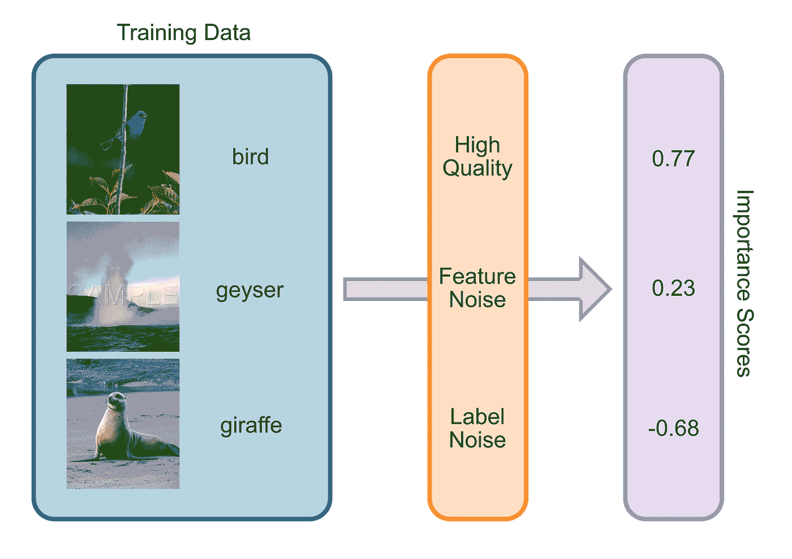
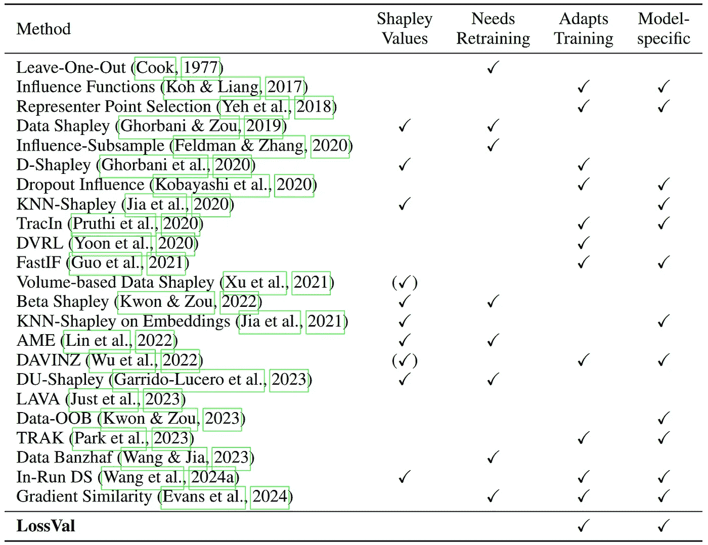
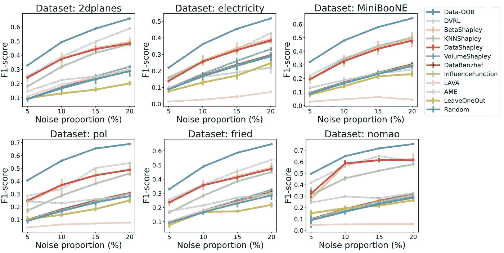
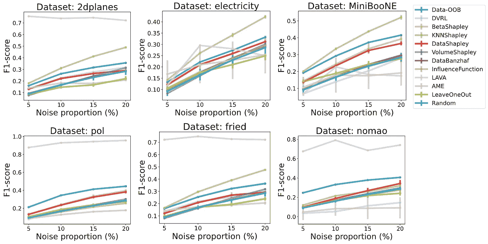
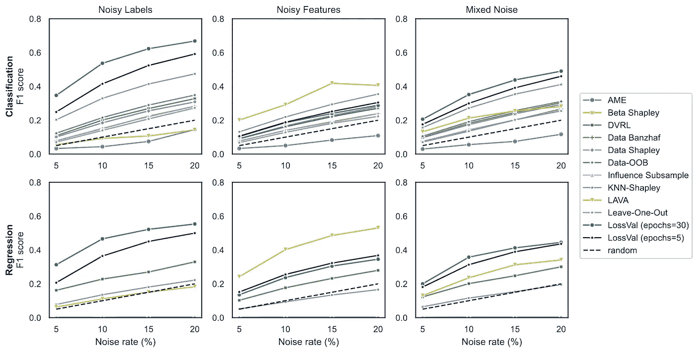

# 数据估值——简明概述

> 原文：[`towardsdatascience.com/data-valuation-a-concise-overview-72e8cf12c755?source=collection_archive---------9-----------------------#2024-12-12`](https://towardsdatascience.com/data-valuation-a-concise-overview-72e8cf12c755?source=collection_archive---------9-----------------------#2024-12-12)

## 理解数据的价值：挑战、方法和应用

 [Tim Wibiral](https://medium.com/@tim.wibiral?source=post_page---byline--72e8cf12c755--------------------------------)

·发布于[Towards Data Science](https://towardsdatascience.com/?source=post_page---byline--72e8cf12c755--------------------------------) ·阅读时间 9 分钟·2024 年 12 月 12 日

--

ChatGPT 和类似的大型语言模型（LLM）是在庞大的数据量上进行训练的。OpenAI 等公司从互联网上抓取数据，收集书籍、文章和社交媒体帖子来训练它们的模型。很容易想象，一些文本（如科学文章或新闻报道）比其他文本（如随机推文）更为重要。几乎所有用于训练机器学习模型的数据集都是如此；它们几乎总是包含噪声样本，标签错误，或者包含误导性的信息。

尝试理解不同训练样本对于机器学习模型训练过程的重要性的过程被称为数据估值。数据估值也被称为数据归因、数据影响分析和代表点。这里有许多不同的方法和应用，我将在本文中讨论其中一些。

数据估值可视化。每个训练样本都会被分配一个重要性分数。（图像来源：作者。）

# 我们为什么需要数据估值？

## 数据市场

人工智能将在未来几年成为一个重要的经济因素，但它们对数据有着极大的需求。高质量数据对训练 AI 模型至关重要，因此成为了一种宝贵的商品。这就引出了数据市场的概念，买卖双方可以用钱交换数据。数据评估是定价数据的基础，但有一个问题：卖家不想在数据被买走之前将其公开，但对于买家而言，在没有看到数据之前，很难理解卖家数据的重要性。为了更深入地了解这个话题，可以参考论文[“A Marketplace for Data: An Algorithmic Solution”](https://arxiv.org/abs/1805.08125)和[“A Theory of Pricing Private Data”](https://arxiv.org/abs/1208.5258)。

## 数据投毒

数据投毒对 AI 模型构成威胁：恶意行为者可能会尝试以一种损害机器学习训练过程的方式篡改训练数据。这可以通过微妙地改变训练样本来完成，这种改变对人类几乎是不可见的，但对 AI 模型却非常有害。数据评估方法可以应对这一点，因为它们自然地会为有害样本分配一个非常低的重要性分数（无论它们是自然发生的，还是出于恶意）。

## 可解释性

近年来，可解释的人工智能（AI）获得了广泛关注。欧盟的人工智能高级专家组甚至[呼吁将 AI 的可解释性作为创建可信赖 AI 的基础](https://data.europa.eu/doi/10.2759/346720)。理解不同训练样本对 AI 系统或 AI 系统的特定预测的重要性，对于解释其行为至关重要。

## 主动学习

如果我们能更好地理解机器学习模型中哪些训练样本更重要，那么我们就可以使用这种方法来获取对模型更具信息量的新训练样本。比如，你正在训练一个新的大型语言模型，发现葡萄牙语维基百科页面上的文章对你的 LLM 非常重要。那么，接下来的自然步骤就是尝试为你的模型获取更多这类文章。以类似的方式，我们在我们的论文[“LossVal”](https://arxiv.org/abs/2412.04158)中使用了数据评估方法，以获取更多的车辆碰撞测试数据，来改善汽车的被动安全系统。

# 数据评估方法概述

现在我们知道数据评估对不同应用有多么重要。接下来，我们将了解数据评估是如何工作的。正如在[我们的论文](https://arxiv.org/abs/2412.04158)中所描述的，数据评估方法大致可以分为四个分支：

+   基于再训练的方法

+   基于梯度的方法

+   基于数据的方法

+   “其他”

## 基于再训练的方法

基于重新训练的方法的常见方案是，它们通过多次训练机器学习模型来洞察模型的训练动态，最终揭示每个训练样本的重要性。最基本的方法（[该方法由 Dennis Cook 于 1977 年提出](https://www.jstor.org/stable/1268249)）是通过去掉一个数据点重新训练机器学习模型，以确定该数据点的重要性。如果去掉该数据点后，模型在验证集上的表现下降，那么我们知道这个数据点对模型有害。反过来，如果去掉该数据点后，模型在验证集上的表现提升，我们知道该数据点对模型有益（或具有信息性）。对每个数据点重复这一过程，就能得到完整数据集的宝贵重要性分数。这种分数叫做留一法误差（LOO）。完全重新训练机器学习模型以处理每一个数据点非常低效，但对于简单模型和小数据集来说是可行的。

Data Shapley 扩展了这个概念，使用了[Shapley 值](https://medium.com/datalab-log/understanding-the-impact-of-features-and-data-through-shapley-values-f235489b0b3e)。这个概念由[Ghorbani & Zou](https://proceedings.mlr.press/v97/ghorbani19c/ghorbani19c.pdf)和[Jia et al](https://proceedings.mlr.press/v89/jia19a.html)于 2019 年同时发布。Shapley 值是博弈论中的一个构造，它告诉你联盟中每个玩家对最终回报的贡献。一个更贴近生活的例子是：假设你和你的朋友 Bob 与 Alice 在从派对回家的路上共享一辆出租车。Alice 住得离起点很近，而 Bob 住得远得多，你则介于两者之间。当然，如果你们三个人平摊最终的车费，那就不公平了，尽管你和 Bob 的路程比 Alice 远。Shapley 值通过考察所有可能的子联盟来解决这个问题：如果只有你和 Alice 共享出租车会怎样？如果只有 Bob 独自驾驶呢？依此类推。通过这种方式，Shapley 值可以帮助你们三个人按公平的方式分担最终的车费。这同样可以应用到数据上：通过在不同的训练数据子集上重新训练机器学习模型，公平地为每个训练样本分配“重要性”。不幸的是，这种做法效率极低：计算精确的 Shapley 值需要对你的机器学习模型进行超过 O(2ⁿ)次的重新训练。然而，使用蒙特卡洛方法可以更高效地近似计算 Data Shapley。

已经提出了许多替代方法，例如[Data-OOB](https://arxiv.org/abs/2304.07718)和[平均边际效应（AME）](https://arxiv.org/abs/2206.10013)。基于重新训练的方法在面对大规模训练集时会遇到困难，因为需要重复训练。使用重新训练计算的重要性分数可能不精确，因为神经网络中的随机性效应。

## 基于梯度的方法

基于梯度的方法仅适用于基于梯度的机器学习算法，如人工神经网络或线性回归与逻辑回归。

影响函数是统计学中的重要工具，由[Dennis Cook](https://www.jstor.org/stable/1268187)提出，他在前文中已有提及。影响函数利用海森矩阵（或其近似）来理解如果某个训练样本被排除，模型性能将如何变化。使用影响函数时，无需重新训练模型。这种方法适用于简单的回归模型，也适用于[神经网络](https://arxiv.org/abs/1703.04730)。虽然计算影响函数效率较低，但已经提出了近似方法。

一些替代方法，如[TraceIn](https://papers.nips.cc/paper/2020/file/e6385d39ec9394f2f3a354d9d2b88eec-Paper.pdf)和[TRAK](https://proceedings.mlr.press/v202/park23c.html)，跟踪机器学习模型训练过程中的梯度更新。它们可以成功利用这些信息来理解某个数据点对训练的重要性，而无需重新训练模型。[梯度相似性](https://arxiv.org/abs/2405.08217)是另一种跟踪梯度的方法，但它利用这些梯度来比较训练和验证梯度的相似性。

在我的硕士论文中，我研究了一种新的基于梯度的数据估值方法，利用损失函数中的梯度信息，称为[LossVal](https://arxiv.org/abs/2412.04158)。我们在标准的损失函数中引入了自加权机制，如均方误差和交叉熵损失。这使得在第一次训练时就能为训练样本分配重要性分数，从而无需进行梯度追踪、海森矩阵计算和重新训练，同时仍能达到最先进的结果。

## 基于数据的方法

上述所有方法都围绕着机器学习模型展开。这有一个优势，那就是它们能告诉你训练样本对特定应用场景和具体机器学习模型的重要性。然而，一些应用（例如数据市场）可能从[“与模型无关”](https://proceedings.neurips.cc/paper/2021/hash/59a3adea76fadcb6dd9e54c96fc155d1-Abstract.html)的重要性分数中受益，这些分数并不基于特定的机器学习模型，而是完全建立在数据之上。

这可以通过不同的方式完成。例如，可以分析[训练集](https://arxiv.org/abs/2305.00054)和干净验证集之间的[距离](https://arxiv.org/abs/2305.00054)，或使用[体积度量](https://proceedings.neurips.cc/paper/2021/hash/59a3adea76fadcb6dd9e54c96fc155d1-Abstract.html)来量化数据的多样性。

## “其他”

在这一类别下，我将所有不适合其他类别的方法归类在一起。例如，使用 K-最近邻（KNN）可以更[高效地计算](https://arxiv.org/abs/2304.01224)Shapley 值，而无需重新训练。[通过零掩码得到的子网络](https://aclanthology.org/2020.sustainlp-1.6/)可以被分析以理解不同数据点的重要性。[DAVINZ](https://proceedings.mlr.press/v162/wu22j.html)通过观察泛化边界来分析训练数据变化时的性能变化。[Simfluence](https://arxiv.org/abs/2303.08114)运行模拟训练并能够根据训练结果估计每个训练样本的重要性。[强化学习](https://arxiv.org/abs/1909.11671)和[进化算法](https://dl.acm.org/doi/abs/10.1145/3535508.3545522)也可以用于数据估值。

一些其他数据估值方法的概述。（来自[`arxiv.org/abs/2412.04158`](https://arxiv.org/abs/2412.04158)的截图。）

# 你应该为你的应用选择哪种方法？

与大多数机器学习问题一样，数据估值中没有免费的午餐。要理解哪种方法最适合你的问题，你需要关注你使用的数据集、模型以及数据集中出现的噪声类型。数据估值的一个常见应用是识别数据集中的噪声样本。下图展示了不同方法在这方面的表现。首先，噪声被添加到数据集中，然后使用不同的方法来识别噪声样本。x 轴显示有多少样本是噪声样本，y 轴显示每种方法识别噪声样本的能力（越高越好）。

第一张和第二张图取自[OpenDataVal 论文](https://openreview.net/forum?id=eEK99egXeB)。他们在这两张图中都使用了逻辑回归作为分类任务的基础模型。在第一张图中，作者打乱了部分训练样本的标签。在这里，Data-OOB 的表现优于所有测试的其他方法。

在应用了**标签噪声**后的多个数据集上的比较，使用逻辑回归作为基础模型。越高越好。（来自[OpenDataVal](https://openreview.net/forum?id=eEK99egXeB)的截图。）

下一张图描绘了一个截然不同的画面：数据集和数据估值方法保持不变，但噪声不同！在这里，作者为部分训练样本添加了高斯噪声。现在，LAVA 和 KNN Shapley 表现出最佳的性能。

在多个数据集上进行的比较，应用**特征噪声**后，使用逻辑回归作为基础模型。得分越高越好。（截图来自[OpenDataVal](https://openreview.net/forum?id=eEK99egXeB).）

如果我们使用多层感知器（MLP）代替逻辑回归模型，我们可以观察到类似的变化。现在，Data-OOB 的表现似乎大大下降。上面的图仅考虑了分类任务，但正如你在下面的图中看到的那样，许多方法在应用于回归任务时表现截然不同。

在多个数据集上进行的比较，使用 MLP 作为基础模型。得分越高越好。（截图来自[`arxiv.org/abs/2412.04158`](https://arxiv.org/abs/2412.04158)）

对于大多数实际问题，你无法准确知道你的样本和特征有多嘈杂。这使得决定应使用哪种数据估值方法变得困难。在最好的情况下，你可以尝试所有方法。否则，我可以给你一些指导：

+   如果你不知道将使用哪种机器学习模型：选择一种与模型无关的方法，如 KNN Shapley、LAVA 或 SAVA。

+   如果你使用简单的模型，如线性或逻辑回归：Data-OOB 会表现非常好。然而，这些简单的模型非常高效，你可以尝试使用计算开销较大但理论上有益的方法，如 Data Shapley。

+   如果你使用 MLP：LossVal 可能表现最佳。然而，深度学习的数据估值在计算上相当昂贵。如果在你的案例中不可行，你可以尝试使用与模型无关的方法。

请记住，本指南基于一组有限的数据估值方法，这些方法仅在嘈杂样本检测方面进行了评估。如果可能的话，尽量测试哪种方法最适合你的具体问题、数据集和模型。

# 当前的研究方向

目前，存在一些朝不同方向发展的研究趋势。有些研究正在将其他博弈论概念引入数据估值，如[Banzhaf 值](https://proceedings.mlr.press/v206/wang23e/wang23e.pdf)或[Winter 值](https://arxiv.org/abs/2402.01943)。其他方法尝试创建联合重要性得分，将学习过程中的其他方面包含在估值中，如[学习算法](https://dl.acm.org/doi/abs/10.1145/3461702.3462574)。进一步的方法致力于研究[隐私](https://arxiv.org/abs/2210.08723)（数据无需公开）和[个性化](https://arxiv.org/abs/2407.15546)数据估值（通过使用元数据来丰富数据）。

# 结论

数据估值是一个日益发展的主题，本文没有提到许多其他的数据估值方法。数据估值是理解和解释机器学习模型的宝贵工具。如果你想了解更多关于数据估值的内容，我可以推荐以下文章：

+   [训练数据影响分析与估计：一项调查](https://link.springer.com/article/10.1007/s10994-023-06495-7)（Hammoudeh & Lowd，2024 年）

+   [机器学习中的数据评估：“成分”、策略和开放挑战](https://www.ijcai.org/proceedings/2022/0782.pdf)（Sim & Xu 等，2022 年）

+   [OpenDataVal: 一个统一的数据评估基准](https://proceedings.neurips.cc/paper_files/paper/2023/hash/5b047c7d862059a5df623c1ce2982fca-Abstract-Datasets_and_Benchmarks.html)（Jian & Liang 等，2023 年）

+   [精彩的数据评估资源库](https://github.com/daviddao/awesome-data-valuation)

*随时通过* [*LinkedIn*](https://www.linkedin.com/in/tim-wibiral/) *与我联系*
