# 数据可视化入门：吸引眼球的可视化操作手册

> 原文：[`towardsdatascience.com/data-visualisation-101-playbook-for-attention-grabbing-visuals-c5b9faa7a950?source=collection_archive---------1-----------------------#2024-02-05`](https://towardsdatascience.com/data-visualisation-101-playbook-for-attention-grabbing-visuals-c5b9faa7a950?source=collection_archive---------1-----------------------#2024-02-05)

## 使用 Plotly 进行引人注目的可视化交流的实用技巧

[](https://miptgirl.medium.com/?source=post_page---byline--c5b9faa7a950--------------------------------)[](https://towardsdatascience.com/?source=post_page---byline--c5b9faa7a950--------------------------------) [玛丽亚·曼苏罗娃](https://miptgirl.medium.com/?source=post_page---byline--c5b9faa7a950--------------------------------)

·发表于 [Towards Data Science](https://towardsdatascience.com/?source=post_page---byline--c5b9faa7a950--------------------------------) ·阅读时间：15 分钟·2024 年 2 月 5 日

--


图片由 DALL-E 3 生成

在[上一篇文章](https://medium.com/towards-data-science/visualisation-101-choosing-the-best-visualisation-type-3a10838b150d)中，我们讨论了如何选择最适合你任务的可视化类型。我们确定了七种不同的使用场景（*时间序列、名义比较、偏差、排名、部分与整体、频率分布和相关性*），以及最适合它们的图表类型。毫不奇怪，在大多数情况下，你可以使用基本的图表类型，如折线图、柱状图或散点图。

选择最合适的可视化类型是基础。然而，这并不是你在进行数据可视化时需要记住的全部。

让我们回归基础。可视化的主要目标是将信息传达给观众。这就是为什么我们需要考虑观众如何感知我们的图表。在实践中，观众的感知和理解取决于许多小细节。

在这篇文章中，我将分享数据可视化的一些关键方面。我们将通过三个步骤来获取更加清晰、锐利和智能的可视化效果：

+   减少噪音，避免观众困惑或分心，

+   为了集中观众的注意力，增加高亮效果，

+   增加上下文信息，以提供所有必要的背景知识，确保清晰理解。

我将使用 Plotly，因为它是我进行数据可视化的主要工具。

> 除非特别说明，以下所有图表示例均基于合成数据集。

# 第一步：减少噪音

我们可能会想把所有的信息都包含在可视化中，例如，为图表上的每个点添加标签。在这些时刻，我们通常出于好意——给观众一个全面的视图。

然而，人脑的工作方式是不同的。你在可视化中添加的每一个元素都会增加认知负担。人们的思维能力是有限的，因此不能浪费这份认知资源在不必要的元素上。添加过多的细节可能会让观众完全失去兴趣，因为他们可能会觉得你的图表比实际更加复杂。这种感知的复杂性可能会让观众感到害怕，因为他们可能不愿意花时间和精力去理解它。

我们可以参考一些数据可视化领域的经典书籍来思考这个问题。爱德华·塔夫特（Edward Tufte）是数据可视化领域的先驱。在他的书《*定量信息的可视化展示*》中，他介绍了数据墨水比（[来源](https://infovis-wiki.net/wiki/Data-Ink_Ratio)）的概念。

> 图形中大部分的墨水应该用于展示数据——墨水会随着数据的变化而变化。数据墨水是图形中不可擦除的核心部分，是响应所表示数字变化而安排的非冗余墨水。

我们的目标是最大化图表中有意义元素（或墨水）的比例。为此，我们可以从图表中去除杂乱（或噪音），以减少感知上的认知负担。杂乱是指那些存在于图表中但没有提供任何附加理解的图形元素。

不幸的是，我们工具中的默认设置有时并不能帮助我们制作清晰的可视化。因此，我首先建议你更改 Plotly 中的默认模板——这将帮助你简化图表。

默认模板是`plotly`。它与 seaborn 风格相似（你可以在[画廊](https://seaborn.pydata.org/examples/index.html)中查看），包括背景颜色和网格线。在我看来，它给图表增加了太多噪音。我更喜欢一个轻量级的模板，叫做`simple_white`。

你可以在图表上对比这两种风格，感受它们的差异。

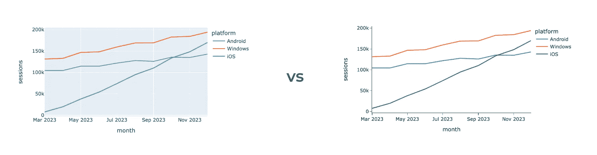

作者图表

使用下面的代码可以更改你所有 Plotly 可视化的模板。你可以查看其他内置模板，甚至在[文档](https://plotly.com/python/templates/)中学习如何创建自己的自定义模板。

```py
import plotly.io as pio
pio.templates.default = 'simple_white'
```

将模板更改为`simple_white`后，你的所有图表将自动变得更加简洁。然而，这只是我们走向无杂乱数据可视化之旅的开始。由于每个图形元素都会增加认知负担，因此值得考虑它们是否必要。图表中的每个元素都应该是你经过深思熟虑的决定，而不是工具的默认行为。

在许多情况下，图形元素并没有增加对理解的帮助，因此我们可以（且应该）去除它们。让我们看几个这样的例子。

如果你创建一个只有一个数据系列的条形图，Plotly 仍然会显示图例。然而，我们可以在不失去任何信息的情况下去除它，并通过 y 轴标题提供度量的上下文。

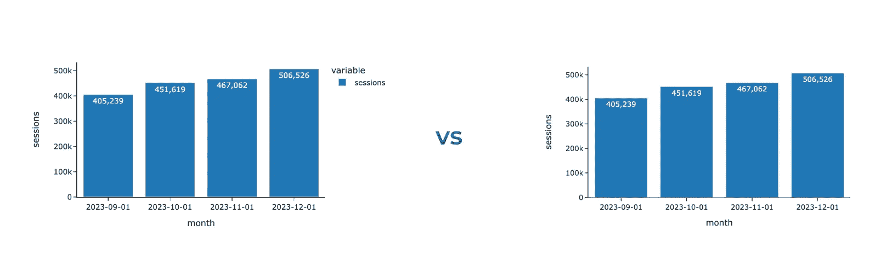

作者图表

让我们隐藏图表上的图例。

```py
# create chart
fig = px.bar(df, text_auto = ',.6r', width = 600)

# hide legend
fig.update_layout(showlegend = False)
```

这让我感到惊讶，但确实有些情况下你不仅可以去除图例，还可以去除其中一个轴。看下面的两张图表：我们为每个条形添加了标签，确保观众可以轻松解读并比较基于条形长度的数值。因此，x 轴不再是必要的。理想情况下，我们应该将关于使用的度量的一些背景信息添加到图表标题中——我们稍后会讨论如何做。

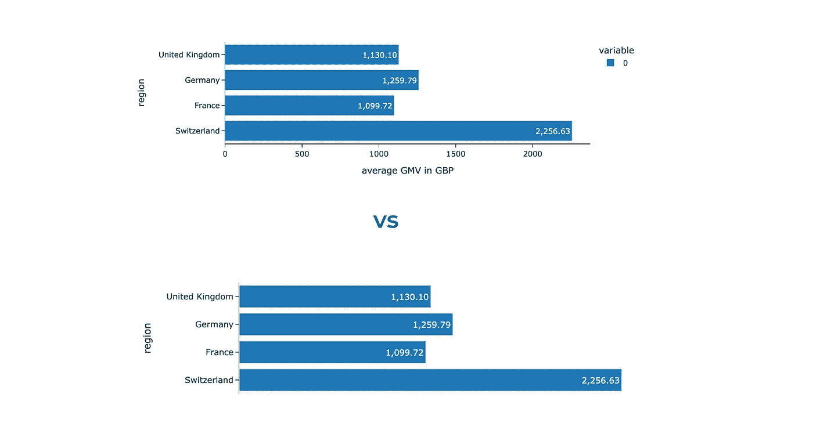

作者图表

要隐藏其中一个轴，我们需要更改其可见性。

```py
fig.update_xaxes(visible = False)
# you can similarly hide y-axes using fig.update_yaxes(visible = False)
```

我们已经学会了如何调整 Plotly 的默认设置，使图表更加简洁明了。然而，这并不是唯一需要注意的事项——事实上，我们自己常常会添加噪音和杂乱。让我给你展示一些我经常看到的嘈杂图表的例子。

分析师喜欢数字（至少我是）。因此，我们经常希望向观众展示这些数字，比如过去几个月我们有多少客户。结果常常是这样的图表。

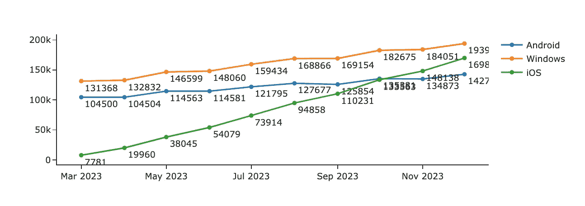

作者图表

在所有这些数字的杂乱中，你完全忽略了数据中的趋势和洞察力。我会采取以下措施来解决这个问题：

+   不用说，我会去掉这些标签。如果你的观众需要知道确切的数字，只保留最重要的（例如，只保留最近一个月或两个月的数据）。

+   将你展示的数值四舍五入是一个好习惯，例如，使用 `184.1K` 代替 `184051`。在大多数情况下，观众并不会在乎是 184 051 还是 184 063 个客户。

+   此外，如果你希望将观众的注意力集中在数据的趋势上，我建议你去掉标记，仅保留线条。

另一个诱惑是让你的可视化更加多彩。除非颜色有特定作用，比如编码某些数据或突出显示最值得注意的部分，否则请避免这么做。我们稍后会讨论如何明智地使用颜色。同时，你可以看看下面的例子，观察一下首先吸引你眼球的是什么，以及你需要花费多少精力去理解底层数据。当我看第一张图时，我感到有些困惑，一直在思考这些颜色是什么意思，为什么每个条形有所不同。

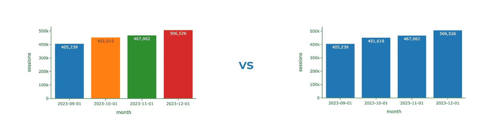

作者图表

此外，这张图表告诉我们，使用过多的重点（在我们这个例子中是鲜艳的颜色）是行不通的——我们只是被分散了注意力，无法专注于某个部分。

我们已经学会了如何从图表中去除噪音。经过这一步，我们得到了中立的可视化效果。它们就像一块画布。接下来的步骤是战略性地加入重点。

# 第 2 步：添加重点

明智地使用重点颜色可以引导观众的注意力，并强调主要信息。人们通常首先会注意到较亮或较暗的颜色。然而，重要的是要记住，你不能突出显示所有内容。相反，你应该将观众的注意力集中在数据的一个或两个关键方面。

你还可以建立一个重点的层次结构，最大程度地强调主要信息，并将不那么重要（但仍然必要）的部分推到背景中。这可以帮助你避免分散注意力，但仍然保留所有必要的背景信息。我们将在下面看到此类方法的示例。

如果你想了解数据可视化中哪些元素会吸引注意力，试试以下这个简单的测试：闭上眼睛，睁开眼睛，然后观察最初吸引你注意的是什么。另一种方法是将你的可视化图展示给别人，并请他们评论他们的思考过程。

## 颜色

在我看来，颜色是驱动观众注意力的最强大工具。这就是为什么我想详细讨论它。让我们从一个例子开始。看看下面的可视化图。你首先注意到的是什么？你认为作者想通过这个图表告诉你什么？

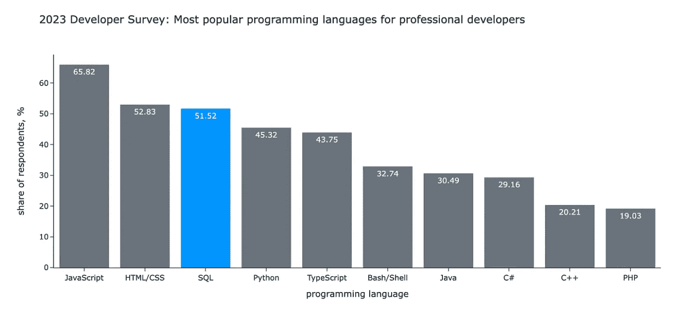

图表由作者提供，数据来自 [StackOverflow 调查](https://survey.stackoverflow.co/2023/#technology-most-popular-technologies)

你可能已经开始查看 SQL 并将其与其他语言进行对比。在 [我之前的文章](https://medium.com/towards-data-science/lmql-sql-for-language-models-d7486d88c541) 中，我使用了这个图表来阐明以下观点：

*根据年度* [*StackOverflow 调查*](https://survey.stackoverflow.co/2023/#technology-most-popular-technologies)*，SQL 仍然是世界上最受欢迎的编程语言之一。对于专业开发者来说，SQL 排名前三（仅次于 Javascript 和 HTML/CSS）。超过一半的专业人员使用它。令人惊讶的是，SQL 甚至比 Python 还要流行。*

我使用了灰色和亮蓝色之间的对比来集中你的注意力在我所提到的 SQL 上。如果我现在制作这个可视化图，我还会让标题更粗，以使其更加突出，因为它是一个有意义的背景。

让我们将其与完全灰色中性的版本进行对比。在没有任何视觉提示的情况下，你将花费更多的时间和精力来查看所有数据。

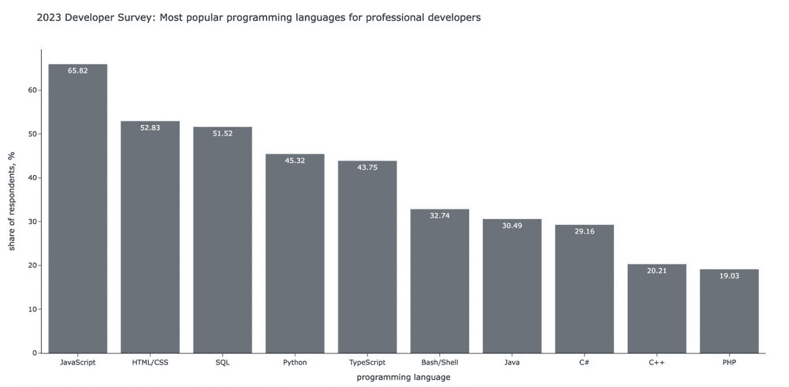

图表由作者提供

希望你现在能看到颜色的所有潜力。让我们学习如何在 Plotly 中使用颜色

我们将从一个像上面示例中的条形图开始。我用更亮的颜色突出显示了那些转化率低于阈值的部分。为此，我根据转化率值定义了颜色列表，并将其作为颜色传递给 Plotly，用于线条和标记。我还指定了希望标签显示在条形图外部，并通过调整透明度使颜色变得更加淡化。

```py
# defining colors based on conversion value
colors = list(map(
    lambda x: 'silver' if x >= 40 else 'purple',
    conv_df.conversion.values
))

# creating default plot
fig = px.bar(conv_df, text_auto='.2f', labels = {'value': 'conversion, %'})

# updating colors
fig.update_traces(marker_color=colors, marker_line_color=colors, 
    textposition='outside', marker_line_width=1.5, opacity=0.9)

# hiding legend 
fig.update_layout(showlegend = False)

# updating range to add some space on the top
fig.update_yaxes(range = [0, 70]) 
```

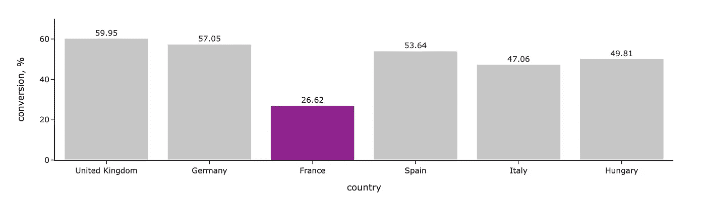

图表由作者绘制

让我们稍微讨论一下如何定义颜色。在上面的示例中，我使用了预定义的 SVG 颜色`"silver"`和`"purple"`。你可以在[这里](https://www.w3.org/TR/css-color-3/#svg-color)找到预定义颜色的完整列表。

如果你想要更多自定义选项，可以将颜色作为 HEX 代码传递。例如，你可以使用品牌颜色为你的演示文稿增添公司风格。

获取 HEX 代码最简单的方法是截取你的界面截图，上传到颜色选取器（*我通常会搜索“在线颜色选取器从图片”*），然后查找所有需要的代码。例如，我目前工作的公司 Wise 的品牌色之一是明亮的绿色，HEX 代码为`#9FE870`。

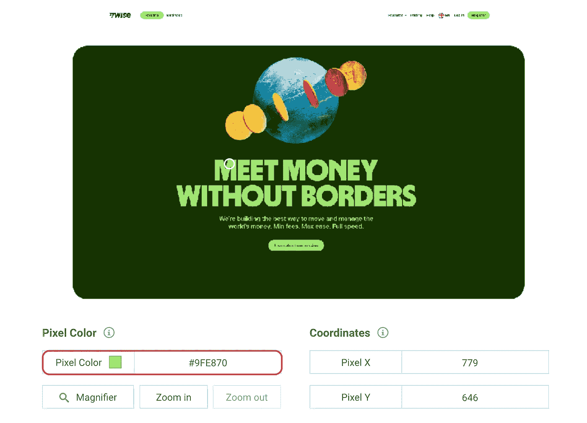

图片由作者提供

由于我在图表中经常使用品牌色，我将它们保存在本地配置文件中，这样可以通过名称轻松访问。

```py
colours = {
  "light_green": "#9FE870",
  "dark_green": "#163300",
  "light_blue": "#7CECF1",
  "dark_blue": "#000146",
  "light_orange": "#FFC828"
}
```

现在，我希望你不会因为不理解如何告诉 Plotly 你想要的颜色而卡住。所以，让我们继续下一个例子，使用线性图，并学习其他指定颜色的方法。

如果你希望精确手动定义每个部分的颜色，可以使用`color_discrete_map`。当我需要在多个图表中保持一致的颜色编码时，我经常使用这种方法。如果在一个图表中你把 Android 用蓝色表示，iOS 用橙色表示，而在另一个图表中反过来，观众可能会感到困惑。所以，值得注意这些细节。

在下面的图表中，我用紫色突出显示了增长的 iOS 受众，并使用灰色阴影表示其他平台，因为我不希望你关注它们。

```py
colormap = {'Android': 'silver', 'Windows': 'gray', 'iOS': 'purple'}
px.line(ts_df, color_discrete_map = colormap)
```

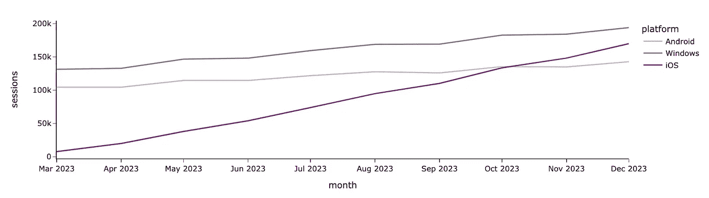

图片由作者提供

如果我想展示不同的群体且不关心每个群体的特定颜色，我可以仅在`color_discrete_sequence`参数中指定颜色的顺序。

```py
px.area(df, color_discrete_sequence = px.colors.qualitative.Prism)
```

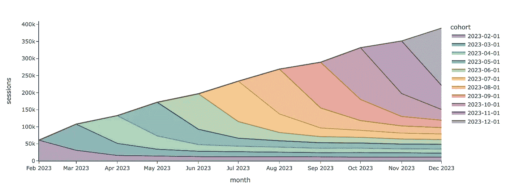

图表由作者绘制

我使用了一个预定义的 Plotly 调色板来设置颜色，但你也可以通过字符串列表指定自定义颜色。以下是 Plotly 中可用的调色板：

+   [离散色调调色板](https://plotly.com/python/discrete-color/)主要包括分离色，这些颜色在需要区分不同群体时非常有用。

+   在[连续颜色尺度](https://plotly.com/python/colorscales/)中，你可以找到许多适合顺序类别的颜色调色板（例如，客户成熟度为 `"< 1 month"`、`"1–3 months"`、`"4–6 months"`、`"6–12 months"` 和 `"> 12 months"`）。

当你需要使用颜色编码值时，连续尺度也可以使用，例如热力图。

```py
px.imshow(
    gmv_df.values, 
    x = gmv_df.columns,
    y = gmv_df.index,
    color_continuous_scale='pubugn'
    text_auto=',.6r', aspect="auto",
    labels=dict(x="age group", y="region", color="GMV in GBP")
)
```

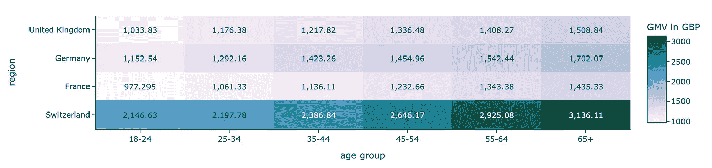

图表由作者提供

当你使用颜色时，需要记住有些人是色盲。最常见的困难是区分红色和绿色的不同阴影。因此，尽量避免这两种颜色的组合，或者同时使用其他视觉提示（如文本或图标）。这样可以帮助你不失去部分观众。

绿色和红色的阴影常用于表示事物的正面和负面方面（例如，在热力图中显示更高和更低的转化率）。你也可以使用蓝色和橙色阴影代替。

## 大小

另一种突出显示某物的方法是调整大小。我们通常会认为较大的东西更重要。例如，为了突出某条线，我们可以增加其宽度。

在 Plotly 中，我们需要使用图形对象来调整线条宽度。

```py
import plotly.graph_objects as go

fig = go.Figure()

fig.add_trace(
    go.Scatter(
        mode='lines', x=ts_df.index,
        y=ts_df.Android, showlegend=True,
        name = 'Android', line = {'width': 1}
    )
)
fig.add_trace(
    go.Scatter(
        mode='lines', x=ts_df.index,
        y=ts_df.Windows, showlegend=True,
        name = 'Windows', line = {'width': 1}
    )
)
fig.add_trace(
    go.Scatter(
        mode='lines', x=ts_df.index,
        y=ts_df.iOS, showlegend=True,
        name = 'iOS', line = {'width': 3} 
    )
)

fig.show()
```

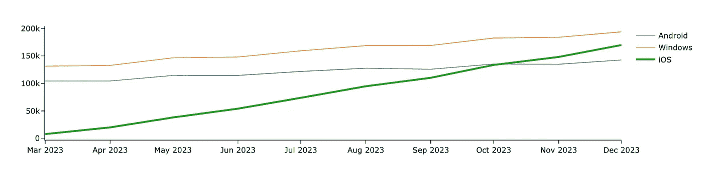

图表由作者提供

现在，iOS 线条相比其他平台更为突出。我们还可以通过加粗或斜体字体来吸引观众的注意力。让我们给图表添加标题，并突出其中的中心部分。为此，我们可以使用 HTML 标签 `<b>`。

```py
fig.update_layout(
    title = '<b>Monthly sessions:</b> sky-rocketing trend for iOS'
)
```

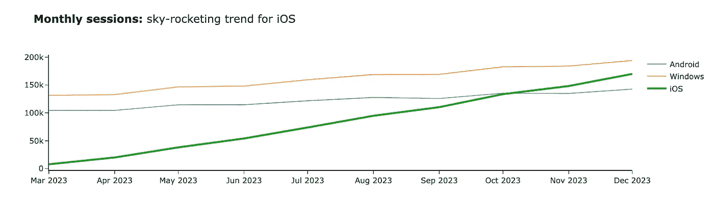

图表由作者提供

# 第三步：讲故事

我们已经学会了如何突出重点，现在可以进入最后一部分——讲故事。我们之前已经讨论过，背景对于理解信息至关重要。所以，在这一部分，我们将讨论如何将背景添加到你的图表中。

为了增加更多的上下文，你可以使用最简单的方法：指定标题和标签。这样可以防止观众询问他们究竟看到了什么。你可以使用 `title` 参数来设置图表标题（就像我们之前做的那样），并用 `labels` 来覆盖默认的轴标签和图例标题。

```py
px.line(ts_df, width = 600, 
    labels = {'value': 'sessions', 'os': 'platform', 'month_date': 'month'},
    title = 'Monthly sessions over time')
```

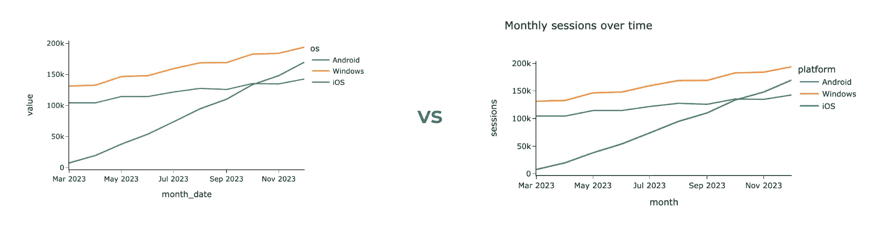

图表由作者提供

详细的标题是一个好习惯，因此标题可能会变得很长。Plotly 是一个强大的可视化工具，但仍有改进的空间。例如，它无法处理过长的图表标题——标题的尾部将不可见。

然而，Plotly 足够灵活，我们可以自己修复这个问题。如果行长度超过阈值（70 个字符），我们将使用 `<br>` HTML 标签在单词之间添加换行符。让我们来做这个。

```py
def format_string_by_lines(s, line_limit = 70):    
    lines = []
    curr_line_words = []
    curr_line_length = 0

    for word in s.split(' '):
        if curr_line_length + len(word) > line_limit:
            lines.append(' '.join(curr_line_words))
            curr_line_words = []
            curr_line_length = 0

        curr_line_words.append(word)
        curr_line_length += len(word)

    lines.append(' '.join(curr_line_words))
    return ' <br> '.join(lines)

chart_title = '<b>Monthly sessions over time:</b> we can see sky-rocketing trend on iOS while Android and Windows are pretty stagnant.'
px.line(ts_df, width = 600, 
    labels = {'value': 'sessions', 'os': 'platform', 'month_date': 'month'},
    title = format_string_by_lines(chart_title))
```

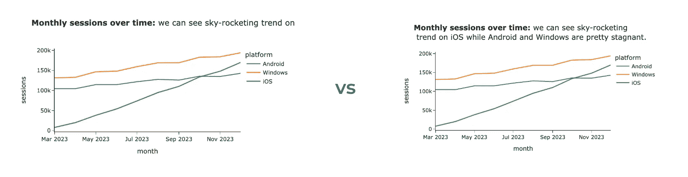

图表由作者提供

此外，我们可能还想展示一些度量的数值。我们已经讨论过，标记所有数据点会导致过多的杂乱，但显示最后的数值似乎是合理的。

我将展示在 Plotly 中实现这一目标的两种方法：使用`text`字段和注释功能。我通常偏好使用`text`，但这还是相当主观的。

让我们从`text`选项开始。首先，让我们查看原始数据集。


图片来自作者

现在，让我们将`text_val`字段添加到数据集中，该字段等于上个月的值，对于其他月份则为空。我还指定了格式化方式，将数字显示为千位数，以去除不必要的细节。

```py
raw_ts_df['text_val'] = list(map(
    lambda v, d: '' if d != raw_ts_df.month_date.max() else '%.1fK' % (v/1000),
    raw_ts_df.value,
    raw_ts_df.month_date
))
```

我们准备好创建我们的可视化了。我将新创建的`text_val`列作为可视化的`text`参数，更新`mode`为`"lines+text"`并指定`middle right`文本位置。我还移动了图例，以免干扰我们的注释。

```py
fig = px.line(raw_ts_df, x = 'month_date', y = 'value', 
    color = 'platform', text = 'text_val',
    width = 1000, height = 500, 
    labels = {'value': 'sessions', 'os': 'platform', 'month_date': 'month'},
    title = '<b>Monthly sessions</b>')

fig.update_traces(textposition="middle right", mode='lines+text')
fig.update_layout(legend=dict(orientation="h", yanchor="bottom", 
    y=0.05, xanchor="right", x=1))
```

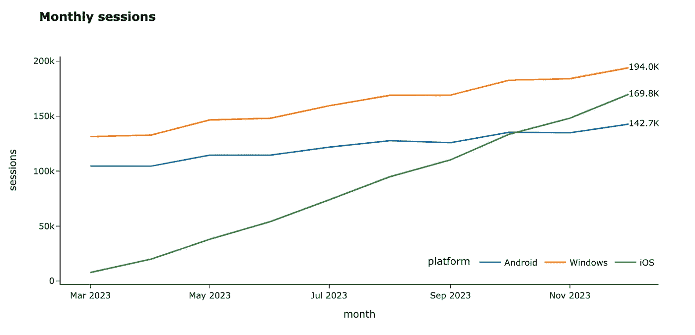

作者绘制的图表

另一种标记数值的方式是使用注释功能。首先，让我们计算每个平台的最后一个值并格式化文本。

```py
annotations = raw_ts_df.groupby('platform', as_index = False)\
    .aggregate({'value': 'last', 'month_date': 'last'})\
    .rename(columns = {'value': 'y', 'month_date': 'x'})

annotations['text'] = annotations.y.map(lambda v: '%.1fK' % (v/1000))
annotations = annotations.drop('platform', axis = 1)
```

让我们添加更多我们将在注释格式化中使用的参数，并将数据框转换为我们可以传递给 Plotly 的列表。

```py
annotations['showarrow'] = False
annotations['xanchor'] = 'left' 
annotations['yanchor'] = 'middle'
annotations_list = annotations.to_dict('records')
```

现在，我们可以通过类似的方式使用注释来创建可视化，并获得相同的结果。所以，选择使用哪种方式完全取决于你。

```py
fig = px.line(raw_ts_df, x = 'month_date', y = 'value', 
    color = 'platform', 
    width = 1000, height = 500, 
    labels = {'value': 'sessions', 'os': 'platform', 'month_date': 'month'},
    title = '<b>Monthly sessions</b>')

fig.update_layout(annotations = annotations_list,
    legend=dict(orientation="h", yanchor="bottom", 
    y=0.05, xanchor="right", x=1))
```

垂直或水平线也可以为你的观众提供所需的上下文。例如，你可以突出显示重要的日期，比如营销活动的启动日期，或者展示你的指标的 SLA。让我们在图表中添加一条垂直线。

你可以通过使用`fig.add_vline`轻松实现这一点。不幸的是，Plotly 存在一个 BUG，无法与日期一起使用。不过，我们可以使用[解决方法](https://github.com/plotly/plotly.py/issues/3065)：看起来有点奇怪，但它有效。

```py
fig.add_vline(
    x=datetime.datetime.strptime("2023-09-01", "%Y-%m-%d").timestamp() * 1000, line_width=3, line_dash="dash", 
    line_color='black', annotation_text="Marketing   <br> campaign  ", 
    annotation_position="top left"
)
```

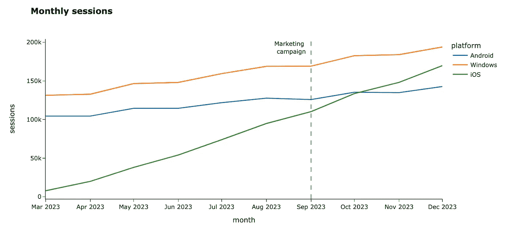

作者绘制的图表

如果你想突出显示图表上的整个区域，可以添加水平线甚至矩形。你可以在[文档](https://plotly.com/python/horizontal-vertical-shapes/)中找到更多详细信息。

# 总结

在这篇文章中，我们已经介绍了数据可视化的关键方面：

+   去除不必要的噪声，以避免分心，

+   使用强调来吸引观众的注意力，通过颜色和大小，

+   添加上下文，帮助你的观众理解你的信息。

> 非常感谢你阅读这篇文章。如果你有任何后续问题或评论，请在评论区留言。

# 参考资料

本文受到了有关数据可视化的优秀书籍《*Storytelling with Data: A Data Visualization Guide for Business Professionals*》的极大影响，作者是 Cole Nussbaumer Knaflic。
