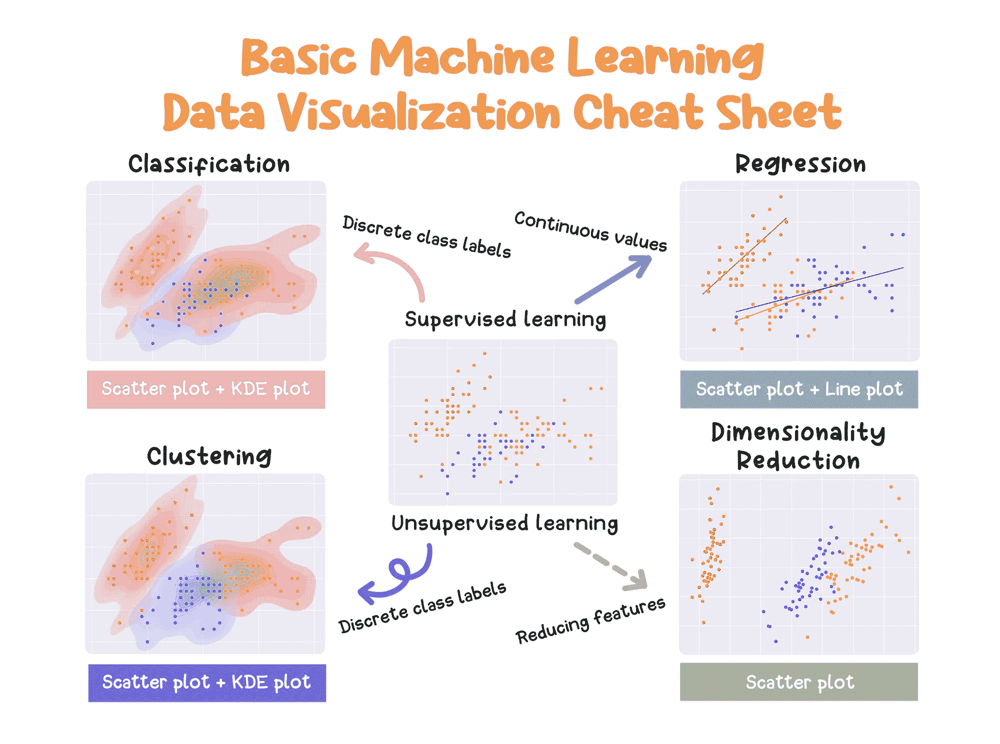

# 基本机器学习算法数据可视化备忘单

> 原文：[`towardsdatascience.com/data-visualization-cheat-sheet-for-basic-machine-learning-algorithms-770c8e61729d?source=collection_archive---------2-----------------------#2024-03-05`](https://towardsdatascience.com/data-visualization-cheat-sheet-for-basic-machine-learning-algorithms-770c8e61729d?source=collection_archive---------2-----------------------#2024-03-05)

## 显示机器学习结果的指导图表。

 [Boriharn K](https://medium.com/@borih.k?source=post_page---byline--770c8e61729d--------------------------------)

·发布于[Towards Data Science](https://towardsdatascience.com/?source=post_page---byline--770c8e61729d--------------------------------) ·8 分钟阅读·2024 年 3 月 5 日

--

图片由[Charlesdeluvio](https://unsplash.com/@charlesdeluvio)提供，来源于[Unsplash](https://unsplash.com/?utm_source=medium&utm_medium=referral)

备忘单可以作为指导方针，给我们一些初步的想法。就个人而言，我有时会使用一些备忘单，发现它们非常有帮助，尤其是在我刚开始学习机器学习算法时。

除了理解和应用，检查获得的结果是一个重要的步骤，帮助我们了解或观察数据的变化。在这种情况下，使用数据可视化是一个不错的选择，因为它可以直观地展示算法的结果。

尽管有多种图表可供选择，但选择合适的图表可以帮助我们有效地展示结果。因此，我认为制作一个快速选择图表的备忘单是一个好主意。最终的结果就是下面展示的基本机器学习数据可视化备忘单。

嗯哼！！

基本机器学习数据可视化备忘单 — 由作者创建。

在继续之前，请考虑到备忘单中推荐的数据可视化仅仅是一些初步的快速想法。可能会有这些图表不适用的情况。接下来，我将引导你...
