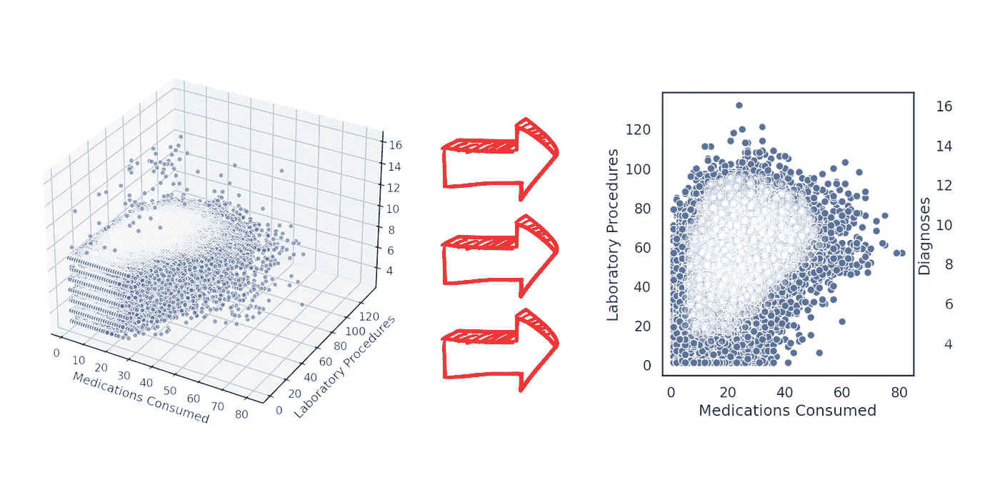

# 数据可视化技术，医疗数据分析 — 第三部分。

> 原文：[`towardsdatascience.com/data-visualization-techniques-for-healthcare-data-analysis-part-iii-7133581ba160?source=collection_archive---------4-----------------------#2024-11-22`](https://towardsdatascience.com/data-visualization-techniques-for-healthcare-data-analysis-part-iii-7133581ba160?source=collection_archive---------4-----------------------#2024-11-22)

## 从有效的条形图到像 3D 可视化这样的陷阱。

 [Leo Anello 💡](https://medium.com/@panData?source=post_page---byline--7133581ba160--------------------------------)

·发表在[Towards Data Science](https://towardsdatascience.com/?source=post_page---byline--7133581ba160--------------------------------) ·阅读 32 分钟·2024 年 11 月 22 日

--

**比较 3D 和 2D 散点图** by [**Leo Anello**](https://medium.com/u/1c040843e458?source=post_page---user_mention--7133581ba160--------------------------------)

# **概览**

我们现在正在进行一个专注于**数据可视化技术**的项目。把这个项目看作是[**特征工程技术：现实世界医疗数据挑战 — 第一部分**](https://medium.com/towards-data-science/feature-engineering-techniques-for-healthcare-data-analysis-part-i-7dfeec78f2a2) **&** [**第二部分**](https://medium.com/towards-data-science/techniques-in-feature-engineering-fc05fd486bc8)的延伸。

基于这些结果，我们将进行全面的**数据探索**、分析，现在重点特别放在**通过可视化进行数据分析**上。

我将介绍各种**图表**，并提出一些次要问题，以及关于何时使用特定类型的图表的提示，具体取决于您想传达的信息。

 [## GitHub - Anello92/feature-engineering-techniques-python

### 通过在 GitHub 上创建帐户为 Anello92/feature-engineering-techniques-python 项目做出贡献。

github.com](https://github.com/Anello92/feature-engineering-techniques-python?source=post_page-----7133581ba160--------------------------------)

最终，您将获得构建**真正有效的数据可视化**的基本知识，这些技能在日常任务中将非常宝贵。**准备好了吗？**

# 目录

+   **Python 库与设置**

+   **初步探索：** 形状…
