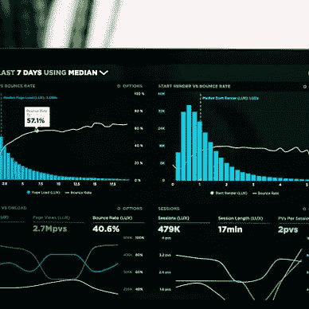
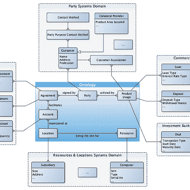

# 数据仓库，重新定义

> 原文：[`towardsdatascience.com/data-warehouse-redefined-f65609454a01?source=collection_archive---------2-----------------------#2024-07-30`](https://towardsdatascience.com/data-warehouse-redefined-f65609454a01?source=collection_archive---------2-----------------------#2024-07-30)

## 重新思考数据仓库：为什么即使在现代数据仓库（MDW）和湖仓模型之外，也有必要进行重新定义

 [Bernd Wessely](https://medium.com/@bernd.wessely?source=post_page---byline--f65609454a01--------------------------------)

·发表于[Towards Data Science](https://towardsdatascience.com/?source=post_page---byline--f65609454a01--------------------------------) ·8 分钟阅读·2024 年 7 月 30 日

--

图片来自[Ruchindra Gunasekara](https://unsplash.com/@ruchindra?utm_source=medium&utm_medium=referral)在[Unsplash](https://unsplash.com/?utm_source=medium&utm_medium=referral)上的分享

好吧，我再次使用了“重新定义”——在我关于[需要重新定义数据工程](https://medium.com/towards-data-science/data-engineering-redefined-643249cbbadd)的文章中我已经用过了。天哪，你可能会问，他还想重新定义什么呢？

嗯，我认为当今数据架构中有很多值得深入研究的内容。而批判性地审视当前数据仓库定义的动机，源于我一位读者的问题。

我写了一篇三部分系列文章，讨论数据网格中的挑战与解决方案。文章中描述的改进型数据网格，作为数据收集方法（如数据仓库：传统、现代以及数据湖/湖仓等变体）的一种替代架构。然而，我强调我们仍然需要数据仓库，作为许多应用程序之一，向数据网格贡献信息。

[Bernd Wessely](https://medium.com/@bernd.wessely?source=post_page-----f65609454a01--------------------------------)

## 数据网格中的挑战与解决方案

[查看列表](https://medium.com/@bernd.wessely/list/challenges-and-solutions-in-data-mesh-82e8aac2d1ef?source=post_page-----f65609454a01--------------------------------)3 个故事
