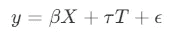
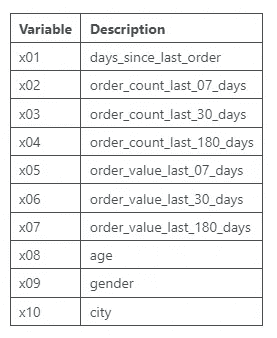
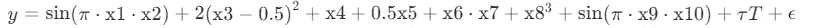

# 利用双重机器学习去偏处理效应

> 原文：[`towardsdatascience.com/de-biasing-treatment-effects-with-double-machine-learning-63b16fcb3e97?source=collection_archive---------2-----------------------#2024-04-05`](https://towardsdatascience.com/de-biasing-treatment-effects-with-double-machine-learning-63b16fcb3e97?source=collection_archive---------2-----------------------#2024-04-05)

## 因果 AI，探索因果推理与机器学习的整合

[](https://medium.com/@raz1470?source=post_page---byline--63b16fcb3e97--------------------------------)[](https://towardsdatascience.com/?source=post_page---byline--63b16fcb3e97--------------------------------) [Ryan O'Sullivan](https://medium.com/@raz1470?source=post_page---byline--63b16fcb3e97--------------------------------)

·发布于 [Towards Data Science](https://towardsdatascience.com/?source=post_page---byline--63b16fcb3e97--------------------------------) ·阅读时长 11 分钟·2024 年 4 月 5 日

--


图片由 [Ales Nesetril](https://unsplash.com/@alesnesetril?utm_source=medium&utm_medium=referral) 提供，来自 [Unsplash](https://unsplash.com/?utm_source=medium&utm_medium=referral)

# **这系列文章的主题是什么？**

欢迎来到我的因果 AI 系列，我们将探讨因果推理如何与机器学习模型相结合。期望在不同的商业环境中探索多个实际应用。

在上一篇文章中，我们探讨了*如何让因果发现应用于现实世界的商业环境*。这次我们将介绍*利用双重机器学习去偏处理效应*。

如果你错过了上一篇关于因果发现的文章，请点击这里查看：

[](/making-causal-discovery-work-in-real-world-business-settings-80e80c5f66b8?source=post_page-----63b16fcb3e97--------------------------------) ## 如何让因果发现应用于现实世界的商业环境

### 因果 AI，探索因果推理与机器学习的整合

towardsdatascience.com

# 介绍

本文将展示为什么双重机器学习是因果 AI 工具箱中的一个重要部分：

**期望深入理解：**

+   平均处理效应（ATE）

+   使用线性回归估计 ATE 的挑战

+   双重机器学习及其如何克服线性回归面临的挑战

+   一个用 Python 实现的案例研究，展示了如何应用双重机器学习。

完整的笔记本可以在这里找到：

[](https://github.com/raz1470/causal_ai/blob/main/notebooks/estimating%20average%20treatment%20effects%20with%20double%20machine%20learning.ipynb?source=post_page-----63b16fcb3e97--------------------------------) [## causal_ai/notebooks/estimating average treatment effects with double machine learning.ipynb at main…

### 本项目介绍了因果人工智能（Causal AI）及其如何推动商业价值。 - causal_ai/notebooks/estimating average…

github.com](https://github.com/raz1470/causal_ai/blob/main/notebooks/estimating%20average%20treatment%20effects%20with%20double%20machine%20learning.ipynb?source=post_page-----63b16fcb3e97--------------------------------)

# 平均处理效应（ATE）

## ATE

ATE 是处理或干预对一个群体的平均影响。我们可以通过比较处理组和控制组之间某一选择指标的平均变化来计算 ATE。

例如，考虑一个营销团队正在进行促销活动。处理组由收到优惠的客户组成，而控制组由未收到优惠的客户组成。我们可以通过比较处理组和控制组中的平均订单数来计算 ATE。

## 潜在结果框架

潜在结果框架由唐纳德·鲁宾（Donald Rubin）提出，已成为因果推断中的基础概念。让我们通过上面营销团队的例子来理解它。

1.  ***处理分配：*** 每个客户有两个潜在结果，一个是处于处理组（收到优惠）的结果，另一个是处于控制组（未收到优惠）的结果。然而，对于每个客户，只能观察到其中一个潜在结果。

1.  ***反事实：*** 未观察到的潜在结果是反事实的，例如，如果这个客户处于控制组（未收到优惠），会发生什么。

1.  ***因果效应：*** 处理的因果效应是不同处理条件下潜在结果之间的差异（收到优惠 vs 未收到优惠）。

1.  ***估计：*** 可以使用一系列因果技术，利用实验数据或观察数据来估计因果效应。

为确保估计效应的有效性，需做出若干假设：

+   ***稳定单元处理值假设（SUTVA）：*** 任何客户的潜在结果不受其他客户处理分配的影响。

+   ***积极性：*** 对于任何特征组合，必须有一定的概率使得客户可以接受处理或控制。

+   ***可忽略性：*** 所有对处理和结果都有影响的混杂因素都是可观察的。

## 实验数据

使用实验数据估计 ATE 相对简单。

随机对照试验（RCT）或 AB 测试的设计是随机将参与者分配到处理组和控制组。这确保了任何结果的差异都可以归因于处理效应，而不是参与者的先天特征。

回到市场营销团队的例子。如果他们随机将客户分为治疗组和控制组，那么订单的平均差异就是所发送优惠的因果效应。

## 观察数据

使用观察数据估计 ATE 更具挑战性。

最常见的挑战是混杂变量，它们同时影响治疗和结果。如果没有控制混杂因子，将导致治疗效应的估计偏差。我们将在文章后续的案例研究中回到这个问题。

其他挑战包括：

+   选择偏倚——治疗分配受结果相关因素的影响。

+   异质性治疗效应——治疗效应在不同子群体之间变化。

# 使用线性回归估计 ATE

## 概述

线性回归可以用于使用观察数据估计 ATE。治疗（T）和控制特征（X）作为变量包含在模型中。



使用生成的图片

治疗变量的系数就是 ATE——与治疗变量的单位变化相关的结果变量的平均变化，同时保持控制特征不变。

## 数据生成过程

我们可以使用一个简单的数据生成过程，包含一个结果变量、治疗和混杂因子，来说明如何使用线性回归估计 ATE。

首先，我们可以可视化因果图：

```py
# Create node lookup variables
node_lookup = {0: 'Confounder',
               1: 'Treatment',
               2: 'Outcome'                                                                                       
 }

total_nodes = len(node_lookup)

# Create adjacency matrix - this is the base for our graph
graph_actual = np.zeros((total_nodes, total_nodes))

# Create graph using expert domain knowledge
graph_actual[0, 1] = 1.0 # Confounder -> Treatment
graph_actual[0, 2] = 1.0 # Confounder -> Outcome
graph_actual[1, 2] = 1.0 # Treatment -> Outcome

plot_graph(input_graph=graph_actual, node_lookup=node_lookup)
```


用户生成的图片

然后我们可以使用简单的数据生成过程创建样本。请特别注意治疗变量的系数（0.75）——这就是我们的真实 ATE。

```py
np.random.seed(123)

# Create dataframe with a confounder, treatment and outcome
df = pd.DataFrame(columns=['Confounder', 'Treatment', 'Outcome'])
df['Confounder'] = np.random.normal(loc=100, scale=25, size=1000)
df['Treatment'] = np.random.normal(loc=50, scale=10, size=1000) + 0.50 * df['Confounder']
df['Outcome'] = 0.25 * df['Confounder'] + 0.75 * df['Treatment'] + np.random.normal(loc=0, scale=5, size=1000)

sns.pairplot(df, corner=True)
```


用户生成的图片

## 线性回归

然后，我们可以训练一个线性回归模型，并提取治疗变量的系数——我们可以看到它正确估计了 ATE（0.75）。

```py
# Set target and features
y = df['Outcome']
X = df[['Confounder', 'Treatment']]

# Train model 
model = RidgeCV()
model = model.fit(X, y)

# Extract the treatment coefficient
ate_lr = round(model.coef_[1], 2)

print(f'The average treatment effect using Linear Regression is: {ate_lr}')
```


用户生成的图片

## 挑战

线性回归可以是估计 ATE（平均处理效应）非常有效的方法。然而，需要注意一些挑战：

+   当我们处理高维数据时，它会遇到困难。

+   “干扰参数”（控制特征，这些是“干扰”估计的因素）可能过于复杂，无法通过线性回归估计。

+   它假设治疗效应在不同的子群体中是恒定的（例如，没有异质性）。

+   假设没有未观察到的混杂因素。

+   假设治疗效应是线性的。

# 双重机器学习（DML）

## 概述

双重机器学习（Double Machine Learning）是一种因果方法，首次在 2017 年发表于《双重/去偏机器学习用于处理和结构参数》一文中：

[](https://arxiv.org/abs/1608.00060?source=post_page-----63b16fcb3e97--------------------------------) [## 双重/去偏机器学习用于处理和因果参数

### 大多数现代的监督统计/机器学习（ML）方法都是专门设计来解决预测问题的……

[arxiv.org](https://arxiv.org/abs/1608.00060?source=post_page-----63b16fcb3e97--------------------------------)

它旨在减少偏差并改善因果效应的估计，适用于高维数据和/或复杂的干扰参数的情况。

它的灵感来源于弗里希-沃-洛维尔定理（Frisch-Waugh-Lovell theorem），因此让我们从理解这一点开始。

## 弗里希-沃-洛维尔定理

FWL 定理用于分解多个回归变量对结果变量的影响，从而使我们能够隔离感兴趣的效应。

假设你有两组特征，X1 和 X2。你可以像之前那样使用线性回归来估计模型参数。然而，你也可以通过以下步骤得到 X1 的相同参数：

1.  仅使用 X2 来预测结果

1.  仅使用 X2 来预测 X1

1.  计算结果模型（步骤 1）和特征模型（步骤 2）的残差

1.  将结果模型的残差对特征模型的残差进行回归，以估计 X1 的参数

一开始这可能很难理解，因此让我们用 Python 来演示一下。我们使用之前相同的数据，但将处理列作为 X1，将混杂变量列作为 X2：

```py
# Set treatment, outcome and confounder samples
treatment = df['Treatment'].to_numpy().reshape(-1,1)
outcome = df['Outcome'].to_numpy().reshape(-1,1)
confounder = df['Confounder'].to_numpy().reshape(-1,1)

# Train treatment model and calculate residuals
treatment_model = RidgeCV()
treatment_model = treatment_model.fit(confounder, treatment)
treatment_pred = treatment_model.predict(confounder)
treatment_residuals = treatment - treatment_pred

# Train outcome model and calculate residuals
outcome_model = RidgeCV()
outcome_model = outcome_model.fit(confounder, outcome)
outcome_pred = outcome_model.predict(confounder)
outcome_residuals = outcome - outcome_pred

# Train residual model and calculate average treatment effect
final_model = RidgeCV()
final_model = final_model.fit(treatment_residuals, outcome_residuals)
ate_dml = round(final_model.coef_[0][0], 2)

print(f'The average treatment effect is: {ate_fwl}')
```


用户生成的图像

我们可以看到，它正确估计了处理变量的系数（0.75）。

## 双重机器学习

双重机器学习（Double Machine Learning）通过隔离处理和控制特征的效应，并使用灵活的机器学习模型，基于 FWL 定理进行构建。

第一阶段通常被称为正交化，因为干扰参数是独立于处理效应估计的。

第一阶段：

+   ***处理模型（去偏化）：*** 用于估计治疗分配概率的机器学习模型（通常称为倾向评分）。然后计算治疗模型的残差。

+   ***结果模型（去噪）：*** 用于仅使用控制特征估计结果的机器学习模型。然后计算结果模型的残差。

第一阶段：

+   处理模型的残差用于预测结果模型的残差。

第二阶段模型的系数是 ATE（平均处理效应）。值得注意的是，第二阶段模型是一个线性模型，这意味着我们假设我们的处理效应是线性的（这也是我们称 DML 为部分线性模型的原因）。

我们可以使用微软的包 EconML，而不是自己编写代码。EconML 实现了广泛的因果机器学习（Causal ML）技术，其中包括多个 DML 的实现：

[](https://econml.azurewebsites.net/?source=post_page-----63b16fcb3e97--------------------------------) [## 欢迎访问 econml 文档！ - econml 0.15.0 文档

### 动态处理方案的估计方法

[econml.azurewebsites.net](https://econml.azurewebsites.net/?source=post_page-----63b16fcb3e97--------------------------------)

```py
# Train DML model
dml = LinearDML(discrete_treatment=False)
dml.fit(df['Outcome'].to_numpy().reshape(-1,1), T=df['Treatment'].to_numpy().reshape(-1,1), X=None, W=df['Confounder'].to_numpy().reshape(-1,1))

# Calculate average treatment effect
ate_dml = round(dml.ate()[0], 2)

print(f'The average treatment effect using the DML is: {ate_dml}')
```


用户生成的图片

我们再次看到它正确估计了处理变量的系数（0.75）。

# 市场营销案例研究

## 背景

市场营销团队向选定的客户发送吸引人的优惠。他们目前并没有从随机选择的客户中挑选出样本来衡量优惠的影响。

数据科学团队被要求估计优惠如何影响客户订单。

## 混杂偏差

天真地比较收到与未收到优惠的客户是有偏差的。这是由于混杂因素所驱动：

+   选择退出电子邮件的客户无法收到优惠——这些客户的参与度较低，不太可能下单。

+   CRM 团队根据客户的订单历史来定位客户——订单历史会影响你再次下单的可能性。

## 数据生成过程

我们设置了一个具有以下特征的数据生成过程：

+   难以处理的干扰参数

+   简单的处理效应（无异质性）

X 特征是治疗前收集的客户特征：



用户生成的图片

T 是一个二进制标志，表示客户是否收到了优惠。



用户生成的图片

```py
np.random.seed(123)

# Set number of observations
n=100000

# Set number of features
p=10

# Create features
X = np.random.uniform(size=n * p).reshape((n, -1))

# Nuisance parameters
b = (
    np.sin(np.pi * X[:, 0] * X[:, 1])
    + 2 * (X[:, 2] - 0.5) ** 2
    + X[:, 3]
    + 0.5 * X[:, 4]
    + X[:, 5] * X[:, 6]
    + X[:, 7] ** 3
    + np.sin(np.pi * X[:, 8] * X[:, 9])
)

# Create binary treatment
T = np.random.binomial(1, expit(b))

# Set treatment effect
tau = 0.75

# Calculate outcome
y = b + T * tau + np.random.normal(size=n)
```

生成数据的 Python 代码基于 Ubers Causal ML 包中的合成数据创建器。能够创建真实的合成数据在评估因果推断方法时至关重要，因此我强烈推荐你查看一下：

[](https://github.com/uber/causalml/blob/master/causalml/dataset/regression.py?source=post_page-----63b16fcb3e97--------------------------------) [## causalml/causalml/dataset/regression.py at master · uber/causalml

### 使用机器学习算法进行提升建模和因果推断 - causalml/causalml/dataset/regression.py at…

[github.com](https://github.com/uber/causalml/blob/master/causalml/dataset/regression.py?source=post_page-----63b16fcb3e97--------------------------------)

## 线性回归

我们从使用线性回归开始估计 ATE。我们的预期是它可能难以捕捉干扰参数，并可能错误指定处理效应。

```py
# Append features and treatment
X_T = np.append(X, T.reshape(-1, 1), axis=1)

# Train linear regression model 
model = RidgeCV()
model = model.fit(X_T, y)
y_pred = model.predict(X_T)

# Extract the treatment coefficient
ate_lr = round(model.coef_[-1], 2)

print(f'The average treatment effect using Linear Regression is: {ate_lr}')
```


用户生成的图片

## 双重机器学习

然后我们使用 LightGBM 作为灵活的第一阶段模型训练 DML 模型。这应该能帮助我们捕捉难以处理的干扰参数，同时正确计算处理效应。

```py
np.random.seed(123)

# Train DML model using flexible stage 1 models
dml = LinearDML(model_y=LGBMRegressor(), model_t=LGBMClassifier(), discrete_treatment=True)
dml.fit(y, T=T, X=None, W=X)

# Calculate average treatment effect
ate_dml = round(dml.ate(), 2)

print(f'The average treatment effect using the DML is: {ate_dml}')
```


用户生成的图片

## 比较

当我们比较结果时，我们观察到线性回归给出了一个有偏的估计，而 DML 非常接近真实值。这真正展示了 DML 的强大之处！

```py
# Plot comparison of results
categories = ['Ground truth', 'DML', 'Linear Regression']
sns.barplot(x=categories, y=[tau, ate_dml, ate_lr])
plt.ylabel('ATE')
plt.title('Average Treatment Effect comparison')
plt.show()
```


用户生成的图片

# 其他方法

还有一些其他因果方法可以用来估计平均处理效应（ATE）（其中很多方法已经在 EconML 和 CausalML 包中实现）：

+   倾向得分匹配（PSM）

+   逆倾向得分匹配（IPSM）

+   S-学习者

+   T-学习者

+   双重稳健学习者（DR）

+   工具变量学习者（IV）

如果你想进一步深入这些方法，我建议从 S-学习者和 T-学习者（通常被称为元学习者）开始。以下是几个关键点，帮助你了解何时以及如何应用它们：

+   当你的处理是二元的，并且处理组和对照组的规模相等时，T-学习者通常是 DML 的一个更简单的替代方案。

+   当你的处理是连续型的，并且你怀疑处理效应可能是非线性的时，S-学习者可能比 DML 更合适。

+   元学习者可能会受到正则化偏差的影响（尤其是 S-学习者）——当我们看到双重机器学习（DML）优于元学习者时，通常就是因为这个原因。

如果你想继续这段因果人工智能的旅程，请关注我——在下一篇文章中，我们将探讨如何利用双重机器学习估计条件平均处理效应（CATE），帮助我们在客户层面个性化治疗。
