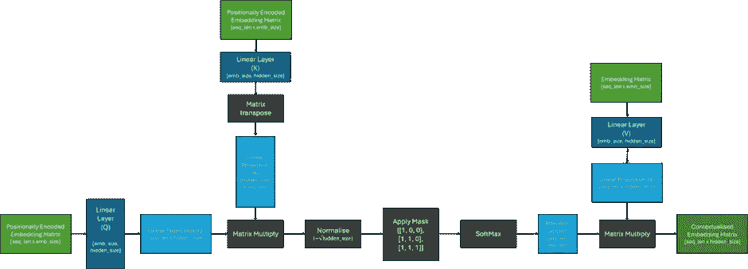
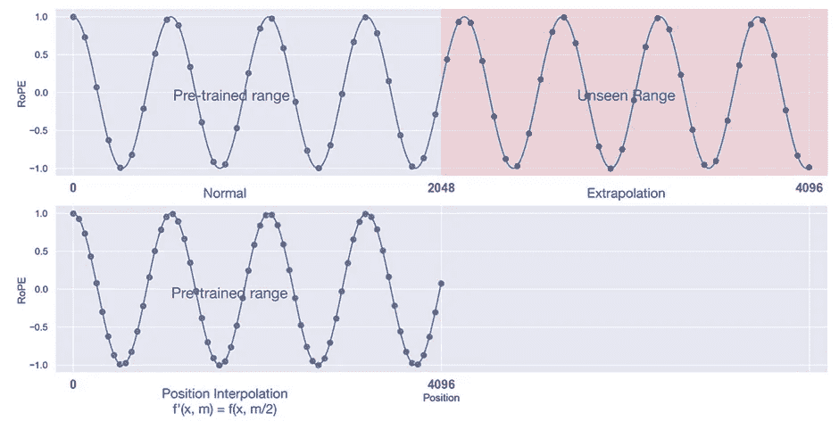
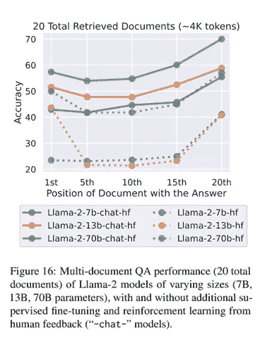

# 解码：理解 Transformer 模型的上下文窗口

> 原文：[`towardsdatascience.com/de-coded-understanding-context-windows-for-transformer-models-cd1baca6427e?source=collection_archive---------4-----------------------#2024-01-27`](https://towardsdatascience.com/de-coded-understanding-context-windows-for-transformer-models-cd1baca6427e?source=collection_archive---------4-----------------------#2024-01-27)

## 你需要了解的关于**上下文窗口如何影响 Transformer 训练和使用**的所有内容

 [Chris Hughes](https://medium.com/@chris.p.hughes10?source=post_page---byline--cd1baca6427e--------------------------------)

·发表于 [Towards Data Science](https://towardsdatascience.com/?source=post_page---byline--cd1baca6427e--------------------------------) ·9 分钟阅读·2024 年 1 月 27 日

--

上下文窗口是 Transformer 一次能够处理的最大序列长度。随着限制令牌数量以及因此限制提示大小的专有大型语言模型（LLM）的兴起，以及对[检索增强生成（RAG）](https://learn.microsoft.com/en-us/azure/search/retrieval-augmented-generation-overview)等技术日益增长的兴趣，理解上下文窗口及其影响的关键概念变得越来越重要，因为在讨论不同模型时，这一点常常被提及。

Transformer 架构是自然语言处理中的一项强大工具，但在处理长文本序列时存在一些局限性。在本文中，我们将探讨不同因素如何影响 Transformer 模型能够处理的最大上下文长度，以及在选择模型时，是否更大的模型总是更好的问题。

由[Azure OpenAI 服务 DALL-E 模型](https://learn.microsoft.com/en-us/azure/ai-services/openai/concepts/models#dall-e-preview)生成的图像，提示语为：“一个机器人在读书。超现实，高质量”

# 我可以在 Transformer 中放入多少个词？

在撰写本文时，像[Llama-2 变体](https://ai.meta.com/llama/)这样的模型具有 4k 标记的上下文长度，[GPT-4 Turbo 具有 128k 标记](https://platform.openai.com/docs/models/gpt-4-and-gpt-4-turbo)，[Claude 2.1 具有 200k 标记](https://www.anthropic.com/news/claude-2-1)！仅从标记数来看，很难想象这如何转化为词汇；尽管这取决于所使用的分词器，但一个好的经验法则是，[100k 标记大约等于 75,000 个词](https://help.openai.com/en/articles/4936856-what-are-tokens-and-how-to-count-them)。为了让这一点更有意义，我们可以将其与一些流行的文学作品进行比较：

+   《指环王》（J.R.R.托尔金）：564,187 个词，752k 个标记

+   《德古拉》（布莱姆·斯托克）：165,453 个词，220k 个标记

+   《格林童话》（雅各布·格林和威廉·格林）：104,228 个词，139k 个标记

+   《弗兰肯斯坦》（玛丽·雪莱）：78,100 个词，104k 个标记

+   《哈利·波特与魔法石》（J.K.罗琳）：77,423 个词，103k 个标记

+   《金银岛》（罗伯特·路易斯·史蒂文森）：72,036 个词，96k 个标记

+   《世界大战》（赫伯特·乔治·威尔斯）：63,194 个词，84k 个标记

+   《巴斯克维尔的猎犬》（阿瑟·柯南·道尔）：62,297 个词，83k 个标记

+   《丛林之书》（吉卜林）：54,178 个词，72k 个标记

总结一下，100k 标记大约相当于一本短篇小说，而 200k 标记则几乎可以容纳完整的*《德古拉》*，一本中等大小的书！要处理大量文本，如*《指环王》*，我们需要 6 次请求 GPT-4，而只需 4 次请求 Claude 2！

由[Azure OpenAI 服务 DALL-E 模型](https://learn.microsoft.com/en-us/azure/ai-services/openai/concepts/models#dall-e-preview)生成的图像，提示语为：“一台机器正在咬书。超现实主义，高质量”

# 什么决定了上下文窗口的大小？

在这一点上，你可能会想，为什么某些模型比其他模型具有更大的上下文窗口。

为了理解这一点，我们首先来看下面的图示，回顾注意力机制是如何工作的；如果你不熟悉注意力的细节，可以参考我之前的文章，这里[详细介绍了该内容](https://medium.com/towards-data-science/de-coded-transformers-explained-in-plain-english-877814ba6429)。最近，已经有多个注意力机制的改进和变体，旨在提高该机制的效率，但核心挑战依然不变。这里，我们将重点关注[原始的缩放点积注意力](https://arxiv.org/abs/1706.03762)。

解码器仅 Transformer 模型的注意力机制。仅对 Q 和 K 输入进行位置编码的方式，在每个 Transformer 层内部应用，遵循了现代架构，如 LLama-2。

从上图中，我们可以看到，包含注意力得分的矩阵大小由输入模型的序列长度决定，并且可以无限制地增大！因此，我们可以看出，上下文窗口的大小并不是由架构决定的，而是由训练时输入给模型的序列长度决定的。

这种计算可能非常昂贵，因为在没有任何优化的情况下，矩阵乘法通常在空间复杂度上是二次的（O*(n²)*）。简而言之，这意味着如果输入序列的长度加倍，所需的内存量将增加四倍！因此，训练一个长度为 128k 的序列模型将需要大约 1024 倍的内存，相较于训练长度为 4k 的序列模型！

需要注意的是，这一操作会针对每一层和每一个头部在 Transformer 中重复进行，这会导致大量的计算。由于 GPU 内存的可用空间还需要与模型的参数、计算出的梯度以及合适大小的输入数据批次共享，因此在训练大型模型时，硬件很快会成为上下文窗口大小的瓶颈。

# **我们可以扩展预训练模型的上下文窗口吗？**

在理解了训练模型时面临的长序列长度的计算挑战后，可能会有诱惑想要在短序列上训练模型，寄希望于这种方法能推广到更长的上下文。

由[Azure OpenAI 服务 DALL-E 模型](https://learn.microsoft.com/en-us/azure/ai-services/openai/concepts/models#dall-e-preview)生成的图像，提示词为：“一只机器人手持扳手。超现实主义，高清。”

一个障碍是位置编码机制，它被用来使 Transformer 捕捉序列中标记的位置。在[原始论文](https://arxiv.org/abs/1706.03762)中，提出了两种位置编码策略。第一种是使用针对序列中每个位置的可学习嵌入，这显然无法推广到模型训练时未见过的最大序列长度。然而，作者假设他们偏好的正弦方法可能会对更长的序列进行外推；后续的研究[证明了事实并非如此](https://openreview.net/pdf?id=R8sQPpGCv0)。

在许多近期的 Transformer 模型中，如 PaLM 和 Llama-2，绝对位置编码已被相对位置编码所取代，例如[RoPE](https://arxiv.org/abs/2104.09864)，其目标是在编码后保持标记之间的相对距离。虽然这些方法比以前的方法在推广到更长的序列时稍微更好，但[对于模型未见过的远超其训练序列长度的序列，性能很快会崩溃](https://openreview.net/pdf?id=R8sQPpGCv0)。

虽然有几种方法旨在[改变](https://openreview.net/pdf?id=R8sQPpGCv0)或[完全移除位置编码](https://arxiv.org/abs/2203.16634)，但这些方法需要对变压器架构进行根本性改变，并且需要重新训练模型，这既昂贵又耗时。由于在本文撰写时，许多顶尖的开源模型都是[基于 Llama-2 的预训练版本](https://arxiv.org/abs/2310.06825)，因此目前有很多[积极的研究](https://arxiv.org/pdf/2401.07872.pdf)正在进行，旨在扩展使用 RoPE 嵌入的现有模型的上下文长度，取得了不同程度的成功。

这些方法中的许多都使用了一些变体，通过插值输入序列；缩放位置嵌入，使其适应模型原始的上下文窗口。其直觉是，模型应该更容易填补单词之间的空隙，而不是试图预测单词之后的内容。

使用插值方法时，目标不是让模型推断出更长的序列，而是创造出模型当前序列长度中的中间位置。图片来源：[[2306.15595] 通过位置插值扩展大语言模型的上下文窗口 (arxiv.org)](https://arxiv.org/abs/2306.15595)

一种名为[YaRN](https://arxiv.org/pdf/2309.00071.pdf)的方法，成功将 Llama-2 的 7B 和 13B 模型的上下文窗口扩展到 128k，而且没有明显的性能下降！

尽管一种在所有情境下都能有效工作的确定性方法尚未出现，但这仍然是一个令人兴奋的研究领域，具有巨大的潜在影响！

# **更长的上下文窗口总是更好吗？**

现在我们已经理解了在更长序列长度上训练模型的一些实际挑战，以及为克服这些挑战而采取的一些潜在缓解措施，我们可以提出另一个问题——这些额外的努力值得吗？乍一看，答案似乎显而易见；为模型提供更多信息应该能够更容易地注入新知识并减少幻觉，使其在几乎所有可以想象的应用中都更有用。然而，事情并非如此简单。

该图片由[Azure OpenAI 服务的 DALL-E 模型](https://learn.microsoft.com/en-us/azure/ai-services/openai/concepts/models#dall-e-preview)生成，使用的提示词是：“两位机器人，每人拿着一本书，比较书本的大小。超现实主义，高质量”

在 2023 年的论文[*迷失在中间*](https://arxiv.org/abs/2307.03172)*,* 斯坦福大学和伯克利的研究人员调查了模型如何使用和访问其上下文窗口中提供的信息，并得出了以下结论：

> “*我们发现，改变输入上下文中相关信息的位置可以显著影响模型性能，这表明当前的语言模型在长输入上下文中并不能稳健地访问和使用信息。*”

对于他们的实验，作者创建了一个数据集，在该数据集中，对于每个查询，包含一个答案的文档和*k — 1*个不包含答案的干扰文档；通过调整输入上下文长度，改变检索到的、不包含答案的文档数量。他们随后通过改变文档的顺序来调整相关信息在输入上下文中的位置，将相关文档放在上下文的开始、中间或末尾，并评估是否有任何正确的答案出现在预测的输出中。

具体来说，他们观察到，当相关信息位于上下文窗口的开始或末尾时，研究中的模型表现最佳；而当所需信息位于上下文的中间时，性能显著下降。

从理论上讲，Transformer 中的自注意力机制使得模型在生成下一个词时能够考虑输入的所有部分，而不管它们在序列中的位置。因此，我认为模型关于如何定位重要信息的任何偏见更可能来自训练数据，而非架构。我们可以通过进一步研究作者在评估 Llama-2 系列模型时观察到的结果，来探讨这个想法，这些结果涉及根据文档位置检索的准确性，展示在下图中。

图像来源：[[2307.03172] Lost in the Middle: How Language Models Use Long Contexts (arxiv.org)](https://arxiv.org/abs/2307.03172)

看着基础模型，我们可以清楚地观察到作者对于 Llama-2 13B 和 70B 模型的结论。有趣的是，对于 7B 模型，我们可以看到它几乎完全依赖于上下文的末尾；由于大量的无监督微调是在从各种来源抓取的数据流上进行的，当模型的参数相对较少，无法在不断变化的上下文中预测下一个词时，专注于最新的标记是有意义的！

更大的模型在相关信息位于文本开头时表现也很好；这表明，随着模型参数的增加，它们学习更多地关注文本的开头。作者假设这是因为，在预训练过程中，模型会看到来自像 StackOverflow 这样的数据源，它们通常从重要信息开始。我怀疑 13B 模型在前置信息上的轻微优势并不显著，因为两种情况的准确性相似，而且 70B 模型并没有展示出这种模式。

“聊天”模型经过进一步的指令调优和强化学习（RLHF）训练，整体表现更好，并且似乎对文本中相关信息的位置变得不那么敏感。对于 13B 模型，这种变化更为明显，而对于 70B 模型则不太明显。7B 模型变化不大，可能是因为它的参数较少。这可能意味着这些模型在更多的训练后，能够更好地利用文本其他部分的信息，但它们仍然偏好最近的信息。考虑到后续训练阶段明显较短，它们尚未完全克服第一次无监督训练的偏差；我怀疑 70B 模型可能需要更大且更多样化的后续训练，才能表现出与 13B 模型在此观察到的表现类似的变化幅度。

此外，我对一项研究感兴趣，该研究探讨了在用于 SFT 的数据集中相关信息的位置。正如 [人类表现出类似行为](https://www.verywellmind.com/understanding-the-primacy-effect-4685243)，即在序列的开始和结束部分更容易回忆起信息，因此，如果这种行为在给定的许多示例中有所体现，也不足为奇。

# 结论

总结来说，上下文窗口并非固定，可以根据需要扩大，只要有足够的内存可用！然而，较长的序列意味着更多的计算——这也导致模型变慢——并且除非模型已经在类似长度的序列上进行过训练，否则输出可能没有太大意义！然而，即便是拥有大上下文窗口的模型，也不能保证它们会有效利用提供给它们的所有信息——这确实是 [没有免费的午餐](https://en.wikipedia.org/wiki/No_free_lunch_theorem)！

[*Chris Hughes*](https://www.linkedin.com/in/chris-hughes1/) *在 LinkedIn 上*

除非另有说明，所有图片均由作者创作。

# 参考文献

+   [RAG 和生成式 AI — Azure AI 搜索 | Microsoft Learn](https://learn.microsoft.com/en-us/azure/search/retrieval-augmented-generation-overview)

+   [Llama 2 — Meta AI](https://ai.meta.com/llama/)

+   [模型 — OpenAI API](https://platform.openai.com/docs/models/gpt-4-and-gpt-4-turbo)

+   [介绍 Claude 2.1 \ Anthropic](https://www.anthropic.com/news/claude-2-1)

+   [什么是 token，如何计算它们？| OpenAI 帮助中心](https://help.openai.com/en/articles/4936856-what-are-tokens-and-how-to-count-them)

+   解码：用通俗英语解释 Transformers | Chris Hughes | Towards Data Science

+   [[1706.03762] 注意力即一切 (arxiv.org)](https://arxiv.org/abs/1706.03762)

+   [短期训练，长期测试：具有线性偏差的注意力机制使得输入长度的外推成为可能 (openreview.net)](https://openreview.net/pdf?id=R8sQPpGCv0)

+   [[2203.16634] 没有位置编码的变换器语言模型仍能学习位置相关信息](https://arxiv.org/abs/2203.16634)

+   [[2310.06825] Mistral 7B](https://arxiv.org/abs/2310.06825)

+   [[2401.07872] 大语言模型中上下文长度扩展技术的什么、为什么及如何 — 详细调查](https://arxiv.org/abs/2401.07872)

+   [[2306.15595] 通过位置插值扩展大语言模型的上下文窗口](https://arxiv.org/abs/2306.15595)

+   [[2309.00071] YaRN：大语言模型的高效上下文窗口扩展](https://arxiv.org/abs/2309.00071)

+   [[2307.03172] 在中间迷失：语言模型如何使用长上下文](https://arxiv.org/abs/2307.03172)

+   [首因效应：含义及其工作原理](https://www.verywellmind.com/understanding-the-primacy-effect-4685243)

+   [无免费午餐定理 — 维基百科](https://en.wikipedia.org/wiki/No_free_lunch_theorem)
