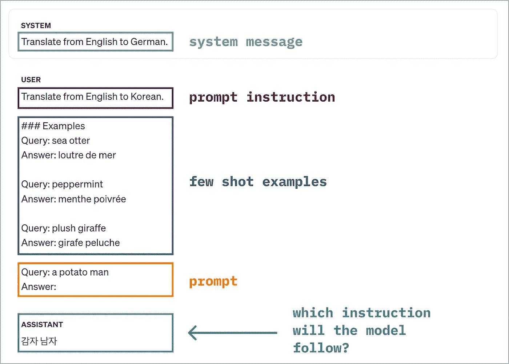

# 以 AI 方式应对认知失调

> 原文：[`towardsdatascience.com/dealing-with-cognitive-dissonance-the-ai-way-1f182a248d6d?source=collection_archive---------8-----------------------#2024-07-04`](https://towardsdatascience.com/dealing-with-cognitive-dissonance-the-ai-way-1f182a248d6d?source=collection_archive---------8-----------------------#2024-07-04)

## 语言模型如何处理提示中的冲突指令？

 [Yennie Jun](https://medium.com/@artfish?source=post_page---byline--1f182a248d6d--------------------------------)

·发布于 [Towards Data Science](https://towardsdatascience.com/?source=post_page---byline--1f182a248d6d--------------------------------) ·阅读时间 7 分钟·2024 年 7 月 4 日

--

在系统消息、提示和示例中给出矛盾的指令时，LLM 会遵循哪条指令来生成回答？由作者创作。

*转载于* [*Art Fish Intelligence*](https://www.artfish.ai/p/dealing-with-cognitive-dissonance)*.*

语言模型如何处理提示中的冲突指令？

[认知失调](https://en.wikipedia.org/wiki/Cognitive_dissonance)是一个心理学术语，用来描述个体在持有两个或多个矛盾信念时所经历的心理不适。例如，如果你在杂货店看到一个标明“10 件物品或更少”的结账通道，但排队的每个人都有 10 件或更多物品，那么你应该怎么办？

在 AI 的背景下，我想了解大型语言模型（LLM）如何处理以矛盾指令形式呈现的认知失调（例如，提示 LLM 从英语翻译成韩语，但却给出英语到法语的翻译示例）。

在这篇文章中，我通过给 LLM 提供矛盾信息来进行实验，以确定 LLM 更可能与哪些矛盾信息保持一致。

# 系统消息、提示指令和少量示例

作为用户，你可以通过以下三种方式之一告诉 LLM 该做什么：

+   直接在系统消息中描述任务
