# 决策树分类器，解释：适合初学者的可视化指南与代码示例

> 原文：[`towardsdatascience.com/decision-tree-classifier-explained-a-visual-guide-with-code-examples-for-beginners-7c863f06a71e?source=collection_archive---------2-----------------------#2024-08-30`](https://towardsdatascience.com/decision-tree-classifier-explained-a-visual-guide-with-code-examples-for-beginners-7c863f06a71e?source=collection_archive---------2-----------------------#2024-08-30)

## 分类算法

## 我们最喜爱的倒立树的新视角

[](https://medium.com/@samybaladram?source=post_page---byline--7c863f06a71e--------------------------------)[](https://towardsdatascience.com/?source=post_page---byline--7c863f06a71e--------------------------------) [Samy Baladram](https://medium.com/@samybaladram?source=post_page---byline--7c863f06a71e--------------------------------)

·发表于[Towards Data Science](https://towardsdatascience.com/?source=post_page---byline--7c863f06a71e--------------------------------) ·阅读时间：10 分钟·2024 年 8 月 30 日

--

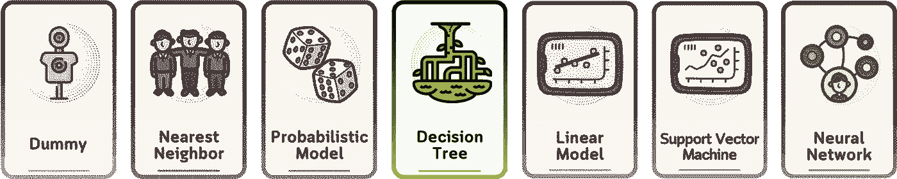

`⛳️ 更多[分类算法](https://medium.com/@samybaladram/list/classification-algorithms-b3586f0a772c)，解释如下： · 虚拟分类器 · K 近邻分类器 · 伯努利朴素贝叶斯 · 高斯朴素贝叶斯 ▶ 决策树分类器 · 逻辑回归 · 支持向量机分类器 · 多层感知器`

决策树在机器学习中无处不在，因其直观的输出而深受喜爱。谁不喜欢一个简单的“如果-那么”流程图呢？尽管它们很受欢迎，但令人惊讶的是，找到一个清晰的、逐步解释决策树工作原理的教程竟然如此困难。（实际上，我都为自己花了那么长时间才真正理解这个算法感到有些不好意思。）

在这篇分析中，我将重点讲解树构建的核心要点。我们将逐一解析每个节点发生了什么以及为什么发生，从根节点到最终的叶节点（当然会配有视觉示例）。


所有视觉效果：作者使用 Canva Pro 创建，已优化为移动端显示；在桌面端可能显示过大。

# 定义

决策树分类器创建一个倒置的树来进行预测，从顶部开始，提出一个关于数据中重要特征的问题，然后根据答案分支。沿着这些分支往下走，每一个停靠点都会问另一个问题，逐步缩小可能性。这个问答游戏会一直持续，直到到达最底部——一个叶节点——在这里你将得到最终的预测或分类。

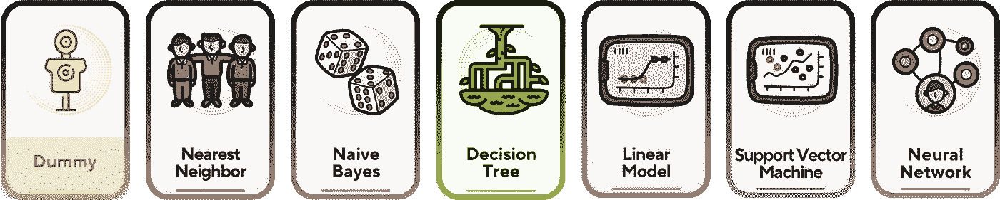

决策树是最重要的机器学习算法之一——它是一个一系列的“是”或“否”问题。

# 使用的数据集

在本文中，我们将使用这个人工高尔夫数据集（灵感来自[1]）作为示例。这个数据集预测一个人在特定天气条件下是否会打高尔夫。

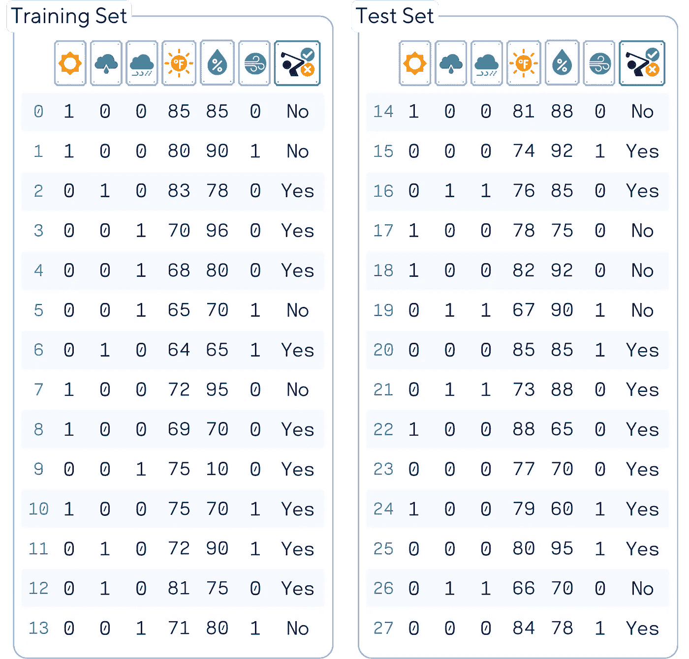

列：‘Outlook’（已经进行独热编码为晴天、多云、雨天），‘Temperature’（华氏温度），‘Humidity’（湿度%），‘Wind’（是否有风），‘Play’（目标特征）

```py
# Import libraries
from sklearn.model_selection import train_test_split
from sklearn.metrics import accuracy_score
import pandas as pd
import numpy as np

# Load data
dataset_dict = {
    'Outlook': ['sunny', 'sunny', 'overcast', 'rainy', 'rainy', 'rainy', 'overcast', 'sunny', 'sunny', 'rainy', 'sunny', 'overcast', 'overcast', 'rainy', 'sunny', 'overcast', 'rainy', 'sunny', 'sunny', 'rainy', 'overcast', 'rainy', 'sunny', 'overcast', 'sunny', 'overcast', 'rainy', 'overcast'],
    'Temperature': [85.0, 80.0, 83.0, 70.0, 68.0, 65.0, 64.0, 72.0, 69.0, 75.0, 75.0, 72.0, 81.0, 71.0, 81.0, 74.0, 76.0, 78.0, 82.0, 67.0, 85.0, 73.0, 88.0, 77.0, 79.0, 80.0, 66.0, 84.0],
    'Humidity': [85.0, 90.0, 78.0, 96.0, 80.0, 70.0, 65.0, 95.0, 70.0, 80.0, 70.0, 90.0, 75.0, 80.0, 88.0, 92.0, 85.0, 75.0, 92.0, 90.0, 85.0, 88.0, 65.0, 70.0, 60.0, 95.0, 70.0, 78.0],
    'Wind': [False, True, False, False, False, True, True, False, False, False, True, True, False, True, True, False, False, True, False, True, True, False, True, False, False, True, False, False],
    'Play': ['No', 'No', 'Yes', 'Yes', 'Yes', 'No', 'Yes', 'No', 'Yes', 'Yes', 'Yes', 'Yes', 'Yes', 'No', 'No', 'Yes', 'Yes', 'No', 'No', 'No', 'Yes', 'Yes', 'Yes', 'Yes', 'Yes', 'Yes', 'No', 'Yes']
}
df = pd.DataFrame(dataset_dict)

# Preprocess data
df = pd.get_dummies(df, columns=['Outlook'],  prefix='', prefix_sep='', dtype=int)
df['Wind'] = df['Wind'].astype(int)
df['Play'] = (df['Play'] == 'Yes').astype(int)

# Reorder the columns
df = df[['sunny', 'overcast', 'rainy', 'Temperature', 'Humidity', 'Wind', 'Play']]

# Prepare features and target
X, y = df.drop(columns='Play'), df['Play']

# Split data
X_train, X_test, y_train, y_test = train_test_split(X, y, train_size=0.5, shuffle=False)

# Display results
print(pd.concat([X_train, y_train], axis=1), '\n')
print(pd.concat([X_test, y_test], axis=1))
```

# 主要机制

决策树分类器通过递归地根据最具信息量的特征来划分数据。以下是它的工作原理：

1.  从根节点开始，包含整个数据集。

1.  选择最佳特征来划分数据（基于如基尼杂质等衡量标准）。

1.  为所选特征的每个可能值创建子节点。

1.  对每个子节点重复步骤 2-3，直到满足停止标准（例如，最大深度达到、每叶最小样本数、或纯叶节点）。

1.  将多数类别分配给每个叶节点。

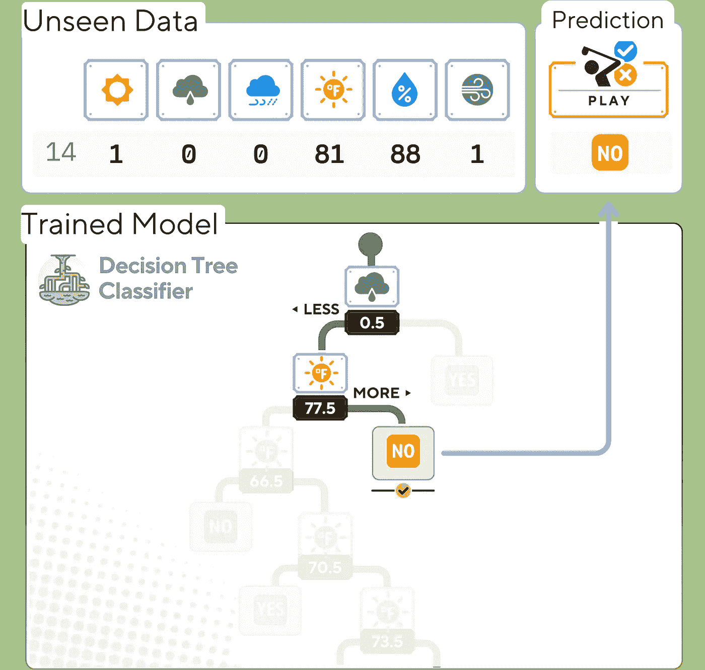

# 训练步骤

在 scikit-learn 中，决策树算法称为 CART（分类与回归树）。它构建二叉树，通常遵循以下步骤：

1.  从根节点开始，包含所有训练样本。

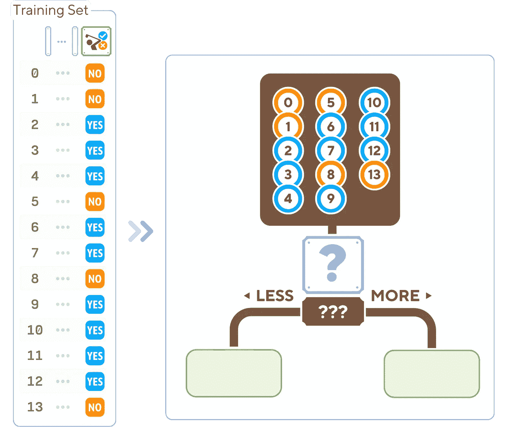

从根节点开始，根节点包含所有 14 个训练样本，我们将找出最佳特征及最佳切分点，开始构建树。

2. 对每个特征：

a. 对特征值进行排序。

b. 考虑相邻值之间的所有可能阈值作为潜在的切分点。

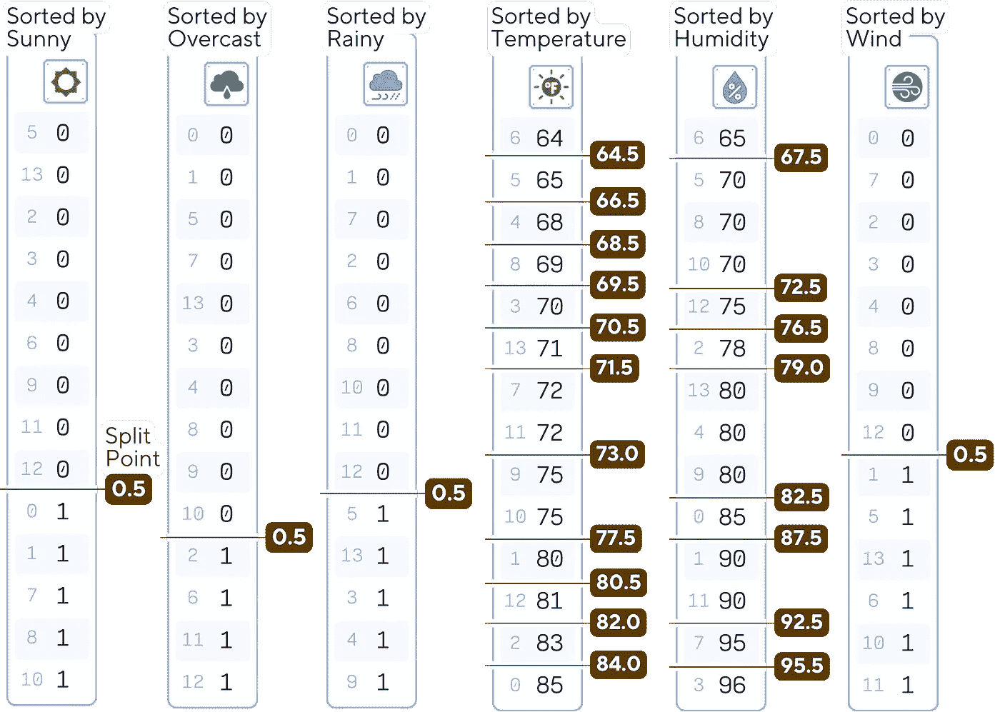

在这个根节点中，有 23 个切分点需要检查。二元列仅有一个切分点。

```py
def potential_split_points(attr_name, attr_values):
    sorted_attr = np.sort(attr_values)
    unique_values = np.unique(sorted_attr)
    split_points = [(unique_values[i] + unique_values[i+1]) / 2 for i in range(len(unique_values) - 1)]
    return {attr_name: split_points}

# Calculate and display potential split points for all columns
for column in X_train.columns:
    splits = potential_split_points(column, X_train[column])
    for attr, points in splits.items():
        print(f"{attr:11}: {points}")
```

3. 对于每个潜在的切分点：

a. 计算当前节点的杂质（例如，基尼杂质）。

b. 计算杂质的加权平均值。

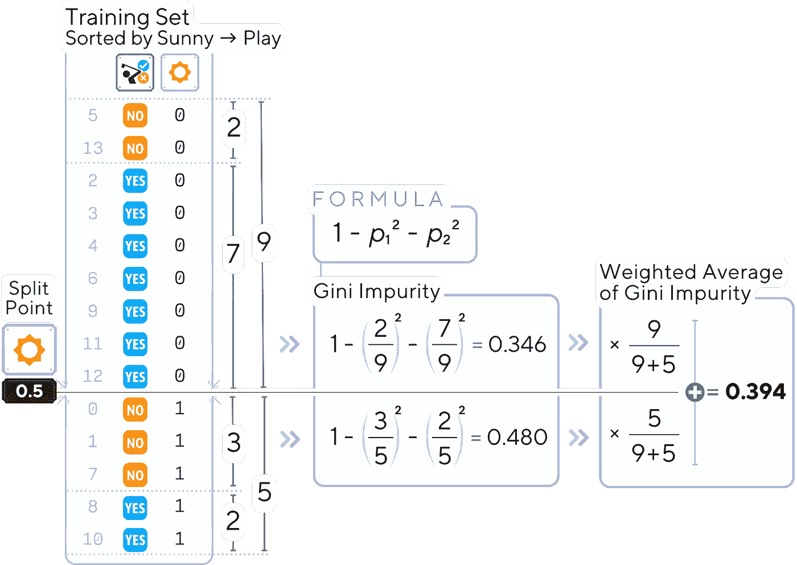

例如，对于特征“sunny”及分裂点 0.5，计算数据集两部分的杂质（如“基尼杂质”）。

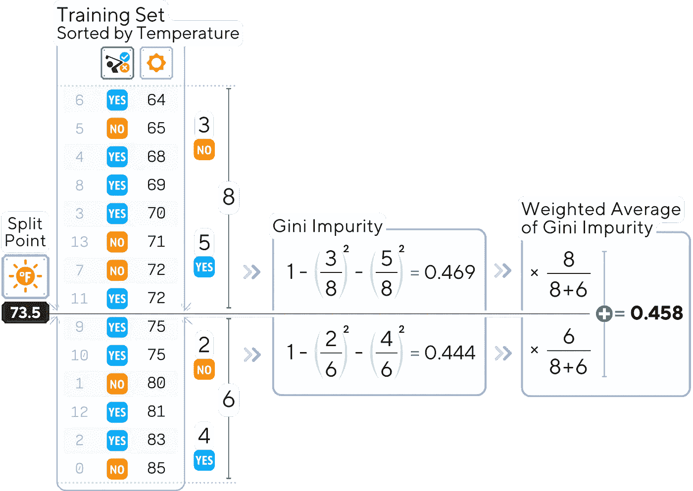

另一个例子，类似的过程也可以应用于像“Temperature”这样的连续特征。

```py
def gini_impurity(y):
    p = np.bincount(y) / len(y)
    return 1 - np.sum(p**2)

def weighted_average_impurity(y, split_index):
    n = len(y)
    left_impurity = gini_impurity(y[:split_index])
    right_impurity = gini_impurity(y[split_index:])
    return (split_index * left_impurity + (n - split_index) * right_impurity) / n

# Sort 'sunny' feature and corresponding labels
sunny = X_train['sunny']
sorted_indices = np.argsort(sunny)
sorted_sunny = sunny.iloc[sorted_indices]
sorted_labels = y_train.iloc[sorted_indices]

# Find split index for 0.5
split_index = np.searchsorted(sorted_sunny, 0.5, side='right')

# Calculate impurity
impurity = weighted_average_impurity(sorted_labels, split_index)

print(f"Weighted average impurity for 'sunny' at split point 0.5: {impurity:.3f}")
```

4\. 在计算所有特征和分裂点的杂质后，选择最低的杂质值。

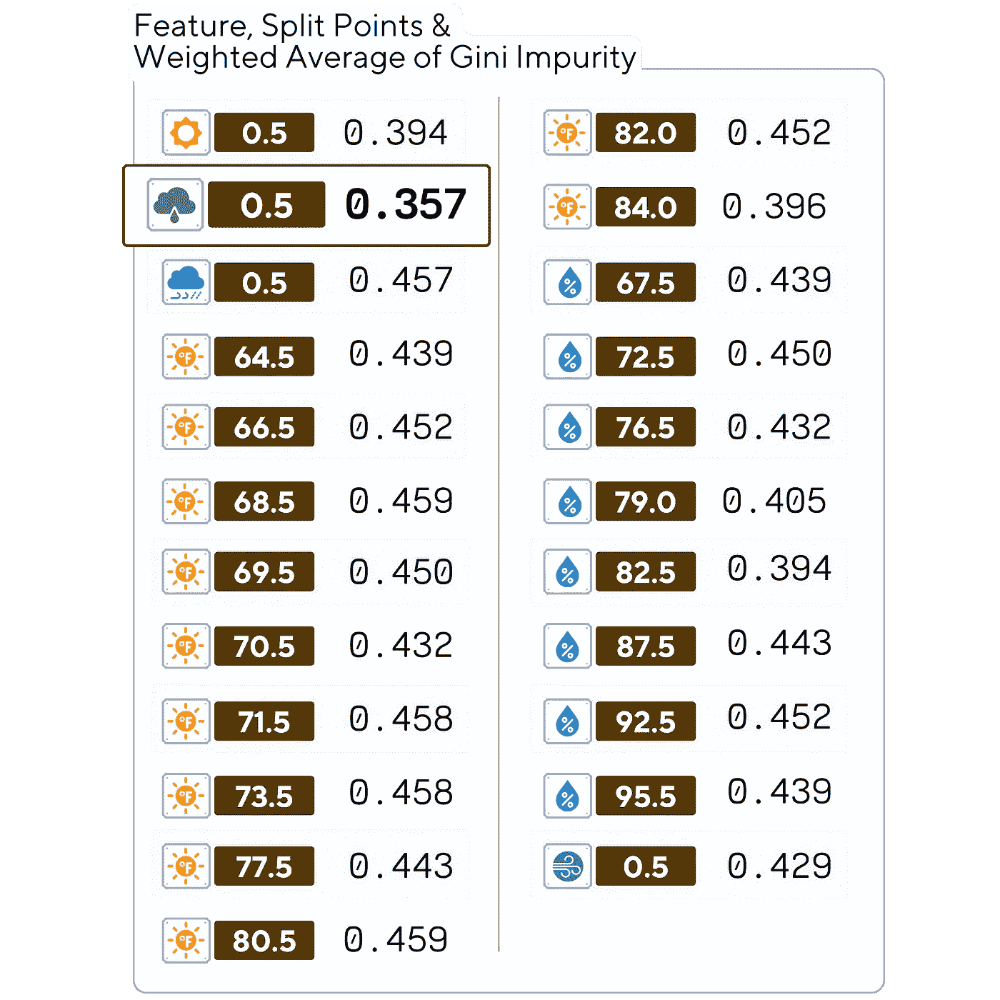

特征“overcast”在分裂点 0.5 时具有最低的杂质值。这意味着这个分裂点将是所有其他分裂点中最纯净的！

```py
def calculate_split_impurities(X, y):
    split_data = []

    for feature in X.columns:
        sorted_indices = np.argsort(X[feature])
        sorted_feature = X[feature].iloc[sorted_indices]
        sorted_y = y.iloc[sorted_indices]

        unique_values = sorted_feature.unique()
        split_points = (unique_values[1:] + unique_values[:-1]) / 2

        for split in split_points:
            split_index = np.searchsorted(sorted_feature, split, side='right')
            impurity = weighted_average_impurity(sorted_y, split_index)
            split_data.append({
                'feature': feature,
                'split_point': split,
                'weighted_avg_impurity': impurity
            })

    return pd.DataFrame(split_data)

# Calculate split impurities for all features
calculate_split_impurities(X_train, y_train).round(3)
```

5\. 根据选择的特征和分裂点创建两个子节点：

- 左子节点：特征值 <= 分裂点的样本

- 右子节点：特征值 > 分裂点的样本

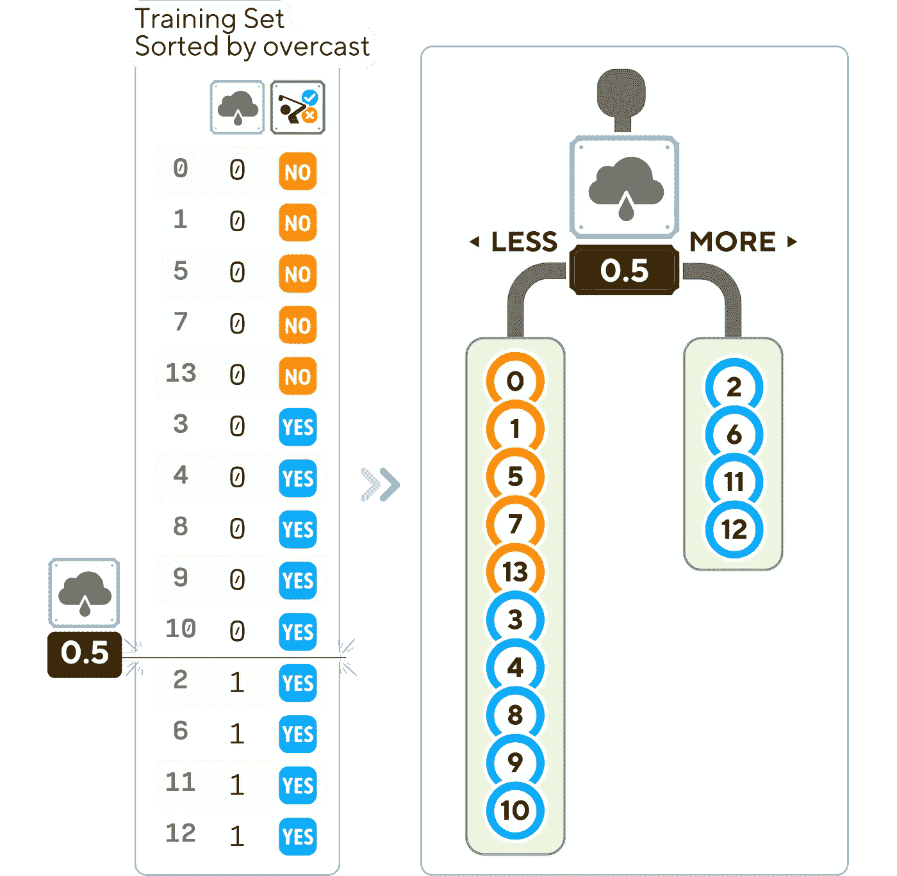

选定的分裂点将数据分为两部分。由于一部分已经是纯净的（右侧！这就是为什么它的杂质值较低！），我们只需要在左侧节点继续构建决策树。

6\. 递归地重复步骤 2–5，直到达到每个子节点。你也可以在满足停止条件时停止（例如，达到最大深度、每个叶节点的最小样本数或最小杂质减少）。

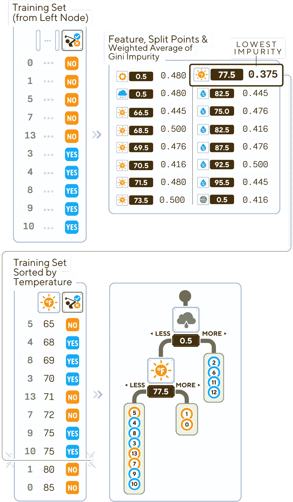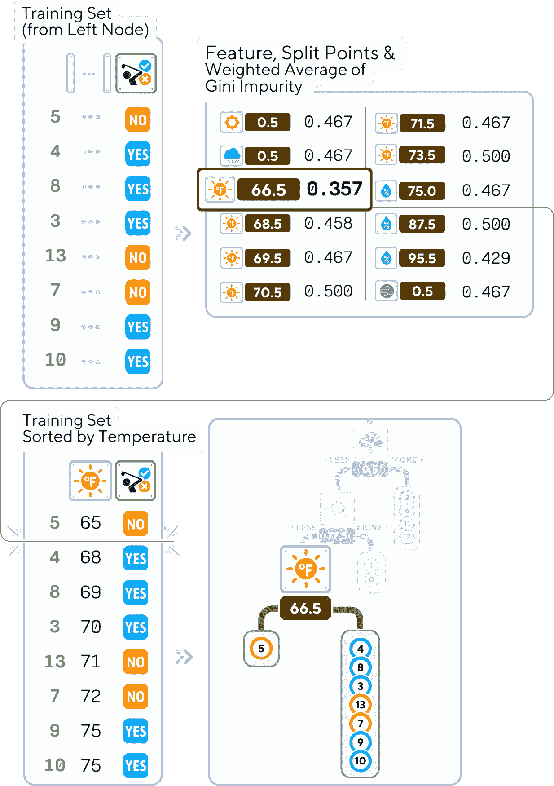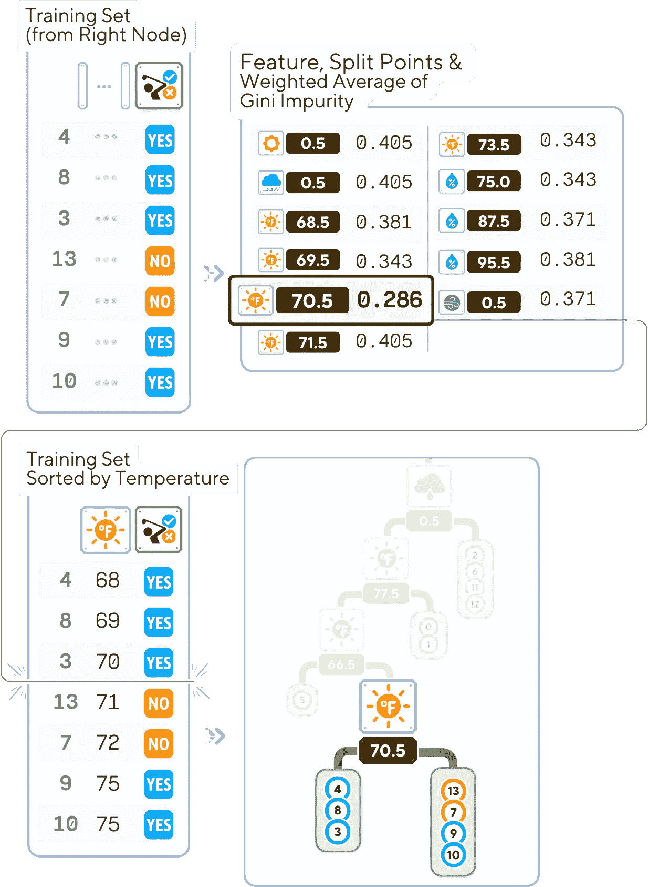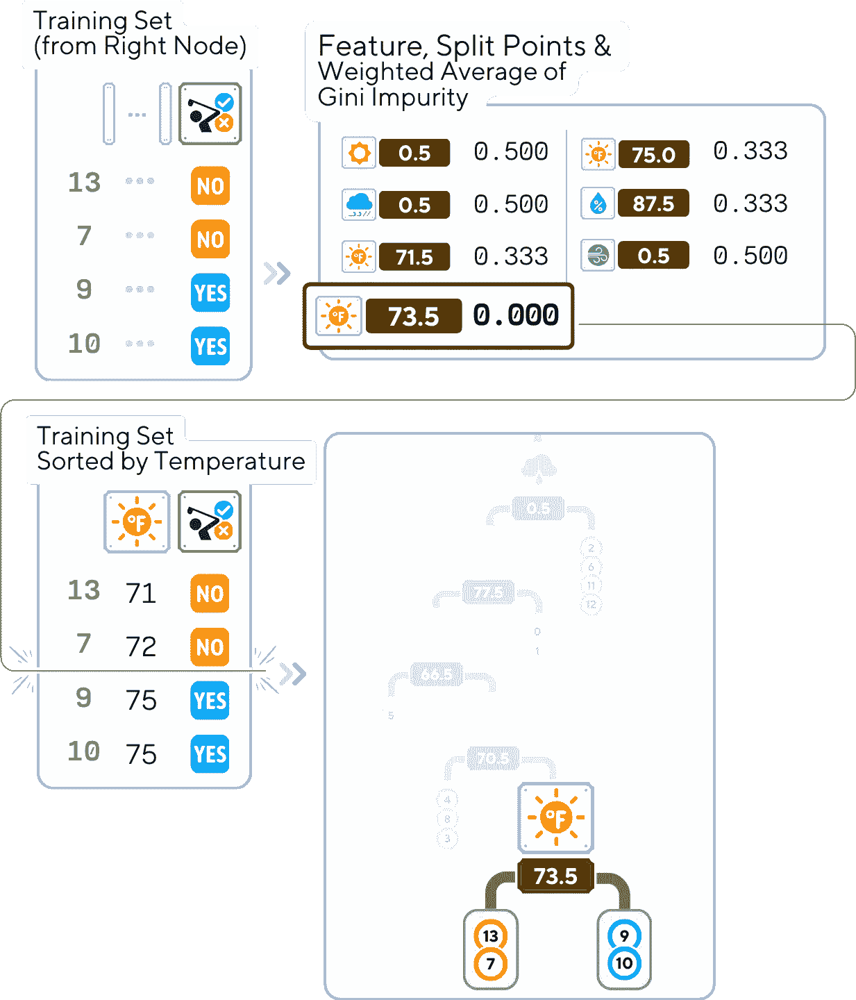

```py
# Calculate split impurities forselected index
selected_index = [4,8,3,13,7,9,10] # Change it depending on which indices you want to check
calculate_split_impurities(X_train.iloc[selected_index], y_train.iloc[selected_index]).round(3)
```

```py
from sklearn.tree import DecisionTreeClassifier

# The whole Training Phase above is done inside sklearn like this
dt_clf = DecisionTreeClassifier()
dt_clf.fit(X_train, y_train)
```

## 最终完整的树

叶节点的类别标签是到达该节点的训练样本的多数类。

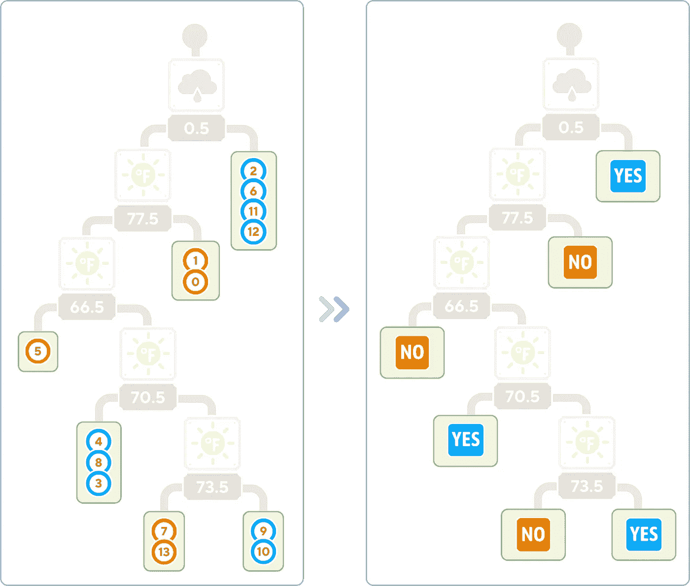

右侧的树是最终将用于分类的决策树。在这一点上，我们不再需要样本。

```py
import matplotlib.pyplot as plt
from sklearn.tree import plot_tree
# Plot the decision tree
plt.figure(figsize=(20, 10))
plot_tree(dt_clf, filled=True, feature_names=X.columns, class_names=['Not Play', 'Play'])
plt.show()
```

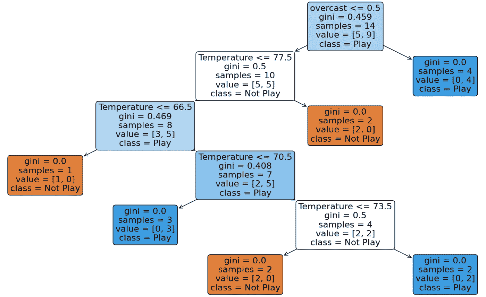

在这个 scikit-learn 输出中，还存储了非叶节点的信息，例如该节点的样本数和每个类别的样本数（值）。

# 分类步骤

训练好决策树后，预测过程是这样进行的：

1.  从训练好的决策树的根节点开始。

1.  评估当前节点的特征和分裂条件。

1.  在每个后续节点重复步骤 2，直到达到叶节点。

1.  叶节点的类别标签成为新实例的预测结果。

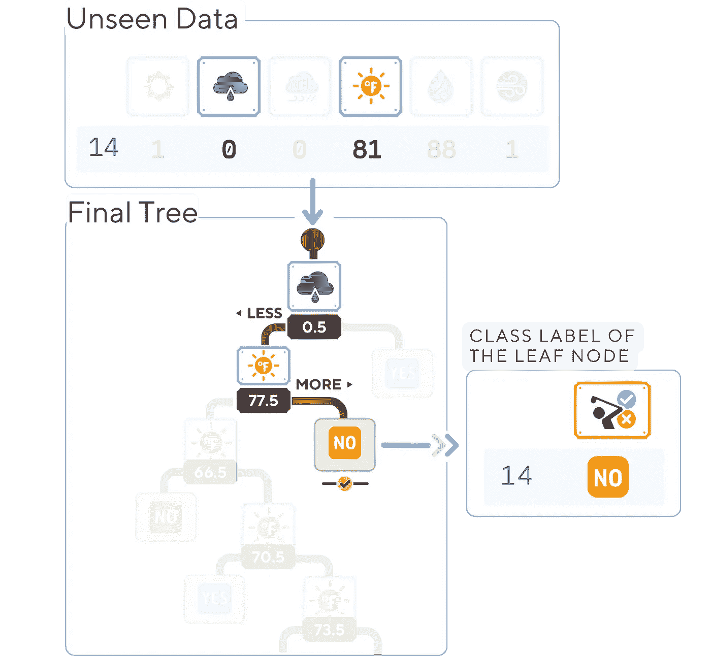

我们只需要决策树所要求的列。除了“overcast”和“Temperature”之外，其他值在做出预测时并不重要。

```py
# Make predictions
y_pred = dt_clf.predict(X_test)
print(y_pred)
```

# 评估步骤

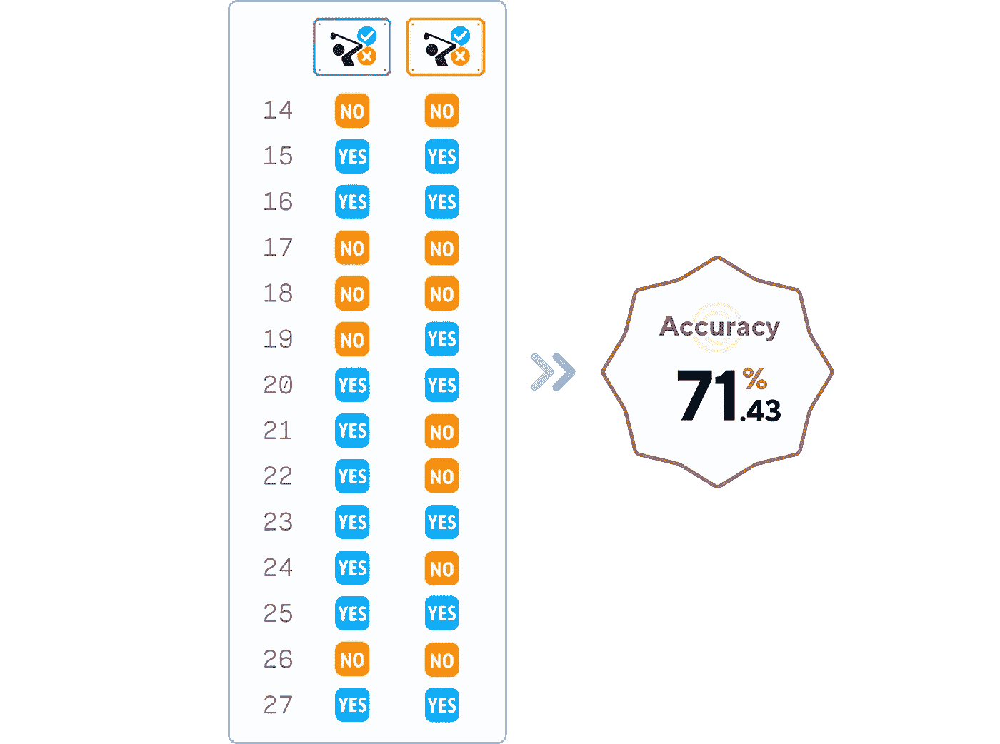

决策树提供了足够的准确性。由于我们的树只检查了两个特征，它可能无法很好地捕捉到测试集的特征。

```py
# Evaluate the classifier
print(f"Accuracy: {accuracy_score(y_test, y_pred)}")
```

# 关键参数

决策树有几个重要参数，控制它们的生长和复杂度：

1 . **最大深度**：设置树的最大深度，这可以有效地防止过拟合。

**👍 有用提示**：考虑从一个浅层树开始（可能是 3 到 5 层深），然后逐渐增加深度。

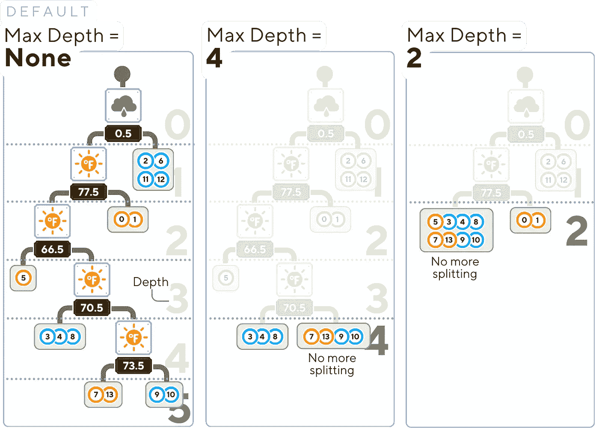

从一个浅层树开始（例如，深度为 3–5），逐步增加，直到找到模型复杂性和验证数据性能之间的最佳平衡。

2. **最小样本分割**：此参数决定了拆分内部节点所需的最小样本数。

**👍 有用提示**：将此值设置为较高（大约训练数据的 5%–10%）可以帮助防止决策树创建过多的小而具体的划分，这些划分可能不能很好地推广到新数据。

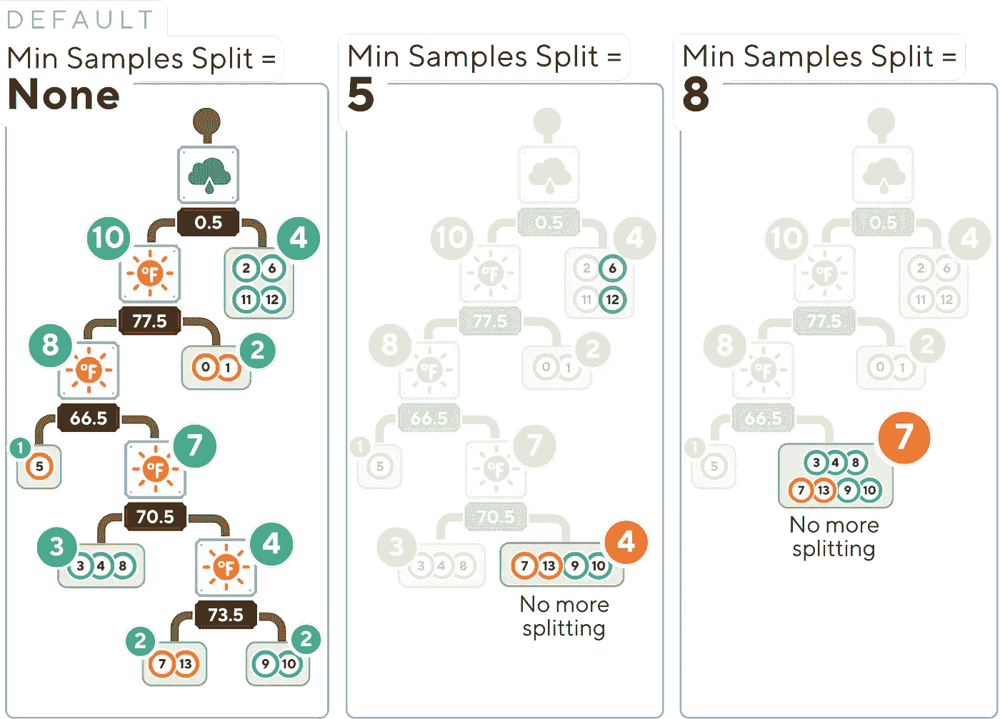

3. **最小样本叶节点**：此参数指定叶节点所需的最小样本数。

**👍 有用提示**：选择一个值，确保每个叶子节点表示一个有意义的数据子集（大约占训练数据的 1%–5%）。这可以帮助避免过于具体的预测。

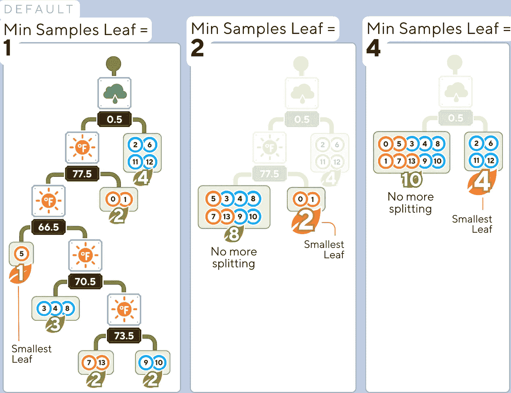

4. **标准**：用于衡量划分质量的函数（通常使用“gini”表示 Gini 不纯度，或“entropy”表示信息增益）。

**👍 有用提示**：虽然 Gini 一般更简单且计算速度更快，但熵在多分类问题中通常表现更好。不过，它们通常会给出相似的结果。

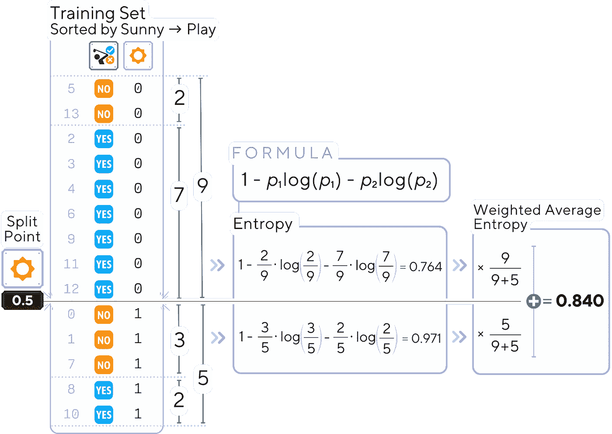

计算“晴天”熵的示例，分割点为 0.5。

# 优缺点

像任何机器学习算法一样，决策树也有其优点和局限性。

## 优点：

1.  **可解释性**：容易理解和可视化决策过程。

1.  **无特征缩放**：可以处理数值型和类别型数据，无需归一化。

1.  **处理非线性关系**：能够捕捉数据中的复杂模式。

1.  **特征重要性**：提供了一个清晰的指示，表明哪些特征对于预测最为重要。

## 缺点：

1.  **过拟合**：容易生成过于复杂的树，导致泛化能力差，尤其是在数据集较小时。

1.  **不稳定性**：数据的微小变化可能会导致生成完全不同的决策树。

1.  **偏向不平衡的数据集**：可能会偏向占主导地位的类别。

1.  **无法外推**：无法对训练数据范围之外的情况做出预测。

在我们的高尔夫例子中，决策树可能会基于天气条件创建非常准确且可解释的规则来决定是否打高尔夫。然而，如果没有适当修剪，或者数据集较小，它可能会过拟合特定条件的组合。

# 最终总结

决策树分类器是解决机器学习中许多问题的绝佳工具。它们易于理解，能够处理复杂数据，并能展示它们如何做出决策。这使得它们在多个领域都非常有用，从商业到医学。虽然决策树强大且可解释，但它们通常作为更高级集成方法的构建模块，如随机森林或梯度提升机。

# 🌟 决策树分类器简化版

```py
# Import libraries
import matplotlib.pyplot as plt
import pandas as pd
import numpy as np
from sklearn.tree import plot_tree, DecisionTreeClassifier
from sklearn.model_selection import train_test_split
from sklearn.metrics import accuracy_score

# Load data
dataset_dict = {
    'Outlook': ['sunny', 'sunny', 'overcast', 'rainy', 'rainy', 'rainy', 'overcast', 'sunny', 'sunny', 'rainy', 'sunny', 'overcast', 'overcast', 'rainy', 'sunny', 'overcast', 'rainy', 'sunny', 'sunny', 'rainy', 'overcast', 'rainy', 'sunny', 'overcast', 'sunny', 'overcast', 'rainy', 'overcast'],
    'Temperature': [85.0, 80.0, 83.0, 70.0, 68.0, 65.0, 64.0, 72.0, 69.0, 75.0, 75.0, 72.0, 81.0, 71.0, 81.0, 74.0, 76.0, 78.0, 82.0, 67.0, 85.0, 73.0, 88.0, 77.0, 79.0, 80.0, 66.0, 84.0],
    'Humidity': [85.0, 90.0, 78.0, 96.0, 80.0, 70.0, 65.0, 95.0, 70.0, 80.0, 70.0, 90.0, 75.0, 80.0, 88.0, 92.0, 85.0, 75.0, 92.0, 90.0, 85.0, 88.0, 65.0, 70.0, 60.0, 95.0, 70.0, 78.0],
    'Wind': [False, True, False, False, False, True, True, False, False, False, True, True, False, True, True, False, False, True, False, True, True, False, True, False, False, True, False, False],
    'Play': ['No', 'No', 'Yes', 'Yes', 'Yes', 'No', 'Yes', 'No', 'Yes', 'Yes', 'Yes', 'Yes', 'Yes', 'No', 'No', 'Yes', 'Yes', 'No', 'No', 'No', 'Yes', 'Yes', 'Yes', 'Yes', 'Yes', 'Yes', 'No', 'Yes']
}
df = pd.DataFrame(dataset_dict)

# Prepare data
df = pd.get_dummies(df, columns=['Outlook'],  prefix='', prefix_sep='', dtype=int)
df['Wind'] = df['Wind'].astype(int)
df['Play'] = (df['Play'] == 'Yes').astype(int)

# Split data
X, y = df.drop(columns='Play'), df['Play']
X_train, X_test, y_train, y_test = train_test_split(X, y, train_size=0.5, shuffle=False)

# Train model
dt_clf = DecisionTreeClassifier(
    max_depth=None,           # Maximum depth of the tree
    min_samples_split=2,      # Minimum number of samples required to split an internal node
    min_samples_leaf=1,       # Minimum number of samples required to be at a leaf node
    criterion='gini'          # Function to measure the quality of a split
)
dt_clf.fit(X_train, y_train)

# Make predictions
y_pred = dt_clf.predict(X_test)

# Evaluate model
print(f"Accuracy: {accuracy_score(y_test, y_pred)}")

# Visualize tree
plt.figure(figsize=(20, 10))
plot_tree(dt_clf, filled=True, feature_names=X.columns,
          class_names=['Not Play', 'Play'], impurity=False)
plt.show()
```

## 进一步阅读

若想详细了解[决策树分类器](https://scikit-learn.org/stable/modules/generated/sklearn.tree.DecisionTreeClassifier.html)及其在 scikit-learn 中的实现，读者可参考官方文档，文档中提供了关于其使用和参数的全面信息。

## 技术环境

本文使用 Python 3.7 和 scikit-learn 1.5。虽然讨论的概念一般适用，但具体的代码实现可能会因版本不同而略有差异。

## 关于插图

除非另有说明，所有图片均由作者创作，并融合了来自 Canva Pro 的授权设计元素。

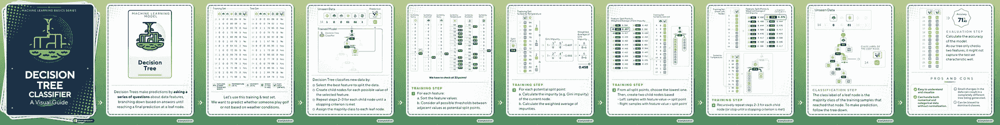

若想查看决策树分类器的简明视觉总结，请访问[配套的 Instagram 帖子](https://www.instagram.com/p/C_SZq1BSYIw/)。

## 参考文献

[1] T. M. Mitchell, [机器学习](https://www.cs.cmu.edu/afs/cs.cmu.edu/user/mitchell/ftp/mlbook.html)（1997），McGraw-Hill Science/Engineering/Math，第 59 页

𝙎𝙚𝙚 𝙢𝙤𝙧𝙚 𝘾𝙡𝙖𝙨𝙨𝙞𝙛𝙞𝙘𝙖𝙩𝙞𝙤𝙣 𝘼𝙡𝙜𝙤𝙧𝙞𝙩𝙝𝙢𝙨 𝙝𝙚𝙧𝙚:


[Samy Baladram](https://medium.com/@samybaladram?source=post_page-----7c863f06a71e--------------------------------)

## 分类算法

[查看列表](https://medium.com/@samybaladram/list/classification-algorithms-b3586f0a772c?source=post_page-----7c863f06a71e--------------------------------)8 个故事

𝙔𝙤𝙪 𝙢𝙞𝙜𝙝𝙩 𝙖𝙡𝙨𝙤 𝙡𝙞𝙠𝙚:


[Samy Baladram](https://medium.com/@samybaladram?source=post_page-----7c863f06a71e--------------------------------)

## 回归算法

[查看列表](https://medium.com/@samybaladram/list/regression-algorithms-b0b6959f1b39?source=post_page-----7c863f06a71e--------------------------------)5 个故事

[Samy Baladram](https://medium.com/@samybaladram?source=post_page-----7c863f06a71e--------------------------------)

## 集成学习

[查看列表](https://medium.com/@samybaladram/list/ensemble-learning-673fc83cd7db?source=post_page-----7c863f06a71e--------------------------------)4 个故事
