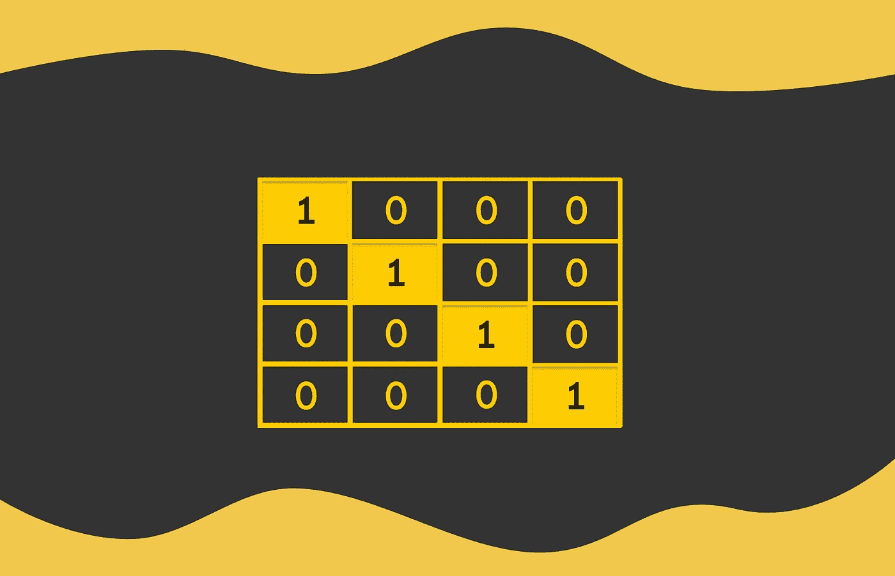
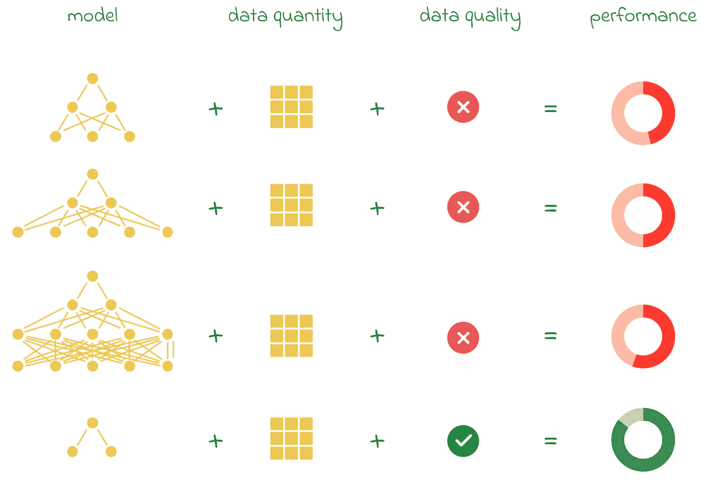

# 解码独热编码：类别数据的初学者指南

> 原文：[`towardsdatascience.com/decoding-one-hot-encoding-a-beginners-guide-to-categorical-data-058582240e86?source=collection_archive---------6-----------------------#2024-11-11`](https://towardsdatascience.com/decoding-one-hot-encoding-a-beginners-guide-to-categorical-data-058582240e86?source=collection_archive---------6-----------------------#2024-11-11)

## 学习将类别数据转化为机器学习模型能够理解的格式

 [Vyacheslav Efimov](https://medium.com/@slavahead?source=post_page---byline--058582240e86--------------------------------)

·发表于 [Towards Data Science](https://towardsdatascience.com/?source=post_page---byline--058582240e86--------------------------------) ·6 分钟阅读·2024 年 11 月 11 日

--

# 引言

在学习机器学习时，理解最基本算法的内部工作原理至关重要。这样可以帮助我们理解算法在流行的库和框架中的运作方式，如何调试它们，更轻松地选择更好的超参数，并确定哪种算法最适合特定问题。

虽然算法是机器学习的核心，但如果没有高质量的数据，它们无法产生有效的结果。由于在某些问题中数据可能是稀缺资源，因此学习如何有效地预处理数据以提取最大价值变得至关重要。此外，预处理不当的数据可能会削弱算法的性能。

即使是一个非常简单的模型，如果数据准备得当，也能优于一个复杂的模型。

> 在本文中，我们将探讨独热编码，这是数据预处理过程中最基础的技术之一。为了有效地进行这一过程，我们将首先理解数据编码的基本动机，然后探索其原理和…
