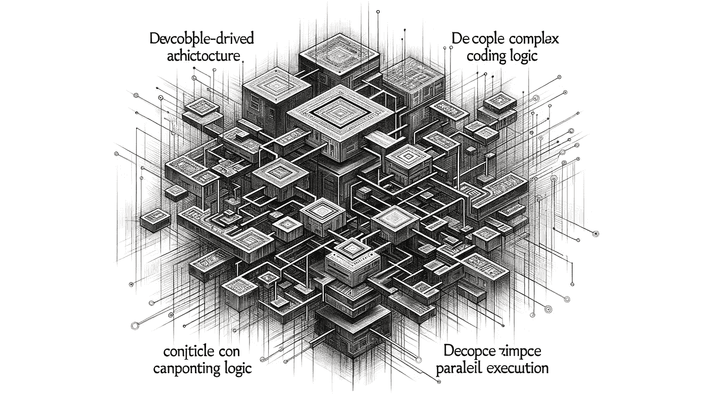

# 深入探索 LlamaIndex 工作流：基于事件驱动的 LLM 架构

> 原文：[`towardsdatascience.com/deep-dive-into-llamaindex-workflow-event-driven-llm-architecture-8011f41f851a?source=collection_archive---------3-----------------------#2024-12-17`](https://towardsdatascience.com/deep-dive-into-llamaindex-workflow-event-driven-llm-architecture-8011f41f851a?source=collection_archive---------3-----------------------#2024-12-17)

## 我对实践后进展和不足之处的看法

 [Peng Qian](https://qtalen.medium.com/?source=post_page---byline--8011f41f851a--------------------------------)

·发布于[Towards Data Science](https://towardsdatascience.com/?source=post_page---byline--8011f41f851a--------------------------------) ·14 分钟阅读·2024 年 12 月 17 日

--

深入探索 LlamaIndex 工作流：基于事件驱动的 LLM 架构。图片来源：DALL-E-3

最近，LlamaIndex 在其版本之一中引入了一个新功能[工作流](https://docs.llamaindex.ai/en/stable/understanding/workflows/)，为 LLM 应用程序提供了基于事件驱动和逻辑解耦的能力。

在今天的文章中，我们将通过一个实用的小项目深入探讨这一功能，探索其中的新特性和仍然存在的不足之处。让我们开始吧。

# 引言

# 为什么是事件驱动的？

越来越多的 LLM 应用程序正在转向智能代理架构，期望 LLM 能够通过调用不同的 API 或多次迭代调用来满足用户需求。

然而，这一转变带来了一个问题：随着代理应用程序发起更多的 API 调用，程序响应变得缓慢，代码逻辑也变得更加复杂。

一个典型的例子是[ReActAgent](https://docs.llamaindex.ai/en/stable/api_reference/agent/react/#llama_index.core.agent.react.ReActAgent)，其中包括思考、行动、观察和最终答案等步骤，至少需要进行三次 LLM 调用和一次工具调用。如果需要循环，I/O 调用的次数会更多。
