# 手动深入探讨 LSTMs 和 xLSTMs ✍️

> 原文：[`towardsdatascience.com/deep-dive-into-lstms-xlstms-by-hand-%EF%B8%8F-c33e638bebb1?source=collection_archive---------1-----------------------#2024-07-09`](https://towardsdatascience.com/deep-dive-into-lstms-xlstms-by-hand-%EF%B8%8F-c33e638bebb1?source=collection_archive---------1-----------------------#2024-07-09)

## 探索 LSTM 的智慧，通向 xLSTMs——一个可能成为当今 LLMs 竞争对手的技术

 [Srijanie Dey, 博士](https://medium.com/@srijanie.dey?source=post_page---byline--c33e638bebb1--------------------------------)

·发表于 [Towards Data Science](https://towardsdatascience.com/?source=post_page---byline--c33e638bebb1--------------------------------) ·阅读时间：12 分钟·2024 年 7 月 9 日

--

作者提供的图片（古老的巫师，由我的四岁孩子创作）

*“在塞伦蒂亚的神秘领域中，那里古老的森林低语着久已遗忘的咒语，居住着谜行者——一位尊敬的巫师，永恒智慧的守护者。”*

*“有一天，当塞伦蒂亚面临巨大危险时，谜行者使用赋予过去、现在与未来精华的本质之石，编织了一场神秘的仪式。借助古老的魔法，他召唤出了 LSTM，一个知识的传导体，能够保存塞伦蒂亚的历史并预见其命运。犹如一条无尽的智慧之河，LSTM 流动着，超越了当下，揭示了地平线之外的未来。”*

*“从他隐居的住所，谜行者观察着塞伦蒂亚的重生，向新的高峰攀升。他知道，正是他那深奥的智慧和不懈的努力，再一次在这个神奇的世界中守护了一个遗产。”*

随着这个故事，我们开始了对最吸引人的递归神经网络之一——长短期记忆网络（LSTMs）的深入探讨。为什么我们要再次回顾这个经典？因为随着语言建模中长上下文长度的重要性日益增长，它们可能再次变得非常有用。

# LSTMs 能否再次超越 LLMs？

最近，奥地利的研究人员提出了一个有前景的举措，旨在复兴 LSTM 的失落辉煌——通过发展更为进化的扩展长短期记忆网络（Extended Long-short Term Memory，简称 xLSTM）。可以说，在变压器（Transformers）出现之前，LSTM 曾经在深度学习的成功中独占鳌头。现在的问题是，随着其能力的最大化和缺点的最小化，LSTM 能否与当今的大型语言模型（LLM）竞争？

为了得到答案，我们不妨回顾一下 LSTM 的历史，并回顾一下它们的独特之处：

长短期记忆网络（LSTM）最早由[Hochreiter 和 Schmidhuber](https://www.bioinf.jku.at/publications/older/2604.pdf)于 1997 年提出——旨在解决循环神经网络（RNN）面临的长期依赖问题。该论文已被引用约 106518 次，LSTM 成为经典也就不足为奇了。

LSTM 的核心思想是能够学习在任意时间间隔内，何时记住和何时忘记相关信息。这就像我们人类一样。我们不会从零开始每次想法——我们依赖于更久远的信息，并能非常巧妙地将它们联系起来。当然，说到 LSTM 时，大家会问——RNN 不也做一样的事情吗？

简短的答案是：可以。然而，存在一个很大的区别。RNN 架构并不支持过多关注过去的内容——只能关注即时的过去。而这并不太有帮助。

举个例子，我们来看约翰·济慈在《秋天》中的这些诗句：

*“Season of mists and mellow fruitfulness,*

*Close bosom-friend of the maturing sun;”*

作为人类，我们理解“mists”（雾气）和“mellow fruitfulness”（丰盈的果实）这两个词与秋季的季节是概念上相关的，唤起了特定时节的想法。同样，LSTM 可以捕捉到这种概念，并利用它进一步理解“maturing sun”（成熟的太阳）一词的上下文。尽管这些词在序列中分隔开，LSTM 网络依然能够学习到它们之间的关联，并保持前面的联系不变。这与原始的循环神经网络（RNN）框架有着明显的区别。

LSTM 之所以能做到这一点，是通过一个门控机制。如果我们对比 RNN 和 LSTM 的架构，差异非常明显。RNN 的架构非常简单——过去的状态和当前的输入通过一个激活函数传递，输出下一个状态。另一方面，LSTM 块在 RNN 块的基础上添加了三个门控：输入门、遗忘门和输出门，它们共同处理过去的状态和当前的输入。这种门控机制正是所有区别的所在。

为了进一步理解，让我们深入探讨这些令人惊叹的关于[LSTM](https://www.linkedin.com/posts/tom-yeh_lstm-aibyhand-deeplearning-activity-7206573043425447936-IYqt?utm_source=share&utm_medium=member_desktop)和[xLSTM](https://www.linkedin.com/posts/tom-yeh_lstm-aibyhand-activity-7194319329536978945-VP6W?utm_source=share&utm_medium=member_desktop)的杰出作品，作者是[Tom Yeh 教授](https://www.linkedin.com/in/tom-yeh/)。

首先，让我们了解 LSTM 背后的数学机制，然后再探讨其更新版本。

（下方的所有图片，除非另有说明，均来自 Tom Yeh 教授的 LinkedIn 帖子，我已获得他的许可进行编辑。）

所以，接下来我们开始：

# LSTM 是如何工作的？

## [1] 初始化

第一步从随机分配先前的隐藏状态 h0 和记忆单元 C0 的值开始。为了与图示同步，我们设置：

h0 → [1,1]

C0 → [0.3, -0.5]

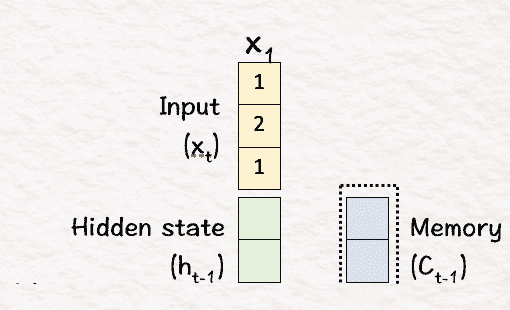

## [2] 线性变换

在下一步中，我们通过将四个权重矩阵（*Wf*，*Wc*，*Wi*和*Wo*）与当前输入 X1 和先前隐藏状态进行拼接后相乘，来执行线性变换。

结果值称为**特征值**，它们是当前输入和隐藏状态的组合。

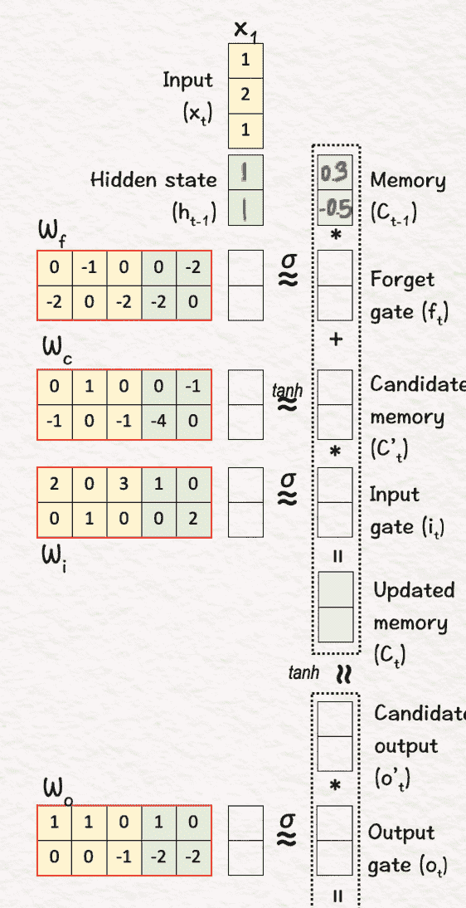

## [3] 非线性变换

这一步在 LSTM 过程中至关重要。它是一个非线性变换，包含两个部分——**sigmoid σ**和**tanh**。

sigmoid 用于获取介于 0 和 1 之间的门值。这个层实际上决定了保留哪些信息，遗忘哪些信息。值始终在 0 和 1 之间——‘0’表示完全删除信息，而‘1’表示保留信息。

+   忘记门 (f1)：[-4, -6] → [0, 0]

+   输入门 (i1)：[6, 4] → [1, 1]

+   输出门 (o1)：[4, -5] → [1, 0]

在下一部分中，应用 tanh 来获得新的候选记忆值，这些值可以添加到先前的信息上。

+   候选记忆 (C’1)：[1, -6] → [0.8, -1]

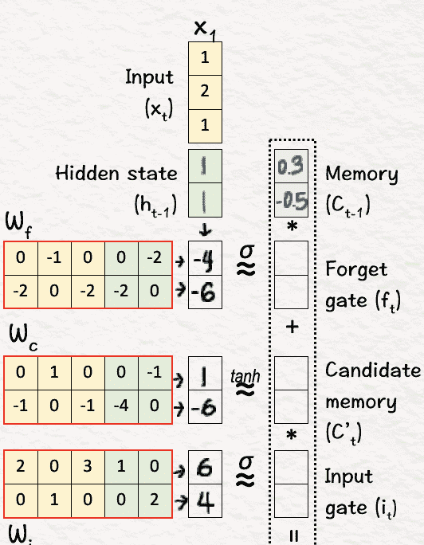

## [4] 更新记忆

一旦获得上述值，就可以使用这些值来更新当前状态。

**前一步已经决定了需要做什么，在这一步我们执行那个决定。**

我们将其分为两部分：

1.  **忘记**：将当前记忆值 (C0) 与获得的忘记门值按元素相乘。其作用是更新当前状态中被决定遗忘的值。→ C0 .* f1

1.  **输入**：将更新后的记忆值 (C’1) 与输入门值按元素相乘，得到‘输入缩放’后的记忆值。→ C’1 .* i1

最后，我们将上述两项相加，得到更新后的记忆 C1，即**C0 .* f1 + C’1 .* i1 = C1**

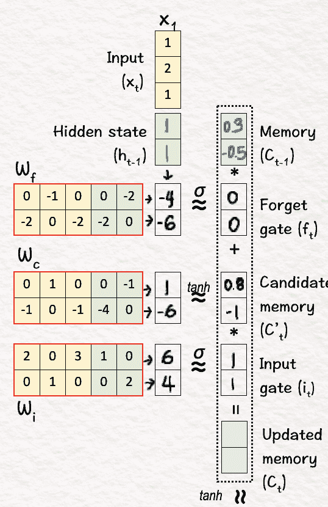

## [5] 候选输出

最后，我们决定输出结果的形式：

首先，我们像之前一样对新的记忆 C1 应用 tanh，得到候选输出 o’1。这样会将值压缩到 -1 到 1 之间。

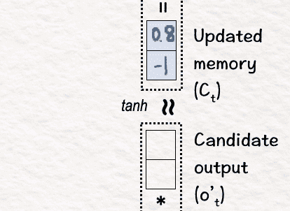

## [6] 更新隐藏状态

为了得到最终输出，我们将之前步骤中获得的候选输出 o’1 与步骤 3 中输出门 o1 的 sigmoid 结果相乘，得到的结果就是网络的第一个输出，也是更新后的隐藏状态 h1，即 **o’1 * o1 = h1**。

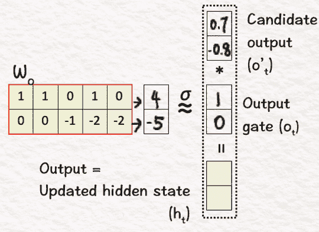

## — — 过程 t = 2 — -

我们继续进行以下的后续迭代：

## [7] 初始化

首先，我们复制来自前面步骤的更新结果，即更新后的隐藏状态 h1 和记忆 C1。

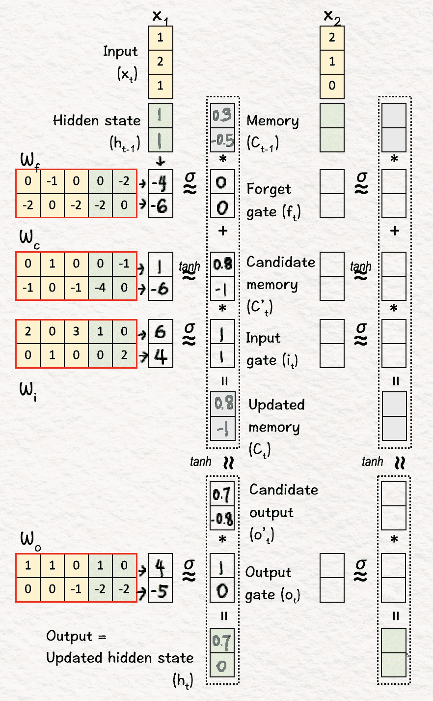

## [8] 线性变换

重复步骤 [2]，即逐元素的权重和偏置矩阵乘法。

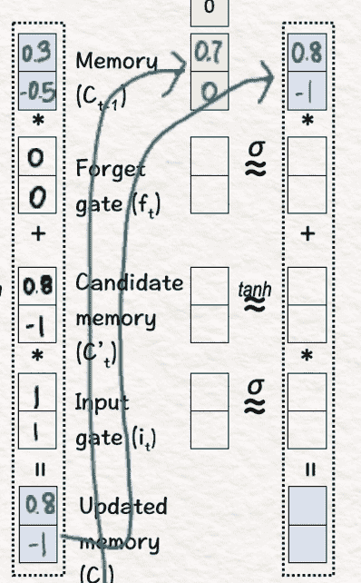

## [9] 更新记忆 (C2)

重复步骤 [3] 和 [4]，即使用 sigmoid 和 tanh 层进行非线性变换，随后决定遗忘相关部分并引入新信息——这将给我们更新后的记忆 C2。

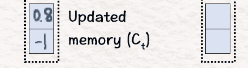

## [10] 更新隐藏状态 (h2)

最后，我们重复步骤 [5] 和 [6]，这会将结果加起来得到第二个隐藏状态 h2。

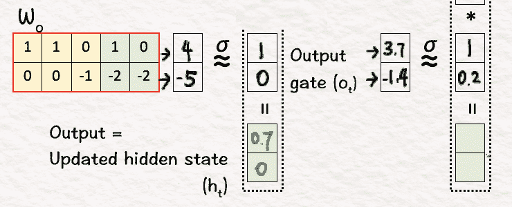

## 接下来，我们进入最后的迭代。

## — — 过程 t = 3 — -

## [11] 初始化

再次，我们复制来自上一迭代的隐藏状态和记忆值，即 h2 和 C2。

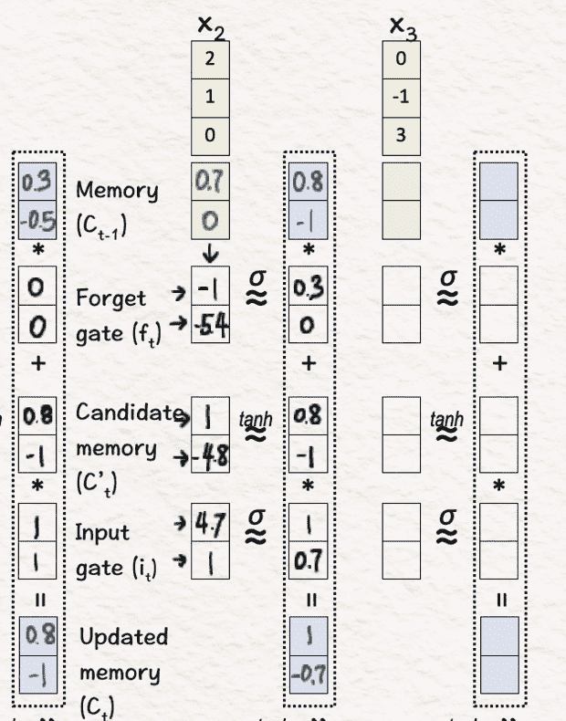

## [12] 线性变换

我们执行与步骤 2 相同的线性变换。

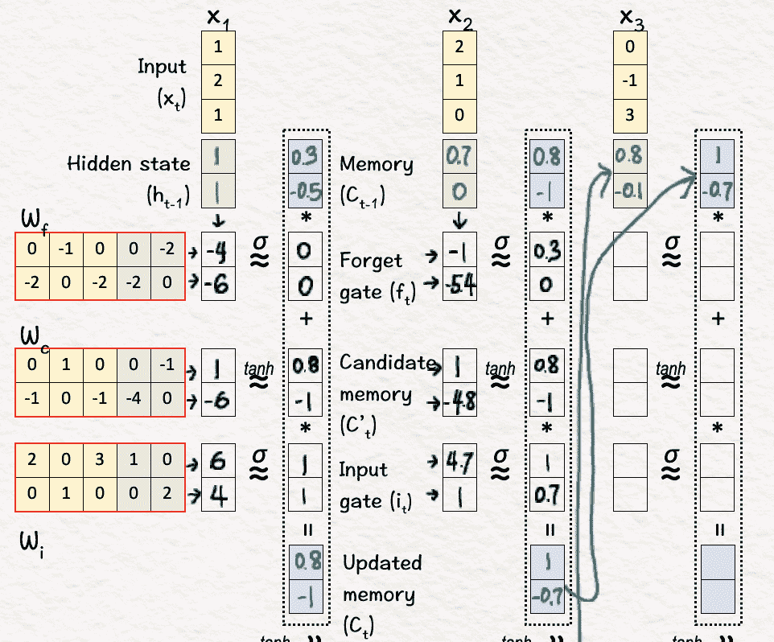

## [13] 更新记忆 (C3)

接下来，我们执行非线性变换，并根据变换中获得的值执行记忆更新。

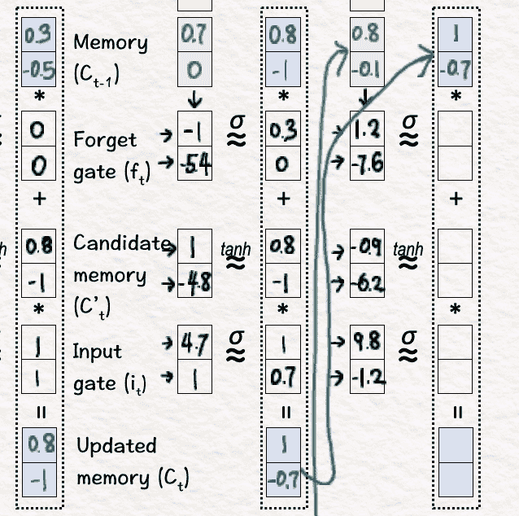

## [14] 更新隐藏状态 (h3)

完成后，我们使用这些值来获得最终的隐藏状态 h3。

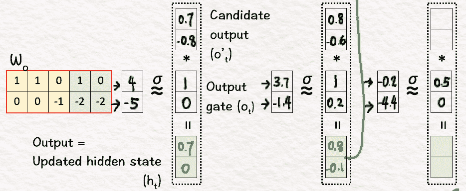

# 总结：

总结上面的工作，关键点是记住 LSTM 依赖于三个主要的门控：**输入门、遗忘门和输出门**。正如这些名称所示，这些门控决定了哪些部分的信息是相关的，以及要保留多少信息，哪些部分可以被丢弃。

简要来说，执行的步骤如下：

1.  从前一状态初始化隐藏状态和记忆值。

1.  执行线性变换，帮助网络开始关注隐藏状态和记忆值。

1.  对数据应用非线性变换（sigmoid 和 tanh），以确定保留/丢弃哪些值，并获得新的候选记忆值。

1.  基于步骤 3 中获得的决策（值），我们进行记忆更新。

1.  接下来，我们根据前一步骤中获得的记忆更新来确定输出的样子。我们在这里获得一个候选输出。

1.  我们将候选输出与步骤 3 中获得的门控输出值结合，最终得出中间隐藏状态。

这个循环将根据需要继续进行多次迭代。

# 扩展长短期记忆（xLSTM）

## xLSTM 的需求

当 LSTM 出现时，它们无疑为做一些之前无法做到的事情奠定了基础。循环神经网络可以具有记忆，但它的记忆非常有限，因此诞生了 LSTM——为了支持长期依赖。然而，这还不够。因为将输入分析为序列阻碍了并行计算的使用，而且由于长期依赖，还导致了性能下降。

因此，作为所有问题的解决方案，transformers 诞生了。但问题仍然存在——我们是否可以通过解决 LSTM 的局限性，再次利用 LSTM 实现 transformers 的功能？为了解答这个问题，xLSTM 架构应运而生。

## xLSTM 与 LSTM 有何不同？

xLSTM 可以看作是 LSTM 的一个非常进化的版本。xLSTM 保留了 LSTM 的基础结构，但引入了新的元素，这些元素有助于处理原始形式的缺点。

## 指数门控与标量记忆混合——sLSTM

最关键的区别是引入了**指数门控**。在 LSTM 中，当我们执行步骤[3]时，会对所有门进行 sigmoid 门控，而对于 xLSTM，它已经被指数门控所替代。

例如：对于输入门 i1-

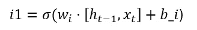

现在，

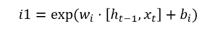

图片由作者提供

由于指数门控提供了更大的范围，xLSTM 能够比 sigmoid 函数更好地处理更新，因为 sigmoid 函数将输入压缩到（0, 1）的范围内。然而，有一个问题——指数值可能会变得非常大。为了缓解这个问题，xLSTM 引入了归一化，并且下面方程中出现的对数函数在这里发挥了重要作用。

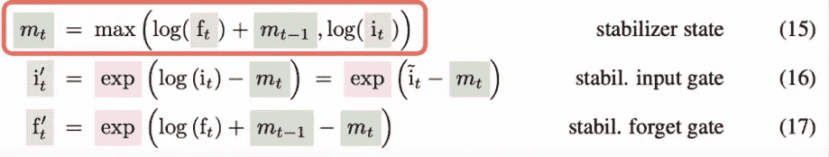

图像来源于参考文献[1]

现在，对数确实逆转了指数的效果，但正如[xLSTM 论文](https://arxiv.org/abs/2405.04517)所声称的，它们的结合应用为平衡状态指明了方向。

这种指数门控以及不同门之间的记忆混合（如原始 LSTM 中所示）形成了**sLSTM**块。

# 矩阵记忆单元——mLSTM

xLSTM 架构的另一个新特点是将标量记忆扩展为矩阵记忆，这使得它能够并行处理更多信息。它还通过引入键、查询和值向量，并将它们作为加权的键向量之和使用在归一化器状态中，从而与 transformer 架构相似，其中每个键向量的权重由输入门和遗忘门确定。

一旦 sLSTM 和 mLSTM 模块准备好后，它们会通过残差连接一个个堆叠在一起，形成 xLSTM 模块，最终构成 xLSTM 架构。

因此，指数门控（结合适当的归一化）和更新的记忆结构的引入为 xLSTM 提供了一个强有力的基础，使其能够实现类似于变换器的结果。

## **总结：**

1.  **LSTM** 是一种特殊的循环神经网络（RNN），它允许像人类一样将先前的信息与当前状态连接，保持思维的持续性。LSTM 因其能够回顾较远的过去，而不仅仅依赖于眼前的即时过去，变得非常流行。使这一切成为可能的是特殊门控元素的引入到 RNN 架构中——

+   **遗忘门**：决定应当保留或忘记前一个单元状态中的哪些信息。通过有选择地遗忘不相关的过去信息，LSTM 保持了长期依赖关系。

+   **输入门**：决定应当存储在单元状态中的新信息。通过控制单元状态的更新方式，它融合了预测当前输出所需的新信息。

+   **输出门**：决定应当作为隐藏状态输出的信息。通过选择性地将单元状态的部分内容作为输出，LSTM 可以向后续层提供相关信息，同时抑制不相关的细节，从而只传递重要信息到更长的序列中。

2\. **xLSTM** 是 LSTM 的一种进化版本，旨在解决 LSTM 面临的缺陷。虽然 LSTM 能够处理长期依赖问题，但信息是顺序处理的，因此没有利用当前变换器所强调的并行性。为了解决这个问题，xLSTM 引入了：

+   **sLSTM**：指数门控，帮助包括比 sigmoid 激活函数更广的范围。

+   **mLSTM**：新型的记忆结构，采用矩阵记忆以增强记忆容量并提高信息检索效率。

# LSTM 会重返舞台吗？

LSTM 总体上属于循环神经网络家族，它们以递归的方式按顺序处理信息。变换器的出现彻底消除了递归应用，但它们在处理极长序列时依然面临严峻问题。研究表明，对于长范围或长上下文，二次时间复杂度是相关的。

因此，探索能够至少启发解决方案路径的选项似乎是值得的，一个好的起点可能是回到 LSTM——简而言之，LSTM 很有可能卷土重来。当前的 xLSTM 结果无疑看起来很有前景。最后，作为总结——[Mamba](https://arxiv.org/pdf/2312.00752) 对递归的使用作为一个良好的例证，表明这可能是一个值得探索的有利路径。

所以，让我们一起跟随这个旅程，看到它的展开，同时牢记递归的强大力量！

*附言：如果你想自己完成这个练习，这里有一个空白模板的链接供你使用。*

[空白模板用于手动练习](https://drive.google.com/file/d/1zfj9TgKP52fOu75HLDs-cooHkhOZAbfU/view?usp=sharing)

现在去玩得开心，创造一些长短期效应吧！

图片来源：作者

## 参考文献：

1.  xLSTM：扩展的长短期记忆，Maximilian 等，2024 年 5 月 [`arxiv.org/abs/2405.04517`](https://arxiv.org/abs/2405.04517)

1.  长短期记忆，Sepp Hochreiter 和 Jürgen Schmidhuber，1997 年，Neural Comput. 9, 8（1997 年 11 月 15 日），1735–1780。 [`doi.org/10.1162/neco.1997.9.8.1735`](https://doi.org/10.1162/neco.1997.9.8.1735)
