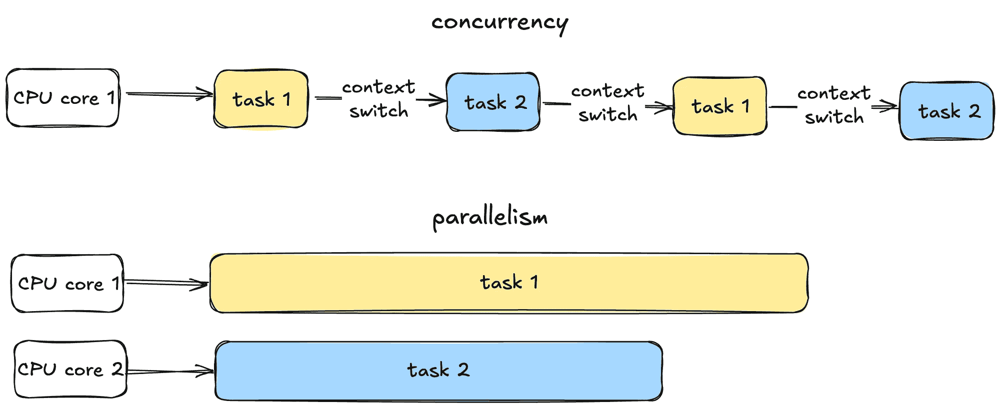
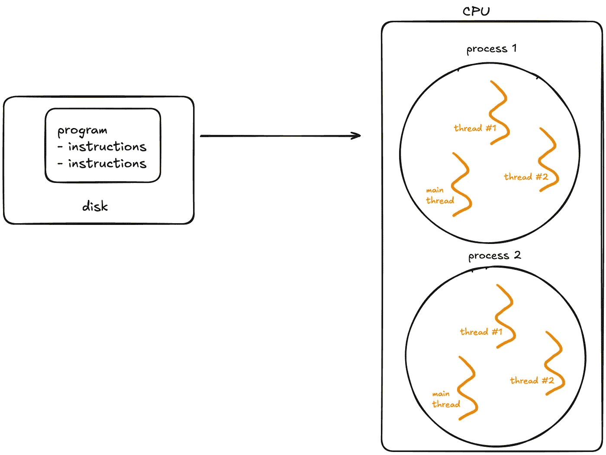
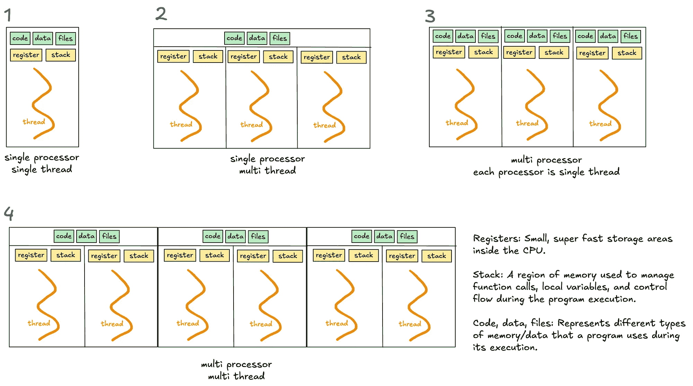
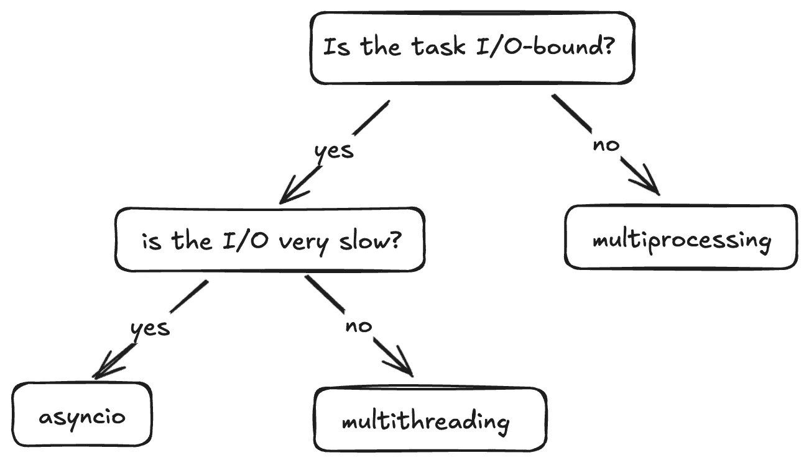

# 深入探讨多线程、多进程和 Asyncio

> 原文：[`towardsdatascience.com/deep-dive-into-multithreading-multiprocessing-and-asyncio-94fdbe0c91f0?source=collection_archive---------0-----------------------#2024-12-28`](https://towardsdatascience.com/deep-dive-into-multithreading-multiprocessing-and-asyncio-94fdbe0c91f0?source=collection_archive---------0-----------------------#2024-12-28)

## 如何选择正确的并发模型

[](https://medium.com/@clarachong13?source=post_page---byline--94fdbe0c91f0--------------------------------)[](https://towardsdatascience.com/?source=post_page---byline--94fdbe0c91f0--------------------------------) [Clara Chong](https://medium.com/@clarachong13?source=post_page---byline--94fdbe0c91f0--------------------------------)

·发表于 [Towards Data Science](https://towardsdatascience.com/?source=post_page---byline--94fdbe0c91f0--------------------------------) ·8 分钟阅读·2024 年 12 月 28 日

--


图片由 [Paul Esch-Laurent](https://unsplash.com/@pinjasaur) 提供，来源于 [Unsplash](https://unsplash.com/)

Python 提供了三种主要的方式来同时处理多个任务：多线程、多进程和 asyncio。

选择正确的模型对于最大化程序性能和高效使用系统资源至关重要。（顺便说一句，这也是一个常见的面试问题！）

如果没有并发，一个程序每次只能处理一个任务。在诸如文件加载、网络请求或用户输入等操作过程中，它会处于空闲状态，浪费宝贵的 CPU 周期。并发通过允许多个任务高效运行来解决这个问题。

但是，我应该使用哪种模型呢？让我们深入了解！

# 目录

1.  并发的基础

    - 并发与并行

    - 程序

    - 进程

    - 线程

    - 操作系统如何管理线程和进程？

1.  Python 的并发模型

    - 多线程

    - Python 的全局解释器锁（GIL）

    - 多进程

    - Asyncio

1.  我应该在什么时候使用哪种并发模型？

# 并发的基础

在深入 Python 的并发模型之前，让我们回顾一下几个基础概念。

## 1\. 并发与并行



并发与并行的视觉表现（由我绘制）

并发就是同时管理多个任务，而不一定是同时进行。任务可能会轮流进行，从而产生多任务的假象。

并行是指通过利用多个 CPU 核心同时运行多个任务。

## 2\. 程序

现在让我们继续探讨一些基础的操作系统概念——程序、进程和线程。



在单一进程内可以同时存在多个线程——这就是多线程（由我绘制）。

> 程序只是一个静态文件，例如 Python 脚本或可执行文件。

程序存储在磁盘上，在操作系统（OS）将其加载到内存中运行之前是被动的。一旦发生这种情况，程序就变成了**进程**。

## 3. 进程

> 进程是运行程序的独立实例。

进程有自己的内存空间、资源和执行状态。进程彼此隔离，这意味着一个进程不能干扰另一个进程，除非通过如***进程间通信（IPC）***等机制显式设计来实现。

进程通常可以分为两种类型：

1.  **I/O 密集型进程：**

    大部分时间***等待***输入/输出操作完成，如文件访问、网络通信或用户输入。在等待时，CPU 处于空闲状态。

1.  **CPU 密集型进程：**

    大部分时间***进行计算***（例如视频编码、数值分析）。这些任务需要大量的 CPU 时间。

**进程的生命周期：**

+   进程在创建时处于*新建*状态。

+   它进入*就绪*状态，等待 CPU 时间。

+   如果进程等待某个事件（如 I/O），它会进入*等待*状态。

+   最后，进程在完成任务后*终止*。

## 4. 线程

> 线程是进程中最小的执行单元。
> 
> 进程充当线程的“容器”，在进程的生命周期内，可以创建和销毁多个线程。

每个进程至少有一个线程——***主线程***，但它也可以创建额外的线程。

线程在同一进程内共享内存和资源，从而实现高效的通信。然而，这种共享可能导致同步问题，如竞争条件或死锁，如果管理不当。与进程不同，单一进程中的多个线程并不是隔离的——一个不正常的线程可能会导致整个进程崩溃。

## 5. 操作系统如何管理线程和进程？

CPU 每次只能执行***一个核心上的任务***。为了处理多个任务，操作系统使用***抢占式上下文切换***。

在上下文切换过程中，操作系统暂停当前任务，保存其状态并加载下一个任务的状态以执行。

这种快速的切换创造了在单一 CPU 核心上同时执行的错觉。

对于进程，上下文切换更为资源密集，因为操作系统必须保存并加载独立的内存空间。对于线程，切换较快，因为线程在同一进程内共享相同的内存。然而，频繁的切换会带来开销，从而可能降低性能。

进程的真正并行执行只有在有多个 CPU 核心可用时才能发生。每个核心同时处理一个独立的进程。

# Python 的并发模型

现在让我们探讨 Python 特定的并发模型。



不同并发模型的总结（由我绘制）

# 1\. 多线程

多线程允许一个进程同时执行多个线程，这些线程共享相同的内存和资源（见图示 2 和 4）。

然而，Python 的全局解释器锁（GIL）限制了多线程在 CPU 密集型任务中的效果。

## Python 的全局解释器锁（GIL）

> GIL 是一个锁，允许在任何时候只有一个线程控制 Python 解释器，这意味着一次只能有一个线程执行 Python 字节码。

GIL 的引入是为了简化 Python 中的内存管理，因为许多内部操作（如对象创建）默认情况下不是线程安全的。如果没有 GIL，多个线程试图访问共享资源时将需要复杂的锁或同步机制来防止竞争条件和数据损坏。

***何时 GIL 成为瓶颈？***

+   对于单线程程序，GIL 无关紧要，因为该线程对 Python 解释器拥有独占访问权。

+   对于多线程 I/O 密集型程序，GIL 的问题较小，因为线程在等待 I/O 操作时会释放 GIL。

+   对于多线程的 CPU 密集型操作，GIL 成为一个显著的瓶颈。多个线程争夺 GIL，必须轮流执行 Python 字节码。

一个值得注意的有趣情况是 `time.sleep` 的使用，Python 实际上将其视为一个 I/O 操作。`time.sleep` 函数不是 CPU 密集型的，因为它在休眠期间不涉及主动计算或 Python 字节码的执行。相反，跟踪经过的时间的责任委托给了操作系统。在此期间，线程释放 GIL，允许其他线程运行并利用解释器。

# 2\. 多进程

多进程使得系统能够并行运行多个进程，每个进程拥有独立的内存、全局解释器锁（GIL）和资源。在每个进程中，可能有一个或多个线程（见图示 3 和 4）。

多进程绕过了 GIL 的限制，这使其适用于需要大量计算的 CPU 密集型任务。

然而，由于独立的内存和进程开销，多进程比单进程更加消耗资源。

# 3\. Asyncio

> 与线程或进程不同，asyncio 使用单个线程处理多个任务。

当使用 `asyncio` 库编写异步代码时，你将使用 `async/await` 关键字来管理任务。

## ***关键概念***

1.  **协程：** 这些是使用 `async def` 定义的函数。它们是 asyncio 的核心，表示可以暂停并稍后恢复的任务。

1.  **事件循环：** 它管理任务的执行。

1.  **任务：** 协程的封装。当你希望一个协程真正开始执行时，你将其转换为任务——例如，使用 `asyncio.create_task()`。

1.  `**await**` ：暂停协程的执行，将控制权交还给事件循环。

## ***它是如何工作的***

Asyncio 运行一个事件循环，调度任务。当任务在等待某些东西时，如网络响应或文件读取，它会自愿“暂停”。当任务暂停时，事件循环会切换到另一个任务，确保不会浪费等待的时间。

这使得 asyncio 非常适用于**需要等待大量时间的小任务**的场景，如处理成千上万的 Web 请求或管理数据库查询。由于所有操作都在一个线程上运行，asyncio 避免了线程切换的开销和复杂性。

> **asyncio 和多线程的关键区别在于它们如何处理等待任务。**

+   多线程依赖操作系统在一个线程等待时切换线程（***抢占式上下文切换***）。

    当一个线程在等待时，操作系统会自动切换到另一个线程。

+   Asyncio 使用单个线程，并依赖任务通过在需要等待时“合作”来暂停（***协作式多任务处理***）。

## 编写 async 代码的两种方式：

`**方法 1：await 协程**`

当你直接`await`一个协程时，***当前协程会在`await`语句处暂停***，直到被`await`的协程执行完毕。任务在当前协程内是***按顺序执行的***。

当你需要协程的结果***立即***以继续下一步时，使用这种方法。

虽然这听起来像是同步代码，但其实不是。在同步代码中，整个程序会在暂停期间被阻塞。

> 使用 asyncio 时，只有当前协程会暂停，而程序的其余部分可以继续运行。这使得 asyncio 在程序级别上是非阻塞的。

**示例：**

事件循环会暂停当前协程，直到`fetch_data`完成。

```py
async def fetch_data():
    print("Fetching data...")
    await asyncio.sleep(1)  # Simulate a network call
    print("Data fetched")
    return "data"

async def main():
    result = await fetch_data()  # Current coroutine pauses here
    print(f"Result: {result}")

asyncio.run(main())
```

`**方法 2：asyncio.create_task(协程)**`

协程被安排在后台***并发运行***。与`await`不同，当前协程会立即继续执行，而无需等待已调度的任务完成。

***已调度的协程一旦事件循环找到机会就开始运行***，无需等待显式的`await`。

> 不会创建新的线程；相反，协程会在与事件循环相同的线程内运行，事件循环管理每个任务的执行时间。

这种方法实现了程序内的并发，使多个任务能够高效地重叠执行。稍后你需要`await`任务来获取其结果并确保任务完成。

当你希望并发地运行任务而不需要立即获取结果时，使用这种方法。

**示例：**

当执行到`asyncio.create_task()`这一行时，协程`fetch_data()`会被安排在***事件循环可用时立即***开始运行。这可以发生在你显式`await`任务之前，甚至***在此之前***。相比之下，在第一个`await`方法中，协程只有在到达`await`语句时才会开始执行。

总的来说，这通过重叠执行多个任务使得程序更高效。

```py
async def fetch_data():
    # Simulate a network call
    await asyncio.sleep(1)
    return "data"

async def main():
    # Schedule fetch_data
    task = asyncio.create_task(fetch_data())  
    # Simulate doing other work
    await asyncio.sleep(5)  
    # Now, await task to get the result
    result = await task  
    print(result)

asyncio.run(main())
```

## 其他重要的点

+   **你可以混合同步和异步代码。**

    由于同步代码是阻塞的，它可以通过`asyncio.to_thread()`分配到一个单独的线程中。这样可以使你的程序实现多线程。

    在下面的示例中，`asyncio`事件循环运行在主线程中，而一个单独的后台线程用于执行`sync_task`。

```py
import asyncio
import time

def sync_task():
    time.sleep(2)
    return "Completed"

async def main():
    result = await asyncio.to_thread(sync_task)
    print(result)

asyncio.run(main())
```

+   你应该将计算密集型的 CPU 绑定任务分配到一个单独的进程中。

# 我应该在什么时候使用哪种并发模型？

这个流程是一个很好的决策方式，帮助你决定何时使用哪种方法。



流程图（由我绘制），参考了这个[stackoverflow](https://stackoverflow.com/questions/27435284/multiprocessing-vs-multithreading-vs-asyncio/52498068#52498068)讨论

1.  **多进程**

    - 最适合计算密集型的 CPU 绑定任务。

    - 当你需要绕过 GIL 时——每个进程都有自己的 Python 解释器，允许真正的并行处理。

1.  **多线程**

    - 最适合快速 I/O 绑定任务，因为减少了上下文切换的频率，Python 解释器会长时间保持在一个线程中。

    - 由于全局解释器锁（GIL），不适合 CPU 绑定任务。

1.  **异步编程（Asyncio）**

    - 适用于慢速 I/O 绑定任务，例如长时间的网络请求或数据库查询，因为它高效地处理等待，使得程序具有可扩展性。

    - 如果不将工作分配到其他进程，不适合 CPU 绑定任务。

# 总结

就这些了，大家。这一话题还有很多内容要讨论，但我希望我已经向你介绍了各种概念，以及何时使用每种方法。

感谢阅读！我定期写关于 Python、软件开发和我构建的项目的文章，所以关注我，不要错过。下篇文章见 :)
