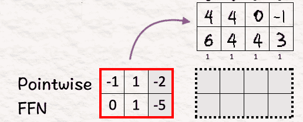
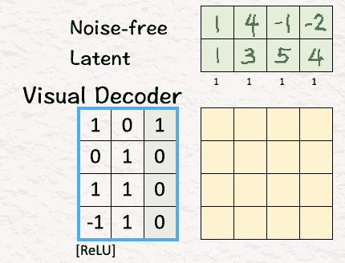

# 深入了解 Sora 的扩散变换器（DiT）手工分析 ✍︎

> 原文：[`towardsdatascience.com/deep-dive-into-soras-diffusion-transformer-dit-by-hand-%EF%B8%8E-1e4d84ec865d?source=collection_archive---------3-----------------------#2024-04-02`](https://towardsdatascience.com/deep-dive-into-soras-diffusion-transformer-dit-by-hand-%EF%B8%8E-1e4d84ec865d?source=collection_archive---------3-----------------------#2024-04-02)

## 探索 Sora 最先进视频背后的秘密

 [Srijanie Dey, PhD](https://medium.com/@srijanie.dey?source=post_page---byline--1e4d84ec865d--------------------------------)

·发布于 [Towards Data Science](https://towardsdatascience.com/?source=post_page---byline--1e4d84ec865d--------------------------------) ·12 分钟阅读·2024 年 4 月 2 日

--

图片来源：作者

*“在古老的 DiTharos 大陆，曾经有一个传说，叫做 Sora。一个象征着无限潜力的传说，涵盖了天空的辽阔与宏伟。”*

*当它展开色彩斑斓的翅膀，飞翔在辽阔的天空，光线在它引人注目的身体上反射时，人们能听到“**Sora 就是天空**”的声音回响在天际。使它成为传说的，不仅仅是它那宏大的体量，还有它驾驭散落在旋云中的光元素的力量。凭借强大的力量，Sora 凭一旋所创造的魔法，堪称一绝！*

*他们说，Sora 依然存在，日复一日磨砺技艺，变得愈加强大，准备在黄金时刻翱翔。当你今天在天空中看到一抹深红，你会知道那是传说的一颗星星正飞入光明的领域！*

这是我讲给儿子听的一个关于远方土地上神话般的龙的故事。我们称它为“**Sora 的传说**”。他非常喜欢这个故事，因为 Sora 既巨大又强大，能够照亮天空。当然，现在他还不理解变换器和扩散的概念，他才四岁，但他确实明白一个使用光的力量并统治着 DiTharos 的宏伟龙的概念。

图片来源：作者（强大的 Sora 由我的儿子创作——色彩选择和大胆的笔触都是他的作品。）

# **Sora by Open AI**

这个故事与我们世界上 Sora（Open AI 的文本到视频模型）如何在人工智能领域诞生并席卷全球的过程非常相似。从原则上讲，Sora 是由[William Peebles](https://www.linkedin.com/in/william-peebles-a980a212a/) 和 [Saining Xie](https://www.linkedin.com/in/sainxie/) 在 2023 年开发的扩散变换器（DiT）。

换句话说，它利用扩散的概念来预测视频，并通过变换器的强大功能实现下一阶段的扩展。为了更好地理解这一点，让我们尝试回答这两个问题：

+   当 Sora 接收到一个提示词时，它会做什么？

+   它是如何结合扩散变换器的理念的？

说到 Sora 制作的视频，这是我最喜欢的一部，内容是一只可爱的斑点狗在意大利街头。它的动作多么自然！

视频使用的提示词是：“相机直接面对意大利布拉诺的彩色建筑。一只可爱的斑点狗透过一栋一楼建筑的窗户看外面。许多人在建筑前的运河街道上走路和骑车。”

Sora 是如何做到这一点的？

不再多说，让我们深入了解细节，看看 Sora 如何根据文本提示生成这些超现实的视频。

# **Sora 是如何工作的？**

再次感谢 Tom Yeh 教授精彩的《手工 AI 系列》，我们有了这篇[关于 Sora 的精彩文章](https://www.linkedin.com/feed/update/urn:li:share:7165412130224033793/)作为讨论材料。（以下所有图片，除非另有注明，均来自 Tom Yeh 教授的上述 LinkedIn 文章，我已获得他的许可进行编辑。）

那么，我们开始吧：

**我们的目标** — 根据文本提示生成视频。

我们给定了：

+   训练视频

+   文本提示

+   扩散步骤 *t* = 3

对于我们的例子，您能猜到我们的文本提示是什么吗？你猜对了。它是“天空是 Sora”。当扩散步骤 *t* = 3 时，意味着我们在三步内加入噪声或扩散模型，但为了说明方便，我们将在这个例子中只进行一步。

> **什么是扩散？**
> 
> 扩散主要指的是粒子散射的现象——想象一下我们如何享受阳光透过云层照射出来的柔和光线。这种柔和的光辉可以归因于阳光穿过云层时发生的散射现象，导致光线向不同方向扩散。
> 
> 粒子的随机运动推动了这种扩散。这正是图像生成中扩散模型的工作原理。向图像中添加随机噪声，导致图像中的元素偏离原始状态，从而为创造更精细的图像铺平道路。
> 
> 当我们谈论图像模型中的扩散时，记住的关键概念是“噪声”。

过程从这里开始：

[1] **将视频转换为补丁**

在处理文本生成时，模型将大语料库分解成小块，称为 tokens，并使用这些 tokens 进行所有计算。类似地，Sora 将视频分解为更小的元素，称为视觉补丁，以简化工作。

由于我们讨论的是视频，因此涉及的是多帧的图像。在我们的示例中，我们有四个帧。每一个帧或矩阵包含了组成图像的像素。

这里的第一步是将这个训练视频转换成如下的 4 个时空补丁：

[2] **减少这些视觉补丁的维度：编码器**

接下来是降维。降维的概念已经存在超过一个世纪了 *(小知识：主成分分析，简称 PCA，是由卡尔·皮尔逊在 1901 年提出的)*，但它的重要性至今未曾褪色。

Sora 也使用了这个方法！

当我们讨论神经网络时，降维的一个基本思想是编码器。编码器通过设计，将高维数据转换为低维数据，重点捕捉数据中最相关的特征。这样做是双赢：它提高了计算效率和速度，同时算法也能获得有用的数据进行处理。

Sora 使用相同的思路，将高维像素转化为低维的潜在空间。为此，我们将补丁与权重和偏置相乘，再经过 ReLU 激活函数。

> **注意**：
> 
> 线性变换：输入的嵌入向量与权重矩阵 **W** 相乘。
> 
> 然后加上偏置向量 **b**，
> 
> z = **W**x + **b**，其中 **W** 是权重矩阵，x 是我们的词嵌入，**b** 是偏置向量。
> 
> ReLU 激活函数：接下来，我们将 ReLU 应用到这个中间的 z 上。
> 
> ReLU 返回输入与零的逐元素最大值。数学上表示为 h = max{0, z}。

+   这里的权重矩阵是一个 2x4 的矩阵 [ [1, 0, -1, 0], [0, 1, 0, 1] ]，偏置为 [0,1]。

+   这里的补丁矩阵是 4x4。

权重矩阵 **W** 的转置与偏置 **b** 及补丁相乘，再经过 **ReLU**，得到的潜在空间仅是一个 2x4 的矩阵。因此，通过使用视觉编码器，“模型”的维度从 4（2x2x1）降到 2（2x1）。

在原始的 DiT 论文中，这个降维是从 196,608（256x256x3）降到 4096（32x32x4），这是一个巨大的降维。想象一下，从 196,608 像素降到 4096 像素——降维了 48 倍！

在这个降维之后，我们进入整个过程中的一个最重要的步骤——**扩散**。

[3] **通过噪声扩散模型**

为了引入扩散，我们将采样噪声添加到前一步得到的潜在特征中，从而找到噪声潜在特征。这里的目标是**让模型检测噪声是什么**。

本质上，这是图像生成的扩散思想。

通过向图像添加噪声，模型被要求猜测噪声是什么以及它的样子。作为回报，模型可以根据它的猜测和从噪声图像中学到的东西，生成一个全新的图像。

> 它也可以看作是从语言模型中删除一个词，并要求模型猜测被删除的词是什么。

由于训练视频已被减少并加入了噪声，接下来的步骤是利用文本提示来生成符合提示的视频。我们通过使用自适应归一化层来进行条件化。

## [4]-[6] **通过自适应归一化层进行条件化**

“条件化”本质上意味着我们尝试使用可用的附加信息来影响模型的行为。例如：由于我们的提示是‘Sora 是天空’，我们希望模型关注像天空或云朵这样的元素，而不是过多关注其他概念，如帽子或植物。因此，自适应归一化层可以更好地解释——**动态地根据输入数据调整和移动网络中的数据**。

> 什么是缩放和位移？
> 
> 缩放发生在我们进行乘法运算时，例如我们可能从变量 A 开始。如果我们假设将其与 2 相乘，那么我们得到 2*A，这会将 A 的值放大 2 倍。如果我们将其乘以 1/2，那么值会缩小到 0.5 倍。
> 
> 位移用加法表示，例如我们可能在数轴上行走。我们从 1 开始，需要移动到 5。我们该怎么做？我们可以加 4，得到 1+4=5，或者我们也可以加一百个 0.04，得到 1+(100*0.04)=5。最终取决于我们是想走大步（4）还是小步（0.04）来达成目标。

[4] **编码条件**

为了利用条件，在我们的例子中就是我们用于构建模型的信息，首先我们将其转换为模型能够理解的形式，即**向量**。

+   该过程的第一步是**将提示转换为文本嵌入向量**。

+   下一步是将步骤*t* = 3 转换为二进制向量。

+   第三步是将这些向量连接在一起。

[5] **估算缩放/位移**

请记住，在这里我们使用的是“自适应”层归一化，这意味着它根据模型的当前条件调整其值。因此，为了捕捉数据的正确本质，我们需要包括数据中每个元素的重要性。这是通过估算缩放和位移来实现的。

为了估算我们模型的这些值，我们将提示和扩散步骤的连接向量与权重相乘，并添加偏差。这些权重和偏差是**可学习参数**，模型会学习并更新这些参数。

*(备注：根据我理解，结果向量中的第三个元素应该是 1。这可能是原文中的一个小错误，但作为人类，我们可以容忍一点错误，不是吗？为了保持一致性，我在这里继续使用原文中的值。)*

这里的目标是估计尺度 [2,-1] 和偏移 [-1,5]（由于我们的模型大小为 2，因此有两个尺度和两个偏移参数）。我们将它们分别保持为 'X' 和 '+'。

[6] **应用尺度/偏移**

为了应用在上一步骤中获得的尺度和偏移，我们将步骤 3 中的噪声潜在变量乘以 [2, -1] 并通过添加 [-1,5] 来进行偏移。

结果是 **‘条件化’** 的噪声潜在变量。

## **[7]-[9] 变换器**

最后三个步骤是将变换器元素添加到上述扩散和条件化步骤中。这一步帮助我们找到模型预测的噪声。

[7] **自注意力**

这是变换器背后的关键思想，使其如此出色！

> 什么是自注意力？
> 
> 这是一种机制，其中句子中的每个单词都会分析其他所有单词，并衡量它们对彼此的重要性，从而理解文本中的上下文和关系。

为了启用自注意力，将条件化噪声潜在变量输入到查询-键（Query-Key）函数中，以获得自注意力矩阵。这里为了简便省略了 QK 值。

[8] **注意力池化**

接下来，我们将条件化噪声潜在变量与自注意力矩阵相乘，以获得注意力加权特征。

[9] **逐点前馈网络**

再次回到基础，我们将注意力加权特征与权重和偏置相乘，以获得预测的噪声。

## **训练**

最后一步是使用 **均方误差**（**MSE**）在 **预测噪声** 和 **采样噪声**（地面真实值）之间训练模型。

[10] **计算 MSE 损失梯度并更新可学习参数**

使用 MSE 损失的梯度，我们通过反向传播来更新所有可学习的参数（例如，自适应归一化层中的权重和偏置）。

编码器和解码器的参数被冻结，不可学习。

*(备注：第二行的第二个元素应该是 -1，这是一个小错误，但它使得事情变得更好)。*

## [11]-[13] **生成新样本**

[11] **去噪**

现在我们准备生成新的视频（耶！），首先需要去除我们引入的噪声。为此，我们从噪声潜在变量中减去预测的噪声，以获得无噪声的潜在变量。

请注意，这与我们原始的潜在空间不同。原因是我们在其中经历了多个条件和注意力步骤，这些步骤将我们问题的上下文纳入了模型。因此，使得模型在生成视频时能更好地理解其目标应该是什么。

[12] **将潜在空间转换回像素：解码器**

就像我们为编码器所做的那样，我们将潜在空间补丁与权重和偏置相乘，之后应用 ReLU。在这里，我们可以观察到，经过解码器的处理后，模型已经恢复到原始的 4 维度，而在使用编码器时，我们将维度降至 2。

[13] **视频时间！**

最后的步骤是将上述矩阵的结果排列成一系列帧，最终给我们带来新的视频。太棒了！

随着这一点，我们来到了这一极具力量的技术的结尾。**恭喜你，已经创建了一个 Sora 视频！**

总结以上所说的内容，这里有五个关键点：

1.  将视频转换为视觉补丁并减少其维度是至关重要的。视觉编码器在这里是我们的朋友。

1.  正如名字所示，扩散是此方法的核心。在视频中添加噪声，并在后续的每一步（以不同的方式）与之进行处理，是这项技术的基础。

1.  接下来是增强扩散过程能力并放大模型规模的变换器架构。

1.  一旦模型训练完成并准备好收敛到解决方案，两个 D——去噪器和解码器便派上用场。一个去除噪声，另一个则将低维空间投射回其原始维度。

1.  最后，来自解码器的结果像素被重新排列以生成所需的视频。

(*一旦你完成了文章，我建议你再读一遍开头的故事。你能发现 DiTharos 中的 Sora 和我们世界中的 Sora 之间的相似之处吗？*)

# **扩散-变换器（DiT）组合**

Sora 能够制作的那种视频，值得一提的是，扩散-变换器（Diffusion-Transformer）二重奏非常强大。与此同时，视觉补丁的概念为我们提供了一条可供尝试不同图像分辨率、纵横比和时长的路径，从而能够进行最广泛的实验。

总体而言，可以毫不夸张地说，这个想法是开创性的，并且无疑将长期存在。根据这篇[纽约时报的文章](https://www.nytimes.com/2024/02/15/technology/openai-sora-videos.html)，Sora 的名字源自日语中的“天空”一词，旨在唤起无限潜力的概念。鉴于我们已经见证了其最初的潜力，确实可以说 Sora 已经开辟了人工智能的新前沿。现在，剩下的就是看看它如何经得起安全性和时间的考验。

根据**DiTharos**的传说——“Sora 继续生存，不断磨练技能，随着每一天的过去变得更强，准备在黄金时刻起飞！”

附言：如果你想自己完成这个练习，这里有一个空白模板供你使用。

[手动练习空白模板](https://bit.ly/3vvj6a6)

现在，去和 Sora 一起在**‘DiTharos’的土地**上玩得开心吧！
