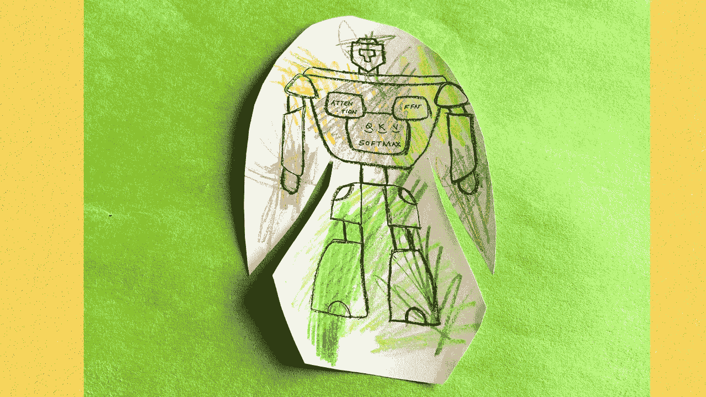
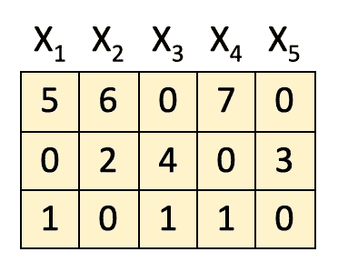
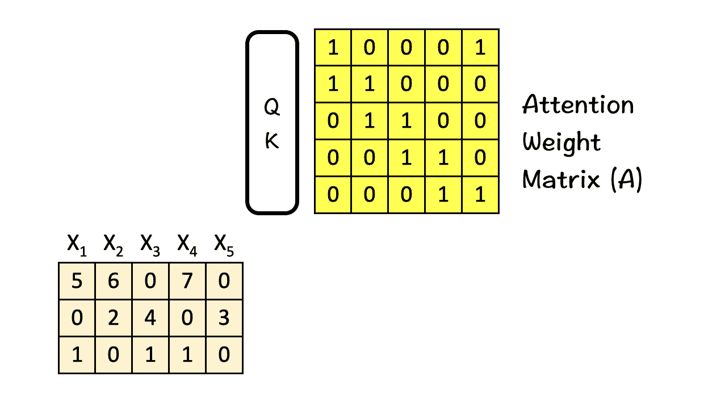
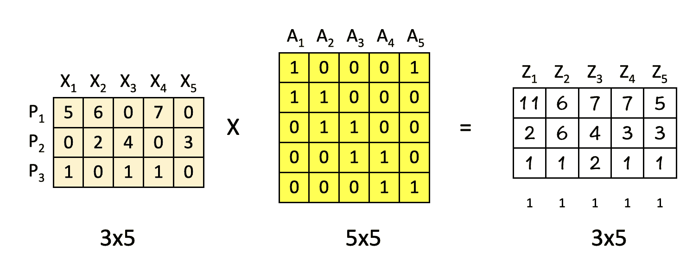
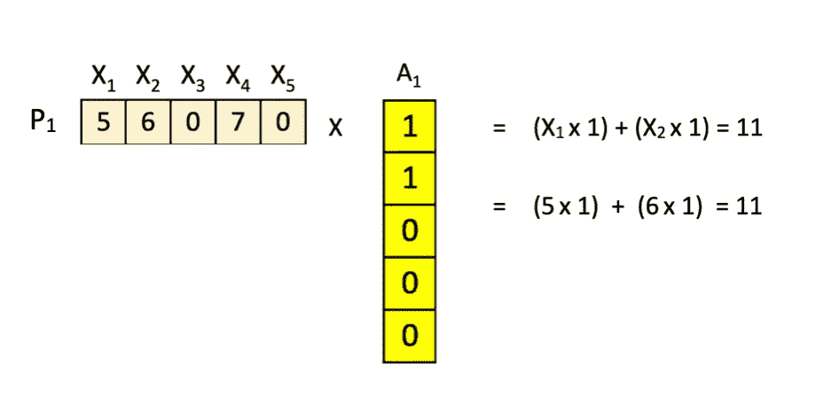
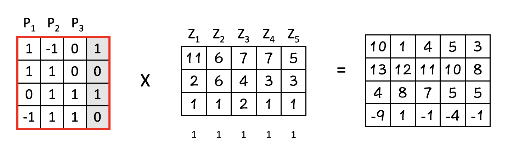
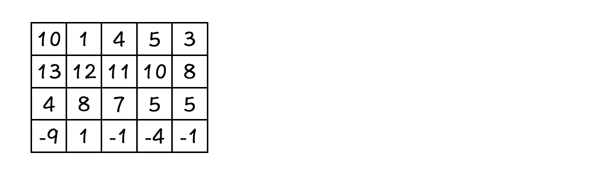
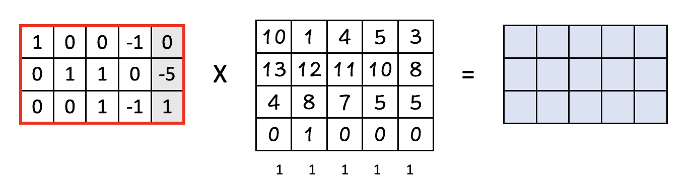

# 深入探讨变形金刚 ✍︎

> 原文：[`towardsdatascience.com/deep-dive-into-transformers-by-hand-%EF%B8%8E-68b8be4bd813?source=collection_archive---------0-----------------------#2024-04-12`](https://towardsdatascience.com/deep-dive-into-transformers-by-hand-%EF%B8%8E-68b8be4bd813?source=collection_archive---------0-----------------------#2024-04-12)

## 探索变形金刚背后强大功能的细节

 [Srijanie Dey, PhD](https://medium.com/@srijanie.dey?source=post_page---byline--68b8be4bd813--------------------------------)

·发表于 [Towards Data Science](https://towardsdatascience.com/?source=post_page---byline--68b8be4bd813--------------------------------) ·6 分钟阅读·2024 年 4 月 12 日

--

我们小区发生了一件新事。

一辆我儿子喜欢叫做“机器人卡车”的新车已经在我们的街道上安家了。

那是一辆特斯拉 Cyber Truck，我已经尝试多次向儿子解释这个名字的含义，但他坚持称其为“机器人卡车”。现在每次我看着机器人卡车并听到这个名字时，它让我想起电影《变形金刚》，其中的机器人能够在汽车和机器人之间变形。

难道不奇怪吗，今天我们所知道的变形金刚很可能正在为这些机器人卡车提供动力？这几乎是一个完整的循环。那么，我在说这些有什么目的呢？

好吧，我的目的地就是——变形金刚。不是指机器人汽车，而是神经网络中的变形金刚。你被邀请了！

图片由作者提供（我们的变形金刚 — ‘机器人霸主’。颜色由我的艺术家儿子指定。）

## 什么是变形金刚？

变形金刚本质上是神经网络。专门用于从数据中学习上下文的神经网络。

但使它们与众不同的是，存在一些机制，消除了对**标注数据集**和**卷积或递归**的需求。

## 这些特殊的机制是什么？

变形金刚有很多种。但是，真正驱动变形金刚的两个机制是注意力加权和前馈网络（FFN）。

## 什么是注意力加权？

注意力加权是一种技术，通过它，模型学习要集中关注输入序列中的哪个部分。可以把它想象成“索隆之眼”始终扫描所有内容，并将光照射到相关部分。

> 有趣的事实：显然，研究人员几乎把 Transformer 模型命名为“Attention-Net”，因为注意力在其中起着如此关键的作用。

## **什么是 FFN？**

在 Transformer 的上下文中，FFN 本质上是一个常规的多层感知器，作用于一批独立的数据向量。结合注意力机制，它生成正确的“位置-维度”组合。

# **注意力和 FFN 是如何工作的？**

所以，不再拖延，让我们深入了解**注意力加权**和**FFN**如何使 Transformer 如此强大。

这篇讨论基于 Tom Yeh 教授的精彩 AI 系列《手把手教你理解[Transformer](https://lnkd.in/g39jcD7j)》。 （除非另有说明，下面的所有图片都来自 Tom Yeh 教授的 LinkedIn 帖子，我已获得他的许可对其进行编辑。）

所以我们开始吧：

这里的关键思想是：**注意力加权和前馈网络（FFN）**。

记住这些，假设我们给定了：

+   来自前一模块的 5 个输入特征（这里是一个 3x5 矩阵，其中 X1、X2、X3、X4 和 X5 是特征，每一行分别表示它们的特征）。

[1] **获取注意力权重矩阵 A**

过程中的第一步是获取**注意力权重矩阵 A**。这部分正是自注意力机制发挥作用的地方。它试图做的是在这个输入序列中找到最相关的部分。

我们通过将输入特征输入查询-键（QK）模块来完成此操作。为了简单起见，这里未包含 QK 模块的详细信息。

[2] **注意力加权**

一旦我们得到了**注意力权重矩阵 A（5x5）**，就可以将输入特征（3x5）与其相乘，从而得到**注意力加权特征 Z**。

这里重要的一点是，这些特征是**根据它们的位置**P1、P2 和 P3 进行组合的，即**水平组合**。

进一步细化，考虑按行执行的计算：

P1 X A1 = Z1 → 位置 [1,1] = 11

P1 X A2 = Z2 → 位置 [1,2] = 6

P1 X A3 = Z3 → 位置 [1,3] = 7

P1 X A4 = Z4 → 位置 [1,4] = 7

P1 X A5 = Z5 → 位置 [1,5] = 5

.

.

.

P2 X A4 = Z4 → 位置 [2,4] = 3

P3 X A5 = Z5 → 位置 [3,5] = 1

举个例子：

一开始似乎有些繁琐，但按照行乘法进行，结果应该是相当直接的。

有趣的是，由于我们的注意力权重矩阵**A**的排列方式，新的特征**Z**实际上是**X**的组合，如下所示：

Z1 = X1 + X2

Z2 = X2 + X3

Z3 = X3 + X4

Z4 = X4 + X5

Z5 = X5 + X1

（提示：查看矩阵**A**中 0 和 1 的位置）。

[3] **FFN : 第一层**

下一步是将注意力加权特征输入到前馈神经网络中。

然而，这里与之前步骤的不同之处在于**跨维度组合值**，而不是在位置上进行组合。其操作如下：

这样做的效果是，它从另一个方向查看数据。

**- 在注意力步骤中，我们基于原始特征将输入进行组合，以获得新的特征。**

**- 在这个 FFN 步骤中，我们考虑它们的特征，即将特征垂直组合以获得我们的新矩阵。**

> 例如：P1(1,1) * Z1(1,1)
> 
> + P2(1,2) * Z1 (2,1)
> 
> + P3(1,3) * Z1(3,1) + b(1) = 11，其中 b 是偏置。

再次进行逐元素的行操作。注意到这里新矩阵的维度增加到了 4。

[4] **ReLU**

我们最喜欢的步骤：ReLU，在这个步骤中，前面矩阵中得到的负值被归零，正值保持不变。

[5] **FFN：第二层**

最后，我们将其传递到第二层，在那里结果矩阵的维度从 4 降低回 3。

这里的输出已经准备好输入到下一个模块（请参见其与原始矩阵的相似性），并且整个过程从头开始重复。

**这里要记住的两件关键事是：**

1.  **注意力层在位置间（水平方向）进行组合。**

1.  **前馈层在维度间（垂直方向）进行组合。**

这就是变形金刚强大之处的秘密——从不同方向分析数据的能力。

总结以上观点，以下是关键要点：

1.  Transformer 架构可以被看作是注意力层和前馈层的组合。

1.  **注意力层结合了特征**以生成新的特征。例如，想象将两个机器人 Robo-Truck 和 Optimus Prime 结合成一个新机器人 Robtimus Prime。

1.  **前馈（FFN）层结合了特征的部分或特征**，生成新的部分/特征。例如，Robo-Truck 的轮子和 Optimus Prime 的离子激光可以组合成一个带轮子的激光。

# 强大的变形金刚

神经网络已经存在了一段时间。卷积神经网络（CNN）和递归神经网络（RNN）曾一度占据主导地位，但自从 2017 年引入 Transformer 之后，局面发生了翻天覆地的变化。从那时起，人工智能领域以指数速度增长——每天都有新的模型、新的基准和新的学习成果涌现。只有时间才能证明，这一卓越的理念是否会引领我们迈向更大的突破——一个真正的“变形金刚”。

但目前来说，说一个理念可以真正*改变*我们生活的方式并不为过！

图片由作者提供

附言：如果你想自己完成这个练习，下面是供你使用的空白模板。

[手部练习空白模板](https://drive.google.com/file/d/1F08laMdmwQ2vxYIqewOghS1eknaprgxe/view?usp=drive_link)

现在去玩得开心一点，创造属于你自己的**Robtimus Prime**！
