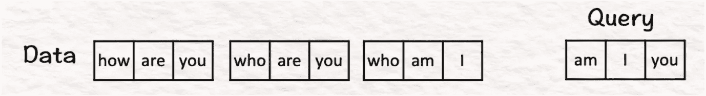
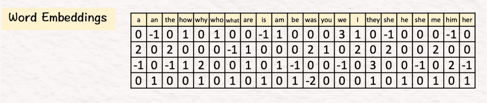
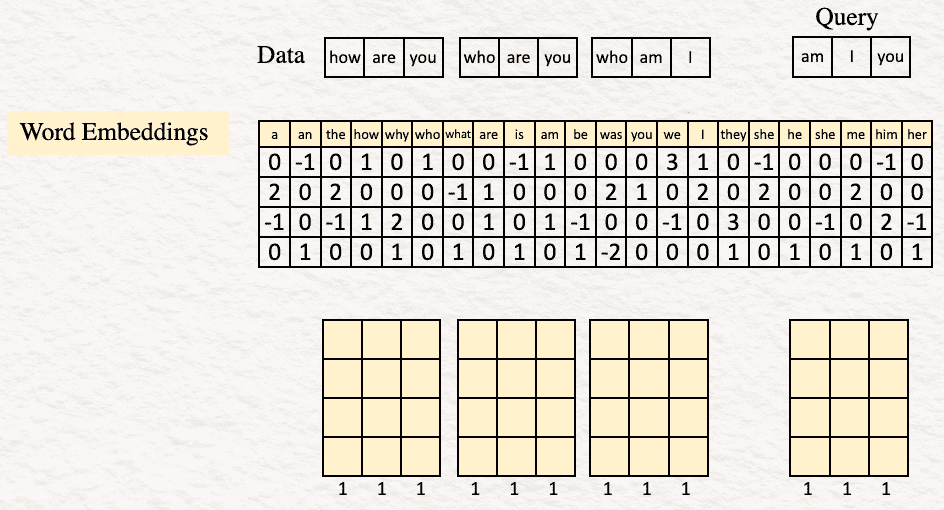
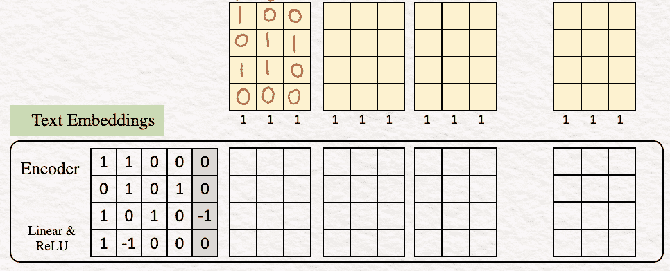
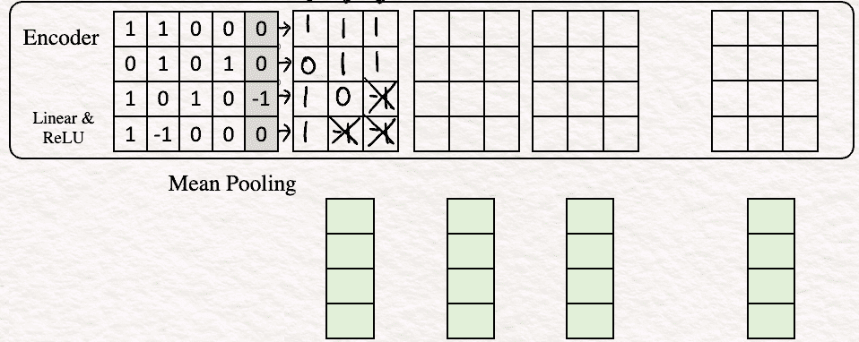
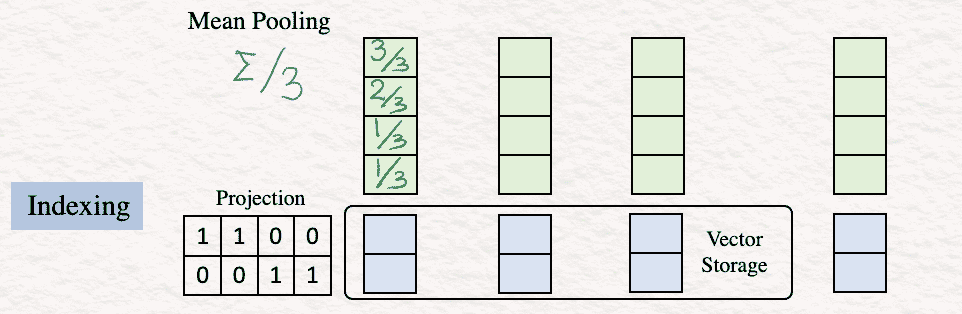
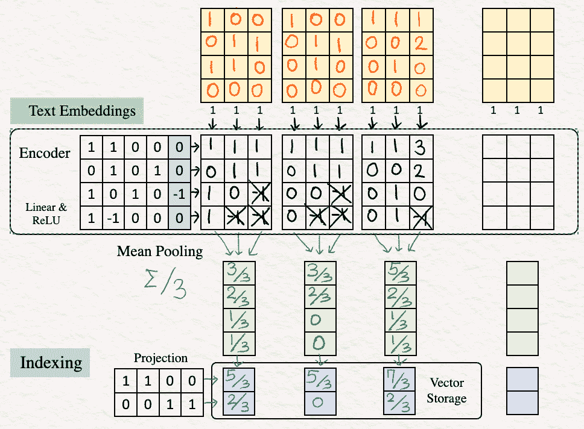
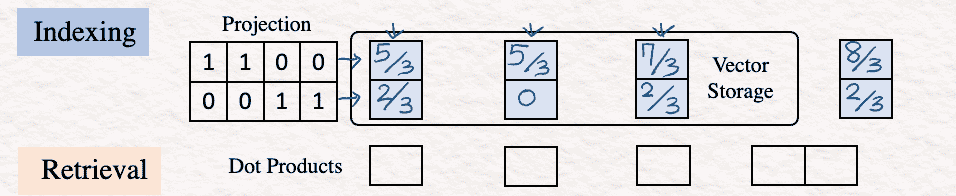
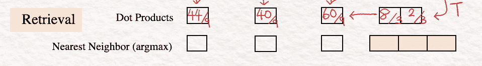

# 手工深入了解向量数据库 ✍︎

> 原文：[`towardsdatascience.com/deep-dive-into-vector-databases-by-hand-e9ab71f54f80?source=collection_archive---------0-----------------------#2024-03-20`](https://towardsdatascience.com/deep-dive-into-vector-databases-by-hand-e9ab71f54f80?source=collection_archive---------0-----------------------#2024-03-20)

## 探索向量数据库背后究竟发生了什么

 [Srijanie Dey, PhD](https://medium.com/@srijanie.dey?source=post_page---byline--e9ab71f54f80--------------------------------)

·发表于[Towards Data Science](https://towardsdatascience.com/?source=post_page---byline--e9ab71f54f80--------------------------------) ·阅读时间 8 分钟·2024 年 3 月 20 日

--

前几天，我请我最喜欢的大型语言模型（LLM）帮助我向将近 4 岁的孩子解释向量。几秒钟内，它就编出了一个充满神话生物、魔法和向量的故事。结果！我得到了一个新的儿童书籍草图，而且这很令人印象深刻，因为独角兽被叫做‘LuminaVec’。

图片由作者提供（‘LuminaVec’，由我将近 4 岁的孩子解释）

那么，模型是如何帮助编织这种创造性魔法的呢？答案是通过使用向量（在现实生活中），而且很可能是向量数据库。怎么做到的呢？让我来解释一下。

# **向量与嵌入**

首先，模型并不理解我输入的具体单词。帮助它理解这些单词的是它们的数字表示形式，这些表示是以**向量**的形式存在的。这些向量帮助模型在不同单词之间找到相似性，同时聚焦于每个单词的有意义信息。它通过使用**嵌入**来做到这一点，嵌入是低维度的向量，旨在捕捉信息的语义和上下文。

换句话说，嵌入中的向量是由一系列数字组成的，这些数字指定了一个对象相对于参考空间的位置。这些对象可以是定义数据集变量的特征。在这些数字向量值的帮助下，我们可以判断一个特征与另一个特征之间的距离——它们是相似（接近）还是不相似（远离）？

这些向量确实很强大，但当我们谈论大语言模型（LLM）时，我们需要格外小心，因为有一个“large”字眼。正如这些“大”模型的情况一样，这些向量可能会迅速变得非常长且复杂，跨越数百甚至数千维。如果不小心处理，处理速度和不断增加的成本可能会很快变得沉重！

# **向量数据库**

为了解决这个问题，我们有我们的强大战士：向量数据库。

**向量数据库**是包含这些向量嵌入的特殊数据库。相似的对象在向量数据库中的向量彼此靠近，而不相似的对象的向量则相距较远。因此，与其每次查询时都解析数据并生成这些向量嵌入，这会消耗大量资源，不如一次性将数据通过模型运行，存储在向量数据库中，按需检索。这样，向量数据库就成为解决大规模和高速度问题的最强大方案之一，尤其是对于这些大语言模型（LLM）。

所以，回到关于彩虹独角兽、闪亮魔法和强大向量的故事——当我问模型这个问题时，它可能遵循了这样的过程——

1.  嵌入模型首先将问题转化为一个向量嵌入。

1.  然后，这个向量嵌入与与 5 岁小朋友的有趣故事和向量相关的向量数据库中的嵌入进行了比较。

1.  基于这种搜索和比较，返回了最相似的向量。结果应包括按与查询向量的相似度排序的向量列表。

# **它到底是如何工作的？**

为了更进一步简化，怎么让我们以微观层面来解决这些步骤呢？是时候回到基础了！感谢 Tom Yeh 教授，我们有了[这份精美的手工作品](https://www.linkedin.com/posts/tom-yeh_vectordatabase-rag-deeplearning-activity-7158816842730336257-BaSm/)，它解释了向量和向量数据库背后的工作原理。（除非另有说明，以下所有图片均来自 Tom Yeh 教授在上述 LinkedIn 帖子中的内容，我已在他的许可下进行了编辑。）

所以，我们开始吧：

在我们的示例中，我们有一个包含三句话的数据集，每句话包含 3 个单词（或标记）。

+   你好吗

+   你是谁

+   我是谁

而我们的查询是句子“我是不是你”。

在现实生活中，数据库可能包含数十亿句子（想象一下维基百科、新闻档案、期刊论文或任何文档集合），每个句子有成千上万的标记。现在，舞台已经搭建好，开始过程吧：

[1] **嵌入**：第一步是为我们想要使用的所有文本生成向量嵌入。为此，我们需要在一个包含 22 个向量的表格中查找对应的单词，其中 22 是我们示例中的词汇量。

在实际生活中，词汇表的大小可以达到数万个。词嵌入的维度通常为几千（例如，1024、4096）。

通过在词汇表中查找单词**how are you**，它的词嵌入如下所示：

[2] **编码**：下一步是对词嵌入进行编码，以获得每个词的特征向量序列。以我们的示例为例，编码器是一个简单的感知机，由一个带有 ReLU 激活函数的线性层组成。

> 快速回顾：
> 
> **线性变换**：输入嵌入向量与权重矩阵 W 相乘，然后与偏置向量**b**相加。
> 
> z = **W**x+**b**，其中**W**是权重矩阵，x 是我们的词嵌入，**b**是偏置向量。
> 
> **ReLU 激活函数**：接下来，我们对这个中间值 z 应用 ReLU。
> 
> ReLU 返回输入和零之间的逐元素最大值。数学表达式为**h** = max{0,z}。

因此，对于这个例子，文本嵌入看起来像这样：

为了演示它是如何工作的，让我们以最后一列为例计算值。

**线性变换**：

[1.0 + 1.1 + 0.0 + 0.0] + 0 = 1

[0.0 + 1.1 + 0.0 + 1.0] + 0 = 1

[1.0 + (0).1 + 1.0 + 0.0] + (-1) = -1

[1.0 + (-1).1 + 0.0 + 0.0] + 0 = -1

**ReLU**

max {0,1} = 1

max {0,1} = 1

max {0,-1} = 0

max {0,-1} = 0

因此，我们得到了特征向量的最后一列。我们可以对其他列重复相同的步骤。

[3] **均值池化**：在此步骤中，我们通过对列进行平均化来将特征向量合并为一个单一的向量。这通常被称为文本嵌入或句子嵌入。

可以使用其他池化技术，如 CLS、SEP，但均值池化是使用最广泛的方法。

[4] **索引**：下一步涉及减少文本嵌入向量的维度，这是通过投影矩阵来完成的。这个投影矩阵可以是随机的。这里的想法是获得一个简短的表示形式，从而允许更快的比较和检索。

这个结果被保存在向量存储中。

[5] **重复**：上述步骤[1]-[4]会对数据集中的其他句子“who are you”和“who am I”重复进行。

现在我们已经在向量数据库中对数据集进行了索引，接下来我们开始进行实际查询，看看这些索引如何发挥作用，最终为我们提供解决方案。

**查询**：“am I you”

[6] 要开始，我们重复上面的相同步骤——嵌入、编码和索引，以获得查询的 2D 向量表示。

[7] **点积（寻找相似性）**

一旦完成了之前的步骤，我们就会执行点积计算。这一步非常重要，因为这些点积是查询向量与数据库向量之间进行比较的核心。为了执行这一步，我们将查询向量转置，并与数据库向量相乘。

[8] **最近邻**

最后一步是执行线性扫描以找到最大的点积，在我们的示例中是 60/9\。这就是“我是谁”的向量表示。在实际生活中，线性扫描可能极其缓慢，因为它可能涉及数十亿个值，替代方法是使用近似最近邻（ANN）算法，如分层可导航小世界（HNSW）。

这也为我们带来了这优雅方法的结尾。

因此，通过使用向量数据库中数据集的向量嵌入并执行上述步骤，我们能够找到最接近查询的句子。嵌入、编码、均值池化、索引以及点积构成了这个过程的核心。

# **‘大’图景**

然而，为了再一次引入‘大’的视角——

+   一个数据集可能包含数百万或数十亿个句子。

+   它们每个的标记数量可能达到数万。

+   单词嵌入的维度可以达到数千。

当我们将所有这些数据和步骤整合在一起时，我们实际上是在处理尺寸庞大的维度。因此，为了应对这一壮丽的规模，向量数据库发挥了重要作用。既然我们在文章开头提到了 LLMs，那么值得一提的是，由于向量数据库的规模处理能力，它们在检索增强生成（RAG）中发挥了重要作用。向量数据库提供的可扩展性和速度，使得 RAG 模型的高效检索成为可能，从而为高效生成模型铺平了道路。

总的来说，毫无疑问，向量数据库是强大的。难怪它们已经存在了一段时间——从开始帮助推荐系统，到如今为大规模语言模型（LLM）提供动力，它们的统治地位持续不断。随着向量嵌入在不同人工智能模式中的快速发展，似乎向量数据库在未来一段时间内将继续保持其主导地位！

作者提供的图片

附言：如果你想独立完成这个练习，这里有一个空白模板供你使用。

[空白模板用于手动练习](http://bit.ly/48ViLuY)

现在去尽情享受并创造一些**‘辉煌的向量魔法’**吧！
